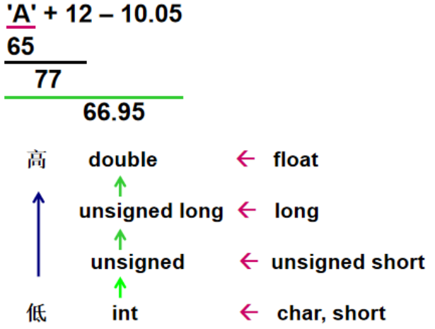
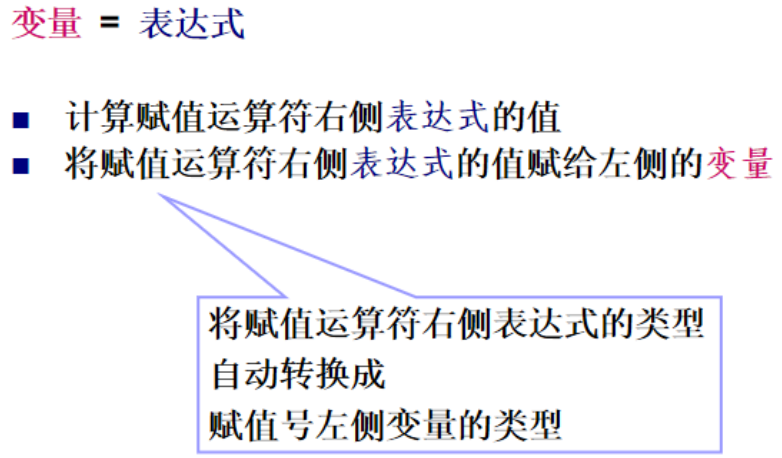
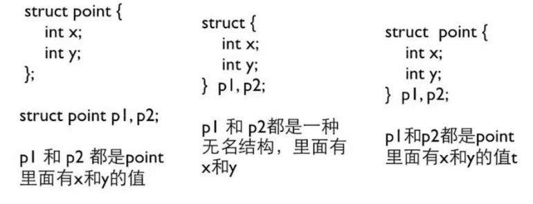

# 数据类型

### 变量和常量
#### 变量

- 作用：开一块内存放数据
- 定义：
    - C89：变量必须在程序一开始全部定义
    - C99：任何位置都可以定义变量
- 名字（标识符）
    
    规则：字母数字下划线组成；数字不能是第一个字符；不能是关键字

- 赋值：动态局部变量若不赋值则随机值

##### 全局变量

生存期和作用域独立于函数，都在全局。

**初始化**：

- 可以初始化，但要求是只能用编译时刻已知的值来初始化它，这里，全局变量的初始化在main函数之前。
- 不初始化：数字得到0；指针得到NULL

示例：

```c
int gAll = 12;  // 编译通过

int gAll = f();  // 编译错误

int gAll = 12;
int g2 = gAll;  // 编译错误

const int gAll;
int g2 = gAll;  // 编译通过，但是不建议这样，尤其在大程序中。

int g2 = gAll; 
const int gAll;  // 编译错误
```

**（全局）变量的覆盖**

在更小的地方定义的变量，会将更大的地方定义的同名变量覆盖

- 函数内部本地变量会掩盖全局覆盖

- 函数内部再开一个块（{ }），在里面定义一个变量，他会覆盖这个块外面的同名变量。

##### 静态本地变量

**语法：** 变量定义前面加上 `static` 修饰符。

**特点：** 

- 函数离开时，保留其值

- 和全局变量在相同的内存区域（很小的地址），而动态本地变量的地址很大

- 生存期：全局；作用域：函数内部（只有函数内部可以访问，这也是 `static` 的意思：局部作用域。

**使用**

- <span style = "color: blue;"> 函数返回本地变量的地址 / 的值 会有warning </span> ：这个变量在函数结束后就没了

- 不要使用全局变量在函数之间传递参数和结果

- 尽量避免使用全局变量，使用全局变量和静态本地变量的函数是线程不安全的。

**其他**

- C语言有很多区放变量：常量区、静态区、栈区、堆区
- 动态变量 auto
    - 特点：调用一次分配一次内存，调用结束就释放了，重来
    - 定义：在C语言中，`auto` 关键字用于声明自动存储期的局部变量。它告诉编译器，该变量应该在栈上分配，并且其生命周期仅限于声明它的函数或代码块。然而，`auto` 关键字实际上是可选的，因为在函数内部声明的变量默认就是自动存储期的。
    - 在C99标准之前，`auto` 关键字是必需的，但在C99及以后的标准中，它变得可选。
- 静态变量 static
    - 特点：整个程序运行期间存在，等程序结束后释放
- 静态全局变量
    - 作用：只可以使其在声明的文件中可见，避免与其他文件中同名变量冲突
- 静态函数 ```static int function_name(parameter_type parameter)```
    - 作用：只能在所声明的文件中调用，其他文件不可使用：辅助函数、实用函数限制在特定文件中
- 静态局部变量
    - 定义：函数内部定义的静态变量
    - 作用：类似全局变量，函数调用结束后，其值不会被销毁，而是保持存在
    - 用处：重复使用，这一次的接着上一次的值用

```c
#include<stdio.h>
//三个变量都赋初始值0
int global = 0;  //global为全局变量
void stc()
{
    int n = 0;  //n 为局部变量
    static int sta = 0;  //sta为静态局部变量
    n++; sta++; global++;  //函数每次执行都对三个变量+1
    printf("%d ", n); printf("%d ", sta); printf("%d ", global);
}
int main()
{
    int i;
    for(i = 1; i <= 5; i++){
        stc(); printf("\n");  //三次调用函数
    }
    return 0; 
}
/* 输出：
1 1 1 
1 2 2 
1 3 3 
1 4 4 
1 5 5 
全局变量和静态局部变量都延续了上次调用的结果继续+，局部变量从初始值开始
*/
```


#### 常量

**定义**

-  `const` 只读变量

    可全局/局部，eg：`const double PI = 3.1415;`
-  `#define` 宏
    
    eg：`#define PI 3.1415`

**字符串常量**

`__func__` ：表示当前函数的名称。

- 它在函数的任何地方都可以使用，不需要传递或定义额外的变量。
- __func__的值是编译器在编译时自动填充的，且是一个预定义标识符，故不能被重新定义。


**基本数据类型总表:**

| 类别   | 名称             | 类型名                | 数据长度 | 取值范围                              | 格式说明符 |
|--------|------------------|-----------------------|----------|---------------------------------------|------------|
| 整型   | \[有符号] 整型    | int                   | 32 位     | $-2^{31}$ ~ $2^{31}-1$               | %d         |
|        | \[有符号] 短整型  | short \[int]          | 16 位     | $-2^{15}$ ~ $2^{15}-1$               | %hd        |
|        | \[有符号] 长整型  | long \[int]           | 32 位     | $-2^{31}$ ~ $2^{31}-1$               | %ld        |
|        | 无符号整型       | unsigned \[int]       | 32 位     | $0$ ~ $2^{32}-1$                     | %u         |
|        | 无符号短整型     | unsigned short \[int] | 16 位     | $0$ ~ $2^{16}-1$                     | %hu        |
|        | 无符号长整型     | unsigned long \[int]  | 32 位     | $0$ ~ $2^{32}-1$                     | %lu        |
| 字符型 | 字符型           | char                 | 8 位      | $0$ ~ $255$                          | %c         |
| 浮点型 | 单精度浮点型     | float                | 32 位     | 约 $10^{-38}$ ~ $10^{38}$            | %f         |
|        | 双精度浮点型     | double               | 64 位     | 约 $10^{-308}$ ~ $10^{308}$          | %lf        |


**注**: 

- 方括号中的内容可以省略。

- bit位数：0 ~ 长度-1 位；符号位：最高位（第长度-1位）

- 	十进制Decimal 八进制Octal（%o） 十六进制Hexadecimal（%x）

    16进制：X对应A~F； x对应a~f


### 整型

**定义**

1. 整型常量 == 整数数字
2. 整型变量

**存储**

让计算机用特定byte存数字：加后缀eg：`123L`,`123UL`，但是短整型没有类似表示

**数字编码**

- 补码：

    使得数据的表示唯一：主要是0和-0统一；使得减法用加法做

    内存中按补码存储


正数：

三个码相同：符号位为 **0**，其余为其二进制

负数：

- 原码：符号位1，其他位与为绝对值的二进制
- 反码：符号位1不变，除符号位其他为原码的反
- 补码：反码 + 1

负数三码转换

- 转换原因：内存中补码存储/运算；知道原码才知道数字是多少

- 原码 —— 补码：

    - 负数 取反（符号位不变） + 1

- 补码转原码：
    
    - 负数法一：减 1，按位取反，符号位不变。
    - 负数法一：补码的补码是原码

溢出：会有进位，溢出最高位舍

**示例**

```c
int a = -1;
printf("%d, %u", a, a);
//结果：-1, 4294967295
printf("%o, %x", a, a);
//结果：37777777777, ffffffff
```

**直接利用格式说明符完成进制转换：**

```c
printf("%d, %o, %x", 10, 10, 10);
printf("%d, %d, %d", 10, 010, 0x10);
```

### 实型/浮点型
	
**定义**

表示形式：小数/科学计数法( %e )

数据精度 与 取值范围是两个不同的概念：

float x = 1234567.89;   x虽在取值范围内，但无法精确表达。 

float y = 1.2e55;   y 的精度要求不高，但超出取值范围。


**存储**

??? info "IEEE 754标准" 
	
	浮点数分三个部分,依次是：

	1. **符号位**（Sign bit）：1位，表示数值正负，0正1负数。

	2. **指数位**（Exponent）：存储指数部分，单精度为8位，双精度为11位。指数部分采用偏移量（bias）表示，单精度的偏移量为127，双精度的偏移量为1023。

	3. **尾数位**（Mantissa，也称为有效数字或 significand）：存储有效数字部分，单精度为23位，双精度为52位。尾数部分通常不包括最高位的1（隐含的前导1），除了特殊情况。

	举例

	假设有一个双精度浮点数 `3.14`，其二进制表示为 `1.1001000110100010100011110100110110`（不包括隐含的前导1），则其在内存中的存储方式如下：

	1. **符号位**：0（因为3.14是正数）
	2. **指数**：计算指数部分，3.14的二进制科学计数法为 `1.1001000110100010100011110100110110 * 2^1`，指数为1，加上偏移量1023，得到1024，二进制为 `10000000000`。
	3. **尾数**：`1001000110100010100011110100110110`（不包括隐含的前导1）

	因此，3.14在内存中的存储为：

	```
	0 10000000000 1001000110100010100011110100110110
	```


特点：不能精确存储

```c
printf("%d", 2.1 - 1 == 0.1);  //输出：0
printf("%d", 0.1 == 0.1);  //输出：1（非零）
```
```c
//判断俩实数是否相等
/*
wrong:
if(f1 == f2){}
*/
fabs(f1 - f2) < 1e-12  //其实1e-8就够了
```

### 字符型

**定义**
	
- 字符型变量

- 字符型常量：单个字符，`'A'` `'\n'` 是正确的定义方式，得加上单引号 

**存储**

存ASCII

??? info "转义字符" 

	1. **多行字符串**：
	```c
	printf("Line 1 \
	Line 2");
	//输出：Line 1 Line 2
	```

	2. **包含特殊字符的字符串**：
	```c
	char str[] = "He said, \"Hello, World!\"";
	//输出: He said, "Hello, World!"
	```

	4. **使用退格符**：
	```c
	printf("Type \bnot\b me\n");
	```
	这里，`\b` 是退格符，用于删除前一个字符。输出结果将是：
	```
	Type  me
	```

	5. **使用空字符**：
	```c
	char str[] = "Hello\0World";
	printf("%s\n", str);
	```
	这里，`\0` 是空字符，它将字符串在 `Hello` 后面截断，所以 `World` 不会被打印出来。输出结果将是：
	```
	Hello
	```

	6. **使用回车符和换行符**：
	```c
	printf("First line.\rSecond line.\n");
	```
	这里，`\r` 是回车符，将光标移动到行首，然后打印 `Second line.`，覆盖了 `First line.`。输出结果将是：
	```
	Second line.
	```

	所有字符都可以用转义字符表示（即：使用8 or 16 进制转义序列）
	eg：打印`A`
    ```c
    printf("%c\n", 'A'); //直接
    ```
    ```c
    printf("%c\n", 65); //ASCII
    ```
    ```c
    printf("%c\n", '\x41'); //使用转义序列`\x`后跟十六进制的ASCII码值打印`A`（在支持C99标准或更高版本的编译器中）
    ```
    ```c
    printf("%c\n", '\101'); //八进制的ASCII码, 注意有''单引号
    ```

**关系**: 整型和字符型可以按ASCII随便交换

### 类型转换

**零、情况**

1. 不同类型数据的混合运算
2. *整型数据除法需要得到小数*

**一、自动**

**（一）、非赋值运算**

1. 理论

	
    
	水平方向：自动；垂直方向：低 —>高 

**（二）、赋值运算**
1. 理论

	
	
2. 示例：
    ```c
    short bi;
    bi = 0x12345678L; //长整型十六进制
    printf("%d", bi);
    /*
    warning: overflow in conversion from ‘long int’ to ‘short int’ changes value from ‘305419896’ to ‘22136’ [-Woverflow]
    11 | bi = 0x12345678L;
        |      ^~~~~~~~~~~
    */
    ```
数值溢出时：

**截断**：由于数值超出了 `short` 类型的范围，编译器会将这个数值截断到 `short` 类型能表示的范围。具体来说，它会取这个数值的低16位。`0x12345678L` 的二进制表示是 `0001 0010 0011 0100 0101 0110 0111 1000`，取低16位是 `0101 0110 0111 1000`，即 `0x5EF8`。

**二、强制类型转换**

**语法：** (类型名)  表达式

**示例：**

```C
    printf("(double)3 = %.1f\n", (double)3); // 3.0
    printf("(int)3.8 = %d\n", (int)3.8);  //3
    printf("(int)-1.6 = %d\n", (int)-1.6);  //-1
    printf("(double)(5/2) = %.1f\n", (double)(5 / 2));  //2.0
    printf("(double)5/2 = %.1f\n", (double)5 / 2);  //2.5
    //后两个：看优先级：（）比（类型名）高。所以倒数第二个：先5/2 = 2，再(double)2 = 2.0 ，最后一个先(double)5 = 5.0，再5.0/2 = 2.5（发生了自动类型转换）

    int i;        // Integer variable
    double x;     // Double variable
    x = 3.8;      // Assign 3.8 to x
    i = (int)x;   // Cast x to int, truncating 3.8 to 3
    printf("x = %f, i = %d\n", x, i);
    // Output: x = 3.800000, i = 3
    printf("(double)(int)x = %f\n", (double)(int)x); 
    // Cast x to int (3) and then cast back to double (3.0)
    // Output: (double)(int)x = 3.000000
    printf("x mod 3 = %d\n", (int)x % 3); 
    // Cast x (3.8) to int (3), then compute 3 % 3 = 0
    // Output: x mod 3 = 0
```

### 枚举

**定义&规则：**

```c
enum 枚举名 {
    枚举常量1,
    枚举常量2,
    ...
};  //带上分号
```

- C内部 `enum` 其实就是 `int`，可以当作 `int` 做运算
- **枚举名**：是枚举类型的名字（可选，因为一般不用）。
- **枚举常量**：是一组合法的标识符，（必要，需要用）类型是`int`常量，默认从 `0` 开始依次递增。
- 枚举中的常量必须唯一

- **不能直接输入枚举常量的名字：**

    枚举常量不能通过输入输出函数直接读写。例如，不能用 `scanf` 读取枚举类型，必须通过整数变量赋值。

- **类型安全性：**

    枚举变量的值可以超出定义的范围（尽管不推荐），因为底层实现是整数。例如：

  ```c
  enum Color { RED, GREEN, BLUE };

  int main() {
      enum Color myColor = 5; // 合法，但不推荐
      printf("%d\n", myColor); // 输出 5
      return 0;
  }
  ```


**意义**：

命名的一组需要排列的整数常量，用于固定类别、状态和选项的表示。可读性，易于维护。


**使用**

```c
enum Color {
    RED,    // 默认值为 0
    GREEN,  // 默认值为 1
    BLUE    // 默认值为 2
};
```

这里定义了一个枚举类型 `Color`，它包含了三个枚举常量：`RED`、`GREEN` 和 `BLUE`。这些常量的默认值分别是 `0`、`1` 和 `2`。


**为枚举常量指定值**

可以显式为枚举常量指定值。如果未指定值，则该常量的值为前一个常量值加 `1`。

```c
enum Day {
    MON = 1,  // MON 的值是 1
    TUE,      // TUE 的值是 2
    WED = 5,  // WED 的值是 5
    THU,      // THU 的值是 6
    FRI = 10, // FRI 的值是 10
    SAT,      // SAT 的值是 11
    SUN       // SUN 的值是 12
};
```

**定义枚举变量**

```c
enum Color { RED, GREEN, BLUE };

int main() {
    enum Color myColor; // 定义一个枚举变量
    myColor = GREEN;    // 为变量初始化枚举常量
    printf("myColor = %d\n", myColor); // 输出 1
    scanf("%d", &myColor);  // 输入 5
    printf("%d", myColor);  // 输出 5
    printf("%d", GREEN); // 输出 1
    return 0;
}
//GREEN的值不会变成5啊，因为枚举常量的值是固定的，且在编译时已经确定。赋值给枚举变量（如 myColor）时，只是改变了变量的值，不会修改枚举常量的值。
```

---

**匿名枚举**

如果不需要多次引用枚举类型名称，可以省略枚举类型的名字，直接使用枚举常量。

```c
enum { MON, TUE, WED, THU, FRI, SAT, SUN };

int main() {
    int today = WED; // 直接使用枚举常量
    printf("Today is day number: %d\n", today); // 输出 2
    return 0;
}
```

**计数**

`Color{c1, c2, c3, c4, cnt};` 这里`cnt`值是4，记录了前面枚举变量的个数，可以用它来循环……

**具体使用场景**

在底层，枚举类型的常量其实是整数（`int` 类型）。因此，枚举常量可以用于任何需要整数值的地方。

```c
enum Status { OFF, ON };

int main() {
    enum Status light = OFF;

    if (light == OFF) {
        printf("Light is off\n");
    }
    return 0;
}
```


```c
//状态开关机
enum State { INIT, RUNNING, STOPPED };

void checkState(enum State s) {
    switch (s) {
        case INIT:    printf("Initializing...\n"); break;
        case RUNNING: printf("Running...\n"); break;
        case STOPPED: printf("Stopped.\n"); break;
        default:      printf("Unknown state!\n");
    }
}
```


### 结构

结构是一种数据类型，它在语法上与python中的字典、类都有相似之处。

想不清楚时，将其当作int类型。因为本质上其都是一种数据类型。

示例：

```c

#include <stdio.h>
#include <string.h>

struct student {
    char name[50];  
    int age;
    long int id;
    char gender[10]; 
    double height;
    char bloodtype;
};  //这是一条C语言定义变量的语句，别忘了最后的分号；另外这段代码的作用是“声明结构类型”

int main() {
    struct student students[3];  //这是在定义一个结构变量
    // 设置第一个学生的属性
    strcpy(students[0].name, "Alice");
    students[0].age = 20;
    students[0].id = 123456789;
    strcpy(students[0].gender, "female");
    students[0].height = 1.65;
    students[0].bloodtype = 'A';

    // 设置第二个学生的属性
    strcpy(students[1].name, "Bob");
    students[1].age = 22;
    students[1].id = 987654321;
    strcpy(students[1].gender, "male");
    students[1].height = 1.80;
    students[1].bloodtype = 'B';

    // 设置第三个学生的属性
    strcpy(students[2].name, "Charlie");
    students[2].age = 19;
    students[2].id = 555555555;
    strcpy(students[2].gender, "male");
    students[2].height = 1.75;
    students[2].bloodtype = 'O';

    // 输出每个学生的信息
    for (int i = 0; i < 3; i++) {
        const char *pronoun;
        if (strcmp(students[i].gender, "male") == 0) {
            pronoun = "his";
        } else {
            pronoun = "her";
        }
        printf("%s, a %d-year-old student, %s ID is %ld.\n", students[i].name, students[i].age, pronoun, students[i].id);
    }

    return 0;
}
```

#### 语法

- 一般情况将结构放在函数外面（全局变量的位置）
- 别的写法：

    

**1. 初始化**：

- 对于结构体数组，不可`students[0] = {"Alice", 20, 12345, female, 1.65, 'A'};`类似这样初始化，只能像上面范例程序一样一个一个初始化。如果想这样，只能在定义时就这样初始化，而非定义后再赋值，像这样:
```c
struct Student students[10] = {
    {"Alice", 20, 12345, female, 1.65, 'A'}, // 初始化第一个元素
    // 其他元素将自动初始化为0（对于数值类型）或空字符串（对于字符数组），但是请注意，上面的语法是在数组声明时对整个数组（或部分数组）进行初始化，而不是在数组已经声明之后对单个元素进行初始化。
};
```

示例：

```c
#include <stdio.h>
#include <string.h>

// 定义结构体
struct Person {
    char name[50];
    int age;
    float height;
};

// 通过函数初始化结构体
void initializePerson(struct Person* p, const char* name, int age, float height) {
    strcpy(p->name, name);
    p->age = age;
    p->height = height;
}

int main() {
    // 直接赋值初始化
    struct Person person1;
    person1.age = 25;
    strcpy(person1.name, "Alice");
    person1.height = 5.7;

    // 使用初始化列表初始化（C99标准及以上支持）
    struct Person person2 = {"Bob", 30, 6.0};

    // 使用初始化列表初始化，并使用类似“关键词传参”的方式
    struct Person person3 = {"zrz", .age = 18, .height = 8.0}

    // 列表初始化，若不给某int变量传值，默认0

    // 通过函数初始化
    struct Person person4;
    initializePerson(&person4, "Charlie", 22, 5.9);

    return 0;
}
```

**2. 访问结构成员**

语法：```结构变量.结构成员```

!!! warning "概念"

    结构类型：虚的，一开始定义的那个是结构类型，例如上面的Person
    结构变量：基于结构类型定义了许多结构变量，例如上面的person1, person2 ……

**3. 结构运算**

重点注意其与数组的区别

- 可以用结构变量的名字访问整个结构
- 对于整个结构，可以整体赋值，
    ```c
    person1 = (struct Person){"Bob", 30, 6.0};
    //做一个类型转换，相当于上面初始化的操作
    ```
    ```c
    person2 = person1
    //这是合法的，相当于每个元素都相等，注意这俩结构变量还是不一样的，只不过其中的成员的值是一样的
    ```

- 整个结构，可以取地址

    注意，结构变量名不是他的地址，取地址必须得用`&`

    ```c
    struct Person *p_person1 = &person1;
    ```

- 整个结构，可以作为参数传递给函数

#### 结构与函数

整个结构可以作为参数传入函数，这时是在函数内新建一个结构变量，并赋值传入的那个结构的值

结构可以作为函数的返回值

**输入结构：**

结构与数组的区别：

- 在传入函数时，结构与普通的int变量类似，要在函数内部更改它，得传地址。因为传入函数，函数接收到的实际是结构的值，不是这个变量，与原结构无关。

- 数组在传入函数时，传入的是这个数组变量。

解决方案1：在函数内部copy一个一样的临时的结构变量，讲这个结构返回

```c
struct point inputStruct(void)
{
    struct point p{/*代码块，要求与main函数里面的一样*/};
    /*代码块*/
    return p;
}

int main()
{
    struct point dest{/*代码块*/};
    dest = inputStruct();
    printf(/*语句*/)
}
```
该方法不好

解决方案2：

!!! quote "K&R"

    “lf a large structure is to be passed to a function, it is generally more efficient to pass a pointer than to copy the whole structure”


**指向结构的指针**

!!! success "指针与函数"

    常用：一个函数的参数是指针，返回值也是指针；目的是将这个值的指针输入，在函数内部更改完之后再返回出去，好处是返回的指针可以再用于其他代码，例如作为其他函数的参数，反复调用。

语法：`pointer -> member`，代表 “这个指针所指的那个结构变量里的那个成员”。

示例：
```c
/*定义一个结构变量today，里面有一个成员是month*/
struct date today;
struct date* ptoday = &today;
(*p).month = 12;
p -> month = 12;
```

**使用示例：**

```c
#include<stdio.h>
struct date {
    int month;
    int day;
};

struct date* getStruct(struct date *p);
void printSturct(const struct date* p);

int main()
{
    struct date today;
    printSturct(getStruct(&today));
    
    *getStruct(&today) = (struct date){12, 18};
    printSturct(&today);

    getStruct(&today) -> day = 19;
    printSturct(&today);
    return 0;
}

struct date* getStruct(struct date *p)
{
    scanf("%d %d", &(p -> month), &(p -> day));
    return p;
}

void printSturct(const struct date* p)
{
    printf("%d-%d\n", p -> month, p -> day);
}
```

#### 结构数组

*结构数组的本质是**数组**，只不过该数组的元素是结构体类型的数据*


**语法**

```c
struct class {
    char* name;
    int age;
    long int id;
};

int main()
{
    struct class student[26] = {{"zrz", 18, 3240105996}, {"hhh", 18, 3240100000}};
}
```

#### 结构中的结构

**语法：**还是按照普通变量来理解

**示例：**
```c
struct point {
    int x;
    int y;
};

struct rectangle {
    struct point pt1;
    struct point pt2;
};

int main()
{
    struct rectangle rt1;
    struct rectangle *prt1 = &rt1;
    scanf("%d %d", &(rt1.pt1.x), &(rt1.pt1.y));
    scanf("%d %d", &(prt1 -> pt2.x), &(prt1 -> pt2.y));
}
```


另外，结构和数组等可以无限组合嵌套，例如结构中的结构的数组

### 联合

**定义语法**：与结构很像

```c
union Person{
    char* name;
    int age;
};
```
```c
typedef union person{
    char* name;
    int age;
}Person;
//使用typedef
```

**存储**：

- 所有成员共享一个内存空间

- 同一时间只有一个成员是有效的

    即填入另一个成员的值即将前面的冲掉

- 联合的大小`sizeof(union)`是其最大的成员

**初始化**：对第一个成员初始化

**应用场景**


1. **节省内存**：   
   联合最常见的用途之一是节省内存。例如，在处理需要多种数据类型但只会使用其中一种的场景下，使用联合可以避免每种数据类型都占用单独的内存区域。
   ```c
   union Data {
       int i;
       float f;
       char str[20];
   };
   ```
   在这个例子中，`Data`联合只需要足够存储最大的成员（`char str[20]`）的内存，而不需要分别为`int`、`float`和`char[]`分配内存空间。

2. **简化存储不同格式的数据**：   
   联合可以存储不同类型的数据，在需要存储多种不同数据格式但只需存储一个格式的情况下特别有用。例如，读取网络数据时，我们可能会在同一位置存储整数、浮点数或字符串等不同数据类型。
   ```c
   union Packet {
       int data_int;
       float data_float;
       char data_string[50];
   };
   ```

3. **实现类型安全的多态（polymorphism）**：   
   在没有面向对象支持的语言（如C语言）中，可以使用联合类型模拟多态。联合类型允许函数根据需要选择合适的数据类型来操作。
   ```c
   union Value {
       int intVal;
       float floatVal;
   };

   void printValue(union Value v, int isInt) {
       if (isInt) {
           printf("Integer: %d\n", v.intVal);
       } else {
           printf("Float: %.2f\n", v.floatVal);
       }
   }
   ```
   通过使用`isInt`标识符，函数`printValue`可以根据需要处理不同类型的数据。

4. **嵌入式系统中的硬件寄存器操作**：
   在嵌入式开发中，联合可以方便地访问硬件寄存器的不同部分。例如，一个32位的硬件寄存器可以被分解为多个8位字段。
   ```c
   union Register {
       unsigned int regVal;  // 32位的寄存器值
       struct {
           unsigned char lowByte;
           unsigned char highByte;
           unsigned char midByte1;
           unsigned char midByte2;
       };
   };
   ```
   通过使用联合，程序可以以不同的方式访问寄存器的内容（如整个32位寄存器或分解后的各个字节）。

5. **类型转换（Type casting）**：
   联合在C语言中也常用于类型转换，尤其是在需要通过不同类型的视图来查看同一块内存数据时。例如，在实现某些特定算法时，可能需要通过联合来在整数和浮点数之间进行转换。
   ```c
   union Convert {
       int i;
       float f;
   };

   union Convert c;
   c.i = 10;
   printf("As float: %.2f\n", c.f);  // 通过联合将整数以浮点数显示
   ```

？？？为啥？到底是几？

6. **实现简易的自定义数据结构**：
   联合可以用于实现自定义的数据结构。例如，当数据结构中有多个可能的数据类型时，可以使用联合来减少内存占用。
   ```c
   struct Shape {
       int type;
       union {
           int radius;     // 圆形
           struct {        // 矩形
               int width;
               int height;
           };
       };
   };
   ```
   在这个例子中，`Shape`结构体根据`type`字段的不同值来区分它是圆形还是矩形，并通过联合在同一内存位置存储不同的数据类型。


1. **解析复杂的数据格式**：
   联合类型非常适合用来解析复杂的二进制数据格式。不同的数据字段可以用不同的方式解读。使用联合可以更方便地从一个字节流中提取不同类型的数据，常见于文件解析或网络数据包的处理。
   ```c
   union DataPacket {
       uint32_t integerData;
       float floatData;
       char stringData[16];
   };

   union DataPacket packet;
   packet.integerData = 0x12345678;  // 作为整数处理
   printf("Integer: %u\n", packet.integerData);
   packet.floatData = 3.14159f;       // 作为浮点数处理
   printf("Float: %.4f\n", packet.floatData);
   packet.stringData[0] = 'H';       // 作为字符串处理
   packet.stringData[1] = 'i';
   packet.stringData[2] = '\0';
   printf("String: %s\n", packet.stringData);
   ```

2. **用于操作不同数据结构**：
   联合可以用来处理包含多种不同数据结构的数据，例如，某个函数可能需要在不同情况下处理不同的数据结构。通过联合，你可以在同一个内存空间内实现这些数据结构的共享。
   ```c
   union Data {
       struct {
           int x;
           int y;
       } point;  // 用于存储坐标
       struct {
           int width;
           int height;
       } rectangle;  // 用于存储矩形尺寸
   };
   ```
   在这个例子中，`Data`联合可以存储一个坐标点或一个矩形的尺寸，但不能同时存储两者。

3. **优化内存池管理**：
   在内存池管理中，联合可用于构建高效的内存分配方案。例如，在一个内存池中管理不同类型的对象时，使用联合类型可以为每个对象节省内存。
   ```c
   union Object {
       int intValue;
       float floatValue;
       char strValue[50];
   };

   struct MemoryPool {
       union Object objects[100];
   };
   ```
   这里的内存池`MemoryPool`可以用来管理100个对象，每个对象可能是一个整数、浮点数或字符串，而不必为每种类型分配不同的内存块。

4. **简化图像处理中的像素表示**：
   在图像处理或图形编程中，像素的数据表示可以使用联合来简化处理。例如，一个像素可能包含RGB（红、绿、蓝）三个颜色通道，可以将其表示为一个整数，也可以将每个通道分开存储。
   ```c
   union Pixel {
       uint32_t rgba;  // 32位整数表示一个像素
       struct {
           unsigned char r;
           unsigned char g;
           unsigned char b;
           unsigned char a;  // alpha透明度
       };
   };
   ```

5. **模拟操作系统中的进程状态**：
   在操作系统中，可以使用联合来模拟进程的不同状态。一个进程的状态可能包含不同类型的数据结构（如寄存器值、程序计数器、堆栈指针等）。通过联合，可以根据需要访问不同的状态信息。
   ```c
   union ProcessState {
       uint32_t registers[8];  // 存储8个通用寄存器
       struct {
           uint32_t pc;  // 程序计数器
           uint32_t sp;  // 堆栈指针
       };
   };
   ```
   通过使用联合，操作系统内核可以方便地访问进程的寄存器内容或程序计数器与堆栈指针。

6. **模拟设备控制寄存器**：
   在硬件编程中，联合类型常用于模拟设备的控制寄存器，其中不同的控制位可能对应不同的控制功能。通过联合，可以以不同的视角来访问同一寄存器。
   ```c
   union ControlRegister {
       uint32_t regValue;  // 32位寄存器值
       struct {
           unsigned bit0 : 1;  // 控制位0
           unsigned bit1 : 1;  // 控制位1
           unsigned bit2 : 1;  // 控制位2
           unsigned bit3 : 1;  // 控制位3
           unsigned bit4 : 1;  // 控制位4
           unsigned reserved : 27;  // 其他保留位
       };
   };
   ```
   在这个例子中，`ControlRegister`联合让你可以直接访问控制寄存器的32位值，也可以单独操作每个控制位。

??? info "总结"

    C语言中的联合类型是一种有效的节省内存的工具，特别适合在程序中存储和操作多种类型的数据。它能够用于实现多态、硬件寄存器的高效操作、类型转换、数据结构优化等多种实际应用。通过共享内存空间，联合可以极大地减少内存消耗，尤其是在内存资源有限的嵌入式系统和其他高效计算场景中。

### 自定义数据类型（typedef）

**语法：**

```c
typedef 原类型名 自定义新类型名;
```
例如，`typedef int Length;` ：这样，`Length` 成为 `int` 的别名，可以代替 `int` 。

再如；

```c
typedef struct adate{
    int month;
    int day;
    int year;
} Date;
Date d = {12, 17, 2024};
```
`Date` 代表 `typedef` 和 `Date` 中间所有东西，`Date` $\Leftrightarrow$ `struct adate`


`typedef` 用于给现有类型定义新的别名或创建易于使用的自定义类型。

---

**1. 简化复杂类型**
为指针类型创建别名，简化代码的书写和阅读。

```c
#include <stdio.h>

// 为指针类型定义别名
typedef char* String;

int main() {
    String name = "Alice";
    printf("Name: %s\n", name);
    return 0;
}
```

**解析**：`String` 是 `char*` 的别名，简化了定义指针变量的代码。

---

**2. 定义结构体的别名**
为结构体类型创建更简洁的名称。

```c
#include <stdio.h>

// 定义结构体和别名
typedef struct {
    int x;
    int y;
} Point;

int main() {
    Point p = {10, 20};
    printf("Point: (%d, %d)\n", p.x, p.y);
    return 0;
}
```

**解析**：使用 `typedef` 后，定义变量时无需再写 `struct`，直接使用 `Point`。

---

**3. 定义枚举类型的别名**
为枚举类型起一个更直观的名字。

```c
#include <stdio.h>

// 定义枚举类型和别名
typedef enum { RED, GREEN, BLUE } Color;

int main() {
    Color favoriteColor = GREEN;
    printf("Favorite color code: %d\n", favoriteColor);
    return 0;
}
```

**解析**：`Color` 是枚举类型的别名，代码更直观。

再例，

```c
typedef enum { false, true } bool;
bool palindrome(char *s) { /*代码块*/}
```

---

**4. 定义自定义数据类型**
将常用的基础类型替换为更具语义的名字。

```c
#include <stdio.h>

// 定义一个长度类型
typedef unsigned int Length;

int main() {
    Length len = 100;
    printf("Length: %u\n", len);
    return 0;
}
```

**解析**：`Length` 是 `unsigned int` 的别名，用于表示逻辑上的长度，增加代码语义。

---

**5. 定义函数指针的别名**
为函数指针类型定义别名，简化函数指针的声明和使用。

```c
#include <stdio.h>

// 定义函数指针类型
typedef int (*Operation)(int, int);

// 函数定义
int add(int a, int b) {
    return a + b;
}

int multiply(int a, int b) {
    return a * b;
}

int main() {
    Operation op;  // 使用别名定义函数指针变量

    op = add;
    printf("Add: %d\n", op(5, 3));

    op = multiply;
    printf("Multiply: %d\n", op(5, 3));

    return 0;
}
```

**解析**：`Operation` 是函数指针 `int (*)(int, int)` 的别名，简化了函数指针的声明。

---

**6. 定义数组类型的别名**
为数组定义一个别名，用于统一管理数据类型。

```c
#include <stdio.h>

// 定义数组类型别名
typedef int Matrix[3][3];

int main() {
    Matrix mat = {
        {1, 2, 3},
        {4, 5, 6},
        {7, 8, 9}
    };

    for (int i = 0; i < 3; i++) {
        for (int j = 0; j < 3; j++) {
            printf("%d ", mat[i][j]);
        }
        printf("\n");
    }

    return 0;
}
```

**解析**：`Matrix` 是一个 3x3 整数数组的别名，简化了矩阵类型的声明。

---

**7. 定义位域类型的别名**
为包含位域的结构体定义一个易用的别名。

```c
#include <stdio.h>

// 定义位域类型
typedef struct {
    unsigned int isAvailable : 1;
    unsigned int isReadOnly  : 1;
    unsigned int isHidden    : 1;
} FileAttributes;

int main() {
    FileAttributes file = {1, 0, 1};

    printf("Available: %u, ReadOnly: %u, Hidden: %u\n",
           file.isAvailable, file.isReadOnly, file.isHidden);
    return 0;
}
```

**解析**：`FileAttributes` 是带有位域的结构体的别名，用于简化属性定义。

---

**8. 定义通用数据类型**
为便于跨平台开发，将特定平台的基础类型定义为通用类型。

```c
#include <stdio.h>

// 定义跨平台的整型别名
typedef unsigned long long int U64;

int main() {
    U64 largeNumber = 1234567890123456789ULL;
    printf("Large number: %llu\n", largeNumber);
    return 0;
}
```

**解析**：`U64` 是 `unsigned long long int` 的别名，用于表示 64 位无符号整数。

---

??? info "总结"
    
    `typedef` 的用法非常灵活，常见场景包括：
    1. 简化复杂类型的声明。
    2. 提高代码可读性和语义性。
    3. 增强代码的可维护性和可移植性。

    在不同的场景中，根据需求使用 `typedef` 可以使代码更加清晰简洁。

### 杂项

??? info "ASCII"
        
    | 字符 | 中文名称   | 十进制 | 十六进制 | 八进制 | 二进制       |
    |------|------------|--------|----------|--------|--------------|
    | NUL  | 空字符     | 0      | 0x00     | 000    | 00000000     |
    | SOH  | 标题开始   | 1      | 0x01     | 001    | 00000001     |
    | STX  | 正文开始   | 2      | 0x02     | 002    | 00000010     |
    | ETX  | 正文结束   | 3      | 0x03     | 003    | 00000011     |
    | EOT  | 传输结束   | 4      | 0x04     | 004    | 00000100     |
    | ENQ  | 请求       | 5      | 0x05     | 005    | 00000101     |
    | ACK  | 确认       | 6      | 0x06     | 006    | 00000110     |
    | BEL  | 响铃       | 7      | 0x07     | 007    | 00000111     |
    | BS   | 退格       | 8      | 0x08     | 010    | 00001000     |
    | TAB  | 水平制表符 | 9      | 0x09     | 011    | 00001001     |
    | LF   | 换行       | 10     | 0x0A     | 012    | 00001010     |
    | VT   | 垂直制表符 | 11     | 0x0B     | 013    | 00001011     |
    | FF   | 换页符     | 12     | 0x0C     | 014    | 00001100     |
    | CR   | 回车       | 13     | 0x0D     | 015    | 00001101     |
    | SO   | 禁止切换   | 14     | 0x0E     | 016    | 00001110     |
    | SI   | 允许切换   | 15     | 0x0F     | 017    | 00001111     |
    | SP   | 空格       | 32     | 0x20     | 040    | 00100000     |
    | !    | 感叹号     | 33     | 0x21     | 041    | 00100001     |
    | "    | 双引号     | 34     | 0x22     | 042    | 00100010     |
    | #    | 井号       | 35     | 0x23     | 043    | 00100011     |
    | $    | 美元符     | 36     | 0x24     | 044    | 00100100     |
    | %    | 百分号     | 37     | 0x25     | 045    | 00100101     |
    | &    | 和号/商标符| 38     | 0x26     | 046    | 00100110     |
    | '    | 单引号     | 39     | 0x27     | 047    | 00100111     |
    | (    | 左括号     | 40     | 0x28     | 050    | 00101000     |
    | )    | 右括号     | 41     | 0x29     | 051    | 00101001     |
    | *    | 星号       | 42     | 0x2A     | 052    | 00101010     |
    | +    | 加号       | 43     | 0x2B     | 053    | 00101011     |
    | ,    | 逗号       | 44     | 0x2C     | 054    | 00101100     |
    | -    | 减号       | 45     | 0x2D     | 055    | 00101101     |
    | .    | 句号       | 46     | 0x2E     | 056    | 00101110     |
    | /    | 斜杠       | 47     | 0x2F     | 057    | 00101111     |
    | 0    | 数字0      | 48     | 0x30     | 060    | 00110000     |
    | 1    | 数字1      | 49     | 0x31     | 061    | 00110001     |
    | 2    | 数字2      | 50     | 0x32     | 062    | 00110010     |
    | 3    | 数字3      | 51     | 0x33     | 063    | 00110011     |
    | 4    | 数字4      | 52     | 0x34     | 064    | 00110100     |
    | 5    | 数字5      | 53     | 0x35     | 065    | 00110101     |
    | 6    | 数字6      | 54     | 0x36     | 066    | 00110110     |
    | 7    | 数字7      | 55     | 0x37     | 067    | 00110111     |
    | 8    | 数字8      | 56     | 0x38     | 070    | 00111000     |
    | 9    | 数字9      | 57     | 0x39     | 071    | 00111001     |
    | :    | 冒号       | 58     | 0x3A     | 072    | 00111010     |
    | ;    | 分号       | 59     | 0x3B     | 073    | 00111011     |
    | <    | 小于号     | 60     | 0x3C     | 074    | 00111100     |
    | =    | 等号       | 61     | 0x3D     | 075    | 00111101     |
    | >    | 大于号     | 62     | 0x3E     | 076    | 00111110     |
    | ?    | 问号       | 63     | 0x3F     | 077    | 00111111     |
    | @    | 电子邮件符  | 64     | 0x40     | 100    | 01000000     |
    | A    | 字母A       | 65     | 0x41     | 101    | 01000001     |
    | B    | 字母B       | 66     | 0x42     | 102    | 01000010     |
    | C    | 字母C       | 67     | 0x43     | 103    | 01000011     |
    | D    | 字母D       | 68     | 0x44     | 104    | 01000100     |
    | E    | 字母E       | 69     | 0x45     | 105    | 01000101     |
    | F    | 字母F       | 70     | 0x46     | 106    | 01000110     |
    | G    | 字母G       | 71     | 0x47     | 107    | 01000111     |
    | H    | 字母H       | 72     | 0x48     | 110    | 01001000     |
    | I    | 字母I       | 73     | 0x49     | 111    | 01001001     |
    | J    | 字母J       | 74     | 0x4A     | 112    | 01001010     |
    | K    | 字母K       | 75     | 0x4B     | 113    | 01001011     |
    | L    | 字母L       | 76     | 0x4C     | 114    | 01001100     |
    | M    | 字母M       | 77     | 0x4D     | 115    | 01001101     |
    | N    | 字母N       | 78     | 0x4E     | 116    | 01001110     |
    | O    | 字母O       | 79     | 0x4F     | 117    | 01001111     |
    | P    | 字母P       | 80     | 0x50     | 120    | 01010000     |
    | Q    | 字母Q       | 81     | 0x51     | 121    | 01010001     |
    | R    | 字母R       | 82     | 0x52     | 122    | 01010010     |
    | S    | 字母S       | 83     | 0x53     | 123    | 01010011     |
    | T    | 字母T       | 84     | 0x54     | 124    | 01010100     |
    | U    | 字母U       | 85     | 0x55     | 125    | 01010101     |
    | V    | 字母V       | 86     | 0x56     | 126    | 01010110     |
    | W    | 字母W       | 87     | 0x57     | 127    | 01010111     |
    | X    | 字母X       | 88     | 0x58     | 130    | 01011000     |
    | Y    | 字母Y       | 89     | 0x59     | 131    | 01011001     |
    | Z    | 字母Z       | 90     | 0x5A     | 132    | 01011010     |
    | \[    | 左方括号    | 91     | 0x5B     | 133    | 01011011     |
    | \\   | 反斜杠     | 92     | 0x5C     | 134    | 01011100     |
    | ]    | 右方括号    | 93     | 0x5D     | 135    | 01011101     |
    | ^    | 插入符号    | 94     | 0x5E     | 136    | 01011110     |
    | _    | 下划线      | 95     | 0x5F     | 137    | 01011111     |
    | `    | 反引号      | 96     | 0x60     | 140    | 01100000     |
    | a    | 字母a       | 97     | 0x61     | 141    | 01100001     |
    | b    | 字母b       | 98     | 0x62     | 142    | 01100010     |
    | c    | 字母c       | 99     | 0x63     | 143    | 01100011     |
    | d    | 字母d       | 100    | 0x64     | 144    | 01100100     |
    | e    | 字母e       | 101    | 0x65     | 145    | 01100101     |
    | f    | 字母f       | 102    | 0x66     | 146    | 01100110     |
    | g    | 字母g       | 103    | 0x67     | 147    | 01100111     |
    | h    | 字母h       | 104    | 0x68     | 150    | 01101000     |
    | i    | 字母i       | 105    | 0x69     | 151    | 01101001     |
    | j    | 字母j       | 106    | 0x6A     | 152    | 01101010     |
    | k    | 字母k       | 107    | 0x6B     | 153    | 01101011     |
    | l    | 字母l       | 108    | 0x6C     | 154    | 01101100     |
    | m    | 字母m       | 109    | 0x6D     | 155    | 01101101     |
    | n    | 字母n       | 110    | 0x6E     | 156    | 01101110     |
    | o    | 字母o       | 111    | 0x6F     | 157    | 01101111     |
    | p    | 字母p       | 112    | 0x70     | 160    | 01110000     |
    | q    | 字母q       | 113    | 0x71     | 161    | 01110001     |
    | r    | 字母r       | 114    | 0x72     | 162    | 01110010     |
    | s    | 字母s       | 115    | 0x73     | 163    | 01110011     |
    | t    | 字母t       | 116    | 0x74     | 164    | 01110100     |
    | u    | 字母u       | 117    | 0x75     | 165    | 01110101     |
    | v    | 字母v       | 118    | 0x76     | 166    | 01110110     |
    | w    | 字母w       | 119    | 0x77     | 167    | 01110111     |
    | x    | 字母x       | 120    | 0x78     | 170    | 01111000     |
    | y    | 字母y       | 121    | 0x79     | 171    | 01111001     |
    | z    | 字母z       | 122    | 0x7A     | 172    | 01111010     |
    | {    | 左花括号    | 123    | 0x7B     | 173    | 01111011     |
    | \|    | 竖线       | 124    | 0x7C     | 174    | 01111100     |
    | }    | 右花括号    | 125    | 0x7D     | 175    | 01111101     |
    | ~    | 波浪号      | 126    | 0x7E     | 176    | 01111110     |
    | DEL  | 删除       | 127    | 0x7F     | 177    | 01111111     |


    单个数字0(0)（ASCII的0位）就是'\0'；带引号的字符0('0') 是ASCII的48位
	

