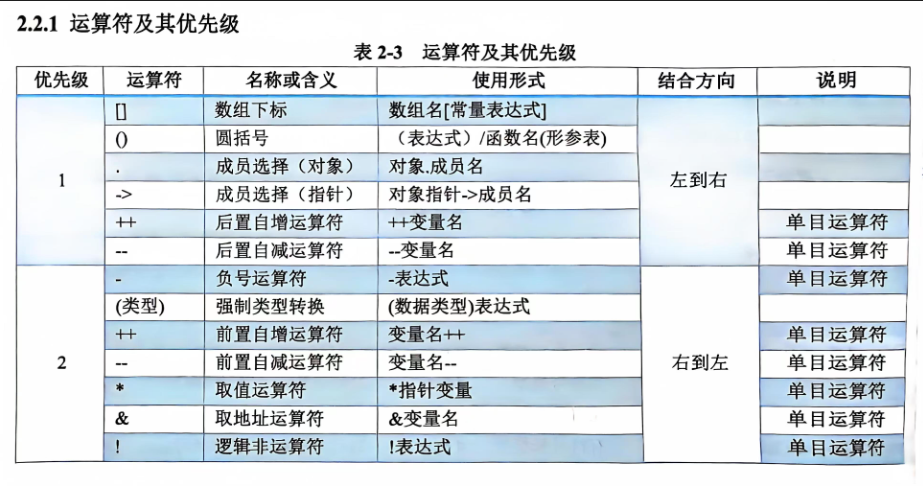
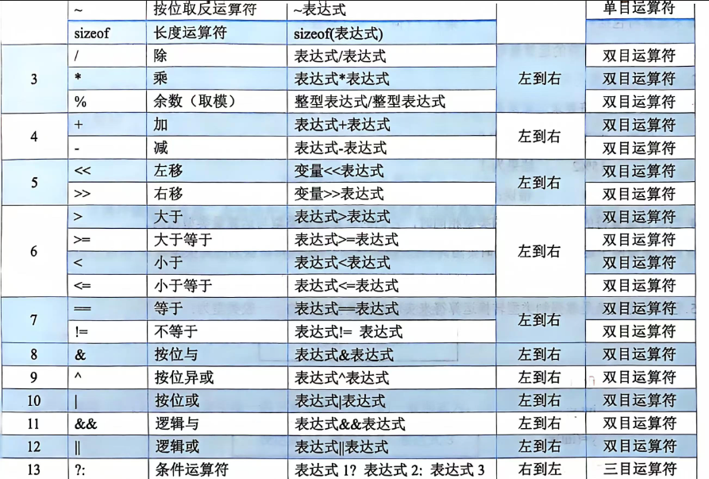
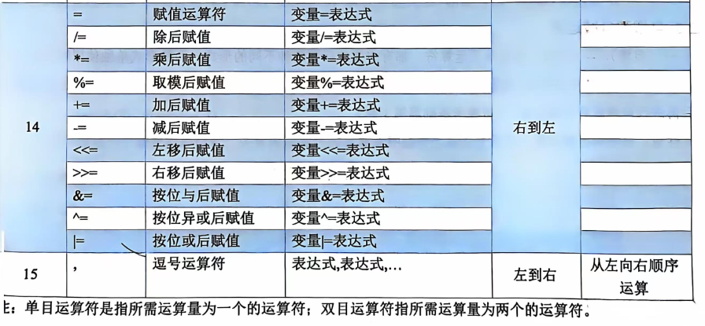

# 运算符和表达式

!!! success "牢记几句话"

    表达式的值

**表达式定义：**

运算符 + 运算对象

运算对象：常量、变量和函数等表达式

**分类**

算术表达式、赋值表达式、关系表达式、逻辑表达式、条件表达式和逗号表达式 


### 优先级

最好都加上括号






- 逻辑表达式：C赋值：真1 假0

- 循环判断：非零真

- ++ --
    - 数据的值一样，表达式的值不一样
        - a++：表达式：a+1之前的值，把表达式的值赋给其他
        - ++a：表达式：a+1之后的值，把表达式的值赋给其他

- 只能对变量不能对表达式用

- 左右结合：先从哪边算

- x = y = 3 : 不能在变量定义处用，可以后面用，结合顺序
- 复合赋值：i+=1：更高效

- 逻辑运算短路：
    - ||：前面真后面不算
    - &&：前面假后面不算

- 逗号运算符：值是最后一个子表达式的值

### 位运算
结果是表达式的值

!!! warning "重点"

    计算机中，数字的储存、运算都是以 补码 形式

    `Ctrl F 数字编码`


#### 位逻辑运算

**~按位取反**


**`&` 按位与**

**特点：** 全1才1

**应用：**

1. 让某一位或者某些位为0

    示例：`x & 0xFE`：将最后一位变成0

2. 取一个数中的一段

    示例：`x & 0xFF`：取出最后两个字节中的内容

**`|` 按位或**

**特点：** 有1则1

**应用：**

1. 将某些位变为1：或上那一位为1的数

    示例：`x | 0x01`最右边一位为1

2. 将两个数拼起来

    示例：`0x00FF | 0xFF00`

逻辑运算（`&&`、`||`）相当于将所有非0值都变成1，然后做按位对应运算

**`^` 按位异或**

**特点** ：

- 两个位相同得0，不同得1
- `x ^ y ^ y 变回到 x`

#### 移位运算

箭头朝向即为移动方向

移动的位数为正

`i << j` 对x的所有位左移j个位置，右边填入0

- `x <<= n` 大多数情况下等价于 `x *= $2^n$`
    - 当左移的位数超过位宽（`sizeof(int) * 8`）或有符号数符号位变化时，将导致未定义行为

    - 位移导致舍弃前面的位的情况也不是


`i >> j` 对x的所有位右移j个位置

- 对于unsigned类型，左边填0
- 对于signed类型，符号位保持不变，原来的高位移到地位
- `x >>= n` 大多数情况下等价于 `x /= $2^n$`
   

   直接遗弃超出范围的位

#### 复合位赋值运算

   - `&=`, `|=`, `^=`, `>>=`, `<<=`

   `a &= b` 等价于 `a = a & b`； `a >>= 3` 等价于 `a = a >> 3`

#### 应用

1. 伪转换二进制
    ```c
    include<stdio.h>
    int main()
    {
        int num;
        printf("please enter your number: ");
        scanf("%x", &num);
        unsigned int mask = 1u << 31;
        printf("the binary of your number is: ");
        for(; mask; mask >>= 1){
            printf("%d", num & mask ? 1 : 0);
        }
        printf("\n");
        return 0;
    }
    ```

2. 单片机


#### 位段

**语法：**

```c
struct 位段名 {
    数据类型 成员名 : 位宽;
    数据类型 成员名 : 位宽;
    /*重复上述*/
};
```

- 可以直接用位段的成员名访问


**注意事项：**

- 存储大小与对齐：

    位段的存储大小通常以 int 或 unsigned int 为单位，且会受编译器的内存对齐策略影响。
    
    多个位段成员**可能共享同一个存储单元**（如果其总位宽小于存储单元大小），但如果超出单元大小，会分配下一个单元。

    - 即，所需的位超过一个int时会采用多个int

    - 因此，**访问位段成员的地址的操作是有语法错误的**

- 数据类型的限制：

    位段成员通常只能是 int 或 unsigned int，具体限制依赖于编译器。

- 移植性问题：

    不同编译器和平台对位段的实现（如存储顺序、对齐方式）可能不同，可移植性较差。

-   位宽限制：

    位宽不能超过存储单位的大小。例如，如果 int 是 32 位，位宽不能大于 32。


**示例：**

```c
struct U0 {
    unsigned int leading: 3;
    unsigned int FLAG1: 1;
    unsigned int FLAG2: 1;
    int trailing: 27;
};

void toBinary(int num)
{
    unsigned int mask = 1u << 31;
    for(; mask; mask >>= 1){
        printf("%d", num & mask ? 1 : 0);
    }
}

int main()
{
    struct U0 num1, num2;
    num2.leading = 2;
    num2.FLAG1 = 1;
    num2.FLAG2  =0;
    num2.trailing = 0;
    printf("please enter your number_1: ");
    scanf("%x", &*(int*)&num1);
    printf("the binary of your number_1 is: ");
    toBinary(*(int*)&num1);
    printf("\n");
    printf("the binary of your number_1 is: ");
    toBinary(*(int*)&num2);
    printf("\n");
    return 0;
}
```


**应用场景：** 底层，对硬件的操作

- 嵌入式开发：

    在嵌入式系统中，用位段模拟硬件寄存器的各个位字段。
- 网络协议：

    用位段解析网络协议的标志字段（如 TCP/IP 报头）。
- 标志集合：
    
    用位段压缩存储多个布尔标志，以节省内存。


