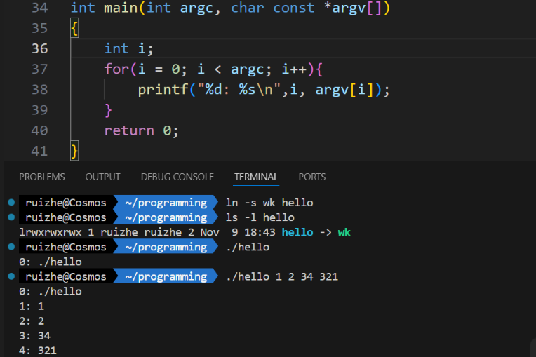

# 数组

### 一维数组

**定义和引用**

- 数组长度必须得是一个数字，不能放变量，即使那个变量有值也不行。
	即：
    ```c
    //situation 1: ERROR
    int n = 5;
    int arr[n];

    //situation 2: ERROR
    int n;
    scanf("%d", &n);
    int arr[n];

    //situation 3: right
    int arr[10];
    ```
- 引用时只能引用单个值，不能一次引用整个数组。引用其实就是*访问和操作*那个东西

- 数组下标越界：不可越界访问；越界访问，随意赋值

- 在内存中的存放
	与前后数据：见下神奇的try：不一定
	内部：index从小到大地址依次增大。从下到上排
	
**初始化**

- C语言规定只能对静态存储的数组初始化，但是课本允许对动态数组+静态数组初始化
	eg：
    ```c
    static int arr[5] = {1, 2, 3, 4, 5}
    ```
- 不初始化：

	静态数组 `static arr[5]`：不初始化则全是0

	动态数组 ` arr[5]`：不初始化则随机数
- 部分初始化：

	初始化前几个，后面没有初始化的元素默认赋值为0

- 全部元素都赋值则可以省略数组长度（不建议）

??? info "神奇的try看着玩玩"

    ```c
    //按照书上的标准，这个定义方式是错的，但是不带了改代码了......
    #include<stdio.h>
    int main()
    {
        int a = 4;
        int arr[a];
        for(int i = 0; i < a; i++){
            arr[i] = i;
        }
        int b = 3;
        printf("%p\n", &a); printf("%p\n", &b); printf("%p\n", &arr);  //打印三个的地址
        printf("%p\n",&arr[0]); printf("%p\n",&arr[3]); printf("%p\n",&arr[4]); printf("%p\n",&arr[7]); //越界访问，且发现&arr[7] ==&a
        printf("%d\n",*&arr[7]);
        printf("%d\n",*&a);  //发现上面那个之后试试a和arr[7]是什么，发现arr[7]被赋值为a的值4
        printf("%d\n",arr[9]); printf("%d\n",arr[10]); //越界访问，随意赋值
        int try[5] = {1, 2};
        printf("%d\n", try[3]); //初始化部分元素，后面的自动赋值0
        return 0;
    }
    /*
    输出：
    a's ptr:0x7ffc2289afe4  b's ptr:0x7ffc2289afe8  arr's ptr0x7ffc2289afd0  arr[0]'s ptr:0x7ffc2289afd0  arr[3]'s ptr:0x7ffc2289afdc 
    arr[4]'s ptr:0x7ffc2289afe0  arr[7]'s ptr:0x7ffc2289afec  
    arr[7]:4  *&a:4
    arr[9]:0  arr[10]:579448784
    try[3]:0
    ```

**示例**

- 用数组计算斐波那契数列，每行打印5个数字，最后一行不满5个也要换行

    ```c
    # include <stdio.h>
    # define MAXN 46                    /* 定义符号常量MAXN */
    int main(void)
    {
        int i, n;
        int fib[MAXN] = {1, 1};         /* 初始化前两个 */
        printf ("Enter n: ");    
        scanf ("%d", &n);
        if(n >= 1 && n <= 46 ){
            for(i = 2; i < n; i++){  
                fib[i] = fib[i - 1] + fib[i - 2];
            }  
            /* 学学人家怎么输出：*/
            for(i = 0; i < n; i++){
                printf("%6d", fib[i]);
                if((i + 1) % 5 == 0){   
                /* 每5个换行：循环变量i+1是5的倍数；注意细节i+1 */
                    printf("\n");
                }  
            }
            if(n % 5 != 0){
            /* 最后不满5个换行：数学转化：最后一行和总数mod5同余 */ 
                printf("\n");
            }
        }else{
            printf("Invalid Value.\n"); 
        }
        return 0;
    }
    ```

- 选择法排序

    ```c
    # include <stdio.h>
    # define MAXN 10                    
    int main(void)
    {
        /* 排序 */
        for(k = 0; k < n-1; k++){
            index = k;                      
            /* 直接用index记录最小值,因为后面交换需要用到index，替换我的min = arr[k] */
            for(i = k + 1; i < n; i++){     
            /* 寻找最小值所在下标 */
                if(a[i] < a[index]){
                    index = i;  
                }
            }
            temp = a[index];
            a[index] = a[k];
            a[k] = temp;
        }
    }
    ```


### 字符串

**定义与初始化**

1. 结束符

    - 有效长度：不包含‘\0' : 计算字符串长度不包括末尾0
    - 结束符：'\0'
        
        `char arr[] = {'h', 'i'}` 不是字符串
        
        `char arr[] = {'h', 'i', '\0'}` or `char arr[] = {'h', 'i', 0}` 是字符串

    - 定义字符串长度 >= 字符串有效长度 + 1

        因为有结束符'\0'

        开大数组：只对前面的赋值，'\0'后面的与字符串无关，字符串到'\0'即结束，故不会影响字符串的处理。

2. 定义方法

- 数组 & 指针：    
`char str[]` or `char* str` 都可以用来定义数组，但是两个不一样。如果要用指针：不能之后再赋值，否则将导致segmentation fault ~
    ```c
    char* str;
    str[0] = 'h';
    str[1] = 'i';
    // 编译器输出:[1]    122420 segmentation fault (core dumped)  ./pta11_7
    char* str2 = "hi";  // OK
    ```


- 放在一维数组中
    ```c
    static char str[6] = {'h', 'a', 'p', 'p', 'y', '\0'}
    ```

- 使用字符串常量
    ```c
    static char str[6] = {"happy"}
    ```
    ```c
    static char str[6] = "happy"
    ```
    - 字符串常量：就是双引号括起来的一个字符串，两种定义方式：`char str[]` or `char* str`

        `char* str` ：只读

        `char str[]`：也是只读，不过在堆栈区会copy一份跟他一样的字符串，这个是可以修改的

        
    - 字符串常量不能修改（但是不能写 `const`）
    - 相同的字符串字面量初始化两不同名字的字符串常量，在一样的地址上（在代码段，是只读的）

    ??? info "字符串常量"

        在C语言中，用数组和指针定义的字符串的区别主要在于它们的存储位置和是否可以修改。

        1. **`char* str1 = "hi";`**
        - 这里 `str1` 是一个指向字符的指针，它指向一个字符串字面量。字符串字面量存储在程序的只读数据段中，这意味着你不能修改 `str1` 指向的内容。尝试修改 `str1` 指向的字符串将导致未定义行为，通常是程序崩溃。
        - 例如，以下代码是不允许的：
            ```c
            str1[0] = 'H'; // 错误：不能修改字符串字面量
            ```

        2. **`char str2[] = "hi";`**
        - 这里 `str2` 是一个字符数组，它在栈上分配了足够的空间来存储字符串 "hi" 及其结尾的空字符 `\0`。`str2` 存储的是数组的第一个元素的地址，这意味着你可以修改 `str2` 中的字符。
        - 例如，以下代码是允许的：
            ```c
            str2[0] = 'H'; // 正确：可以修改数组中的字符
            ```

        - **字符串字面量（`str1`）**：字符串字面量存储在只读数据段中，这是C语言规范的一部分。编译器将字符串字面量放在只读内存区域，以防止程序修改它们。这样做的好处是可以节省内存，因为多个相同的字符串字面量可以共享同一块内存区域。

        - **字符数组（`str2`）**：字符数组是在栈上分配的，它们的生命周期仅限于定义它们的函数或代码块。字符数组的内容可以被修改，因为它们不是存储在只读内存区域。

        在你提供的两个例子中：

        - `char* str1 = "hi";`
        - 这里的 `"hi"` 是一个字符串常量，而 `str1` 是一个指向这个字符串常量的指针。

        - `char str2[] = "hi";`
        - 这里的 `"hi"` 也是一个字符串常量，但 `str2` 是一个字符数组，它在栈上分配了空间，并且包含了字符串常量的内容。尽管 `str2` 本身不是一个字符串常量，它包含了字符串常量的内容，并且这些内容在数组中是可以被修改的。

        为什么 `str2` 不是字符串常量？

        `str2` 不是字符串常量，因为它是一个字符数组，它包含了字符串常量的内容，但存储在栈上，并且其内容是可以被修改的。字符串常量本身是存储在只读内存区域的，而 `str2` 只是包含了这些内容的一个可修改的副本。


**访问**

- 可以用数组，可以用指针，多用指针

- 通常涉及'\0'，用它来控制

**输入输出**

1. 用 `getchar()`，特定字符控制

- 直接读一个字符串

    ```c
    int str[100];
    int k;
    printf("Enter your string:"); //输入提示
    k = 0;
    while((str[k] = getchar()) != '\n'){ //用getchar逐个获取字符，不到'\n'不停
        k++;  //统计字符数量
    }
    str[k] = '\0'; //输入结束符'\0'
    ```

- 先读一个在读一个字符串

    ```C
    scanf("%c", &ch);
    getchar(); // 再getchar消耗掉第一个'\n', 清理缓冲区
    while((str[k] = getchar()) != '\n'){
        k++;
    }
    str[k] = '\0';
    ```


2. 用`scanf()`

- 读取（可能）含有空格的字符串：目的是通过含有空格字符串的测试点

    这种方法不可以用于读取单个字符

    ```C
    scanf("%c", ch);
    getchar(); //何时都要有
    /*如果前面需要先读一个则加上面这部分*/
    scanf("%[^\n]", str);
    ```

- scanf读一个单词：到空格/tab/回车 为止，即见到那三个就停止读入了

    ```c
    char str\[8]; 
    scanf("%s", str); //input: 123 45678
    printf("%s", str);  //output: 123
    ```
- %ns  (n为一个整数)：这次输入最多输入$n$个值，其他的内容停在输入流中，等待下一个scanf，这些scanf依然遵循上一条

    ```c
    char str1[8];
    char str2[8];
    scanf("%3s", str1);
    scanf("%s", str2);
    printf("%s##%s", str1, str2);
    /*
    input 1234 56 --> output 123##4
    input 12 345 --> output 12##345
    input 12 34567789835374 --> *** stack smashing detected ***: terminated \ [1]    25177 IOT instruction (core dumped)  ./wk
    input 123456 --> output 123##456
    ```

**程序参数**

main函数原型：`int main(int argc, char const *argv[])`

1. `int argc`
    - **含义**: 表示命令行参数的数量（argument count）。
    - **值**: 
        - 包括程序名在内的参数总数。
        - 至少为1（即使没有其他参数，程序名也会作为第一个参数）。
   

2. `char const *argv[]`
    - **含义**: 表示命令行参数的数组（argument vector）。
    - **值**:
        - `argv[0]`: 通常是程序的名称（包括路径，取决于操作系统）。
        - `argv[1]` 到 `argv[argc-1]`: 由用户提供的其他命令行参数。
    - **类型**:
        - `const char* argv[]` 是一个字符串指针数组，表示每个参数是一个以空字符 `\0` 结尾的字符串。
    - **用法**:
        - 可以通过索引访问每个参数。
        - 如果需要将字符串参数转换为数字，可以使用函数如 `atoi` 或 `strtol`。

---

**示例**

```c
#include <stdio.h>

int main(int argc, char const *argv[]) {
    printf("Number of arguments: %d\n", argc);
    for (int i = 0; i < argc; i++) {
        printf("Argument %d: %s\n", i, argv[i]);
    }
    return 0;
}
```

**运行**

假设编译生成的可执行文件为 `program`：

```bash
./program arg1 arg2
```

输出：
```
Number of arguments: 3
Argument 0: ./program
Argument 1: arg1
Argument 2: arg2
```


**程序链接：**




### 二维数组

**定义和引用**

- 先行数后列数
- 在内存中的存放
	
    按行 —— 列顺序存放：先0行，再1行……每行按列顺序存放
	
    从上到下：00,01,02,10,11,12,20,21,22……

**初始化**

- 分行赋值

	- 按顺序每行一个括号

	- 部分赋值
		- 括号在：内部也可像一维的一样只赋前面几个的值，空括号代表全0
		- 没or少括号：代表全0
- 顺序赋值
	全写出 or 部分写出，
- 如果完整赋值，可以省略行长度

**矩阵的术语**

```c
for(i = 0; i < n; i++){
	for(j = 0; j < n; j ++){
		// 见下
		}
}
```

- 主对角线：` if(i == j)`
- 上三角： ` if(i <= j)`
- 下三角：` if(i >= j)`
- 副对角：` if(i + j == n - 1)`
- 遍历上三角：`/*j的循环体：*/ j = i; j < n; j++`

