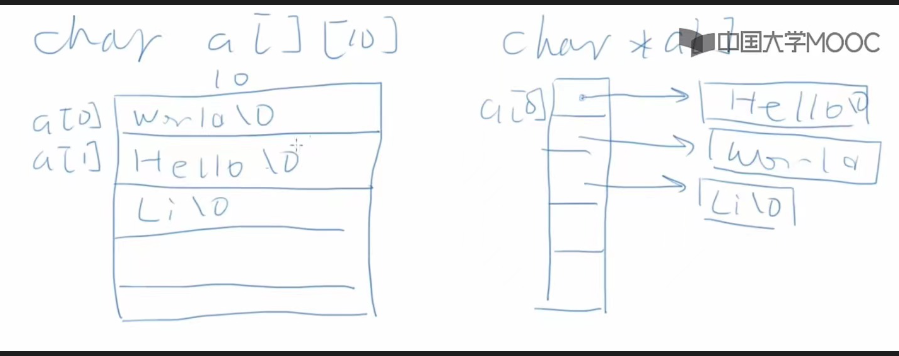
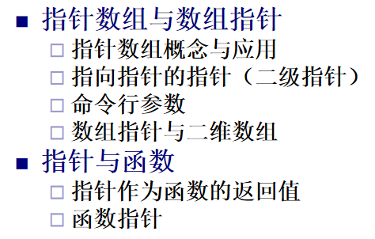
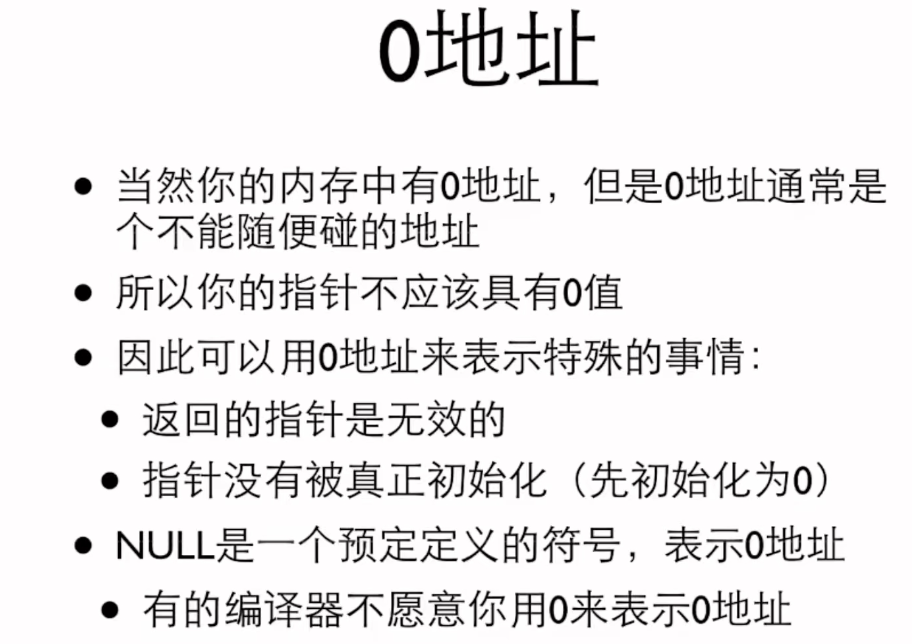

# 指针

### 概念与定义

**基本定义**
```c
int i;
int *p = &i;
int* p = &i;
```

理解：有一个整型变量i，p这个变量的值是变量i地址的变量，称p为指针变量
```c
int*p, q;
```
易错：其中，q只是普通int变量；要想定义多个指针变量得分别指定

### 规则

- 输出：得用%p，不能转换成整数再%x（16进制），因为这俩值一不一样取决于编译器、64or32位架构

- 取址符右边只能是变量；`&(++i)`,`&(i + j)`均不合法

### 指针运算
`q - p`：同类型指针相减，表示差的元素个数

`(int)p - (int)q` ：表示差的字节数


`p + 1` / `p-1`:指向下一个存储单元 / 指向上一个存储单元

其他都非法：指针相加、相乘和相除，指针加or减浮点数

可以++，--，+=，-=：注意对应的表达式值&变量值

!!! info
   
    ++i（表达式值+1） 大于 *，i++（表达式值不变） 等于 * 但从右向左结合：意味着俩都先于\*，那么\*其实是对表达式的值取\*

    例如

    ```c
    int main()
    {
    int arr[5] = {1, 2, 3, 4, 5};
    int* p = arr;
    int* q = arr;
    printf("*p++ : %d\n", *p++); //输出*p++ : 1
    printf("p : %p\n", p); //输出p : 0x7ffd12243564
    printf("*++q : %d\n", *++q); //输出*++q : 2
    printf("q : %p\n", q); //输出q : 0x7ffd12243564
    return 0;
    }
    ```


**应用**

\*p++ : 取出原本这个位置的值再把p+1

指针比较
	<, <=, >, >=, =, != 
	比较地址大小
	数组中元素地址 *线性递增*


### 应用
#### 指针与函数

**数组作参数**

函数定义：

- 常用：指针 例如 `*arr` or `arr[]`

- !!! info "其他"

      ```c
      // 1. 不指定大小，单独传递数组名（等价于指针）
      void func(int arr[]);

      // 2. 带有形参大小的语义化声明（仅作提示，与1等价）
      void func(int arr[length]);

      // 3. 传递数组和大小（常用方式）
      void func(int arr[], int size);

      // 4. 使用指针的方式（与1等价）
      void func(int *arr);

      // 5. 传递指针和大小（常用方式，等价于3）
      void func(int *arr, int size);

      // 6. 使用通用指针（适合泛型处理）
      void func(void *arr) {
          int *intArr = (int *)arr; // 需要显式转换
      }
      /*
      1. 参数 void *arr 的含义
      void * 是一种通用指针类型，表示它可以指向任意类型的数据（int、float、char 等）。
      它不能直接用于解引用或进行算术运算，因为编译器不知道它指向的具体数据类型。
      2. 显式类型转换 (int *)arr
      int *intArr = (int *)arr; 将 void * 指针显式转换为 int * 指针。
      这样，编译器就知道 intArr 指向的是一个 int 类型数据，允许后续进行解引用和算术运算。
      */

      // 7. 多维数组，必须指定列数（编译器需要推导数组布局）
      void func(int arr[][N]);  // 适用于静态二维数组
      void func(int arr[M][N]); // 如果固定行数，也可显式指定

      // 8. 多维数组同时传递行数（灵活处理，但需要列数固定）
      void func(int arr[][N], int rows);

      // 9. 动态分配的二维数组（需传递指针数组）
      void func(int **arr, int rows, int cols);

      // 10. const修饰符，保护数组内容（适合只读操作）
      void func(const int arr[], int size);
      void func(const int *arr, int size);

      // 11. restrict关键字（优化提示，避免指针别名）
      void func(int *restrict arr, int size);

      // 12. 使用stddef.h的size_t定义大小（推荐规范写法）
      #include <stddef.h>
      void func(int arr[], size_t size);
      void func(int *arr, size_t size);

      // 13. 使用指针加偏移处理子数组
      void func(int *arr, int startIndex, int length);

      // 14. 同时传递数组和数据类型信息（处理泛型或多类型场景）
      void func(void *arr, size_t elementSize, size_t length);
      ```


函数调用：

- 常用：数组名 `arr` 
- !!! info "其他"

    ```c
    // 1. 直接传递数组名
    int arr[10] = {0};
    func(arr);  // 对应 void func(int arr[]); 或 void func(int *arr);

    // 2. 带有大小参数
    int arr[10] = {0};
    func(arr, 10);  // 对应 void func(int arr[], int size); 或 void func(int *arr, int size);

    // 3. 传递多维数组
    int arr[3][4] = {{0}};
    func(arr);          // 对应 void func(int arr[][4]); 或 void func(int arr[M][4]);
    func(arr, 3);       // 对应 void func(int arr[][4], int rows);

    // 4. 动态分配的一维数组
    int *arr = malloc(10 * sizeof(int));
    func(arr);          // 对应 void func(int *arr);
    func(arr, 10);      // 对应 void func(int *arr, int size);

    // 5. 动态分配的二维数组（指针数组）
    int **arr = malloc(3 * sizeof(int *));
    for (int i = 0; i < 3; i++) arr[i] = malloc(4 * sizeof(int));
    func(arr, 3, 4);    // 对应 void func(int **arr, int rows, int cols);

    // 6. 传递通用指针
    void *arr = malloc(10 * sizeof(int));
    func(arr);          // 对应 void func(void *arr);

    // 7. 传递子数组（指针偏移）
    int arr[10] = {0};
    func(arr + 5, 5);   // 对应 void func(int *arr, int size); 或子数组操作

    // 8. 常量数组传递
    const int arr[10] = {0};
    func(arr, 10);      // 对应 void func(const int arr[], int size);

    // 9. 使用 restrict 修饰的数组
    int arr[10] = {0};
    func(arr, 10);      // 对应 void func(int *restrict arr, int size);

    // 10. 传递多类型数据
    double darr[10] = {0};
    func((void *)darr, sizeof(double), 10);  // 对应 void func(void *arr, size_t elementSize, size_t length);

    // 11. 多维数组的动态分配模拟
    int *arr = malloc(3 * 4 * sizeof(int));
    func(arr, 3, 4);    // 对应 void func(int *arr, int rows, int cols);

    // 12. 直接传递字符数组（字符串）
    char str[] = "hello";
    func(str);          // 对应 void func(char arr[]); 或 void func(char *arr);

    ```


!!! info "经典交换"

    === "1"
 
        ```c
        void swap1 (int x, int y)
        {   
        int t;
        t = x; 
        x = y; 
        y = t;
        } 
        ```
 
    === "2"
 
        ```c
        void swap2 (int *px, int *py)
        {    
        int t;
        t = *px; 
        *px = *py; 
        *py = t;
        } 
        ```
 
    === "3"
 
        ```c
        void swap3 (int *px, int *py)
        {    
        int *pt;
        pt = px; 
        px = py; 
        py = pt;
        } 
        ```
 
不理解就记住只有第二个能成功


??? info "试图理解"

    函数：仍然是参数的传递

    变量作参数：将那个变量的值给到函数的形参，而函数结束后，形参消失，原来的变量仍然是原来的值

    指针做参数：将那个变量的值给到函数的形参，这里，值是地址值，通过地址，可以在函数内部访问外面那个值


##### 函数多返回值 

**原理**

通过传入指针变量，更改对应地址上的值，实现“多返回值”。

**形式**

函数定义：参数例如 `int* p`

函数调用：参数例如 `&num`

例子：
```c
#include<stdio.h>
void minmax(int arr[], int *min, int *max) 
/*
传入参数有讲究：要在定义的函数中对main函数输入/定义的数组进行处理，就必须得传入它，这是函数参数传递的基本内容;
传入指针变量，因为定义的函数内部要对main函数中的min，max变量进行处理，原理同上面;
**核心：要在函数内部对主函数的变量进行操作，则必须得把主函数中的那个变量or其地址传入函数**
*/
{
    int i, j;
    *min = arr[0];
    *max = arr[0];
    for(i = 0; i < 5; i++){
        if(arr[i] >= *max) *max = arr[i];
        if(arr[i] <= *min) *min = arr[i];
    }
    printf("min = %d\n", *min);
    printf("max = %d", *max);
}
int main()
{
    int min; int max;
    int arr[5] = {1,4,7,5,0};
    minmax(arr, &min, &max);
    return 0;
}
```
注：
	函数参数表中的数组是什么？
		答：指针。
		形式：`int a[]` `int *a` 都行

**其他场景**

函数返回状态：return返回运算的状态，指针返回运算结果

#### 数组与指针

!!! success "牢记几句话"

    “数组名是指向数组首元素的指针”

    “同类型指针直接加减是加一个sizeof，实现移位的功能”

##### 几组等价表示
```c
int arr[10];
int* p = arr;
```
那么，
```c
arr , &arr[0] , &*arr , p , &p[0] , &*p
/*注意：
不包含&arr: 他是整个数组的地址；
他的类型：int (*)[10]，即一个指向包含 10 个 int 元素的数组的指针。
&arr + 1 ：加一个数组的大小
arr + 1 ：加一个元素的大小
*/
arr[i] , *(arr + i) , p[i] , *(p + i)
```
不等价：数组名是常量指针，不可赋值运算例如 `arr++`

```c
    int n, i;
    scanf("%d", &n);
    int* arr = (int* )malloc(n * sizeof(int));
    for(i = 0; i < n; i++) scanf("%d", &arr[i]); 
    for (i = 0; i < n; i++) printf("%d#", arr[i]);
    return 0;
```

##### 用法

遍历：`p++`

法一：
```c
int arr[] = {1,2,3,4,5,6,-1};
int* p = arr;
while(*p != -1){
    printf("%d\n", *p++);
}
```
法二：
```c
int arr[] = {1,2,3,4,5,6,-1};
int* p = arr;
for(p = arr; p < arr + n; p++){
   sum += *p;
   }
```


##### 其他

2. 数组变量是const类型指针:常量指针
   即：`int b[]` <=>`int* const b`
   故数组变量不能直接赋值, 即：
```c
int arr1[3] = {1,2,3};
int arr2;
arr2 = arr1;  //ERROR
```

#### const与指针
1. 指针可以是const(指针不可修改：`const` 在 `*` 后面)：这个指针变量的值（地址）不能变了，不能再指向其他变量

    ```c
    int* const q = &i    //q is const
    q++   //ERROR
    i = 20    //OK
    ```

2. 所指的是const(通过指针不可修改：`const` 在 `*` 前面)：表示不能通过这个指针去修改那个变量，但是这个指针和那个变量都不是const都可以修改.用处：大的结构用const结构的指针
    ```c
    const int *p = &i    
    i = 20; i++    //OK
    p++    //OK
    p = &j    //OK
    *p = 30    //ERROR
    ```

3. const数组

    `const int a\[] = {1,2,3,4,5,6}` : 这里的const表示每个元素都是const int

    用处：防止函数对数组修改：`int func(const int arr[], int len)`


### 动态分配内存
C99中的代替方法：可变长度数组
C89中：malloc函数：`#include<stdlib.h>`

**语法**

`int* a = malloc(n * sizeof(int))`

!!! info "malloc() & free()"
	
    函数原型：
		
    `void* malloc(size_t size);`
		
    `void free(void *ptr);`


free() and malloc() is 绑定使用的

参数：内存大小; 

返回值：void* ：一个指针，指向一块内存，单位为字节

之后需要强制类型转换 `(int*)malloc(n * sizeof(int))`

之后将malloc产生的那个指针当数组来用即可

之后要free(a)  //a 是那个指针

必须得是malloc申请来的内存才能被free，其他不行。
好习惯：定义指针先赋值0，最后在free(0)

合理设计程序结构以找到合适地方进行free

如果没有内存了：返回0 orNULL
	
   
**示例**
```c
    int n, i;
    scanf("%d", &n);
    int* arr = (int* )malloc(n * sizeof(int));
    for(i = 0; i < n; i++) scanf("%d", &arr[i]);
    for (i = 0; i < n; i++) printf("%d#", arr[i]);
    free(arr);
    return 0;
```

### 数组与指针

### 指针数组

### 函数指针


`char **a` : a是一个指针，指向另一个指针，那个指针指向一个字符串

`char *a[]` : 






### 杂项
1. NULL与0地址

1. 指针一定要现初始化！
2. 指针类型转换
	- 原理：换一种视角去看那些内存空间
	- 普通指针
		- 事实上，指针的大小都是一样的，可以进行强制类型转换
		- 理解：用内存格格来看：原来这堆格格代表A类型的数据，强制类型转换后代表B类型的数据，按照数据存储的规则进行“翻译”即可
		例子：
??? info "不同类型指针的相互赋值"

    在C语言中，`int` 类型和 `char` 类型的指针可以相互赋值，因为它们通常具有相同的大小（在大多数平台上，`char` 是1字节，`int` 是4字节，但指针的大小是固定的，通常是4字节或8字节，取决于系统架构）。然而，这种赋值通常是不安全的，因为 `int` 和 `char` 指针指向的数据大小不同，解引用这些指针可能会导致未定义行为。

    以下是一些示例和说明：

    示例1：将 `int*` 赋值给 `char*`
    ```c

        int i = 10;
        int* intPtr = &i;
        char* charPtr = (char*)intPtr; // 将int*转换为char*

        // 打印charPtr指向的值
        printf("%d\n", *charPtr); // 打印i的最低字节

    ```
    在这个例子中，我们将 `int` 类型的指针转换为 `char` 类型的指针，并打印出指向的值。这里打印的是 `int` 值的最低字节，因为 `char` 类型是1字节的。

    示例2：将 `char*` 赋值给 `int*`
    ```c

        char chars[4] = {'a', 'b', 'c', 'd'};
        char* charPtr = chars;
        int* intPtr = (int*)charPtr; // 将char*转换为int*

        // 打印intPtr指向的值
        printf("%c\n", *intPtr); // 打印chars数组的前4个字节作为一个整数

    ```
    在这个例子中，我们将 `char` 类型的指针转换为 `int` 类型的指针，并打印出指向的值。这里打印的是 `char` 数组的前4个字节作为一个整数的ASCII值。

    注意事项
    虽然这些赋值在技术上是可能的，但它们可能会导致未定义行为，特别是当你尝试解引用这些指针并访问它们指向的数据时。这是因为 `int` 和 `char` 类型的数据在内存中的表示和对齐方式可能不同。

    - **对齐问题**：许多系统要求 `int` 类型的数据必须在4字节边界上对齐，而 `char` 类型的数据没有这样的要求。将 `char*` 赋值给 `int*` 可能会导致对齐问题，从而导致程序崩溃或数据损坏。
    - **数据解释**：将 `int*` 赋值给 `char*` 或反之，可能会导致数据解释错误，因为 `int` 和 `char` 类型的数据在内存中的布局不同。

    因此，除非完全清楚这样做的后果，否则应避免将 `int` 和 `char` 类型的指针相互赋值。在实际编程中，最好使用相同类型的指针来操作相同类型的数据。


