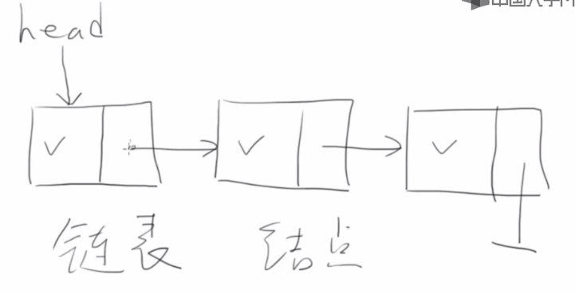
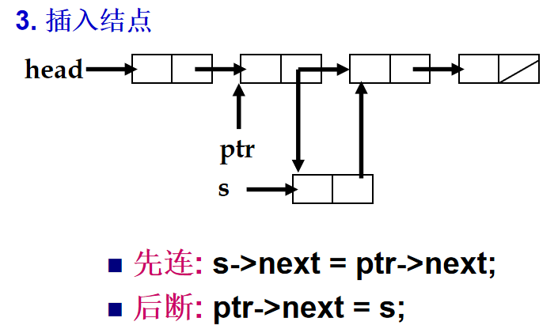
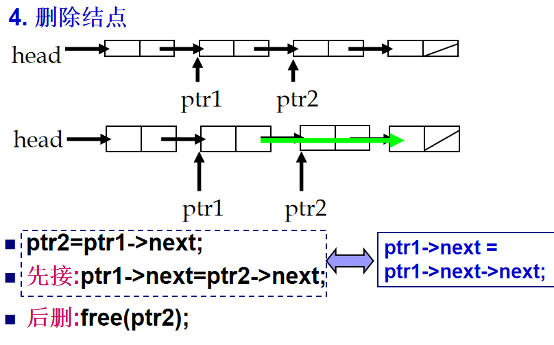

# 动态内存与链表

功能：可增大、可获取大小、可访问

[查看原码](https://github.com/Elliottt001/Code/tree/main/C/Practice/changeable-array)

设计思想：

- 自定义类型一般不定义指针
- free 的对象是Array结构里面的数组

## 链表

可变数组的缺陷：内存受限场景下，反复重新申请大内存会有内存不够的情况

方法：申请block大小的内存，再次申请一个，将他俩链起来（告诉编译器下一块内存在哪里）



结点包含：数据、指向下一个的指针





**语法：**

```c
typedef struct _node {
    int value;
    struct _node* next;
} Node;
```

=== "python链表"

    在 Python 中，链表可以用类和对象来实现，因为 Python 本身没有像 C++ 或 Java 那样的内置链表数据结构。链表有两种主要类型：**单向链表**和**双向链表**。以下是关于它们的实现和操作的详细说明。

    ---

    **单向链表实现**

    **定义单向链表：**

    ```python
    class Node:
        def __init__(self, data):
            self.data = data  # 存储节点数据
            self.next = None  # 指向下一个节点

    class LinkedList:
        def __init__(self):
            self.head = None  # 初始化头节点为空

        # 向链表末尾添加节点
        def append(self, data):
            new_node = Node(data)
            if not self.head:  # 如果链表为空
                self.head = new_node
                return
            current = self.head
            while current.next:  # 找到最后一个节点
                current = current.next
            current.next = new_node

        # 打印链表
        def print_list(self):
            current = self.head
            while current:
                print(current.data, end=" -> ")
                current = current.next
            print("None")

        # 删除值等于 data 的节点
        def delete(self, data):
            current = self.head

            # 如果要删除的是头节点
            if current and current.data == data:
                self.head = current.next
                current = None
                return

            # 找到要删除的节点
            prev = None
            while current and current.data != data:
                prev = current
                current = current.next

            if not current:  # 未找到节点
                print("Node not found")
                return

            prev.next = current.next
            current = None
    ```

    **使用示例：**

    ```python
    # 创建链表
    ll = LinkedList()
    ll.append(1)
    ll.append(2)
    ll.append(3)

    # 打印链表
    ll.print_list()  # 输出: 1 -> 2 -> 3 -> None

    # 删除节点
    ll.delete(2)
    ll.print_list()  # 输出: 1 -> 3 -> None
    ```

    ---

    **双向链表实现**

    **定义双向链表：**

    ```python
    class Node:
        def __init__(self, data):
            self.data = data
            self.next = None  # 指向下一个节点
            self.prev = None  # 指向前一个节点

    class DoublyLinkedList:
        def __init__(self):
            self.head = None  # 初始化头节点为空

        # 在链表末尾添加节点
        def append(self, data):
            new_node = Node(data)
            if not self.head:  # 如果链表为空
                self.head = new_node
                return
            current = self.head
            while current.next:  # 找到最后一个节点
                current = current.next
            current.next = new_node
            new_node.prev = current

        # 从链表头部打印链表
        def print_list(self):
            current = self.head
            while current:
                print(current.data, end=" <-> ")
                current = current.next
            print("None")

        # 从链表尾部打印链表（反向）
        def print_reverse(self):
            current = self.head
            while current and current.next:
                current = current.next
            while current:
                print(current.data, end=" <-> ")
                current = current.prev
            print("None")

        # 删除值等于 data 的节点
        def delete(self, data):
            current = self.head

            # 如果要删除的是头节点
            if current and current.data == data:
                self.head = current.next
                if self.head:
                    self.head.prev = None
                current = None
                return

            # 找到要删除的节点
            while current and current.data != data:
                current = current.next

            if not current:  # 未找到节点
                print("Node not found")
                return

            if current.next:
                current.next.prev = current.prev
            if current.prev:
                current.prev.next = current.next

            current = None
    ```

    **使用示例：**

    ```python
    # 创建双向链表
    dll = DoublyLinkedList()
    dll.append(1)
    dll.append(2)
    dll.append(3)

    # 打印链表
    dll.print_list()  # 输出: 1 <-> 2 <-> 3 <-> None

    # 反向打印链表
    dll.print_reverse()  # 输出: 3 <-> 2 <-> 1 <-> None

    # 删除节点
    dll.delete(2)
    dll.print_list()  # 输出: 1 <-> 3 <-> None
    ```

    ---

    **链表操作总结**

    - **插入操作：** 可以在头部、尾部或中间插入节点。
    - **删除操作：** 需要更新相邻节点的指针。
    - **遍历操作：** 从头节点开始，依次访问每个节点。

    链表的实现非常灵活，适合存储动态数据结构，适用于需要频繁插入和删除操作的场景。

=== "C链表"

    在 C 中，链表可以用结构体和指针来实现。以下是单向链表和双向链表的实现和常用操作的详细说明。

    ---

    **单向链表**

    **定义单向链表节点**

    ```c
    #include <stdio.h>
    #include <stdlib.h>

    // 定义节点结构
    struct Node {
        int data;              // 节点数据
        struct Node* next;     // 指向下一个节点的指针
    };

    // 创建新节点
    struct Node* createNode(int data) {
        struct Node* newNode = (struct Node*)malloc(sizeof(struct Node));
        newNode->data = data;
        newNode->next = NULL;
        return newNode;
    }
    ```

    **单向链表操作**

    1. **插入节点到链表末尾**

    ```c
    void append(struct Node** head, int data) {
        struct Node* newNode = createNode(data);
        if (*head == NULL) {  // 如果链表为空
            *head = newNode;
            return;
        }
        struct Node* temp = *head;
        while (temp->next != NULL) {  // 遍历到链表末尾
            temp = temp->next;
        }
        temp->next = newNode;
    }
    ```

    !!! success "append函数超详解"

        **函数原型**

        ```c
        void append(List* plist, int num);
        ```

        **参数说明**：

        1. **`plist`**：指向链表结构的指针，用于表示要操作的链表。
        - `List` 是一个结构体，包含指向链表头节点的指针 `head`。
        - 通过传入 `List*`，函数能够直接操作链表的内容（比如添加节点）。
        2. **`num`**：要添加到链表的新节点的值。

        ---

        **函数实现**

        ```c
        void append(List* plist, int num)
        {
            // 1. 创建一个新的节点并初始化
            Node* p = (Node*)malloc(sizeof(Node)); // 为新节点分配内存
            p->value = num; // 设置新节点的值
            p->next = NULL; // 新节点的 next 指针初始化为 NULL

            // 2. 找到链表的最后一个节点
            Node* last = plist->head; // 从链表头开始遍历
            if (last) {
                // 如果链表不为空，找到最后一个节点
                while (last->next) {
                    last = last->next; // 循环向下，直到最后一个节点
                }
                // 3. 将新节点连接到最后一个节点
                last->next = p;
            } else {
                // 如果链表为空，将新节点作为头节点
                plist->head = p;
            }
        }
        ```

        ---

        **详细分步解析**

        **1. 创建新节点**

        ```c
        Node* p = (Node*)malloc(sizeof(Node));
        p->value = num;
        p->next = NULL;
        ```

        - **动态内存分配**：
        - 使用 `malloc` 分配一段内存，用于存储新节点。
        - 返回值是 `void*`，需要强制类型转换为 `Node*`。
        - **初始化新节点**：
        - `p->value = num`：将新节点的 `value` 字段设置为传入的值 `num`。
        - `p->next = NULL`：将新节点的 `next` 指针设置为 `NULL`，表示它暂时是链表的最后一个节点。

        ---

        **2. 查找链表的最后一个节点**

        ```c
        Node* last = plist->head;
        if (last) {
            while (last->next) {
                last = last->next;
            }
        }
        ```

        - **指针 `last` 的作用**：
        - `last` 是一个临时指针，用于遍历链表，找到当前链表的最后一个节点。
        - 初始时，`last` 指向链表的头节点（`plist->head`）。
        - **判断链表是否为空**：
        - 如果 `plist->head` 为 `NULL`，说明链表为空，直接跳到 `else` 部分。
        - 如果 `plist->head` 不为 `NULL`，说明链表中至少有一个节点，进入 `while` 循环。
        - **`while` 循环**：
        - `last->next` 表示当前节点的下一节点是否存在。
        - 循环条件 `last->next` 为真时，将指针 `last` 移动到下一个节点。

        ---

        **3. 连接新节点**

        ```c
        last->next = p;
        ```

        - 当找到链表的最后一个节点时，将其 `next` 指针指向新创建的节点 `p`，这样 `p` 成为新的最后一个节点。

        ---

        **4. 处理空链表**

        ```c
        else {
            plist->head = p;
        }
        ```

        - 如果链表为空（`plist->head == NULL`），新节点 `p` 直接成为链表的头节点。

        ---

        **函数工作原理举例**

        假设链表初始状态为空，依次调用 `append` 函数，插入 3 个值：`10`、`20`、`30`。

        **初始状态**

        - 链表为空：`plist->head = NULL`

        **第一步**：添加 `10`
        
        1. 创建新节点 `p`，值为 `10`，`p->next = NULL`。
        2. 因为链表为空（`plist->head == NULL`），将 `plist->head` 指向 `p`。
        - 链表状态：`10 -> NULL`

        **第二步**：添加 `20`
        
        1. 创建新节点 `p`，值为 `20`，`p->next = NULL`。
        2. 遍历链表，找到最后一个节点（`10`）。
        3. 将最后一个节点（`10`）的 `next` 指针指向新节点 `p`。
        - 链表状态：`10 -> 20 -> NULL`

        **第三步**：添加 `30`
        
        1. 创建新节点 `p`，值为 `30`，`p->next = NULL`。
        2. 遍历链表，找到最后一个节点（`20`）。
        3. 将最后一个节点（`20`）的 `next` 指针指向新节点 `p`。
        - 链表状态：`10 -> 20 -> 30 -> NULL`

        ---

        **总结**
        
        `append` 函数的核心功能是向链表末尾添加一个新节点。主要步骤：
        
        1. 创建新节点，动态分配内存并初始化。
        2. 判断链表是否为空：
        - 如果为空，将新节点设为头节点。
        - 如果不为空，遍历链表找到最后一个节点，并将新节点连接到最后。


    2. **打印链表**

    ```c
    void printList(struct Node* head) {
        struct Node* temp = head;
        while (temp != NULL) {
            printf("%d -> ", temp->data);
            temp = temp->next;
        }
        printf("NULL\n");
    }
    ```

    3. **删除节点**

    ```c
    void deleteNode(struct Node** head, int key) {
        struct Node* temp = *head;
        struct Node* prev = NULL;

        // 如果头节点需要删除
        if (temp != NULL && temp->data == key) {
            *head = temp->next;
            free(temp);
            return;
        }

        // 查找要删除的节点
        while (temp != NULL && temp->data != key) {
            prev = temp;
            temp = temp->next;
        }

        // 如果未找到节点
        if (temp == NULL) {
            printf("Node with data %d not found.\n", key);
            return;
        }

        prev->next = temp->next;  // 删除节点
        free(temp);
    }
    ```

    **单向链表完整示例**

    ```c
    int main() {
        struct Node* head = NULL;

        // 插入节点
        append(&head, 10);
        append(&head, 20);
        append(&head, 30);

        // 打印链表
        printf("Linked List: ");
        printList(head);

        // 删除节点
        deleteNode(&head, 20);
        printf("After Deletion: ");
        printList(head);

        return 0;
    }
    ```

    ---

    **双向链表**

    **定义双向链表节点**

    ```c
    #include <stdio.h>
    #include <stdlib.h>

    // 定义双向链表节点结构
    struct Node {
        int data;              // 节点数据
        struct Node* next;     // 指向下一个节点
        struct Node* prev;     // 指向前一个节点
    };

    // 创建新节点
    struct Node* createNode(int data) {
        struct Node* newNode = (struct Node*)malloc(sizeof(struct Node));
        newNode->data = data;
        newNode->next = NULL;
        newNode->prev = NULL;
        return newNode;
    }
    ```

    **双向链表操作**

    1. **插入节点到链表末尾**

    ```c
    void append(struct Node** head, int data) {
        struct Node* newNode = createNode(data);
        if (*head == NULL) {  // 如果链表为空
            *head = newNode;
            return;
        }
        struct Node* temp = *head;
        while (temp->next != NULL) {  // 遍历到链表末尾
            temp = temp->next;
        }
        temp->next = newNode;
        newNode->prev = temp;
    }
    ```

    2. **从头部打印链表**

    ```c
    void printList(struct Node* head) {
        struct Node* temp = head;
        while (temp != NULL) {
            printf("%d <-> ", temp->data);
            temp = temp->next;
        }
        printf("NULL\n");
    }
    ```

    3. **从尾部打印链表**

    ```c
    void printReverse(struct Node* head) {
        struct Node* temp = head;
        if (temp == NULL) return;

        // 遍历到链表末尾
        while (temp->next != NULL) {
            temp = temp->next;
        }

        // 从尾部向头部打印
        while (temp != NULL) {
            printf("%d <-> ", temp->data);
            temp = temp->prev;
        }
        printf("NULL\n");
    }
    ```

    4. **删除节点**

    ```c
    void deleteNode(struct Node** head, int key) {
        struct Node* temp = *head;

        // 找到要删除的节点
        while (temp != NULL && temp->data != key) {
            temp = temp->next;
        }

        if (temp == NULL) {  // 未找到节点
            printf("Node with data %d not found.\n", key);
            return;
        }

        if (temp->prev != NULL) {
            temp->prev->next = temp->next;
        } else {  // 删除头节点
            *head = temp->next;
        }

        if (temp->next != NULL) {
            temp->next->prev = temp->prev;
        }

        free(temp);
    }
    ```

    **双向链表完整示例**

    ```c
    int main() {
        struct Node* head = NULL;

        // 插入节点
        append(&head, 10);
        append(&head, 20);
        append(&head, 30);

        // 正序打印链表
        printf("Doubly Linked List: ");
        printList(head);

        // 倒序打印链表
        printf("Reverse List: ");
        printReverse(head);

        // 删除节点
        deleteNode(&head, 20);
        printf("After Deletion: ");
        printList(head);

        return 0;
    }
    ```

    ---

    **总结**

    - 单向链表适合基本操作，结构简单。
    - 双向链表可以在两个方向上遍历，适合需要频繁前后移动的操作。
    - 操作中要特别注意指针的正确操作，避免内存泄漏或段错误 (`segmentation fault`)。


=== "C++链表"

    在 C++ 中，可以使用类和指针来实现链表结构。以下是单向链表和双向链表的实现及常用操作的详细说明。

    ---

    **单向链表**

    **定义单向链表节点**

    ```cpp
    #include <iostream>
    using namespace std;

    // 定义单向链表节点
    class Node {
    public:
        int data;        // 节点数据
        Node* next;      // 指向下一个节点的指针

        Node(int val) : data(val), next(nullptr) {}  // 构造函数
    };
    ```

    **定义单向链表类**

    ```cpp
    class LinkedList {
    private:
        Node* head;  // 指向头节点的指针

    public:
        LinkedList() : head(nullptr) {}  // 构造函数

        // 添加节点到链表末尾
        void append(int data) {
            Node* newNode = new Node(data);
            if (head == nullptr) {
                head = newNode;
                return;
            }
            Node* temp = head;
            while (temp->next != nullptr) {
                temp = temp->next;
            }
            temp->next = newNode;
        }

        // 打印链表
        void printList() {
            Node* temp = head;
            while (temp != nullptr) {
                cout << temp->data << " -> ";
                temp = temp->next;
            }
            cout << "NULL" << endl;
        }

        // 删除指定值的节点
        void deleteNode(int key) {
            Node* temp = head;
            Node* prev = nullptr;

            // 删除头节点
            if (temp != nullptr && temp->data == key) {
                head = temp->next;
                delete temp;
                return;
            }

            // 查找要删除的节点
            while (temp != nullptr && temp->data != key) {
                prev = temp;
                temp = temp->next;
            }

            // 未找到节点
            if (temp == nullptr) {
                cout << "Node with value " << key << " not found." << endl;
                return;
            }

            // 删除节点
            prev->next = temp->next;
            delete temp;
        }

        // 析构函数：释放所有节点
        ~LinkedList() {
            Node* temp;
            while (head != nullptr) {
                temp = head;
                head = head->next;
                delete temp;
            }
        }
    };
    ```

    **单向链表完整示例**

    ```cpp
    int main() {
        LinkedList list;

        // 添加节点
        list.append(10);
        list.append(20);
        list.append(30);

        // 打印链表
        cout << "Linked List: ";
        list.printList();

        // 删除节点
        list.deleteNode(20);
        cout << "After Deletion: ";
        list.printList();

        return 0;
    }
    ```

    ---

    **双向链表**

    **定义双向链表节点**

    ```cpp
    class Node {
    public:
        int data;        // 节点数据
        Node* next;      // 指向下一个节点
        Node* prev;      // 指向前一个节点

        Node(int val) : data(val), next(nullptr), prev(nullptr) {}  // 构造函数
    };
    ```

    **定义双向链表类**

    ```cpp
    class DoublyLinkedList {
    private:
        Node* head;  // 指向头节点

    public:
        DoublyLinkedList() : head(nullptr) {}  // 构造函数

        // 添加节点到链表末尾
        void append(int data) {
            Node* newNode = new Node(data);
            if (head == nullptr) {
                head = newNode;
                return;
            }
            Node* temp = head;
            while (temp->next != nullptr) {
                temp = temp->next;
            }
            temp->next = newNode;
            newNode->prev = temp;
        }

        // 从头部打印链表
        void printList() {
            Node* temp = head;
            while (temp != nullptr) {
                cout << temp->data << " <-> ";
                temp = temp->next;
            }
            cout << "NULL" << endl;
        }

        // 从尾部打印链表（反向）
        void printReverse() {
            Node* temp = head;
            if (temp == nullptr) return;

            // 找到尾节点
            while (temp->next != nullptr) {
                temp = temp->next;
            }

            // 从尾节点向头打印
            while (temp != nullptr) {
                cout << temp->data << " <-> ";
                temp = temp->prev;
            }
            cout << "NULL" << endl;
        }

        // 删除指定值的节点
        void deleteNode(int key) {
            Node* temp = head;

            // 找到要删除的节点
            while (temp != nullptr && temp->data != key) {
                temp = temp->next;
            }

            // 未找到节点
            if (temp == nullptr) {
                cout << "Node with value " << key << " not found." << endl;
                return;
            }

            // 更新前后节点的指针
            if (temp->prev != nullptr) {
                temp->prev->next = temp->next;
            } else {  // 删除头节点
                head = temp->next;
            }

            if (temp->next != nullptr) {
                temp->next->prev = temp->prev;
            }

            delete temp;
        }

        // 析构函数：释放所有节点
        ~DoublyLinkedList() {
            Node* temp;
            while (head != nullptr) {
                temp = head;
                head = head->next;
                delete temp;
            }
        }
    };
    ```

    **双向链表完整示例**

    ```cpp
    int main() {
        DoublyLinkedList list;

        // 添加节点
        list.append(10);
        list.append(20);
        list.append(30);

        // 正序打印链表
        cout << "Doubly Linked List: ";
        list.printList();

        // 反序打印链表
        cout << "Reverse List: ";
        list.printReverse();

        // 删除节点
        list.deleteNode(20);
        cout << "After Deletion: ";
        list.printList();

        return 0;
    }
    ```

    ---

    **总结**

    单向链表优点

    - 结构简单，占用内存少。
    - 适合只需要从头到尾遍历的场景。

    双向链表优点

    - 支持从头部和尾部两个方向遍历，操作更加灵活。
    - 适合需要频繁插入、删除以及双向遍历的场景。

    链表的实现中要特别注意内存管理，防止内存泄漏。在 C++ 中，可以使用智能指针（如 `std::unique_ptr` 或 `std::shared_ptr`）来简化内存管理工作。

## 附录：链表内存分配的常见疑问
```c
Node* createList() {
    Node* head = (Node*)malloc(sizeof(Node)); // 创建头节点
    head->next = NULL; // 头节点的指针域初始化为NULL
    return head;
    //是(Node*)malloc(sizeof(Node))而不是(Node*)malloc(sizeof(Node*))
}
```

`head` 是一个指向 `Node` 类型的指针，而你要分配的内存是用来存储一个 `Node` 结构体的数据。因此，应该为 **结构体本身** 分配内存，而不是为指针分配内存。

**`malloc(sizeof(Node))` 的含义**：

   - `malloc(sizeof(Node))` 会根据 `Node` 结构体的大小分配内存。例如，假设 `Node` 结构体包含一个 `next` 指针（通常是 `Node*` 类型），那么 `sizeof(Node)` 就是 `Node` 结构体的总大小，包含 `next` 指针所占的空间。
   - 当你为 `Node` 分配内存时，你实际上是为整个结构体分配空间，而不是为指针本身分配空间。指针只是用来指向那个结构体的。

