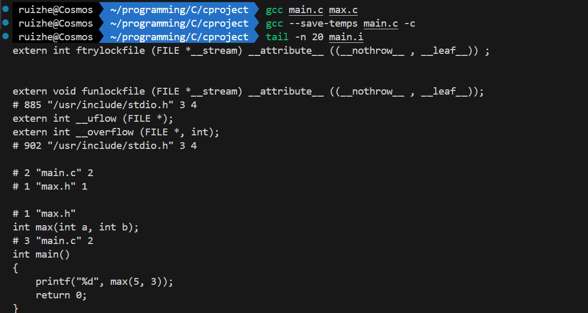

# 大程序结构

[浅谈VScode中多文件项目的编译
-博客园](https://www.cnblogs.com/Roboduster/p/15315817.html)

将不同功能（函数）放到很多个.c文件中

文件结构与内容：

main.c，其中 `#include"func.h"`

func.h，其中写func函数的原型声明

- 作用：“合同”，里面是func的原型

func.c，其中 `#include"func.h"`，下面写函数的body

### 头文件

示例：
```c
// hello.h
#ifndef HELLO_H
#define HELLO_H
​
#include <stdio.h>
​
extern void greet(const char *name);
​
#endif // HELLO_H
​
// hello.c
#include "hello.h"
​
void greet(const char *name)
{
    printf("Hello, %s!\n", name);
}
​
// main.c
#include "hello.h"
​
int main(){
    greet("各位大佬!");
}
```

**知识**

把*函数原型*放到一个头文件(以.h结尾)中，在需要调用这个函数的源代码文件(.c文件)中#include这个头文件，就能让编译器在编译的时候知道函数的原刑

`#include`:编译预处理指令，和宏一样，在编译之前就处理了

它把include后面那个文件的全部文本内容 原封不动地插入到include语句所在的地方，所以也不是一定要在.c文件的最前面#include

**注意：** 在定义和使用这个函数的地方都要
`include"func.h"`；一般情况：任何.c都有同名的.h，把所有*对外公开的*函数原型和全局变量的声明都放进去。

**补充**：不对外公开：加 `static` 函数前面加它代表只有他在的这个.c文件（编译单元）可以用它，其他不行；全局变量前面加它代表他只是这个.c文件（编译单元）中可以使用的全局变量。



**语法**：

- `""` or `<>`
    - `""` 先在当前目录下找这个文件，找不到再去别的目录下找，一般用于自己写的

    - `<>` 不会在当前目录下找，一般用于系统的标准库头文件(在/usr/include目录下，另外有c++目录里面是cpp的头文件)

    命令行可以`more stdio.h` 一点点看，`code stdio.h` 的效果和`ctrl + click` 相同hhh

- 标准头文件结构

    ```c
    #ifndef __FILENAME_H__
    #define __FILENAME_H__

    //代码块

    #endif
    ```


**理解**：include不是在引入库，只是文本替换

### 声明

对于在一个.c文件（不是main.c，假设是func.c）定义的全局变量，要想在main.c访问它，需要在对应的func.h声明（声明变量）；

**语法**:

func.h： `extern int VARIBLENAME` 

func.c：`int VARIBLENAME = 12` (在全局变量的位置，最外面)


