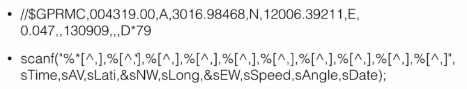
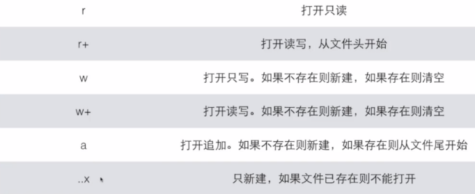

# 文件

### 格式化输入输出

`printf : %[flags][width][.prec][hlL]type`

| **部分**             | **说明**                                                                                   | **示例代码**                                                                                             | **输出**              |
|-----------------------|-------------------------------------------------------------------------------------------|----------------------------------------------------------------------------------------------------------|-----------------------|
| **`%`**              | 格式说明符的起始标志。                                                                    | `printf("Value: %d\n", 42);`                                                                              | `Value: 42`          |
| **`[flags]`**         | 可选标志，用于修改输出格式：                                                              |                                                                                                          |                       |
| - `-`                | 左对齐输出（默认右对齐）。                                                                | `printf("\|%-10d\|\n", 42);`                                                                               | `\|42        \|`        |
| - `+`                | 输出符号（正数带`+`，负数带`-`）。                                                        | `printf("%+d\n", 42); printf("%+d\n", -42);`                                                             | `+42` `-42`          |
| - `空格`             | 正数前加空格，负数前加`-`。                                                               | `printf("\|% d\|\n", 42); printf("\|% d\|\n", -42);`                                                         | `\| 42\|` `\|-42\|`       |
| - `0`                | 用`0`填充宽度（在数字前有效）。                                                           | `printf("%05d\n", 42);`                                                                                | `00042`            |
| - `#`                | 启用格式依赖的功能（例如八进制/十六进制前缀）。                                           | `printf("%#x\n", 42); printf("%#o\n", 42);`                                                              | `0x2a` `052`         |
| **`[width]`**         | 最小输出宽度（整数）。输出不足时用空格填充，超过时无影响。                               | `printf("\|%10d\|\n", 42); printf("\|%3d\|\n", 12345);`                                                      | `\|        42\|` `\|12345\|` |
| - `*`                | 下一个参数是字符占位数（那个参数替换`*`）                                                          | `printf("%0*d\n", 7, 42);`                                                                                | `0000042`            |
| **`[.prec]`**         | 精度控制：                                                                                 |                                                                                                          |                       |
| - `.`                | 指定浮点数的小数位数或字符串最大字符数。                                                  | `printf("%.2f\n", 3.14159); printf("%.3s\n", "Hello");`                                                  | `3.14` `Hel`         |
| - 整数部分           | 对整数无影响（不推荐使用）。                                                              | `printf("%.5d\n", 42);`                                                                                  | `00042`              |
| - `.*`                | 下一个参数是小数点后的位数                                                           | `printf("%*lf\n", 5, 0.5);`                                                                                | `0.50000`            |
| **`[hIL]`**           | 长度修饰符：控制输入数据的大小。                                                          |                                                                                                          |                       |
| - `h`                | 短整数类型（`short`）。                                                                  | `short s = 42; printf("%hd\n", s);`                                                                      | `42`                 |
| - `l`                | 长整数类型（`long`）。                                                                   | `long l = 123456789; printf("%ld\n", l);`                                                                | `123456789`          |
| - `ll`               | 长长整数类型（`long long`）。                                                            | `long long ll = 123456789012345; printf("%lld\n", ll);`                                                  | `123456789012345`    |
| - `L`                | 长浮点类型（`long double`）。                                                            | `long double ld = 3.141592653589; printf("%Lf\n", ld);`                                                  | `3.141593`           |
| **`type`**            | 数据类型，定义如何解释数据并输出：                                                        |                                                                                                          |                       |
| - `d`/`i`            | 带符号整数（十进制）。                                                                   | `printf("%d\n", 42); printf("%d\n", -42);`                                                               | `42` `-42`           |
| - `u`                | 无符号整数（十进制）。                                                                   | `printf("%u\n", 42);`                                                                                    | `42`                 |
| - `f`                | 浮点数（小数形式）。                                                                     | `printf("%.2f\n", 3.14159);`                                                                             | `3.14`               |
| - `x`/`X`            | 无符号整数（十六进制）。                                                                 | `printf("%x\n", 42); printf("%X\n", 42);`                                                                | `2a` `2A`            |
| - `o`                | 无符号整数（八进制）。                                                                   | `printf("%o\n", 42);`                                                                                    | `52`                 |
| - `c`                | 单个字符。                                                                               | `printf("%c\n", 'A');
| - `s`                | 字符串。                                                                                 | `printf("%s\n", "Hello");`                                                                               | `Hello`              |
| - `p`                | 指针地址。                                                                               | `printf("%p\n", (void*)&main);`                                                                          | 类似于 `0x7ffc...`   |
| - `%`                | 输出百分号本身。                                                                         | `printf("100%% Complete\n");`                                                                            | `100% Complete`      |
| - `e`                | 科学计数法表示的浮点数（小写）。                                                          | `printf("%e\n", 12345.6789);`                                                                             | `1.234568e+04`       |
| - `E`                | 科学计数法表示的浮点数（大写）。                                                          | `printf("%E\n", 12345.6789);`                                                                             | `1.234568E+04`       |
| - `n`                | 将到目前为止读入/写出的字符数存储到指定的变量中。                                              | `int n; printf("Hello%n\n", &n); printf("Chars: %d\n", n);`                                               | `Hello` 和 `Chars: 5` |
| - `a`                | 十六进制表示的浮点数（小写），符合 C99 标准。                                              | `printf("%a\n", 123.45);`                                                                                 | `0x1.edp+06`         |
| - `A`                | 十六进制表示的浮点数（大写），符合 C99 标准。                                              | `printf("%A\n", 123.45);`                                                                                 | `0X1.EDP+06`         |
| - `G`                | 根据值自动选择`%E`或`%f`格式（大写）。                                                    | `printf("%G\n", 12345.6789);`                                                                             | `12345.7`            |
| - `g`                | 根据值自动选择`%e`或`%f`格式（小写）。                                                    | `printf("%g\n", 12345.6789);`                                                                             | `12345.7`            |

```c
printf("%9.3f\n", 123.0)
//连带小数点前后总共占9位
```



**printf scanf的返回值**

- scanf：读入的字符数
- printf：输出的字符数

大型程序中，应该判断每次调用scanf和printf的返回值，从而了解程序运行中是否存在问题。


### 基本概念

在C语言中，文件操作是一种将程序数据持久化到存储设备（如硬盘）中的方式，可以读取和写入数据到文件中。文件操作的核心思想是通过**文件指针**来访问文件，文件指针是一个连接程序和文件的桥梁。

---

#### 文件与流
- **文件（File）**  
  文件是存储在存储设备上的数据集合，可以是文本文件（如 `.txt`）或二进制文件（如 `.bin`）。C语言通过文件操作函数访问文件内容。

- **流（Stream）**  
  流是文件与程序之间数据传输的抽象。通过流，数据可以从程序写入文件，或从文件读取到程序。

---

#### 文件指针
- 类型为 `FILE*` 的指针，定义在 `stdio.h` 中，用于标识程序与文件之间的连接。

使用：

1. 使用 `fopen` 打开文件并获取指针。
2. 操作文件（读/写/定位）。
3. 使用 `fclose` 关闭文件并释放资源。


**文件指针会随着在文件中写入内容而移动**。

- **`fprintf`、`fwrite` 等写操作**：文件指针会移动到写入数据的末尾。
- **`fseek` 和 `ftell`**：可以用于手动调整和检查文件指针的位置。

---

### 示例代码
以下代码演示了文件指针如何随着写入内容而移动：

```c
#include <stdio.h>

int main() {
    FILE* fp = fopen("test.txt", "w+");  // 读写模式
    if (fp == NULL) {
        perror("Failed to open file");
        return 1;
    }

    // 初始文件指针位置
    printf("Initial position: %ld\n", ftell(fp));  // 输出 0

    // 写入内容
    fprintf(fp, "Hello, ");
    printf("After first write: %ld\n", ftell(fp)); // 输出 7（"Hello, " 有 7 个字符）

    // 写入更多内容
    fprintf(fp, "world!");
    printf("After second write: %ld\n", ftell(fp)); // 输出 13（"Hello, world!" 有 13 个字符）

    // 关闭文件
    fclose(fp);
    return 0;
}
```

**输出示例：**
```
Initial position: 0
After first write: 7
After second write: 13
```

---

文件指针移动规则

1. **写入操作后**：
   - 文件指针移动到写入内容的末尾。
   - 例如，写入 `"Hello"` 后，文件指针移动到 `5` 处（字符数为 `5`）。

2. **读操作后**：
   - 文件指针移动到读取内容的末尾。

3. **手动移动指针**：
   - 可以通过 `fseek` 或 `rewind` 函数调整指针位置。例如：
     ```c
     fseek(fp, 0, SEEK_SET);  // 将文件指针移动到文件开头
     ```


### 常用函数

#### 1. 文件的打开与关闭

**文件打开：`fopen`**

- **函数原型**：
    ```c
    FILE *fopen(const char *filename, const char *mode);
    ```
- **功能**：打开一个文件并返回一个指向该文件的指针。
- **参数**：
    - `filename`：要打开的文件名。
    - `mode`：文件打开模式。常用模式有：
    在 C 语言中，文件操作模式也可以结合二进制模式进行操作。二进制模式通过在文件模式字符串中添加一个字符 `'b'` 实现，具体格式如 `"rb"`, `"wb"`, 等等。以下是补充二进制相关内容后的完整表格：

| 模式      | 作用                                              | 文件存在      | 文件不存在 |
|-----------|---------------------------------------------------|---------------|------------|
| `"r"`     | 打开只读                                          | 成功打开      | 返回 NULL  |
| `"w"`     | 打开只写，文件存在则清空原文件内容                | 成功打开      | 创建新文件 |
| `"a"`     | 打开追加模式，文件指针位于末尾                    | 成功打开      | 创建新文件 |
| `"r+"`    | 以读写模式打开文件，不清空文件内容                | 成功打开      | 返回 NULL  |
| `"w+"`    | 打开读写，文件存在则清空原文件内容                | 成功打开      | 创建新文件 |
| `"a+"`    | 以读写模式打开文件，文件指针位于末尾              | 成功打开      | 创建新文件 |
| `"rb"`    | 打开二进制文件只读                                | 成功打开      | 返回 NULL  |
| `"wb"`    | 打开二进制文件只写，文件存在则清空原文件内容      | 成功打开      | 创建新文件 |
| `"ab"`    | 打开二进制文件追加模式，文件指针位于末尾          | 成功打开      | 创建新文件 |
| `"r+b"`   | 打开二进制文件读写，不清空文件内容                | 成功打开      | 返回 NULL  |
| `"w+b"`   | 打开二进制文件读写，文件存在则清空原文件内容      | 成功打开      | 创建新文件 |
| `"a+b"`   | 打开二进制文件读写，文件指针位于末尾              | 成功打开      | 创建新文件 |
| `"wx"`    | 只创建新文件写入模式，文件已存在则返回 NULL       | 返回 NULL     | 创建新文件 |
| `"wbx"`   | 只创建新二进制文件写入模式，文件已存在则返回 NULL | 返回 NULL     | 创建新文件 |


- **返回值**：成功时返回文件指针，失败时返回 `NULL`。

---

**文件关闭：`fclose`**

- **函数原型**：
    ```c
    int fclose(FILE *stream);
    ```
- **功能**：关闭文件，释放相关资源。
- **参数**：
    - `stream`：文件指针。
- **返回值**：成功时返回 `0`，失败时返回 `EOF`。

---

#### 2. 文件读取操作

##### 文本文件读取

**`fgetc`**

- **函数原型**：
    ```c
    int fgetc(FILE *stream);
    ```
- **功能**：从文件中读取一个字符。
- **参数**：
    - `stream`：文件指针。
- **返回值**：返回读取的字符，如果到达文件末尾，返回 `EOF`。

**`fgets`**

- **函数原型**：
    ```c
    char *fgets(char *str, int n, FILE *stream);
    ```
- **功能**：从文件中读取一行字符（包括空格）并存入 `str` 中，最多读取 `n-1` 个字符。
- **参数**：
    - `str`：存储读取内容的缓冲区。
    - `n`：缓冲区的大小。
    - `stream`：文件指针。
- **返回值**：返回 `str`，如果读取到文件末尾返回 `NULL`。

##### 二进制文件读取

**`fread`**

- **函数原型**：
    ```c
    size_t fread(void *ptr, size_t size, size_t count, FILE *stream);
    ```
- **功能**：从文件中读取二进制数据，存入内存中。
- **参数**：
    - `ptr`：数据存储缓冲区。
    - `size`：每个元素的大小（字节）。
    - `count`：要读取的元素个数。
    - `stream`：文件指针。
- **返回值**：成功读取的元素个数。

---

#### 3. 文件写入操作

##### 文本文件写入

**`fputc`**

- **函数原型**：
    ```c
    int fputc(int c, FILE *stream);
    ```
- **功能**：向文件写入一个字符。
- **参数**：
    - `c`：要写入的字符。
    - `stream`：文件指针。
- **返回值**：成功返回写入的字符，失败返回 `EOF`。

**`fputs`**

- **函数原型**：
    ```c
    int fputs(const char *str, FILE *stream);
    ```
- **功能**：向文件写入一个字符串（不包含 `\0` 结束符）。
- **参数**：
    - `str`：要写入的字符串。
    - `stream`：文件指针。
- **返回值**：成功返回非负值，失败返回 `EOF`。

##### 二进制文件写入

**`fwrite`**

- **函数原型**：
    ```c
    size_t fwrite(const void *ptr, size_t size, size_t count, FILE *stream);
    ```
- **功能**：向文件写入二进制数据。
- **参数**：
    - `ptr`：数据源（内存中的数据）。
    - `size`：每个元素的大小（字节）。
    - `count`：要写入的元素个数。
    - `stream`：文件指针。
- **返回值**：成功写入的元素个数。

---

#### 4. 文件定位

**`fseek`**

- **函数原型**：
    ```c
    int fseek(FILE *stream, long offset, int whence);
    ```
- **功能**：将文件指针移动到指定位置。
- **参数**：
    - `stream`：文件指针。
    - `offset`：偏移量，单位为字节。可以是正值、负值或零。
    - `whence`：偏移基准位置。常用值有：
        - `SEEK_SET`：文件开头。
        - `SEEK_CUR`：当前位置。
        - `SEEK_END`：文件末尾。
- **返回值**：成功时返回 `0`，失败时返回非零值。

**`ftell`**

- **函数原型**：
    ```c
    long ftell(FILE *stream);
    ```
- **功能**：返回当前文件指针的偏移量（从文件开头开始计）。
- **参数**：
    - `stream`：文件指针。
- **返回值**：返回当前文件指针的位置（以字节为单位），失败时返回 `-1L`。

**`rewind`**

- **函数原型**：
    ```c
    void rewind(FILE *stream);
    ```
- **功能**：将文件指针重置到文件开头。
- **参数**：
    - `stream`：文件指针。
- **返回值**：无返回值。

---

#### 5. 错误处理

**`feof`**

- **函数原型**：
    ```c
    int feof(FILE *stream);
    ```
- **功能**：判断是否到达文件末尾。
- **参数**：
    - `stream`：文件指针。
- **返回值**：非零值表示文件结束，返回 `0` 表示未到达文件末尾。

**`ferror`**

- **函数原型**：
    ```c
    int ferror(FILE *stream);
    ```
- **功能**：检查文件是否发生错误。
- **参数**：
    - `stream`：文件指针。
- **返回值**：非零值表示发生错误，返回 `0` 表示没有错误。

---

#### 6. 文件清空与创建

**`freopen`**

- **函数原型**：
    ```c
    FILE *freopen(const char *filename, const char *mode, FILE *stream);
    ```
- **功能**：关闭当前文件并重新打开文件。
- **参数**：
    - `filename`：文件名。
    - `mode`：打开模式（如 `"r"`, `"w"`, `"a"` 等）。
    - `stream`：当前打开的文件指针。
- **返回值**：成功返回新的文件指针，失败返回 `NULL`。

---

#### 7. 文件缓冲与同步

**`setbuf`**

- **函数原型**：
    ```c
    void setbuf(FILE *stream, char *buffer);
    ```
- **功能**：为文件流设置缓冲区。
- **参数**：
    - `stream`：文件指针。
    - `buffer`：缓冲区指针。若为 `NULL`，则禁用缓冲。
- **返回值**：无返回值。

**`setvbuf`**

- **函数原型**：
    ```c
    int setvbuf(FILE *stream, char *buffer, int mode, size_t size);
    ```
- **功能**：为文件流设置缓冲区，支持不同的缓冲模式。
- **参数**：
    - `stream`：文件指针。
    - `buffer`：缓冲区指针。
    - `mode`：缓冲模式，通常为 `_IOFBF`（全缓冲）、`_IONBF`（无缓冲）或 `_IOLBF`（行缓冲）。
    - `size`：缓冲区大小。
- **返回值**：成功返回 `0`，失败返回非零值。

**`fflush`**

- **函数原型**：
    ```c
    int fflush(FILE *stream);
    ```
- **功能**：强制刷新文件缓冲区，将缓冲区中的内容写入文件。
- **参数**：
    - `stream`：文件指针。如果为 `NULL`，则刷新所有打开的输出流。
- **返回值**：成功返回 `0`，失败返回 `EOF`。

---

#### 8. 临时文件处理

**`tmpfile`**
- **函数原型**：
    ```c
    FILE *tmpfile(void);
    ```
- **功能**：创建一个临时文件并返回文件指针。该文件在程序结束时自动删除。
- **返回值**：成功返回临时文件指针，失败返回 `NULL`。

---

### 缓冲区


在 C 语言中，**文件缓冲区（Buffer）**是用来临时存储数据的一块内存区域，用于优化文件的输入和输出操作。缓冲区的引入可以减少实际文件操作的次数，从而提高程序的效率。

---

!!! question "输入内容怎样到达输出？"

    **用户输入 → 输入缓冲区 → 程序处理 → 输出缓冲区 → 输出设备**

    1. **用户输入**    
    当程序需要从用户获取输入时（例如通过键盘），数据首先由用户输入到操作系统的输入设备（如键盘缓冲区）。操作系统会将这些输入数据暂存，等待程序读取。

    ---

    2. **标准输入（stdin）**   
    C语言通过标准输入流（`stdin`）读取用户输入。`stdin`是一个指向标准输入设备的文件指针，通常与键盘输入关联。常用的输入函数包括：

    - `scanf()`：读取格式化输入。
    - `getchar()`：读取单个字符。
    - `fgets()`：读取一行字符串。

    3. **输入缓冲区**   
    - 当用户输入数据并按下回车键时，数据会被送入**输入缓冲区**。
    - 输入缓冲区是内存中的一块区域，用于临时存储用户输入的数据。
    - 程序从输入缓冲区中读取数据，而不是直接从键盘读取。

    ---

    4. **程序处理**   
    程序通过标准库函数（如`scanf()`或`getchar()`）从输入缓冲区中读取数据，并将其存储到程序的变量或内存中。程序可以对数据进行处理、计算或转换。

    ---

    5. **输出缓冲区**   
    当程序需要输出数据时（例如通过`printf()`），数据首先被写入**输出缓冲区**。输出缓冲区是内存中的一块区域，用于临时存储待输出的数据。

    6. **输出缓冲区的类型**   
    - **行缓冲**：当遇到换行符（`\n`）或缓冲区满时，数据会被刷新到输出设备（如屏幕）。
    - **全缓冲**：当缓冲区满时，数据才会被刷新（通常用于文件输出）。
    - **无缓冲**：数据立即输出，不经过缓冲区（通常用于标准错误输出`stderr`）。

    ---

    7. **标准输出（stdout）**   
    C语言通过标准输出流（`stdout`）将数据输出到标准输出设备（通常是屏幕）。常用的输出函数包括：

    - `printf()`：格式化输出。
    - `putchar()`：输出单个字符。
    - `puts()`：输出字符串。

    8. **输出缓冲区的刷新**    
    - 当输出缓冲区满、遇到换行符（`\n`）或调用`fflush(stdout)`时，缓冲区中的数据会被刷新到输出设备。
    - 如果程序正常结束，所有未刷新的缓冲区数据也会被自动刷新。

    ---

    9. **操作系统和硬件设备**    
    - 操作系统负责管理输入输出设备（如键盘、屏幕等）。
    - 当数据从输出缓冲区刷新时，操作系统会将数据传递给硬件设备（如屏幕），最终显示给用户。

---


??? info "**缓冲区的基本概念**"

    1. **缓冲的作用**：

    - 文件操作（如读写）通常涉及磁盘 I/O，这是一种相对慢的操作。
    - 为了减少磁盘 I/O 的频率，C 标准库在内存中分配了一块缓冲区。
    - 程序在读取或写入文件时，先将数据存储到缓冲区，达到一定量后再进行磁盘 I/O 操作。

    2. **缓冲区的分类**：

    - **全缓冲（Fully Buffered）**：当缓冲区填满时才进行实际的 I/O 操作。适用于文件。
    - **行缓冲（Line Buffered）**：每次遇到换行符或缓冲区满时，进行一次 I/O 操作。适用于标准输入输出（如 `stdin`、`stdout`）。
    - **无缓冲（Unbuffered）**：不使用缓冲区，每次 I/O 操作都直接访问设备或文件。适用于 `stderr`。

    ---

    **缓冲区在文件中的应用**

    - 文件操作函数如 `fopen()`、`fwrite()`、`fread()`、`fprintf()`、`fgets()` 等都会使用缓冲区。
    - 在写入时：
    - 数据先写入缓冲区。
    - 当缓冲区满、手动刷新缓冲区（`fflush()`）、或文件关闭时，数据被写入磁盘。
    - 在读取时：
    - 文件数据被读取到缓冲区，程序再从缓冲区中获取数据。

---

**常用函数与缓冲区相关操作**

1. **`fflush()`**
`fflush()` 用于清空缓冲区，将缓冲区中的数据立即写入文件或设备。
```c
int fflush(FILE *stream);
```
- 参数：
  - `stream`：文件流指针，表示需要刷新的文件。如果传递 `NULL`，则刷新所有输出流。
- 典型应用：
  - 在程序中强制写入文件。
  - 确保日志或调试信息及时输出。

示例：
```c
#include <stdio.h>

int main() {
    FILE *file = fopen("example.txt", "w");
    if (file == NULL) {
        printf("Error opening file.\n");
        return 1;
    }

    fprintf(file, "Hello, world!");
    fflush(file);  // 立即将缓冲区内容写入文件

    fclose(file);
    return 0;
}
```

2. **`setvbuf()`**
`setvbuf()` 用于设置文件的缓冲区模式及大小。
```c
int setvbuf(FILE *stream, char *buffer, int mode, size_t size);
```
- 参数：
    - `stream`：文件流指针。
    - `buffer`：自定义缓冲区（传递 `NULL` 表示使用默认缓冲区）。
    - `mode`：缓冲区模式，可选值：
        - `_IOFBF`：全缓冲模式。
        - `_IOLBF`：行缓冲模式。
        - `_IONBF`：无缓冲模式。
    - `size`：缓冲区大小（以字节为单位）。
- 返回值：
    - 成功返回 0，失败返回非零值。

示例：设置自定义缓冲区
```c
#include <stdio.h>

int main() {
    FILE *file = fopen("example.txt", "w");
    if (file == NULL) {
        printf("Error opening file.\n");
        return 1;
    }

    char buffer[1024];  // 自定义缓冲区
    setvbuf(file, buffer, _IOFBF, sizeof(buffer));  // 设置全缓冲模式

    fprintf(file, "Buffered data.");
    fclose(file);  // 文件关闭时，缓冲区中的数据会写入文件

    return 0;
}
```

3. **`setbuf()`**
`setbuf()` 是 `setvbuf()` 的简单版本，用于设置文件流为全缓冲或无缓冲。
```c
void setbuf(FILE *stream, char *buffer);
```
- 参数：
    - `stream`：文件流指针。
    - `buffer`：缓冲区指针。如果为 `NULL`，文件流设置为无缓冲模式。

示例：设置无缓冲模式
```c
#include <stdio.h>

int main() {
    FILE *file = fopen("example.txt", "w");
    if (file == NULL) {
        printf("Error opening file.\n");
        return 1;
    }

    setbuf(file, NULL);  // 设置文件流为无缓冲模式

    fprintf(file, "This will be written immediately.");
    fclose(file);

    return 0;
}
```

---

**缓冲区的默认行为**

1. **标准流的默认缓冲模式**：
    - `stdout`：行缓冲模式。
    - `stdin`：行缓冲模式。
    - `stderr`：无缓冲模式。
2. **文件流的默认缓冲模式**：
    - 通常是全缓冲模式，缓冲区大小一般由操作系统决定（通常为 4KB 或 8KB）。

---

**缓冲区可能引发的问题**

1. **未及时刷新缓冲区**：
    - 如果程序异常退出，缓冲区中的数据可能未被写入文件，导致数据丢失。
2. **并发操作冲突**：
    - 多线程或多进程同时操作同一文件时，缓冲区可能引发数据竞争，需要特别注意同步操作。

---

**总结**

- **缓冲区的作用**：提高文件 I/O 的效率，通过减少磁盘读写次数来优化性能。
- **关键操作**：
    - 使用 `fflush()` 手动刷新缓冲区。
    - 使用 `setvbuf()` 或 `setbuf()` 自定义缓冲区行为。
- **文件默认缓冲模式**：文件通常是全缓冲，标准流根据类型可能是行缓冲或无缓冲。
  


### 文件的输入输出

方法一：shell的重定向 

- `>` 将输出定向值后面的文件
- `<` 从后面的文件中读取输入

方法二：FILE

```c
int main()
{
    FILE* fp = fopen("try.c", "r");
    if(fp){
        fscanf(fp, "%d", &num);
        printf("%d\n", num);
        fclose(fp);
    }
    else{
        printf("文件打开失败");
    }
}
```

`fopen` : `FILE *fopen(const char *__restrict__ __filename, const char *__restrict__ __modes)`

- Open a file and create a new stream for it.
- 参数是两个字符串，第二个如下：

    


`fclose`: `int fclose(FILE *__stream)`

- Close STREAM.

对文本文件的读和写：

1. `fscanf` : `int fscanf(FILE *__restrict__ __stream, const char *__restrict__ __format, ...)`

 - Read formatted input from STREAM.
- 只是在`scanf`前面加一个FILE*的指针，其他都一样。

2. `fprintf` : `int fprintf(FILE *__restrict__ __stream, const char *__restrict__ __format, ...)`

- Write formatted output to STREAM.

对二进制文件的读和写

1. `fread` : `size_t fread(void *__restrict__ __ptr, size_t __size, size_t __n, FILE *__restrict__ __stream)`

    - Read chunks of generic data from STREAM.

2. `fwrite` : `size_t fwrite(const void *__restrict__ __ptr, size_t __size, size_t __n, FILE *__restrict__ __s)`

    - Write chunks of generic data to STREAM.

- FILE指针是最后一个参数

- 返回值是成功读写的字节数

- 对二进制文本的读写一般是通过对一个结构变量的操作进行的，因此，`__size` 代表一个结构的大小；`__n` 代表读写几个结构变量

### 在文件中定位

`ftell` : `long ftell(FILE *__stream)`
- Return the current position of STREAM.

`fseek` : `int fseek(FILE *__stream, long __off, int __whence)`
- Seek to a certain position on STREAM.
- 用来调整文件指针的位置。它适用于文本文件和二进制文件。通过 fseek，可以在文件中快速定位到某个特定的位置，以便后续读取或写入。
- 第三个参数：基准量：从哪里开始的第一步确定初始位置
    - `SEEK_SET` ：从头开始
    - `SEEK_CUR` ：从当前位置开始
    - `SEEK_END` ：从尾开始（倒过来）
- 第二个参数：偏移量：在第三个参数的基础上移动几个字节作为开始的seek的地方


未解决可移植性的问题：用文本

处理数据的方式：数据库 / 第三方库 （用C底层的文件/数据操作方式的少了）


