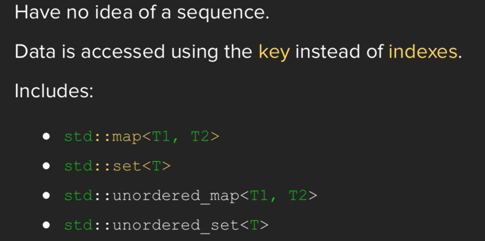

命名缘由：将 key 和 value 关联起来。

无序，以键值对存储，不能用 index 访问。

`map` 和 `set` 的 `key` 是按顺序存储的（红黑树实现），故需要定义怎样对 `key` 进行排序。另外，遍历 a range of keys 比较快

`unordered_map` 和 `unordered_set` 的 `key` 是无序存储的（哈希表实现），故需要定义怎样对 `key` 进行哈希。另外，查寻某个 key 比较快

