The data in sequence containers are sequential, which is different from associative containers.

The most commonly used sequence containers are:
- `vector`: Dynamic array, the most commonly used container.
- `deque`: Double-ended queue, allows fast insertion and deletion at both ends.
- `list`: Doubly linked list, allows fast insertion and deletion at any position, but slow random access.
- `forward_list`: Singly linked list, allows fast insertion and deletion at any position, but slow random access and only forward traversal.
- `array`: Fixed-size array,

## Vector

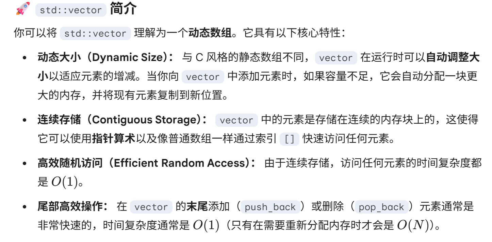

```cpp
std::vector<int> vecInt; // vector of int
std::vector<std::string> vecStr; // vector of string
std::vector<myStruct> vecStruct; // vector of user-defined struct
std::vector<std::vector<int>> vec2D; // 2D vector(vector of vector<int>)
```

### Member Functions

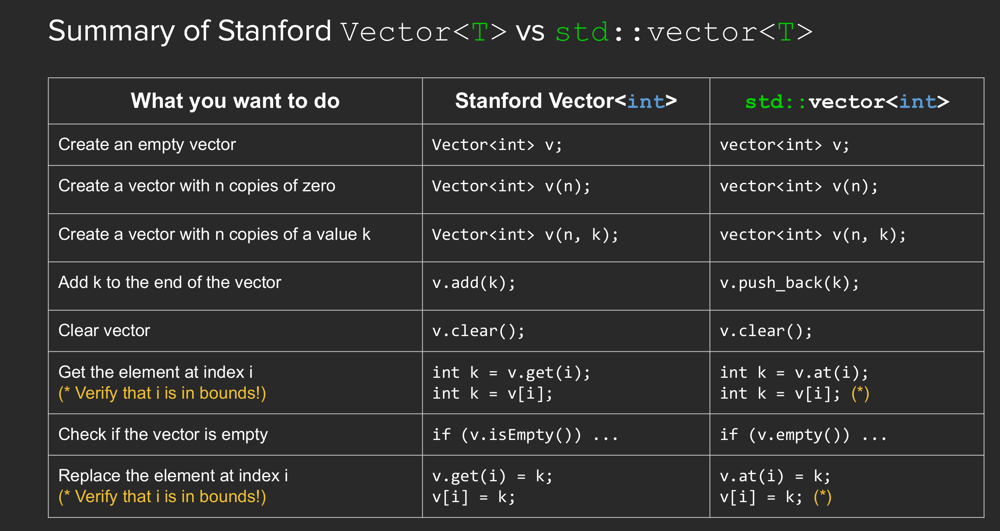

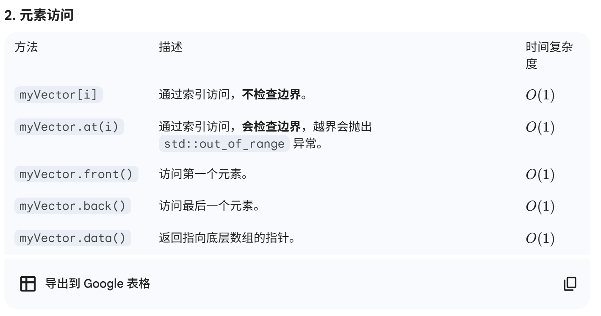
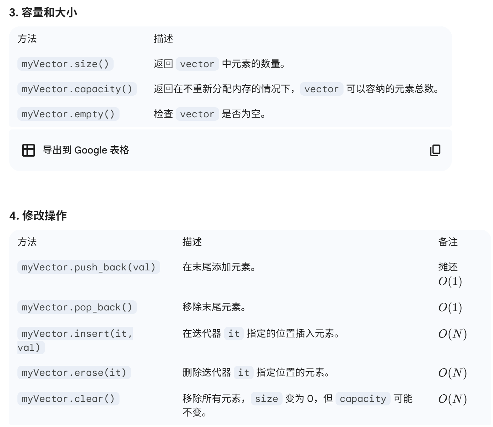

关于 `.at(index)` 在越界时的报错：

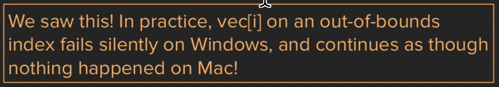

## Deque

Double ended queue 双端队列

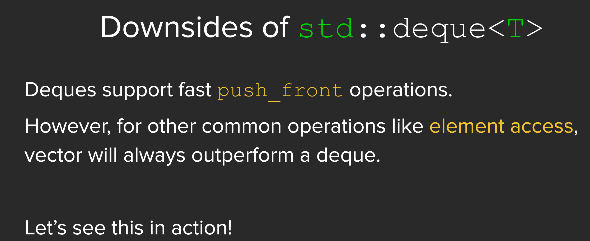

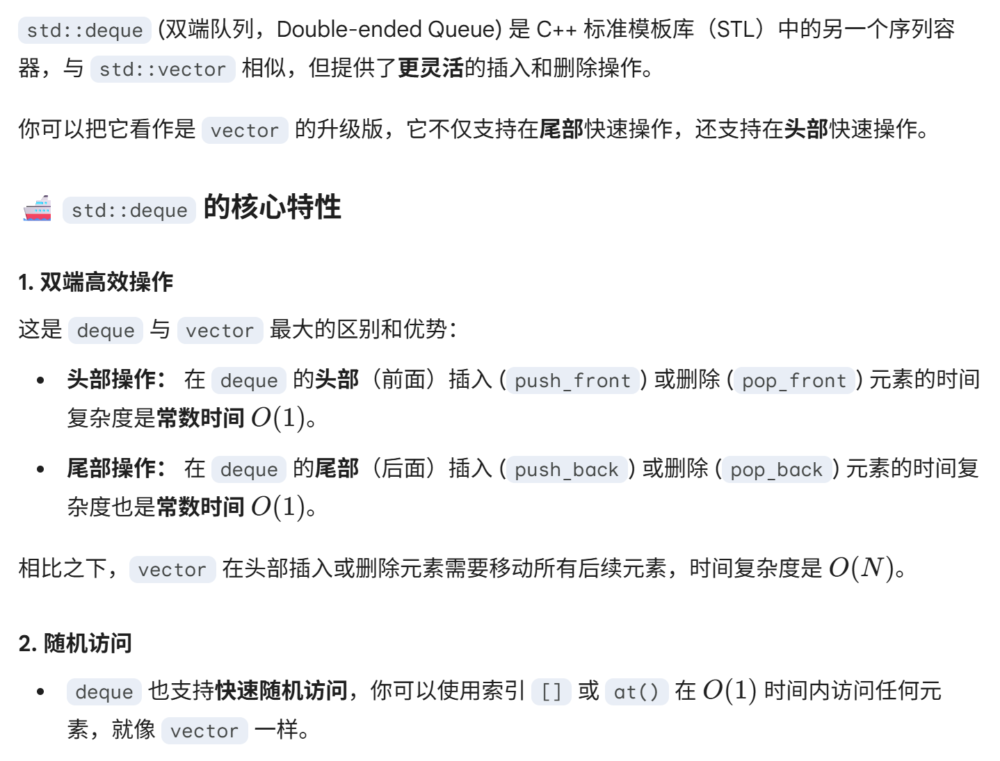
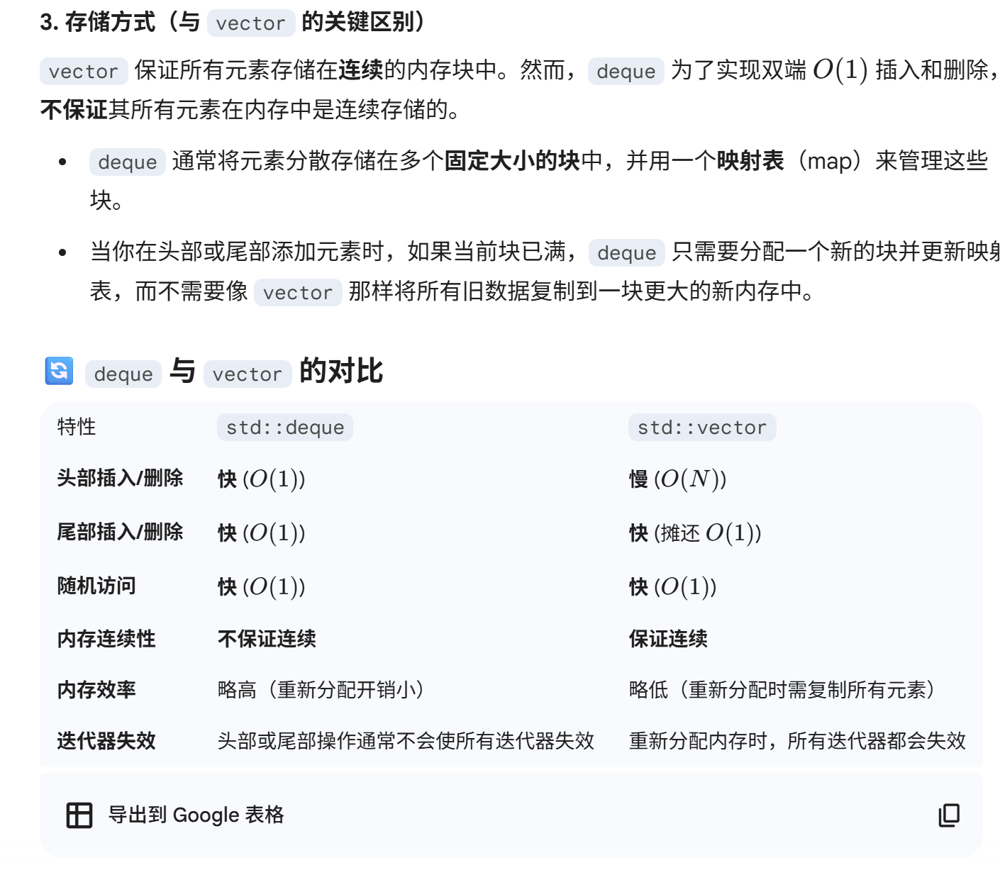

## Container Adaptors

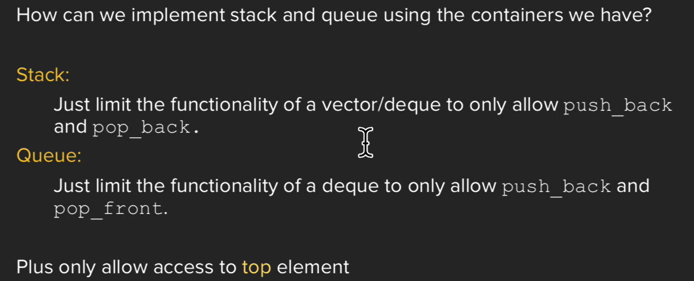

cpp 中的 stack 和 queue 实际是阉割版的 deque 和 vector。

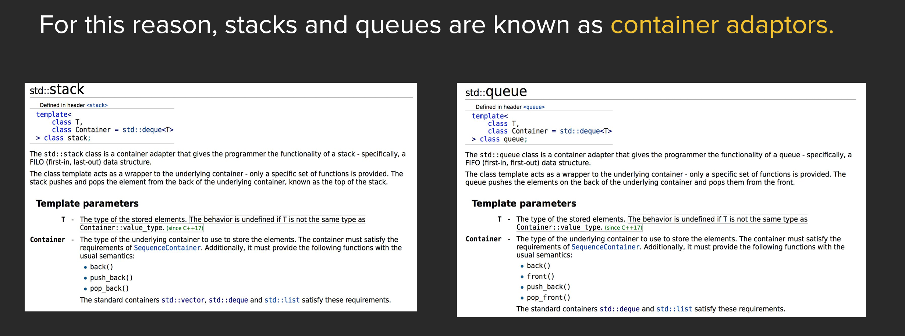

有 deque & vector 还要用 stack & queue 的原因：

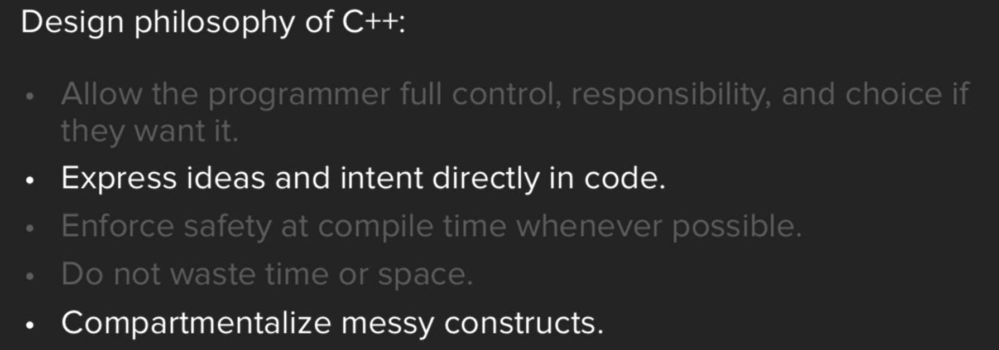
