## 基础知识

参数默认值：可以为函数参数指定默认值，如果调用函数时省略该参数，则使用默认值。

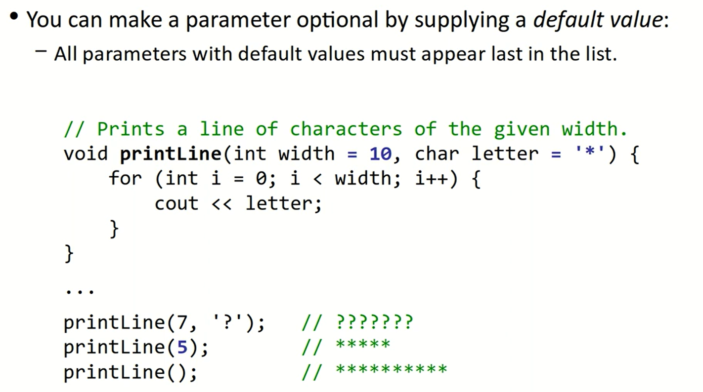

声明调用顺序：

- 必须先声明函数，才能调用函数。
- 但是可以先声明后定义：先给出函数原型 prototype 再定义函数体。
- 要是不声明，先调用后定义就会报错。

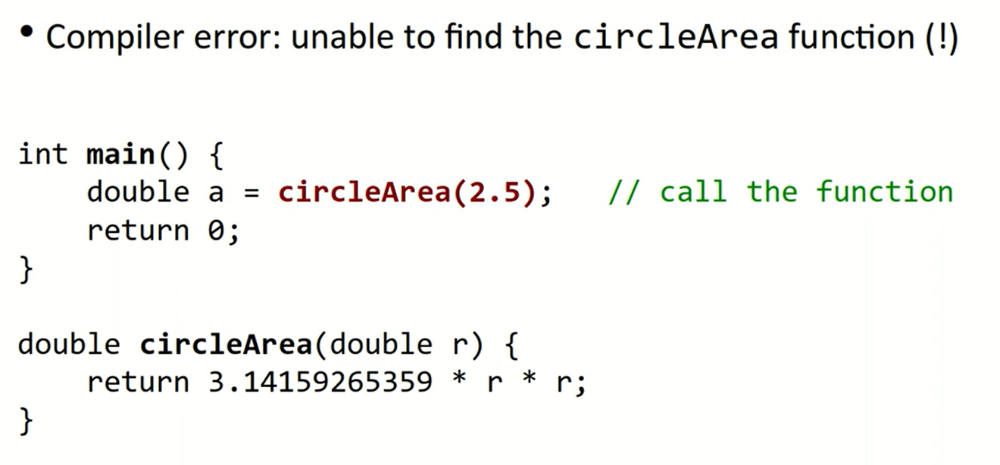
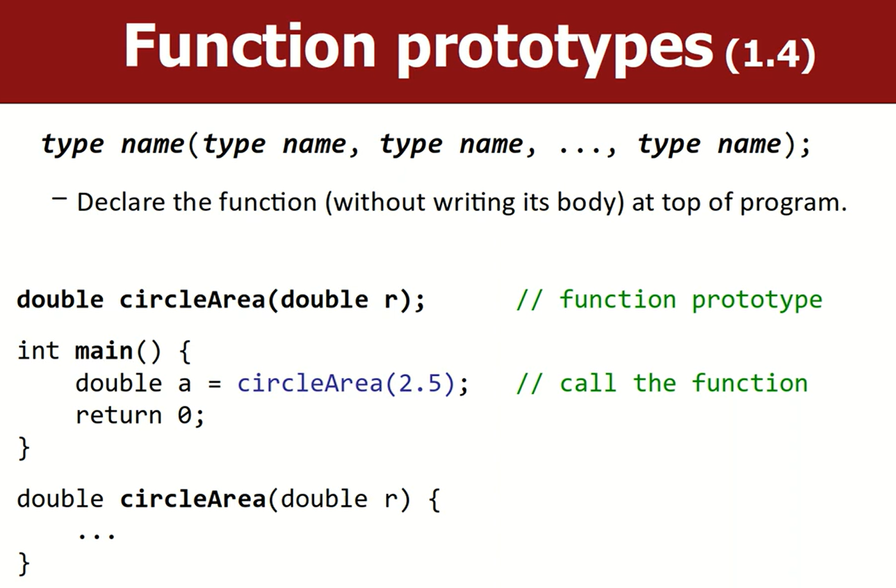

如果使用有默认值的函数，只需要在 function prototype 里面指定默认值即可，函数定义时不需要再指定默认值。如果在定义时候再次指定默认值会报错。

```cpp
// function prototype
int add(int a, int b = 10); // b has default value 10

int main() {
    int sum1 = add(5);      // uses default value for b, sum1 = 15
    int sum2 = add(5, 20);  // overrides default value, sum2 = 25
    return 0;
}
// function definition
int add(int a, int b) { // no default value here
    return a + b;
}
```

## Math Functions

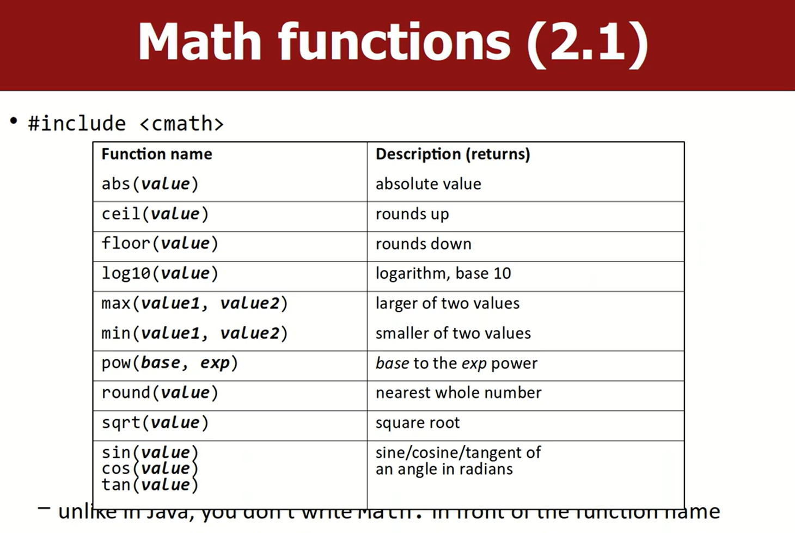

这些函数全在 `std` 命名空间下，使用前需要 `#include <cmath>`。

## 引用

Value Semantics & Reference Semantics

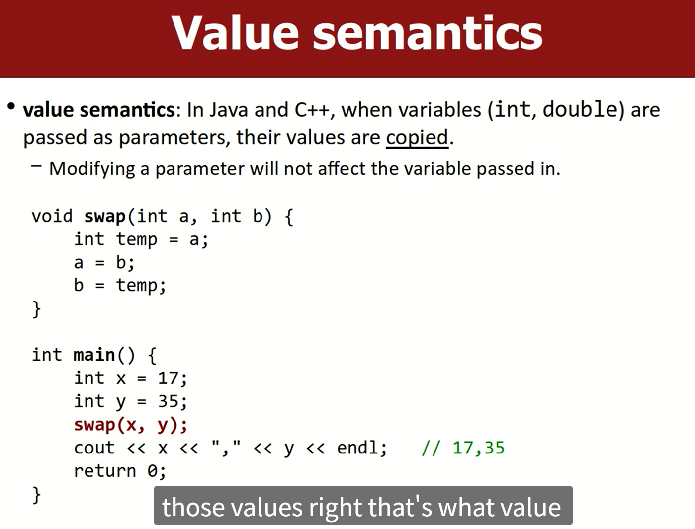
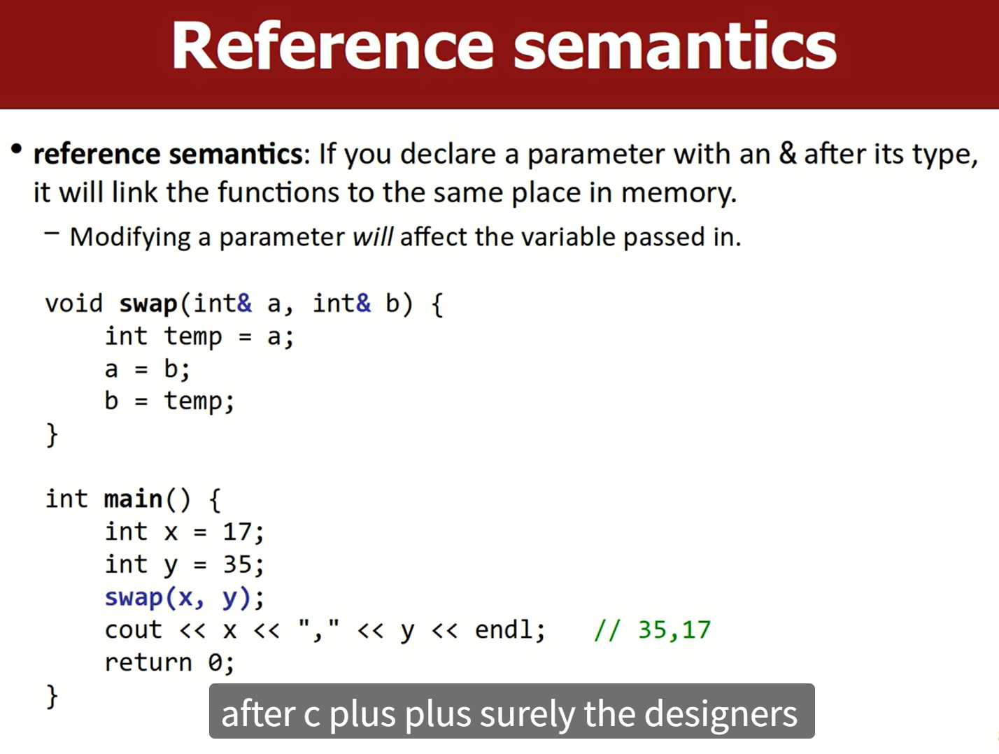

???+ info "补充"

    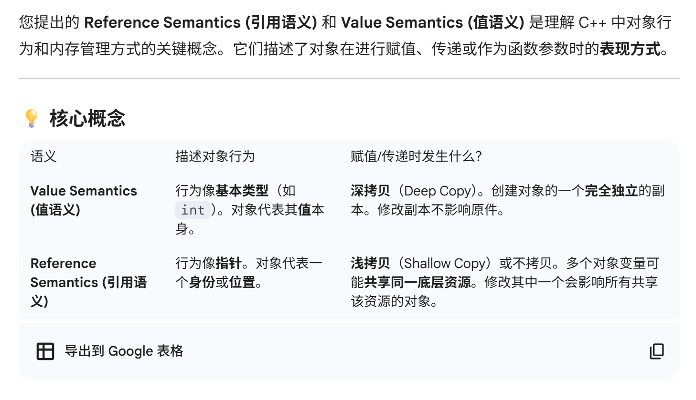
    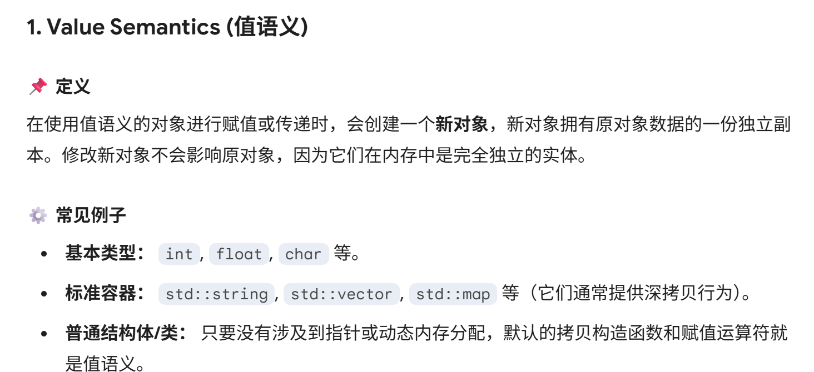
    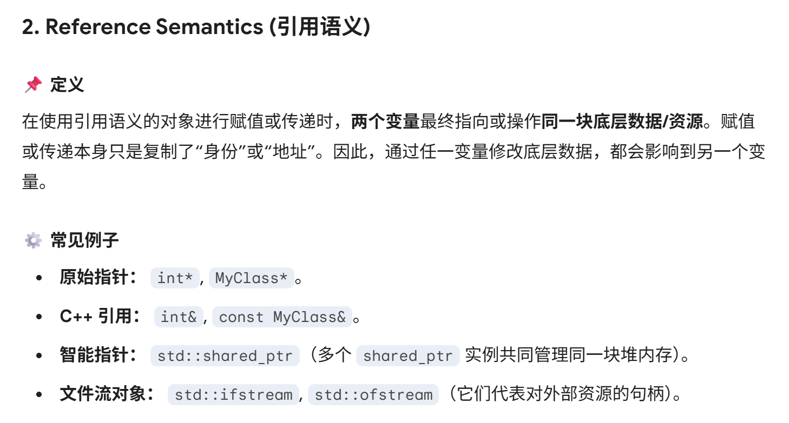

这里和 C 里面的指针还不一样，cpp 里面的 reference 语法是对指针的升级。

通过引用实现多返回值

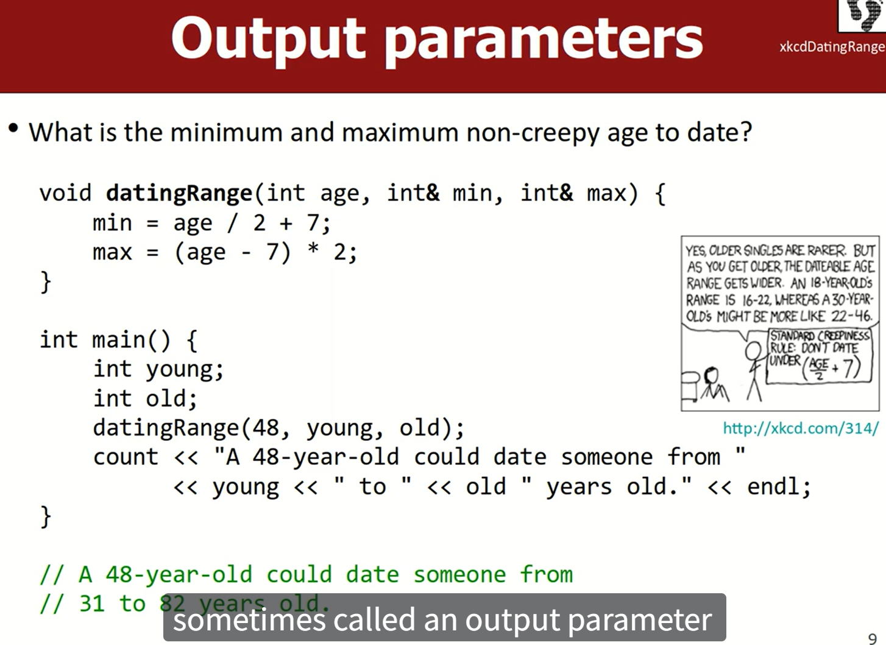

???+ info "讲解"

    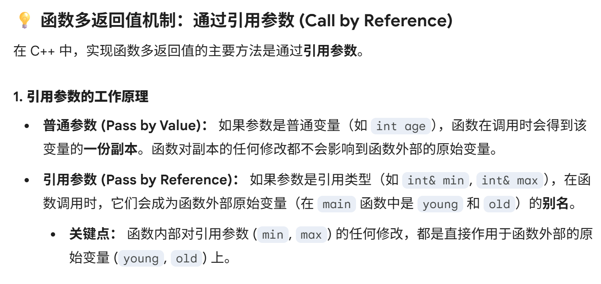
    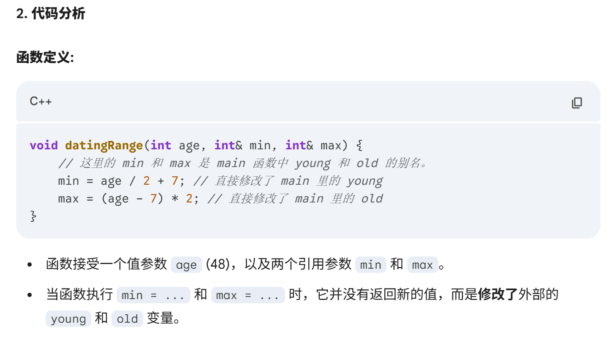
    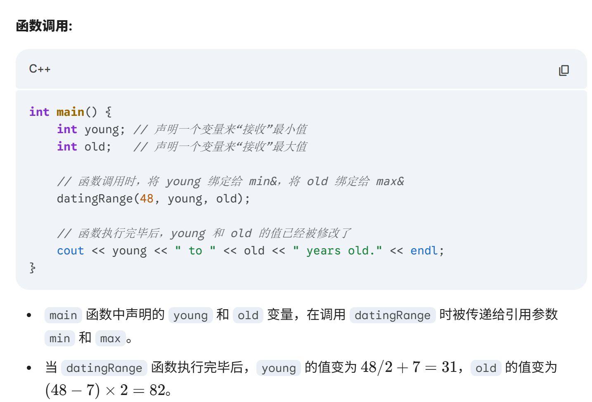

编程习惯：

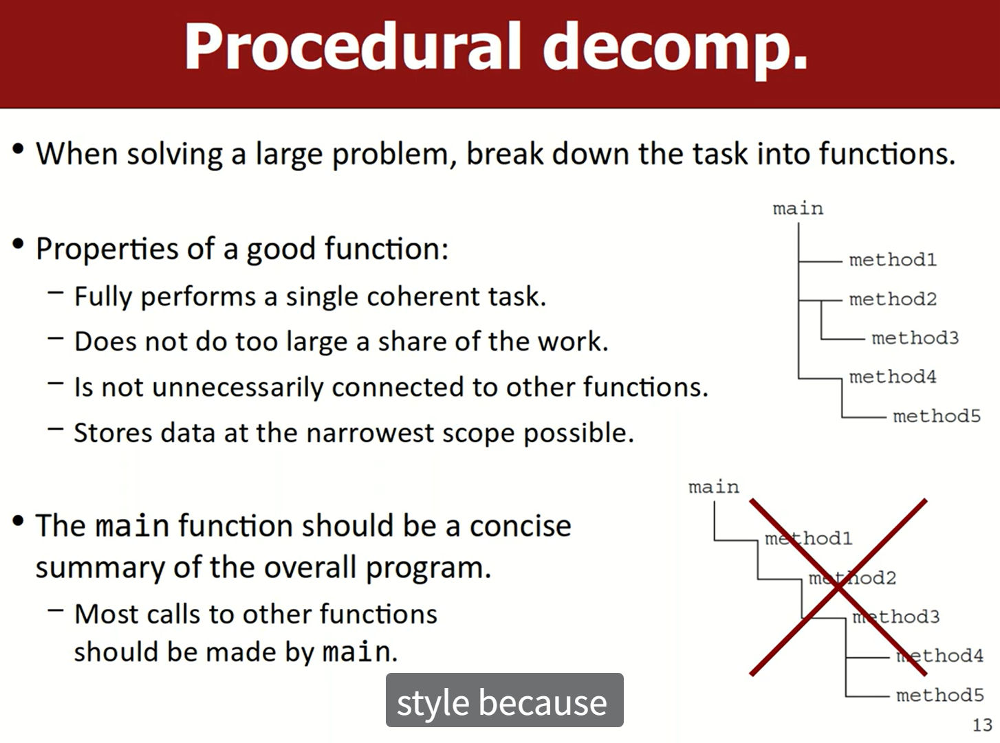