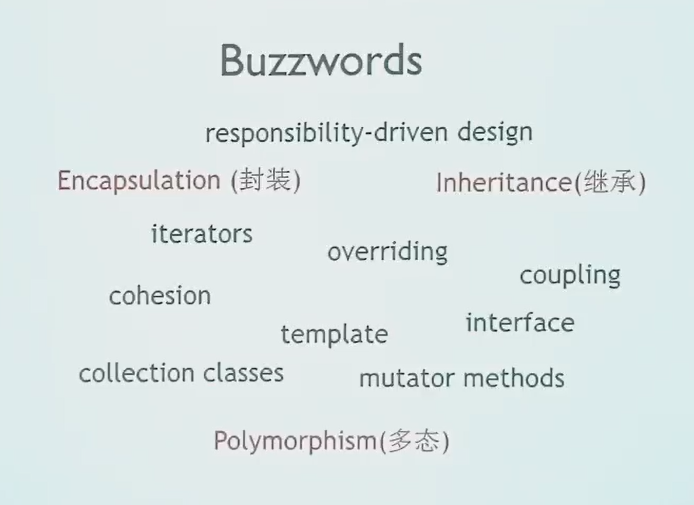

!!! warning "成绩"

    1. 平时成绩 50%

        - 作业：偶数周 2、4、6、8、10、12、14、16
        - ddl在奇数周周六24点（3、5、7、9、13、16）
        - 人工批阅代码，抄袭0分
        - 晚交：每天扣50%

    2. 考试 50%

        - 上机考试

!!! success "CS106L"

    [Videos in YouTube](https://www.youtube.com/watch?v=Ct3QF2qENGM&list=PLCgD3ws8aVdolCexlz8f3U-RROA0s5jWA&index=1)

    [Official Slides](https://web.stanford.edu/class/archive/cs/cs106l/cs106l.1204/lectures.html)

    [Official Website](https://web.stanford.edu/class/cs106l/)

    [Notes / Reference / Codes in GitHub](https://github.com/jackwang0108/CS106L-2019Fall)

---

词对应的知识点知道考试就没问题