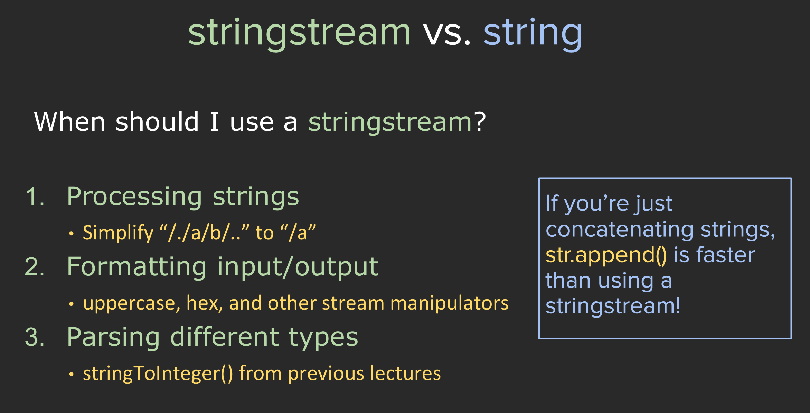

!!! note "Goals of CS 106L"

    1. Learn what features are out there in C++ and why they exist.
    2. Become comfortable with reading C++ documentation.
    3. Become familiar with the design philosophy of modern C++. 
    4. NOT: memorize the syntax of C++.


## Assembly

An example of inline assembly in C++ to print "Hello, world!" to the console:

```cpp
#include "stdio.h"
#include "stdlib.h"

extern "C" void myputs(char* str) {
    printf("%s\n", str);
}

int main(int argc, char *argv[]) {
    asm(  
        "sub $0x20,%rsp\n\t"
        "movabs $0x77202c6f6c6c6548,%rax\n\t"
        "mov %rax,(%rsp)\n\t"
        "movl $0x646c726f, 0x8(%rsp)\n\t"
        "movw $0x21, 0xc(%rsp)\n\t"
        "movb $0x0,0xd(%rsp)\n\t"
        "leaq (%rsp),%rax\n\t"
        "mov %rax,%rdi\n\t"
        "call myputs\n\t"
        "add $0x20, %rsp\n\t"
        );
    return EXIT_SUCCESS;
}
```


For the reason that people use different assembly syntax, a code work well on others computer may not work on your machine. C++ is Cross-platform.  

[Here](https://www.cs.virginia.edu/~evans/cs216/guides/x86.html) is a x86 Assembly Guide

## Design Philosophy of C++ 



Performance! Performance! Performance!

## References

[Here](https://web.stanford.edu/class/archive/cs/cs106l/cs106l.1204/lectures/intro/intro.pdf) is the slides of lecture 1

Here is [Cpp Core Guidence](https://isocpp.github.io/CppCoreGuidelines/CppCoreGuidelines) wirtten by Bjarne Stroustrup and Herb Sutter.