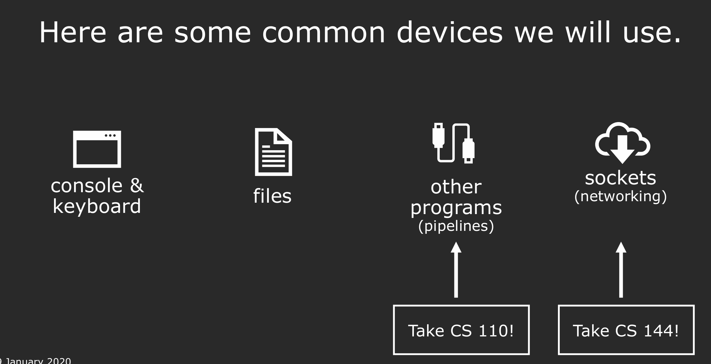
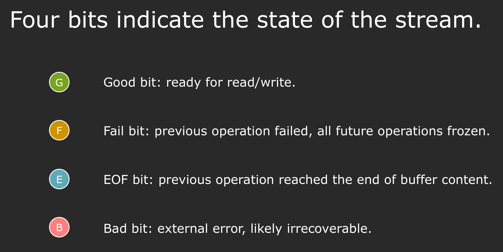
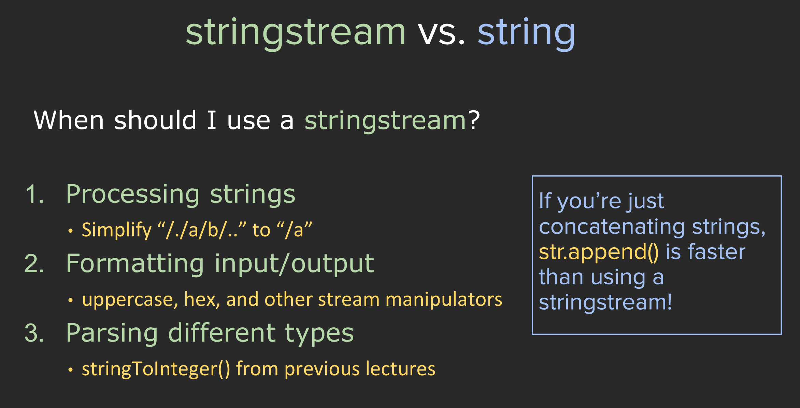
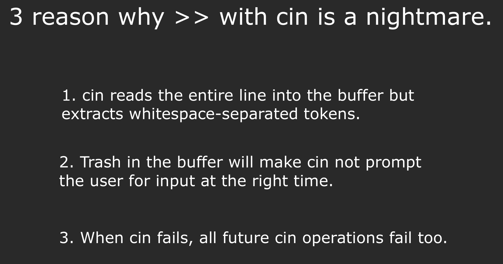

The reason why we use streams is we often want our programs to interact with external devices.



## Stringstream

一、`stringstream` 是什么？

`stringstream` 是 C++ 标准库 `<sstream>` 中的一个类，
它是一个“基于字符串的流（`stream`）”。

换句话说：

>它把字符串封装成一个 虚拟的输入/输出设备，
>
>让你能像操作 cin、cout 一样去“读写”这个字符串。


### ostringstream

??? info- "Examples"

    A basic example:

    ```cpp
    #include<iostream> // for cout
    #include<sstream> // for ostringstream

    using namespace std;

    int  main () {
        ostringstream oss("Ito En Green Tee");
        cout << oss.str() << endl;
        return 0;
    }
    // Ito En Green Tee
    ```

    ```cpp
    #include<iostream>
    #include<sstream>

    using namespace std;

    int  main () {
        ostringstream oss("Ito En Green Tee");
        oss << 16.9 << "Out ";
        cout << oss.str() << endl;
        return 0;
    }

    // 16.9Out reen Tee
    ```

    ```cpp
    #include<iostream>
    #include<sstream>

    using namespace std;

    int  main () {
        ostringstream oss("Ito En Green Tee", stringstream::ate);
        oss << 16.9 << " Out ";
        cout << oss.str() << endl;
        return 0;
    }
    // Ito En Green Tee16.9 Out
    ```
    第二个参数是 `ios_base::openmode` 的枚举，`stringstream::ate` 表示 初始写入位置设在已有内容的末尾。

    如果没有 `ate`，写入会从开头覆盖原来的内容；ate 保证你写的东西会追加在 `"Ito En Green Tee"` 的后面。

`ostringstream` is output string stream, which can write the given thing into a string just like writing into a file.

`oss` is an object in ostringstrea. Like `cout`, we can use `<<` to add thing into `oss`. But the target of `oss` is a string buffer in memory but `cout`'s target is the console.

`oss.str()` return the string in the buffer. 

### istringstream

??? info- "Example"

    ```cpp
    #include <iostream>
    #include <sstream>
    #include <string>

    using namespace std;

    int main() {
        ostringstream oss("420 3.14", ostringstream::ate);
        oss << "Hello";

        istringstream iss(oss.str());

        int a;
        double b;
        string c;

        iss >> a >> b >> c;

        cout << "a = " << a << endl;
        cout << "b = " << b << endl;
        cout << "c = " << c << endl;

        return 0;
    }
    ```

`>>` will automatically parse the data in the string according to the variable type

`iss` is just like `cin`

### stringstream positioning functions


??? info "Example"

    ```cpp
    #include <iostream>
    #include <sstream>

    using namespace std;

    int main() {
        ostringstream oss("Ount str 4200 3.14");
        oss << "Hello";

        fpos pos = oss.tellp() + streamoff(4);
        oss.seekp(pos);
        oss << "test";

        cout << oss.str() << endl;
        return 0;
    }
    ```

`fpos` is a kind representing the position. and `pos` is a varible

Must use `streamoff(4)`, instead of directly `4` because it is not `int`

We can put negtive number in `streamoff()` like `streamoff(-4)`, just try it!

### State bits

Indicate the state of the stream. 

Check the buffer state before and after the 
After the function, if not Fail or EOF, the buffer is cleared after the program.



`good()`, `bad()`, `fail()`, `eof()`: functions of stream object whose return value is boolean. Like `cin.good()`, `iss.bad()`, `oss.fail()`, `cout.eof()`.


!!! attention "When to use stringstream"

    1. When you want to process strings, like parsing a path string.
    2. When you want to format input/output in memory.
    3. When you want to parse different types from a string.

    

    🧩 一、`stringstream` 是什么？

    `stringstream` 是 C++ 中的一个**字符串流类**，定义在 `<sstream>` 头文件里。

    它的作用是：

    > 让字符串像输入输出流（`cin` / `cout`）一样进行“读取”和“写入”操作。

    换句话说：

    * 你可以往字符串里写内容（像输出流）；
    * 也可以从字符串里按格式读内容（像输入流）。

    ---

    🧠 二、什么时候用 `stringstream`

    这三点总结得非常精炼，我们逐条看👇

    ---

    ✅ **1. Processing strings（处理字符串内容）**

    > **用途：** 当你需要**按空格、分隔符、路径等解析字符串**时，`stringstream` 很方便。

    🧩 示例：处理路径字符串

    比如要把 `"/./a/b/.."` 简化为 `"/a"`：

    ```cpp
    #include <iostream>
    #include <sstream>
    #include <string>
    #include <stack>
    using namespace std;

    string simplifyPath(const string& path) {
        stringstream ss(path);
        string token;
        stack<string> st;

        while (getline(ss, token, '/')) {  // 以 '/' 分割
            if (token == "" || token == ".") continue;
            if (token == ".." && !st.empty()) st.pop();
            else if (token != "..") st.push(token);
        }

        string result = "/";
        while (!st.empty()) {
            result = "/" + st.top() + result;
            st.pop();
        }
        return result;
    }

    int main() {
        cout << simplifyPath("/./a/b/..") << endl;  // 输出：/a
    }
    ```

    ✅ `stringstream` 让我们可以像读取文件一样“逐段”解析字符串，非常方便。

    ---

    ✅ **2. Formatting input/output（格式化输入输出）**

    > **用途：** 当你要在内存中格式化输出（比如控制大小写、进制、对齐等）时，可以用 `stringstream`。

    就像 `cout` 一样，`stringstream` 也支持流操作符和 manipulators（格式控制符）：

    ```cpp
    #include <iostream>
    #include <sstream>
    #include <iomanip>  // manipulators
    using namespace std;

    int main() {
        stringstream ss;
        ss << uppercase << hex << 255; // 转成十六进制大写格式
        cout << ss.str() << endl;      // 输出 "FF"
    }
    ```

    💡 如果你只是想**拼接字符串**，不建议用 `stringstream`：

    ```cpp
    // ❌ 不推荐
    stringstream ss;
    ss << "Hello " << name << "!";
    auto s = ss.str();

    // ✅ 更快
    string s = "Hello " + name + "!";
    ```

    > ⚙️ **结论：**
    >
    > * 用 `stringstream` 处理复杂格式、进制转换、对齐输出；
    > * 只拼接字符串时，`string.append()` 或 `+` 更高效。

    ---

    ✅ **3. Parsing different types（从字符串解析不同类型）**

    > **用途：** 当你要从字符串中提取出数字、单词或各种类型数据时。

    示例：把字符串转整数

    相当于一个简单的 `stringToInteger()` 实现：

    ```cpp
    #include <iostream>
    #include <sstream>
    #include <string>
    using namespace std;

    int stringToInteger(const string& str) {
        stringstream ss(str);
        int value;
        ss >> value;
        return value;
    }

    int main() {
        cout << stringToInteger("123") + 10 << endl; // 输出 133
    }
    ```

    💡 优点：

    * 自动跳过空格；
    * 自动进行类型转换；
    * 若格式错误，流会进入失败状态，可检测。

    > 例如：
    >
    > ```cpp
    > if (!(ss >> value)) {
    >     cout << "输入不是整数！" << endl;
    > }
    > ```

    ---

    ⚖️ 三、什么时候 **不该** 用 `stringstream`

    | 场景       | 原因                 | 更好的方法                               |
    | -------- | ------------------ | ----------------------------------- |
    | 简单字符串拼接  | `stringstream` 性能低 | 用 `+` 或 `append()`                  |
    | 单纯读取文件内容 | 复杂且慢               | 用 `getline()`                       |
    | 大量数值转换   | 流操作有开销             | 用 `stoi()`, `stod()`, `to_string()` |

    ---

    🧾 四、总结表

    | 用途                          | 是否推荐   | 示例                         |
    | --------------------------- | ------ | -------------------------- |
    | 按分隔符解析字符串                   | ✅ 强烈推荐 | `getline(ss, token, ',')`  |
    | 格式化输出（hex, setw, uppercase） | ✅ 推荐   | `ss << hex << num;`        |
    | 从字符串提取类型（int, double, ...）  | ✅ 推荐   | `ss >> num;`               |
    | 字符串拼接                       | ❌ 不推荐  | 用 `+`                      |
    | 简单数值转换                      | ⚙️ 可替代 | 用 `stoi()` / `to_string()` |

    ---

    💬 小结一句话

    > 💡 **用 `stringstream` 当你想把字符串当作流来处理时：**
    >
    > * 需要解析（像输入流）；
    > * 需要格式化（像输出流）；
    > * 需要自动类型转换。

    而不是简单地拼接字符串。


## iostream

Including `cin`, `cout`, `cerr`, `clog`.

The last three are all output stream.

### cout

It does not directly return the thing into the console, instead, it return it into a internal buffer which need to be flushed into the console , and, the `endl` we use equals to `\n` plus a flush.

!!! info "Flush"

    Flush means forcely write the things in buffer and clear the buffer

### cin

???+ info "std::streambuf"

    🔹 1. 为什么缓冲区会“只剩下后面的东西”？

    当你输入一行，比如：

    ```
    18 Alice⏎
    ```

    * 整行 `"18 Alice\n"` 进入 **输入缓冲区**。
    * 第一次 `cin >> age;`：

    * `cin` 会读出 `18`，并把读位置推进到 `' '` 之后。
    * 结果就是“剩下的部分（`Alice\n`）”还留在缓冲区。
    * 第二次 `cin >> name;`：

    * 从当前位置开始，跳过空格，读 `"Alice"`，推进到 `\n`。
    * `\n` 会被跳过，缓冲区此时相当于空了。

    👉 这并不是因为有 **flush**，而是因为 `cin` 读走了前面的数据，缓冲区的读位置向前移动。
    （`flush` 是输出流的概念，用于把输出缓冲区写到终端；输入缓冲区没有 flush。）

    ---

    🔹 2. 什么叫行缓冲？

    “行缓冲”是 **输入模式**的一种（由终端驱动决定）：

    * **行缓冲模式 (line buffered)**：
    你在键盘上输入的字符会暂时放在缓冲区里，直到按下 **回车**，这一行才会交给程序读取。

    * 举例：你输入 `abc`，没按回车时，程序根本看不到。
    * 按了回车，缓冲区才会变成 `"abc\n"`，然后 `cin` 才能读。

    * **全缓冲 (fully buffered)**：
    一般用于文件，缓冲区满了才提交给程序。

    * **无缓冲 (unbuffered)**：
    比如 `cin.get()` 配合关闭缓冲，或者 `getchar()` 在某些环境下，可以逐字符输入（通常需要特殊配置）。

    🔹 1. `cin` 的本质

    在 C++ 里：

    * `cin` 是一个 `std::istream` 对象。
    * 它内部持有一个指向 **stream buffer** 的指针（`rdbuf()`）。
    * 这个 buffer 的实现类是 `std::streambuf`（标准库的抽象基类）。

    所以，`cin` 自己并不直接管理“读位置”，它把工作交给了 **stream buffer**。

    ---

    🔹 2. `std::streambuf` 的核心

    `std::streambuf` 里有三个重要的指针，用于管理输入缓冲区（get area）：

    * `eback()` → 缓冲区的起始位置 (begin)
    * `gptr()`  → 当前的读位置 (get pointer)
    * `egptr()` → 缓冲区的结束位置 (end)

    可以类比成这样一段内存：

    ```
    [ eback() ........ gptr() ........ egptr() ]
    ```

    * `gptr()` 指向当前还没读的数据。
    * 每次你做 `cin >> something`，数据被消费，`gptr()` 就向前移动。
    * 当 `gptr() == egptr()`，说明缓冲区的数据读完了，此时 `cin` 会向 **操作系统** 请求更多数据（也就是等你输入）。

    ---

    🔹 3. 底层运行过程

    比如你输入 `"18 Alice\n"`，缓冲区布局大概是：

    ```
    eback()
    |
    v
    [ '1' ][ '8' ][ ' ' ][ 'A' ][ 'l' ][ 'i' ][ 'c' ][ 'e' ][ '\n' ]
            ^
            gptr()
                                ^
                                egptr()
    ```

    * 第一次 `cin >> age;`

    * 读 `1` 和 `8`
    * `gptr()` 移动到空格 `' '` 的位置。

    ```
    [ '1' ][ '8' ][ ' ' ][ 'A' ][ 'l' ][ 'i' ][ 'c' ][ 'e' ][ '\n' ]
                    ^
                    gptr()
    ```

    * 第二次 `cin >> name;`

    * 跳过空格，读 `"Alice"`，`gptr()` 最后停在 `\n`。

    ```
    [ '1' ][ '8' ][ ' ' ][ 'A' ][ 'l' ][ 'i' ][ 'c' ][ 'e' ][ '\n' ]
                                                        ^
                                                        gptr()
    ```

    * 再读时 → `gptr() == egptr()`，缓冲区空了 → 阻塞等待新输入。

    ---

    🔹 4. 小结

    * **读位置 (get pointer)** 在底层就是 `std::streambuf` 里的 `gptr()`。
    * 这是一个普通的 **指针**，指向输入缓冲区中的当前位置。
    * 每次读取，`gptr()` 就会向前推进；当到达 `egptr()`，就会触发缓冲区 refill（去操作系统拿新数据）。

    ---

    ⚡换句话说：你猜的“有一个指针随着读取向前走”其实完全正确，只不过在标准库里它有专门的名字和机制 → **get pointer (gptr)**。

    对 ✅ 当 **输入类型不匹配** 的时候，流对象（这里是 `cin`，它是一个输入流对象 `std::istream`）的 **状态位 (state bits)** 里会被设置 **failbit**。

    ---

    🔹1. C++ 流状态位回顾

    一个流对象（`cin`, `cout`, `ifstream` 等）都有四个重要的状态标志（state bits）：

    | 状态位       | 说明                     | 检测方式         |
    | --------- | ---------------------- | ------------ |
    | `goodbit` | 一切正常（值 = 0）            | `cin.good()` |
    | `eofbit`  | 遇到输入结束（EOF）            | `cin.eof()`  |
    | `failbit` | 格式化提取失败（比如读 int 却遇到字母） | `cin.fail()` |
    | `badbit`  | 流已损坏（严重 I/O 错误，如设备损坏）  | `cin.bad()`  |

    ---

    🔹2. 在类型不匹配时

    代码：

    ```cpp
    int x;
    cin >> x;   // 期待数字
    ```

    输入：

    ```
    abc⏎
    ```

    流程：

    1. 缓冲区得到 `"abc\n"`。
    2. `cin` 尝试提取整数 → 发现第一个字符 `'a'` 不是数字。
    3. 读取失败：

    * **failbit = 1**
    * **gptr 不动**，仍然指向 `'a'`。
    * 变量 `x` 不会被修改。

    此时：

    ```cpp
    cin.fail()   // true
    cin.good()   // false
    cin.eof()    // false
    cin.bad()    // false
    ```

So, if the buffer is not empty, things left in the buffer 



### getline

Way to get a whole line:

`getline` : read a whole line back to `\n`(read up to `\n`) but not including `'\n'` in the string.


Function prototype:

```cpp
istream& getline (istream& is, string& str, char delim);
```

- `is` : input stream object, like `cin`, `iss`
- `str` : string variable to store the line
- `delim` : delimiter, default is `'\n'`

Example:

```cpp
getline(cin, name, '\n');
```


`cin.ignore()`

Function prototype:

```cpp
// Situation 1: ignore one character (default)
cin.ignore();

// Situation 2: ignore specified(n) number of characters, or until specified delimiter is found
cin.ignore(streamsize n, int delim);
```

