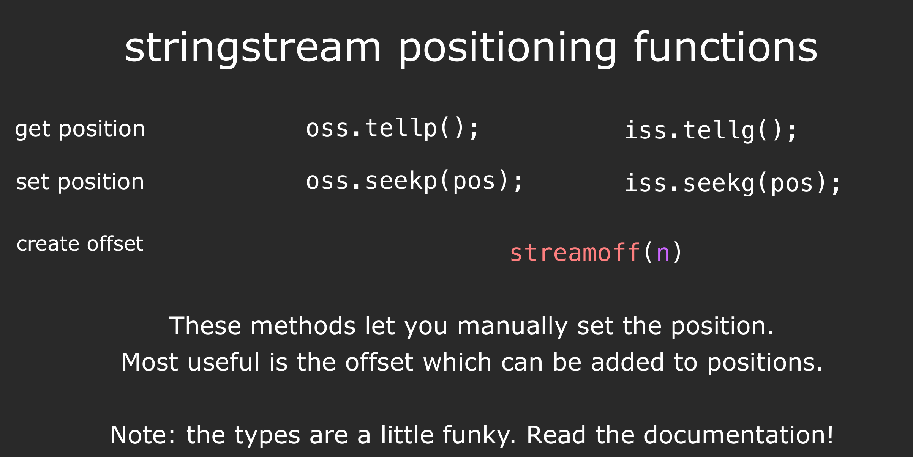

The reason why we use streams is we often want our programs to interact with external devices.


## Stringstream

### ostringstream

??? info- "Examples"

    A basic example:

    ```cpp
    #include<iostream> // for cout
    #include<sstream> // for ostringstream

    using namespace std;

    int  main () {
        ostringstream oss("Ito En Green Tee");
        cout << oss.str() << endl;
        return 0;
    }
    // Ito En Green Tee
    ```

    ```cpp
    #include<iostream>
    #include<sstream>

    using namespace std;

    int  main () {
        ostringstream oss("Ito En Green Tee");
        oss << 16.9 << "Out ";
        cout << oss.str() << endl;
        return 0;
    }

    // 16.9Out reen Tee
    ```

    ```cpp
    #include<iostream>
    #include<sstream>

    using namespace std;

    int  main () {
        ostringstream oss("Ito En Green Tee", stringstream::ate);
        oss << 16.9 << " Out ";
        cout << oss.str() << endl;
        return 0;
    }
    // Ito En Green Tee16.9 Out
    ```
    第二个参数是 `ios_base::openmode` 的枚举，`stringstream::ate` 表示 初始写入位置设在已有内容的末尾。

    如果没有 `ate`，写入会从开头覆盖原来的内容；ate 保证你写的东西会追加在 `"Ito En Green Tee"` 的后面。

`ostringstream` is output string stream, which can write the given thing into a string just like writing into a file.

`oss` is an object in ostringstrea. Like `cout`, we can use `<<` to add thing into `oss`. But the target of `oss` is a string buffer in memory but `cout`'s target is the console.

`oss.str()` return the string in the buffer. 

### istringstream

??? info- "Example"
```cpp
#include <iostream>
#include <sstream>
#include <string>

using namespace std;

int main() {
    ostringstream oss("420 3.14", ostringstream::ate);
    oss << "Hello";

    istringstream iss(oss.str());

    int a;
    double b;
    string c;

    iss >> a >> b >> c;

    cout << "a = " << a << endl;
    cout << "b = " << b << endl;
    cout << "c = " << c << endl;

    return 0;
}
```

`>>` will automatically parse the data in the string according to the variable type

`iss` is just like `cin`

### stringstream positioning functions



??? info "Example"

    ```cpp
    #include <iostream>
    #include <sstream>

    using namespace std;

    int main() {
        ostringstream oss("Ount str 4200 3.14");
        oss << "Hello";

        fpos pos = oss.tellp() + streamoff(4);
        oss.seekp(pos);
        oss << "test";

        cout << oss.str() << endl;
        return 0;
    }
    ```

`fpos` is a kind representing the position. and `pos` is a varible

Must use `streamoff(4)`, instead of directly `4` because it is not `int`

We can put negtive number in `streamoff()` like `streamoff(-4)`, just try it!

### State bits

Indicate the state of the stream. 

Check the buffer state before and after the 
After the function, if not Fail or EOF, the buffer is cleared after the program.


`good()`, `bad()`, `fail()`, `eof()`: functions of stream object whose return value is boolean. Like `cin.good()`, `iss.bad()`, `oss.fail()`, `cout.eof()`.

## iostream

Including `cin`, `cout`, `cerr`, `clog`.

The last three are all output stream.

### cout

It does not directly return the thing into the console, instead, it return it into a internal buffer which need to be flushed into the console , and, the `endl` we use equals to `\n` plus a flush.

!!! info "Flush"

    Flush means forcely write the things in buffer and clear the buffer

### cin

??? info "std::streambuf"


    🔹 1. `cin` 的本质

    在 C++ 里：

    * `cin` 是一个 `std::istream` 对象。
    * 它内部持有一个指向 **stream buffer** 的指针（`rdbuf()`）。
    * 这个 buffer 的实现类是 `std::streambuf`（标准库的抽象基类）。

    所以，`cin` 自己并不直接管理“读位置”，它把工作交给了 **stream buffer**。

    ---

    🔹 2. `std::streambuf` 的核心

    `std::streambuf` 里有三个重要的指针，用于管理输入缓冲区（get area）：

    * `eback()` → 缓冲区的起始位置 (begin)
    * `gptr()`  → 当前的读位置 (get pointer)
    * `egptr()` → 缓冲区的结束位置 (end)

    可以类比成这样一段内存：

    ```
    [ eback() ........ gptr() ........ egptr() ]
    ```

    * `gptr()` 指向当前还没读的数据。
    * 每次你做 `cin >> something`，数据被消费，`gptr()` 就向前移动。
    * 当 `gptr() == egptr()`，说明缓冲区的数据读完了，此时 `cin` 会向 **操作系统** 请求更多数据（也就是等你输入）。

    ---

    🔹 3. 底层运行过程

    比如你输入 `"18 Alice\n"`，缓冲区布局大概是：

    ```
    eback()
    |
    v
    [ '1' ][ '8' ][ ' ' ][ 'A' ][ 'l' ][ 'i' ][ 'c' ][ 'e' ][ '\n' ]
            ^
            gptr()
                                ^
                                egptr()
    ```

    * 第一次 `cin >> age;`

    * 读 `1` 和 `8`
    * `gptr()` 移动到空格 `' '` 的位置。

    ```
    [ '1' ][ '8' ][ ' ' ][ 'A' ][ 'l' ][ 'i' ][ 'c' ][ 'e' ][ '\n' ]
                    ^
                    gptr()
    ```

    * 第二次 `cin >> name;`

    * 跳过空格，读 `"Alice"`，`gptr()` 最后停在 `\n`。

    ```
    [ '1' ][ '8' ][ ' ' ][ 'A' ][ 'l' ][ 'i' ][ 'c' ][ 'e' ][ '\n' ]
                                                        ^
                                                        gptr()
    ```

    * 再读时 → `gptr() == egptr()`，缓冲区空了 → 阻塞等待新输入。

    ---

    🔹 4. 小结

    * **读位置 (get pointer)** 在底层就是 `std::streambuf` 里的 `gptr()`。
    * 这是一个普通的 **指针**，指向输入缓冲区中的当前位置。
    * 每次读取，`gptr()` 就会向前推进；当到达 `egptr()`，就会触发缓冲区 refill（去操作系统拿新数据）。

    ---

    ⚡换句话说：你猜的“有一个指针随着读取向前走”其实完全正确，只不过在标准库里它有专门的名字和机制 → **get pointer (gptr)**。
