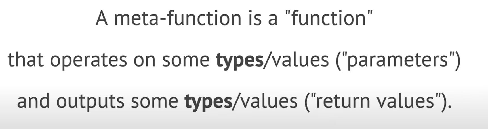
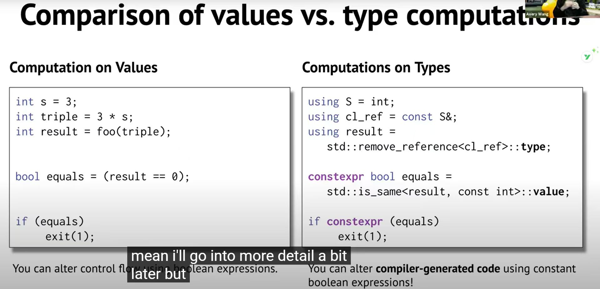
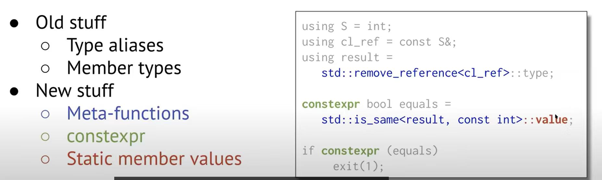
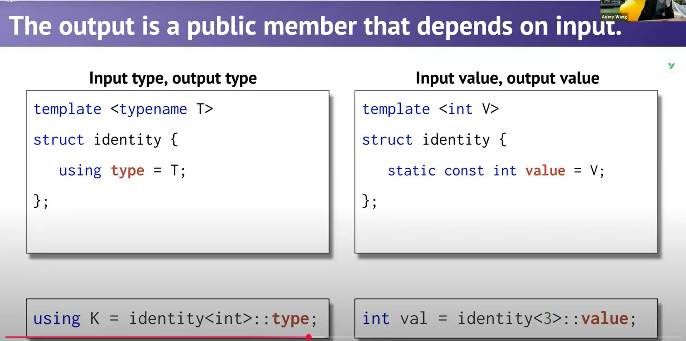
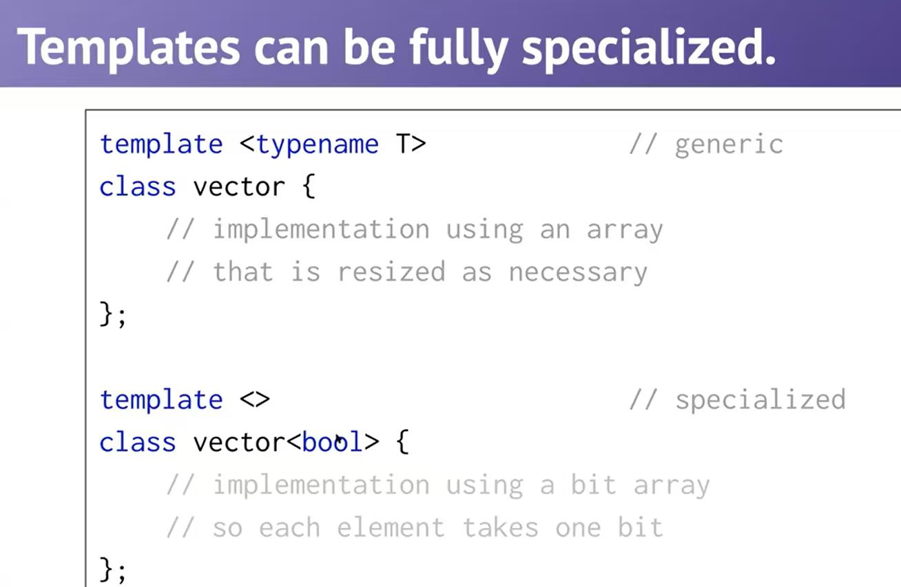
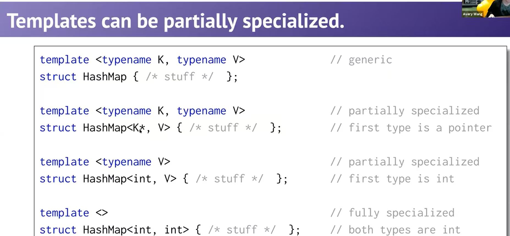

## Computation on Type —— meta-function

It is finished in **compiler time**, not runtime. So in the runtime, for example, `factorial<5>::value` is just a constant `120`,(`mov eax, 120   ;` in assembly) not a function call, because the compiler has already calculated it.

Computation on Type （类型计算） is the core of the template metaprogramming（模板元编程，TMP）




!!! success "Translation"

    元函数就是一个 模板结构体（struct template），它里面有公开的成员（类型或者常量），这些成员的值或类型依赖于你给它传入的模板参数。

???- info "explanation"

    We can pass a TYPE as the parameter to a meta-function, and get TYPE out as the return value. Also, we can get value out of the meta-function. In another word, most thing we can do on value, we have an analogous thing we can do on types. 



In the right part, what we do is:

1. Let `S == INT`
2. Let `cl_ref == const S& == const int&`, meaning that we write `cl_ref` equals to writing `const int&`.
3. By using `remove_reference` with `const int&`, we let `result == const int`, and get type `const int` into `result`



???- info "lvalue reference"

    Basic syntax: `Tpye& name = lvalue`

    An example:

    ```cpp
    int a = 5;
    int& ref = a;  // ref is a's alias
    ref = 10;      // equals to a = 10
    ```

    Apparently, the result is equals to  `Tpye name = lvalue`. Difference: 

    - `Tpye name = lvalue`: copy `lvalue` to `name`, `name` is in different place of memory with `lvalue`
    - `Tpye& name = lvalue`: `name` and `lvalue` point to the same block of memory



Must use CLASS or STRUCT to define a meta-function, because CLASS or STRUCT can have member TYPE / VALUE.

Here are two examples of meta-function:

```cpp
// 类型计算
template <typename T>
struct add_pointer {
    using type = T*;    // 输出类型
};

// 数值计算
template <int N>
struct factorial {
    static constexpr int value = N * factorial<N-1>::value; // 输出常量
};
```

We can use `using` (`using <name> = <type>;`) to define a TYPE member, and `static constexpr` (`static constexpr T value = <value>;`) to define a VALUE member.

!!! info "DIFFERENT FROM FUNCTION"

    We never need to create an instance（实例） of the struct. Because meta-function is a result container, not a real object. IT IS A STRUCT, we use `::` to access its member(`::value` for its value, `::type` for its type).


### Template Deduction

Template Specialization: we can have generic template, and also have special version of the template for some specific types.





We can judge whether it is specialization by looking at the template argument list. 

- If we donnot pass any template argument to the class / struct, it is a full specialization. If we pass some template argument, but not all, it is a partial specialization. If we pass all template arguments, it is a generic template.

When using the template, the compiler will choose the most specialized version that matches the template argument. Choosing by ranking, ranking from most specialized to least specialized.（从最特化开始到最一般化依次尝试）

`if constexpr` : can turn off some branch of code in compile time. If the condition is false, the code in that branch will not be compiled.

## References

Check [type trait](https://en.cppreference.com/w/cpp/header/type_traits.html) (a cpp library) for more template function

Check [Google C++ Style Guide](https://google.github.io/styleguide/cppguide.html) for coding style.

Use [Compiler Explorer](https://godbolt.org/) to see how the compiler translates C++ code to assembly code.

Browse [xkcd.com](https://xkcd.com) for fun.