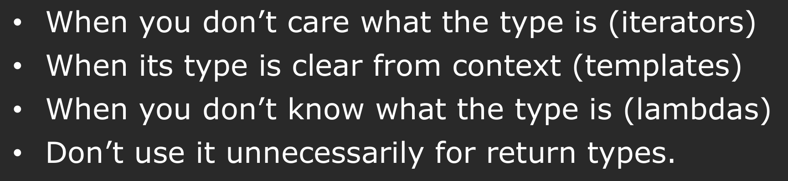

## Modern C++ Types

### Auto

If you use `auto`, the compiler will figure out the type of the variable by itself

`auto` is a compile-time thing.

Sometimes you don't know the type, and you need to ask the compiler to figure it out for you. It creates a class instance for you.

`auto` can be used in return type of function.(BUT IT IS NOT RECOMMENDED) But it cannot be used in function parameter.

Some guidelines for using `auto`:



Example:

```cpp
auto calculateSum(const std::vector<int>& v) {
    auto copy = v; // copy is std::vector<int>
    auto multiplier = 2.4;
    auto name = "Avery";
    auto betterName = std::string("Avery");
    auto func = [](auto i) {return i * 2; }; // func is a lambda that takes one parameter of any type and returns the parameter multiplied by 2
    return std::accumulate(copy.begin(), copy.end(), 0) * multiplier;
}
```


### Pair

C++17 allows structured binding, which makes it easier to unpack pairs and tuples.

`std::pair` is a simple container to store two heterogeneous objects as a single unit.(C++17)

```cpp
#include <iostream>
#include <utility>

using namespace std;

pair<int, int> findPriceRange(int dist) {
    int min = static_cast<int>(dist * 0.08 + 100);
    int max = static_cast<int>(dist * 0.36 + 200);

    return make_pair(min, max);
}

int main() {
    int dist = 500;
    auto [minPrice, maxPrice] = findPriceRange(dist); // C++17 structured binding
    cout << "Min Price: " << minPrice << ", Max Price: " << maxPrice << endl;

    return 0;
}
```

Here, `auto` is used to automatically deduce the types of each variable.

### Struct

Return multiple things from a function.

A struct is a collection of named variables grouped together.

```cpp
struct Point {
    int x;
    int y;
};

Point createPoint(int x, int y) {
    return {x, y};
}
```
Struct is a light version of class. The only difference is that in struct, members are public by default, while in class, members are private by default.

```cpp
struct Point {
    int x;
    int y;
};

Point createPoint(int x, int y) {
    return {x, y};
}
```

## Initialization

There are 27 ways to initialize a variable in C++.

C++11 adds uniform initialization using curly braces `{}`. It can be used for all types of initialization.

```cpp
int a{10};              // basic type
int b = {20};           // same as above (copy form)
vector<int> v{1, 2, 3}; // container
pair<int, string> p{1, "hello"}; // pair
MyClass obj{1, 2, 3};   // custom class construction
```

```cpp
int main() {
    vector<int> vec1{3}; 
    vector<int> vec2(3);
}


## 1. 基础类型
`int, long, short, char, bool, float, double, void, wchar_t, char16_t, char32_t`

## 2. 流程控制
`if, else, switch, case, default, for, while, do, break, continue, goto, return`

## 3. 存储/生命周期
`static, extern, register, mutable, thread_local, inline`

## 4. 常量 / 编译期
`const, constexpr, consteval, constinit`

## 5. 类型相关
`auto, decltype, typename, using, typedef, signed, unsigned, volatile`

## 6. 内存管理
`new, delete`

## 7. 面向对象
`class, struct, union, enum, public, private, protected, this, friend, virtual, explicit, operator, template`

## 8. 继承 / 多态
`override, final`

## 9. 模板 / 泛型编程
`template, typename, concept, requires`

## 10. 异常处理
`try, catch, throw, noexcept`

## 11. 命名空间 / 作用域
`namespace, using, inline (namespace), alignas, alignof`

## 12. 并发 / 原子
`atomic_cancel, atomic_commit, atomic_noexcept, co_await, co_return, co_yield`  
（协程相关关键字也是 C++20 引入的）

## 13. 其他杂项
`true, false, nullptr, sizeof, static_assert, typeid, dynamic_cast, reinterpret_cast, const_cast`


## 14. 预处理指令（不是关键字，但常用）
`#include, #define, #undef, #ifdef, #ifndef, #if, #else, #elif, #endif, #pragma`

## 15. C 语言关键字（C++ 也支持）
`auto, break, case, char, const, continue, default, do, double, else, enum, extern, float, for, goto, if, int, long, register, return, short, signed, sizeof, static, struct, switch, typedef, union, unsigned, void, volatile, while`
