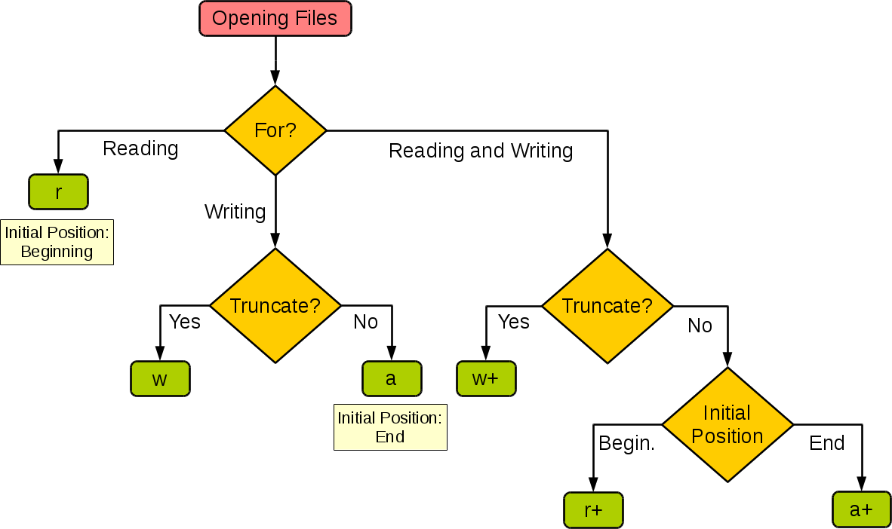

## 文件基本操作

### 1. **打开文件**
使用 `open()` 函数打开文件，返回一个文件对象。

语法：

```python
file_object = open(file, mode='r', buffering=-1, encoding=None, errors=None, newline=None, closefd=True, opener=None)
```

参数说明：

- **file**: 文件路径（字符串）。
- **mode**: 文件打开模式（默认为 `'r'`，只读）。
- **buffering**: 缓冲策略（默认 `-1`，使用系统默认缓冲）。
- **encoding**: 文件编码（如 `'utf-8'`）。
- **errors**: 编码错误处理方式（如 `'ignore'`、`'replace'`）。
- **newline**: 控制换行符行为（如 `None`、`'\n'`）。
- **closefd**: 是否关闭文件描述符（通常为 `True`）。
- **opener**: 自定义文件打开器。

文件模式：

| 模式 | 描述 |
|------|------|
| `'r'`  | 只读（默认）。 |
| `'w'`  | 写入，覆盖文件（如果文件不存在则创建）。 |
| `'x'`  | 独占创建，如果文件已存在则报错。 |
| `'a'`  | 追加写入，如果文件不存在则创建。 |
| `'b'`  | 二进制模式（如 `'rb'`、`'wb'`）。 |
| `'t'`  | 文本模式（默认）。 |
| `'+'`  | 读写模式（如 `'r+'`、`'w+'`）。 |


示例：
```python
file = open('example.txt', 'r', encoding='utf-8')
```

---

### 2. **读取文件**
文件对象提供了多种读取文件内容的方法。

方法：

- **`read(size)`**: 读取指定大小的数据（字节或字符），默认读取全部内容。
  ```python
  content = file.read()  # 读取整个文件
  ```
- **`readline(size)`**: 读取一行内容，可指定最大读取大小。
  ```python
  line = file.readline()  # 读取一行
  ```
- **`readlines()`**: 读取所有行，返回一个列表。
  ```python
  lines = file.readlines()  # 读取所有行
  ```


示例：
```python
with open('example.txt', 'r') as file:
    for line in file:  # 逐行读取
        print(line.strip())
```

---

### 3. **写入文件**
文件对象提供了多种写入文件内容的方法。

方法：

- **`write(string)`**: 写入字符串到文件。
  ```python
  file.write('Hello, World!\n')
  ```
- **`writelines(lines)`**: 写入多行内容（列表或迭代器）。
  ```python
  lines = ['Line 1\n', 'Line 2\n']
  file.writelines(lines)
  ```

示例：
```python
with open('example.txt', 'w') as file:
    file.write('Hello, World!\n')
```

---

### 4. **关闭文件**
使用 `close()` 方法关闭文件，释放资源。

方法：

- **`close()`**: 关闭文件。
  ```python
  file.close()
  ```

#### 使用 `with` 语句：
推荐使用 `with` 语句自动管理文件的关闭。
```python
with open('example.txt', 'r') as file:
    content = file.read()
# 文件会在 with 块结束后自动关闭
```

---

### 5. **文件定位**
文件对象提供了与文件指针相关的方法。

方法：

- **`seek(offset, whence)`**: 移动文件指针到指定位置。
  - `offset`: 偏移量。
  - `whence`: 参考位置（`0`：文件开头，`1`：当前位置，`2`：文件末尾）。
  ```python
  file.seek(0)  # 移动到文件开头
  ```
- **`tell()`**: 返回当前文件指针的位置。
  ```python
  position = file.tell()
  ```

示例：
```python
with open('example.txt', 'r') as file:
    file.seek(10)  # 移动到第 10 个字节
    print(file.read(5))  # 读取 5 个字节
```

---

### 6. **文件属性**
使用 `os` 模块可以获取文件的属性。

常用函数：

- **`os.path.exists(path)`**: 检查文件或目录是否存在。
  ```python
  import os
  if os.path.exists('example.txt'):
      print('文件存在')
  ```
- **`os.path.getsize(path)`**: 获取文件大小（字节）。
  ```python
  size = os.path.getsize('example.txt')
  ```
- **`os.path.isfile(path)`**: 检查是否为文件。
  ```python
  if os.path.isfile('example.txt'):
      print('这是一个文件')
  ```
- **`os.path.isdir(path)`**: 检查是否为目录。
  ```python
  if os.path.isdir('example_dir'):
      print('这是一个目录')
  ```

---

### 7. **文件操作**
使用 `os` 和 `shutil` 模块可以进行文件的复制、移动、删除等操作。

常用函数：

- **`os.rename(src, dst)`**: 重命名或移动文件。
  ```python
  os.rename('old_name.txt', 'new_name.txt')
  ```
- **`os.remove(path)`**: 删除文件。
  ```python
  os.remove('example.txt')
  ```
- **`shutil.copy(src, dst)`**: 复制文件。
  ```python
  import shutil
  shutil.copy('source.txt', 'destination.txt')
  ```
- **`shutil.move(src, dst)`**: 移动文件。
  ```python
  shutil.move('source.txt', 'new_location/source.txt')
  ```

---

### 8. **目录操作**
使用 `os` 模块可以操作目录。

常用函数：

- **`os.mkdir(path)`**: 创建目录。
  ```python
  os.mkdir('new_dir')
  ```
- **`os.rmdir(path)`**: 删除空目录。
  ```python
  os.rmdir('empty_dir')
  ```
- **`os.listdir(path)`**: 列出目录内容。
  ```python
  files = os.listdir('.')
  ```

---

### 9. **临时文件**
使用 `tempfile` 模块可以创建临时文件。

示例：

```python
import tempfile
with tempfile.NamedTemporaryFile(delete=False) as temp_file:
    temp_file.write(b'Hello, World!')
    print(temp_file.name)  # 临时文件路径
```

---

### 10. **文件编码**
使用 `codecs` 模块可以处理特定编码的文件。

示例：

```python
import codecs
with codecs.open('example.txt', 'r', encoding='utf-8') as file:
    content = file.read()
```

---

### 上下文语法（with语句）

`with` 语句是 Python 中用于**上下文管理**的语法结构，主要用于简化资源管理（如文件操作、网络连接、数据库连接等）。它的核心作用是确保资源在使用完毕后被正确释放，避免资源泄漏。

---

#### 基本语法

```python
with expression [as variable]:
    # 代码块
```

- **`expression`**：返回一个上下文管理器对象（如 `open()` 函数返回的文件对象）。
- **`as variable`**：将上下文管理器对象赋值给变量（可选）。
- **代码块**：在 `with` 语句块中执行操作。

示例：
```python
with open('example.txt', 'r', encoding='utf-8') as file:
    content = file.read()
    print(content)
```

#### 工作原理

`with` 语句的背后是**上下文管理器协议**，即对象需要实现 `__enter__()` 和 `__exit__()` 方法：
- **`__enter__()`**：进入上下文时调用，返回一个值（通常是被管理的资源）。
- **`__exit__()`**：退出上下文时调用，用于释放资源或处理异常。

示例：

```python
class MyContextManager:
    def __enter__(self):
        print("进入上下文")
        return self

    def __exit__(self, exc_type, exc_value, traceback):
        print("退出上下文")
        if exc_type:  # 如果有异常
            print(f"异常类型: {exc_type}, 异常值: {exc_value}")
        return True  # 如果返回 True，则抑制异常

with MyContextManager() as cm:
    print("在上下文中操作")
    # raise ValueError("测试异常")  # 可以取消注释测试异常处理
```


#### with语句常见用法

1. 文件操作
    `with` 语句最常见的用法是文件操作，确保文件在使用完毕后自动关闭。

    ```python
    with open('example.txt', 'r', encoding='utf-8') as file:
        content = file.read()
        print(content)
    # 文件已自动关闭
    ```

2. 线程锁
    `with` 语句可以用于管理线程锁，确保锁在使用完毕后自动释放。

    ```python
    import threading

    lock = threading.Lock()

    with lock:
        print("锁已获取")
        # 执行线程安全操作
    # 锁已自动释放
    ```

3. 数据库连接
    `with` 语句可以用于管理数据库连接，确保连接在使用完毕后自动关闭。

    ```python
    import sqlite3

    with sqlite3.connect('example.db') as conn:
        cursor = conn.cursor()
        cursor.execute('SELECT * FROM users')
        result = cursor.fetchall()
        print(result)
    # 连接已自动关闭
    ```

4. 自定义上下文管理器
    可以通过实现 `__enter__()` 和 `__exit__()` 方法创建自定义上下文管理器。

    ```python
    class Timer:
        def __enter__(self):
            import time
            self.start_time = time.time()
            return self

        def __exit__(self, exc_type, exc_value, traceback):
            import time
            self.end_time = time.time()
            print(f"代码块执行时间: {self.end_time - self.start_time} 秒")

    with Timer():
        for _ in range(1000000):
            pass
    ```


#### `with` 语句的嵌套
`with` 语句可以嵌套使用，管理多个资源。

#### 示例：
```python
with open('file1.txt', 'r') as file1, open('file2.txt', 'w') as file2:
    content = file1.read()
    file2.write(content)
```


#### `contextlib` 模块
Python 的 `contextlib` 模块提供了更多工具来简化上下文管理器的创建。

##### （1）`contextlib.contextmanager`
使用 `@contextmanager` 装饰器可以将生成器函数转换为上下文管理器。

```python
from contextlib import contextmanager

@contextmanager
def my_context_manager():
    print("进入上下文")
    try:
        yield "资源"
    finally:
        print("退出上下文")

with my_context_manager() as resource:
    print(f"正在使用 {resource}")
```

##### （2）`contextlib.ExitStack`
`ExitStack` 可以动态管理多个上下文管理器。

```python
from contextlib import ExitStack

with ExitStack() as stack:
    file1 = stack.enter_context(open('file1.txt', 'r'))
    file2 = stack.enter_context(open('file2.txt', 'w'))
    content = file1.read()
    file2.write(content)
```


---


## 异常处理机制


### 2. **异常处理的语法**
Python 使用 `try-except` 语句处理异常，基本语法如下：

```python
try:
    # 可能引发异常的代码
except ExceptionType as e:
    # 异常处理代码
else:
    # 如果没有异常发生，执行此代码块
finally:
    # 无论是否发生异常，都会执行此代码块
```

---

### 3. **异常处理的组成部分**

（1）**`try` 块**

- 包含可能引发异常的代码。
- 如果 `try` 块中的代码发生异常，程序会跳转到对应的 `except` 块。

（2）**`except` 块**

- 捕获并处理特定类型的异常。
- 可以捕获多个异常类型，使用多个 `except` 块或一个 `except` 块捕获多个异常。

（3）**`else` 块**

- 如果 `try` 块中的代码没有引发异常，则执行 `else` 块。
- 可选部分。

（4）**`finally` 块**

- 无论是否发生异常，`finally` 块中的代码都会执行。
- 通常用于释放资源（如关闭文件、断开连接等）。

---

**示例**

1. 捕获特定异常
```python
try:
    result = 10 / 0  # 除以零会引发 ZeroDivisionError
except ZeroDivisionError as e:
    print(f"捕获到异常: {e}")
```

输出：
```
捕获到异常: division by zero
```

2. 捕获多个异常
```python
try:
    num = int(input("请输入一个整数: "))
    result = 10 / num
except ValueError as e:
    print(f"输入的不是整数: {e}")
except ZeroDivisionError as e:
    print(f"除数不能为零: {e}")
```

3. 使用 `else` 和 `finally`
```python
try:
    num = int(input("请输入一个整数: "))
    result = 10 / num
except ValueError as e:
    print(f"输入的不是整数: {e}")
except ZeroDivisionError as e:
    print(f"除数不能为零: {e}")
else:
    print(f"计算结果: {result}")
finally:
    print("程序执行完毕")
```

---

### 5. **捕获所有异常**
可以使用 `except Exception` 捕获所有异常，但不推荐这样做，因为它会隐藏潜在的错误。

#### 示例：
```python
try:
    result = 10 / 0
except Exception as e:
    print(f"捕获到异常: {e}")
```

---

### 6. **自定义异常**
可以通过继承 `Exception` 类创建自定义异常。

#### 示例：
```python
class MyCustomError(Exception):
    pass

try:
    raise MyCustomError("这是一个自定义异常")
except MyCustomError as e:
    print(f"捕获到自定义异常: {e}")
```

---

### 7. **抛出异常**
使用 `raise` 语句可以主动抛出异常。

#### 示例：
```python
def divide(a, b):
    if b == 0:
        raise ValueError("除数不能为零")
    return a / b

try:
    result = divide(10, 0)
except ValueError as e:
    print(f"捕获到异常: {e}")
```

---

### 8. **异常链**
在捕获异常后，可以使用 `raise from` 将当前异常与另一个异常关联起来，形成异常链。

#### 示例：
```python
try:
    result = 10 / 0
except ZeroDivisionError as e:
    raise ValueError("计算失败") from e
```

---

### 9. **内置异常**
在Python中，我们可以将运行时会出现状况的代码放在`try`代码块中，在`try`后面可以跟上一个或多个`except`块来捕获异常并进行相应的处理。例如，在上面的代码中，文件找不到会引发`FileNotFoundError`，指定了未知的编码会引发`LookupError`，而如果读取文件时无法按指定编码方式解码文件会引发`UnicodeDecodeError`，所以我们在`try`后面跟上了三个`except`分别处理这三种不同的异常状况。在`except`后面，我们还可以加上`else`代码块，这是`try` 中的代码没有出现异常时会执行的代码，而且`else`中的代码不会再进行异常捕获，也就是说如果遇到异常状况，程序会因异常而终止并报告异常信息。最后我们使用`finally`代码块来关闭打开的文件，释放掉程序中获取的外部资源。由于`finally`块的代码不论程序正常还是异常都会执行，甚至是调用了`sys`模块的`exit`函数终止Python程序，`finally`块中的代码仍然会被执行（因为`exit`函数的本质是引发了`SystemExit`异常），因此我们把`finally`代码块称为“总是执行代码块”，它最适合用来做释放外部资源的操作。

Python中内置了大量的异常类型，除了上面代码中用到的异常类型以及之前的课程中遇到过的异常类型外，还有许多的异常类型，其继承结构如下所示。

```
BaseException
 +-- SystemExit
 +-- KeyboardInterrupt
 +-- GeneratorExit
 +-- Exception
      +-- StopIteration
      +-- StopAsyncIteration
      +-- ArithmeticError
      |    +-- FloatingPointError
      |    +-- OverflowError
      |    +-- ZeroDivisionError
      +-- AssertionError
      +-- AttributeError
      +-- BufferError
      +-- EOFError
      +-- ImportError
      |    +-- ModuleNotFoundError
      +-- LookupError
      |    +-- IndexError
      |    +-- KeyError
      +-- MemoryError
      +-- NameError
      |    +-- UnboundLocalError
      +-- OSError
      |    +-- BlockingIOError
      |    +-- ChildProcessError
      |    +-- ConnectionError
      |    |    +-- BrokenPipeError
      |    |    +-- ConnectionAbortedError
      |    |    +-- ConnectionRefusedError
      |    |    +-- ConnectionResetError
      |    +-- FileExistsError
      |    +-- FileNotFoundError
      |    +-- InterruptedError
      |    +-- IsADirectoryError
      |    +-- NotADirectoryError
      |    +-- PermissionError
      |    +-- ProcessLookupError
      |    +-- TimeoutError
      +-- ReferenceError
      +-- RuntimeError
      |    +-- NotImplementedError
      |    +-- RecursionError
      +-- SyntaxError
      |    +-- IndentationError
      |         +-- TabError
      +-- SystemError
      +-- TypeError
      +-- ValueError
      |    +-- UnicodeError
      |         +-- UnicodeDecodeError
      |         +-- UnicodeEncodeError
      |         +-- UnicodeTranslateError
      +-- Warning
           +-- DeprecationWarning
           +-- PendingDeprecationWarning
           +-- RuntimeWarning
           +-- SyntaxWarning
           +-- UserWarning
           +-- FutureWarning
           +-- ImportWarning
           +-- UnicodeWarning
           +-- BytesWarning
           +-- ResourceWarning
```

从上面的继承结构可以看出，Python中所有的异常都是`BaseException`的子类型，它有四个直接的子类，分别是：`SystemExit`、`KeyboardInterrupt`、`GeneratorExit`和`Exception`。其中，`SystemExit`表示解释器请求退出，`KeyboardInterrupt`是用户中断程序执行（按下`Ctrl+c`），`GeneratorExit`表示生成器发生异常通知退出，不理解这些异常没有关系，继续学习就好了。值得一提的是`Exception`类，它是常规异常类型的父类型，很多的异常都是直接或间接的继承自`Exception`类。如果Python内置的异常类型不能满足应用程序的需要，我们可以自定义异常类型，而自定义的异常类型也应该直接或间接继承自`Exception`类，当然还可以根据需要重写或添加方法。

---


### 使用
#### 1. **`raise` 主动抛出异常**
`raise` 用于在代码中主动触发异常，通常用于以下场景：
- **输入验证**：当输入不符合预期时，抛出异常。
- **逻辑错误**：当程序逻辑出现问题时，抛出异常。
- **自定义异常**：抛出用户定义的异常类型。

语法：

```python
raise ExceptionType("错误信息")
```

示例：
```python
def divide(a, b):
    if b == 0:
        raise ValueError("除数不能为零")
    return a / b

try:
    result = divide(10, 0)
except ValueError as e:
    print(f"捕获到异常: {e}")
```

输出：
```
捕获到异常: 除数不能为零
```


#### 2. **`try-except` 捕获异常**
`try-except` 用于捕获和处理异常，通常用于以下场景：

- **处理外部错误**：如文件不存在、网络连接失败等。
- **恢复程序状态**：在异常发生后，尝试恢复程序正常运行。
- **提供友好提示**：向用户显示友好的错误信息。

语法：
```python
try:
    # 可能引发异常的代码
except ExceptionType as e:
    # 异常处理代码
```

示例：
```python
try:
    with open("example.txt", "r") as file:
        content = file.read()
except FileNotFoundError as e:
    print(f"文件不存在: {e}")
```

输出（如果文件不存在）：
```
文件不存在: [Errno 2] No such file or directory: 'example.txt'
```

---

#### 3. **`raise` 和 `try-except` 的区别**

| 特性                | `raise` 主动抛出异常                          | `try-except` 捕获异常                        |
|---------------------|-----------------------------------------------|---------------------------------------------|
| **作用**            | 主动触发异常                                  | 捕获并处理异常                              |
| **使用场景**        | 输入验证、逻辑错误、自定义异常                | 处理外部错误、恢复程序状态、提供友好提示    |
| **异常来源**        | 由开发者主动触发                              | 由代码运行时自动触发                        |
| **异常处理**        | 通常由外层的 `try-except` 捕获                | 直接处理异常                                |
| **代码位置**        | 通常在函数或方法内部                          | 通常在调用可能引发异常的代码处              |

---

### 4. **`raise` 和 `try-except` 的配合使用**
`raise` 和 `try-except` 通常配合使用，`raise` 用于触发异常，`try-except` 用于捕获和处理异常。

示例：

```python
def validate_age(age):
    if age < 0:
        raise ValueError("年龄不能为负数")
    if age > 120:
        raise ValueError("年龄不能超过 120 岁")

try:
    validate_age(-10)
except ValueError as e:
    print(f"输入无效: {e}")
```

输出：
```
输入无效: 年龄不能为负数
```


在Python中，可以使用`raise`关键字来引发异常（抛出异常对象），而调用者可以通过`try...except...`结构来捕获并处理异常。例如在函数中，当函数的执行条件不满足时，可以使用抛出异常的方式来告知调用者问题的所在，而调用者可以通过捕获处理异常来使得代码从异常中恢复，定义异常和抛出异常的代码如下所示。

```Python
class InputError(ValueError):
    """自定义异常类型"""
    pass


def fac(num):
    """求阶乘"""
    if num < 0:
        raise InputError('只能计算非负整数的阶乘')
    if num in (0, 1):
        return 1
    return num * fac(num - 1)
```

调用求阶乘的函数`fac`，通过`try...except...`结构捕获输入错误的异常并打印异常对象（显示异常信息），如果输入正确就计算阶乘并结束程序。

```Python
flag = True
while flag:
    num = int(input('n = '))
    try:
        print(f'{num}! = {fac(num)}')
        flag = False
    except InputError as err:
        print(err)
```


---

**最佳实践**

- **明确异常类型**：在 `raise` 和 `except` 中尽量使用具体的异常类型，避免使用通用的 `Exception`。
- **记录异常信息**：使用日志记录异常信息，便于排查问题。
- **避免过度捕获**：不要捕获所有异常（如 `except Exception`），以免隐藏潜在的错误。
- **合理使用 `finally`**：在 `finally` 块中释放资源（如关闭文件、断开连接等）。


## 打开和关闭文件

有了文件系统，我们可以非常方便的通过文件来读写数据；在Python中要实现文件操作是非常简单的。我们可以使用Python内置的`open`函数来打开文件，在使用`open`函数时，我们可以通过函数的参数指定**文件名**、**操作模式**和**字符编码**等信息，接下来就可以对文件进行读写操作了。这里所说的操作模式是指要打开什么样的文件（字符文件或二进制文件）以及做什么样的操作（读、写或追加），具体如下表所示。

!!! info 

    截断：删除原有内容并从头写入

通过选择合适的文件打开模式，可以灵活地控制文件的读写行为。
下图展示了如何根据程序的需要来设置`open`函数的操作模式。



在使用`open`函数时，如果打开的文件是字符文件（文本文件），可以通过`encoding`参数来指定读写文件使用的字符编码。如果对字符编码和字符集这些概念不了解，可以看看[《字符集和字符编码》](https://www.cnblogs.com/skynet/archive/2011/05/03/2035105.html)一文，此处不再进行赘述。

使用`open`函数打开文件成功后会返回一个文件对象，通过这个对象，我们就可以实现对文件的读写操作；如果打开文件失败，`open`函数会引发异常，稍后会对此加以说明。如果要关闭打开的文件，可以使用文件对象的`close`方法，这样可以在结束文件操作时释放掉这个文件。

## 读写文本文件

用`open`函数打开文本文件时，需要指定文件名并将文件的操作模式设置为`'r'`，如果不指定，默认值也是`'r'`；如果需要指定字符编码，可以传入`encoding`参数，如果不指定，默认值是None，那么在读取文件时使用的是操作系统默认的编码。需要提醒大家，如果不能保证保存文件时使用的编码方式与`encoding`参数指定的编码方式是一致的，那么就可能因无法解码字符而导致读取文件失败。

下面的例子演示了如何读取一个纯文本文件（一般指只有字符原生编码构成的文件，与富文本相比，纯文本不包含字符样式的控制元素，能够被最简单的文本编辑器直接读取）。

```Python
file = open('致橡树.txt', 'r', encoding='utf-8')
print(file.read())
file.close()
```

> **说明**：[《致橡树》](http://www.china.org.cn/learning_english/2011-02/21/content_21967654.htm)是舒婷老师在1977年3月创建的爱情诗，也是我最喜欢的现代诗之一。

除了使用文件对象的`read`方法读取文件之外，还可以使用`for-in`循环逐行读取或者用`readlines`方法将文件按行读取到一个列表容器中，代码如下所示。

```Python
file = open('致橡树.txt', 'r', encoding='utf-8')
for line in file:
    print(line, end='')
file.close()

file = open('致橡树.txt', 'r', encoding='utf-8')
lines = file.readlines()
for line in lines:
    print(line, end='')
file.close()
```

!!! info "文件指针"

    文件对象在内部维护了一个文件指针，用于跟踪当前读取的位置。每次调用 \_\_next\_\_() 方法时：

    - 从文件指针的当前位置读取数据，直到遇到换行符（\n）或文件结束。

    - 返回读取的行内容（包括换行符）。

    - 将文件指针移动到下一行的起始位置。

如果要向文件中写入内容，可以在打开文件时使用`w`或者`a`作为操作模式，前者会截断之前的文本内容写入新的内容，后者是在原来内容的尾部追加新的内容。

```Python
file = open('致橡树.txt', 'a', encoding='utf-8')
file.write('\n标题：《致橡树》')
file.write('\n作者：舒婷')
file.write('\n时间：1977年3月')
file.close()
```

### 读写二进制文件

读写二进制文件跟读写文本文件的操作类似，但是需要注意，在使用`open`函数打开文件时，如果要进行读操作，操作模式是`'rb'`，如果要进行写操作，操作模式是`'wb'`。还有一点，读写文本文件时，`read`方法的返回值以及`write`方法的参数是`str`对象（字符串），而读写二进制文件时，`read`方法的返回值以及`write`方法的参数是`bytes-like`对象（字节串）。下面的代码实现了将当前路径下名为`guido.jpg`的图片文件复制到`吉多.jpg`文件中的操作。

```Python
try:
    with open('guido.jpg', 'rb') as file1:
        data = file1.read()
    with open('吉多.jpg', 'wb') as file2:
        file2.write(data)
except FileNotFoundError:
    print('指定的文件无法打开.')
except IOError:
    print('读写文件时出现错误.')
print('程序执行结束.')
```

如果要复制的图片文件很大，一次将文件内容直接读入内存中可能会造成非常大的内存开销，为了减少对内存的占用，可以为`read`方法传入`size`参数来指定每次读取的字节数，通过循环读取和写入的方式来完成上面的操作，代码如下所示。

```Python
try:
    with open('guido.jpg', 'rb') as file1, open('吉多.jpg', 'wb') as file2:
        data = file1.read(512)
        while data:
            file2.write(data)
            data = file1.read()
except FileNotFoundError:
    print('指定的文件无法打开.')
except IOError:
    print('读写文件时出现错误.')
print('程序执行结束.')
```

##  简单的总结

通过读写文件的操作，我们可以实现数据持久化。在Python中可以通过`open`函数来获得文件对象，可以通过文件对象的`read`和`write`方法实现文件读写操作。程序在运行时可能遭遇无法预料的异常状况，可以使用Python的异常机制来处理这些状况。Python的异常机制主要包括`try`、`except`、`else`、`finally`和`raise`这五个核心关键字。`try`后面的`except`语句不是必须的，`finally`语句也不是必须的，但是二者必须要有一个；`except`语句可以有一个或多个，多个`except`会按照书写的顺序依次匹配指定的异常，如果异常已经处理就不会再进入后续的`except`语句；`except`语句中还可以通过元组同时指定多个异常类型进行捕获；`except`语句后面如果不指定异常类型，则默认捕获所有异常；捕获异常后可以使用`raise`要再次抛出，但是不建议捕获并抛出同一个异常；不建议在不清楚逻辑的情况下捕获所有异常，这可能会掩盖程序中严重的问题。最后强调一点，**不要使用异常机制来处理正常业务逻辑或控制程序流程**，简单的说就是不要滥用异常机制，这是初学者常犯的错误。


