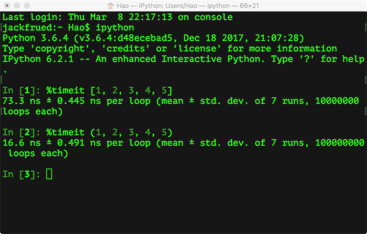

## 序列

#### 序列生成式

以下是 **序列推导式** 的 **基本语法** 和 **较复杂示例** 的表格总结：

---

| **推导式类型**       | **基本语法**                                      | **较复杂示例**                                                                 | **示例解释**                                                                 |
|----------------------|--------------------------------------------------|-------------------------------------------------------------------------------|------------------------------------------------------------------------------|
| **列表推导式**       | `[表达式 for 变量 in 可迭代对象 if 条件]`         | `[(x, y) for x in range(3) for y in range(3) if x != y]`                      | 生成所有 `(x, y)` 组合，其中 `x` 和 `y` 不相等。                             |
| **集合推导式**       | `{表达式 for 变量 in 可迭代对象 if 条件}`         | `{(x, y) for x in range(3) for y in range(3) if x + y < 3}`                   | 生成所有 `(x, y)` 组合，其中 `x + y < 3`。                                   |
| **字典推导式**       | `{键: 值 for 变量 in 可迭代对象 if 条件}`         | `{x: [y for y in range(x)] for x in range(5)}`                                | 生成字典，键是 `x`，值是 `[0, 1, ..., x-1]` 的列表。                         |
| **生成器推导式**     | `(表达式 for 变量 in 可迭代对象 if 条件)`         | `(x**2 for x in range(10) if x % 2 == 0)`                                     | 生成偶数的平方数生成器。                                                     |
| **嵌套推导式**       | 嵌套多个推导式                                    | `[[i * j for j in range(1, 4)] for i in range(1, 4)]`                         | 生成 3x3 的乘法表。                                                          |

??? info "嵌套推导式"

	`nested_dict = {i: {j: {k: i + j + k for k in range(2)} for j in range(2)} for i in range(2)}` 


	2. **代码结构**

	代码的结构如下：
	```python
	nested_dict = {
		i: {  # 外层字典的键是 i，值是一个字典
			j: {  # 中层字典的键是 j，值是一个字典
				k: i + j + k  # 内层字典的键是 k，值是 i + j + k
				for k in range(2)  # 内层推导式，遍历 k
			}
			for j in range(2)  # 中层推导式，遍历 j
		}
		for i in range(2)  # 外层推导式，遍历 i
	}
	```

	---

	3. **逐层解析**

	3.1 **外层推导式**
	```python
	for i in range(2)
	```

	- **作用**：遍历 `i`，取值范围是 `[0, 1]`。
	- **结果**：生成外层字典的键值对，键是 `i`，值是一个中层字典。

	3.2 **中层推导式**
	```python
	for j in range(2)
	```

	- **作用**：遍历 `j`，取值范围是 `[0, 1]`。
	- **结果**：生成中层字典的键值对，键是 `j`，值是一个内层字典。

	3.3 **内层推导式**
	```python
	for k in range(2)
	```
	- **作用**：遍历 `k`，取值范围是 `[0, 1]`。
	- **结果**：生成内层字典的键值对，键是 `k`，值是 `i + j + k`。

	---

	5. **最终输出**

	运行代码后，输出如下：
	```python
	{
		0: {
			0: {0: 0, 1: 1},
			1: {0: 1, 1: 2}
		},
		1: {
			0: {0: 1, 1: 2},
			1: {0: 2, 1: 3}
		}
	}
	```

#### 生成器

1. **生成器的定义**

生成器是一种 **惰性求值** 的迭代器，可以通过以下两种方式定义：
	1. **生成器函数**：使用 `yield` 关键字定义的函数。
	2. **生成器推导式**：使用类似列表推导式的语法，但用 `()` 包裹。

---

2. **生成器函数**

2.1 **基本语法**

```python
def 生成器函数():
    yield 值
```
- **`yield`**：用于生成一个值，并暂停函数的执行，直到下一次调用。

2.2 **示例**

```python
def my_generator():
    yield 1
    yield 2
    yield 3

# 创建生成器对象
gen = my_generator()

# 使用 next() 获取值
print(next(gen))  # 输出: 1
print(next(gen))  # 输出: 2
print(next(gen))  # 输出: 3
```

2.3 函数调用：

1. **创建生成器对象**

调用生成器函数时，会返回一个生成器对象，而不是立即执行函数。

```python
gen = my_generator()  # 创建生成器对象
print(gen)  # 输出: <generator object my_generator at 0x...>
```

2. **使用 `next()` 获取值**

通过 `next()` 函数可以逐个获取生成器生成的值。

```python
print(next(gen))  # 输出: 1
print(next(gen))  # 输出: 2
print(next(gen))  # 输出: 3
```

- 如果生成器没有更多的值，调用 `next()` 会抛出 `StopIteration` 异常。
  ```python
  print(next(gen))  # 抛出 StopIteration 异常
  ```

3. or **使用 `for` 循环遍历**

生成器对象可以直接用于 `for` 循环，循环会自动处理 `StopIteration` 异常。

```python
gen = my_generator()  # 重新创建生成器对象
for value in gen:
    print(value)  # 输出: 1, 2, 3
```


3. **生成器推导式**

3.1 **基本语法**

```python
(表达式 for 变量 in 可迭代对象 if 条件)
```
- 与列表推导式类似，但用 `()` 包裹。

3.2 **示例**

```python
gen = (x**2 for x in range(5))

# 使用 for 循环遍历生成器
for num in gen:
    print(num)  # 输出: 0, 1, 4, 9, 16
```

3.3 **特点**

- **惰性求值**：生成器推导式不会立即生成所有值，而是按需生成。
- **节省内存**：适合处理大规模数据。

---

4. **生成器的常用方法**

4.1 **`next()`**

- 获取生成器的下一个值。
- 如果生成器没有更多的值，会抛出 `StopIteration` 异常。
- **示例**：
  ```python
  gen = (x for x in range(3))
  print(next(gen))  # 输出: 0
  print(next(gen))  # 输出: 1
  print(next(gen))  # 输出: 2
  ```

4.2 **`for` 循环**

- 遍历生成器的所有值。
- **示例**：
  ```python
  gen = (x for x in range(3))
  for num in gen:
      print(num)  # 输出: 0, 1, 2
  ```

4.3 **`send()`**

- 向生成器发送值，并获取下一个值。
- **示例**：
  ```python
  def my_generator():
      value = yield 1
      yield value + 2

  gen = my_generator()
  print(next(gen))        # 输出: 1
  print(gen.send(10))     # 输出: 12
  ```

4.4 **`close()`**

- 关闭生成器。
- **示例**：
  ```python
  gen = (x for x in range(3))
  gen.close()
  ```

---

8. **示例代码**

示例 1：生成斐波那契数列
```python
def fibonacci():
    a, b = 0, 1
    while True:
        yield a
        a, b = b, a + b

# 生成前 10 个斐波那契数
gen = fibonacci()
for _ in range(10):
    print(next(gen))
```

示例 2：逐行读取大文件
```python
def read_large_file(file_path):
    with open(file_path, "r") as file:
        for line in file:
            yield line.strip()

# 逐行读取大文件
for line in read_large_file("large_file.txt"):
    print(line)
```


### 字符串str

#### 表示

**单个**或多个字符用单引号 **或者** 双引号 或者 三个单引号或双引号（这样可以换行）包围起来

`\`：

- 转义
- 后面跟八进制或者十六进制数来表示字符（例如`\141`和`\x61`都代表小写字母`a`）
- 后面跟Unicode字符编码来表示字符（例如b'\xe5\xbc\xa0\xe7\x91\x9e\xe5\x96\x86'代表'张瑞喆'）
- 不希望字符串中的`\`表示转义：在字符串的最前面加上字母`r`

#### 运算

**运算符**

- `+` ：字符串的拼接，

- `*`：重复一个字符串的内容

- `in` 和 `not in`：判断一个字符串是否包含另外一个字符串（成员运算）

- `[]` 和 `[:]`：从字符串取出某个字符或某些字符（切片运算）

```Python
s1 = 'hello ' * 3
print(s1) # hello hello hello 
s2 = 'world'
s1 += s2
print(s1) # hello hello hello world
print('ll' in s1) # True
print('good' not in s1) # True
str2 = 'abc123456'
# 从字符串中取出指定位置的字符(下标运算)
print(str2[2]) # c
# 字符串切片(从指定的开始索引到指定的结束索引)
print(str2[2:5]) # c12
print(str2[2:]) # c123456
print(str2[2::2]) # c246
print(str2[::2]) # ac246
print(str2[::-1]) # 654321cba
print(str2[-3:-1]) # 45
```

**点方法**

核心技能：查看并现场学会

方法1：输入 `str.` 看vscode后面的提示

方法2：
```python
print(dir(str))  # 内置dir函数：查看某对象的所有可用方法和属性。

help(str.title)  # 查看“帮助”文档
```

列出魔术方法：
```python
print([method for method in dir(str) if method.startswith('__') and method.endswith('__')])
```

| 函数       | 作用                                   | 示例                                   |
|------------|----------------------------------------|----------------------------------------|
| `dir()`    | 列出对象的属性和方法                   | `dir(str)`                             |
| `help()`   | 查看对象或函数的文档信息               | `help(str.split)`                      |

包含 魔术方法 和 普通方法

| 特性             | 魔术方法                          | 普通方法                        |
|------------------|-----------------------------------|---------------------------------|
| **命名规则**      | 双下划线开头和结尾（`__xxx__`）   | 普通命名（`xxx`）               |
| **调用方式**      | 隐式调用（由 Python 解释器触发）  | 显式调用（由开发者调用）        |
| **设计目的**      | 实现对象的底层行为                | 实现对象的具体功能              |
| **使用场景**      | 运算符重载、对象生命周期管理等    | 字符串处理、列表操作等          |
| **示例**          | `__init__`、`__add__`、`__len__`  | `lower()`、`split()`、`append()` |
| **调用示例**      | `obj1 + obj2`（隐式调用 `__add__`）| `obj.method()`（显式调用）      |
| **实现功能**      | 使对象支持 Python 内置操作        | 提供对象的具体功能              |
| **开发者调用频率**| 较少直接调用                      | 频繁调用                        |
| **典型用途**      | 初始化、运算符重载、类型转换等    | 数据处理、逻辑实现等            |


##### **双下划线方法（魔术方法）**
这些是 Python 的特殊方法，用于实现对象的特定行为（如运算符重载、字符串表示等）：
在 Python 中，字符串类型（`str`）的魔术方法（也称为双下划线方法或特殊方法）是用于实现对象特定行为的内置方法。以下是 `str` 类型的全部魔术方法：

(1) **对象创建与初始化**

- `__new__(cls, *args, **kwargs)`: 创建字符串对象（通常由 Python 解释器调用）。
- `__init__(self, value)`: 初始化字符串对象。

(2) **字符串表示**

- `__repr__(self)`: 返回对象的官方字符串表示（通常用于调试）。
- `__str__(self)`: 返回对象的用户友好字符串表示（通常用于打印）。
- `__format__(self, format_spec)`: 实现格式化字符串（用于 `format()` 函数和 f-string）。

(3) **比较操作**

- `__eq__(self, other)`: 实现相等比较（`==`）。
- `__ne__(self, other)`: 实现不等比较（`!=`）。
- `__lt__(self, other)`: 实现小于比较（`<`）。
- `__le__(self, other)`: 实现小于等于比较（`<=`）。
- `__gt__(self, other)`: 实现大于比较（`>`）。
- `__ge__(self, other)`: 实现大于等于比较（`>=`）。

(4) **哈希与唯一性**

- `__hash__(self)`: 返回对象的哈希值（用于字典键和集合成员）。

(5) **属性访问**

- `__getattribute__(self, name)`: 获取对象的属性值。
- `__setattr__(self, name, value)`: 设置对象的属性值。
- `__delattr__(self, name)`: 删除对象的属性。

(6) **容器行为**

- `__len__(self)`: 返回字符串的长度（`len(s)`）。
- `__getitem__(self, key)`: 实现索引访问（如 `s[0]`）。
- `__iter__(self)`: 返回字符串的迭代器（用于 `for` 循环）。
- `__contains__(self, item)`: 实现成员检查（`in` 操作符）。

(7) **算术操作**

- `__add__(self, other)`: 实现字符串的加法操作（`+`）。
- `__mul__(self, other)`: 实现字符串的乘法操作（`*`）。
- `__rmul__(self, other)`: 实现字符串的右乘法操作（`*`）。
- `__mod__(self, other)`: 实现字符串的格式化操作（`%`）。
- `__rmod__(self, other)`: 实现字符串的右格式化操作（`%`）。

(8) **类型检查与继承**

- `__class__`: 返回对象的类。
- `__init_subclass__(cls)`: 在子类初始化时调用。
- `__subclasshook__(cls, subclass)`: 用于自定义 `issubclass()` 行为。

(9) **其他**

- `__dir__(self)`: 返回对象的属性和方法列表（用于 `dir()` 函数）。
- `__sizeof__(self)`: 返回对象占用的内存大小（以字节为单位）。
- `__reduce__(self)`: 用于序列化对象（`pickle` 模块）。
- `__reduce_ex__(self, protocol)`: 用于序列化对象（支持协议版本）。
- `__getnewargs__(self)`: 返回用于对象重建的参数（`pickle` 模块）。


#### 方法

> 中括号 `[]` 用于表示函数参数中参数是“可选参数”，即有默认值

- **`capitalize()`**: 将字符串首字母大写。
- **`casefold()`**: 将字符串转换为小写（适用于 Unicode 大小写折叠）。
- **`center(width[, fillchar])`**: 将字符串居中，并用指定字符填充。
- **`count(sub[, start[, end]])`**: 返回子串在字符串中出现的次数。
- **`encode(encoding='utf-8', errors='strict')`**: 将字符串编码为字节对象。
- **`endswith(suffix[, start[, end]])`**: 检查字符串是否以指定后缀结尾。
- **`expandtabs(tabsize=8)`**: 将制表符（`\t`）替换为空格。
- **`find(sub[, start[, end]])`**: 返回子串的索引，未找到返回 `-1`。
- **`format(*args, **kwargs)`**: 格式化字符串。

	??? info "format方法的用法"

		1. **基本语法**
		```python
		str.format(*args, **kwargs)
		```
		- **`*args`**：位置参数，按顺序替换字符串中的占位符。
		- **`**kwargs`**：关键字参数，通过名称替换字符串中的占位符。

		---

		2. **占位符格式**
		在字符串中，占位符用 `{}` 表示。`format()` 方法会将 `{}` 替换为传入的参数。

		(1) **位置参数**
		- 使用 `{}` 作为占位符，按顺序替换。
		- 示例：
		```python
		text = "My name is {} and I am {} years old."
		result = text.format("Alice", 25)
		print(result)  # 输出: My name is Alice and I am 25 years old.
		```

		(2) **索引参数**
		- 在 `{}` 中使用索引（从 `0` 开始）指定替换顺序。
		- 示例：
		```python
		text = "My name is {0} and I am {1} years old. {0} is my first name."
		result = text.format("Alice", 25)
		print(result)  # 输出: My name is Alice and I am 25 years old. Alice is my first name.
		```

		(3) **关键字参数**
		- 在 `{}` 中使用名称指定替换值。
		- 示例：
		```python
		text = "My name is {name} and I am {age} years old."
		result = text.format(name="Alice", age=25)
		print(result)  # 输出: My name is Alice and I am 25 years old.
		```

		---

		3. **格式化选项**
		`format()` 方法支持丰富的格式化选项，可以在 `{}` 中使用 `:` 指定格式。

		(1) **数字格式化**
		- 保留小数位数：
		```python
		text = "The value of pi is {:.2f}."
		result = text.format(3.14159)
		print(result)  # 输出: The value of pi is 3.14.
		```
		- 千位分隔符：
		```python
		text = "The population is {:,}."
		result = text.format(1000000)
		print(result)  # 输出: The population is 1,000,000.
		```

		(2) **对齐与填充**
		- 左对齐：
		```python
		text = "{:<10}".format("left")
		print(text)  # 输出: left      (右填充空格)
		```
		- 右对齐：
		```python
		text = "{:>10}".format("right")
		print(text)  # 输出:      right (左填充空格)
		```
		- 居中对齐：
		```python
		text = "{:^10}".format("center")
		print(text)  # 输出:   center   (两侧填充空格)
		```
		- 自定义填充字符：
		```python
		text = "{:*^10}".format("center")
		print(text)  # 输出: **center** (两侧填充 *)
		```

		(3) **进制转换**
		- 二进制：
		```python
		text = "Binary: {:b}".format(10)
		print(text)  # 输出: Binary: 1010
		```
		- 十六进制：
		```python
		text = "Hex: {:x}".format(255)
		print(text)  # 输出: Hex: ff
		```

		---

		4. **混合使用**
		可以混合使用位置参数、关键字参数和格式化选项。

		示例
		```python
		text = "Name: {0}, Age: {1}, Salary: ${2:.2f}, Hex: {3:x}"
		result = text.format("Alice", 25, 5000.50, 255)
		print(result)
		# 输出: Name: Alice, Age: 25, Salary: $5000.50, Hex: ff
		```

		---

		5. **`**kwargs` 的高级用法**
		可以将字典作为关键字参数传入。

		示例
		```python
		data = {"name": "Alice", "age": 25}
		text = "My name is {name} and I am {age} years old."
		result = text.format(**data)
		print(result)  # 输出: My name is Alice and I am 25 years old.
		```

- **`format_map(mapping)`**: 使用字典格式化字符串。
- **`index(sub[, start[, end]])`**: 返回子串的索引，未找到抛出 `ValueError`。
- **`isalnum()`**: 检查字符串是否只包含字母和数字。
- **`isalpha()`**: 检查字符串是否只包含字母。
- **`isascii()`**: 检查字符串是否只包含 ASCII 字符。
- **`isdecimal()`**: 检查字符串是否只包含十进制数字。
- **`isdigit()`**: 检查字符串是否只包含数字。
- **`isidentifier()`**: 检查字符串是否是有效的 Python 标识符。
- **`islower()`**: 检查字符串是否全部为小写。
- **`isnumeric()`**: 检查字符串是否只包含数字字符。
- **`isprintable()`**: 检查字符串是否可打印。
- **`isspace()`**: 检查字符串是否只包含空白字符。
- **`istitle()`**: 检查字符串是否每个单词首字母大写。
- **`isupper()`**: 检查字符串是否全部为大写。
- **`join(iterable)`**: 将可迭代对象中的元素连接成一个字符串。

	??? info "join方法的用法"

		1. **基本语法**

		```python
		str.join(iterable)
		```

		- **`str`**：连接符（字符串），用于将可迭代对象中的元素连接起来（生成一个新的字符串）。
		- **`iterable`**：可迭代对象（如列表、元组、集合等），其中的元素必须是字符串类型，否则会抛出 `TypeError`。

		---

		3. **示例代码**

		示例 1：连接列表中的字符串

		```python
		words = ["Hello", "World", "Python"]
		result = " ".join(words)
		print(result)
		```
		**输出：**

		```
		Hello World Python
		```

		- 使用空格 `" "` 作为连接符，将列表 `words` 中的元素连接成一个字符串。

		---

		示例 2：连接元组中的字符串

		```python
		letters = ("a", "b", "c")
		result = "-".join(letters)
		print(result)
		```
		**输出：**
		```
		a-b-c
		```

		- 使用连字符 `"-"` 作为连接符，将元组 `letters` 中的元素连接成一个字符串。

		---

		示例 3：连接集合中的字符串

		```python
		chars = {"A", "B", "C"}
		result = "".join(chars)
		print(result)
		```
		**输出：**

		```
		ABC
		```

		- 使用空字符串 `""` 作为连接符，将集合 `chars` 中的元素连接成一个字符串。
		- 注意：集合是无序的，输出的字符串顺序可能与代码中的顺序不同。

		---

		示例 4：连接字符串中的字符

		```python
		text = "Python"
		result = "-".join(text)
		print(result)
		```
		**输出：**
		```
		P-y-t-h-o-n
		```

		- 字符串本身也是可迭代对象，`join()` 可以将其中的字符连接起来。

		---

		示例 5：连接数字列表（需要先转换为字符串）
		```python
		numbers = [1, 2, 3, 4]
		result = ", ".join(map(str, numbers))
		print(result)
		```
		**输出：**

		```
		1, 2, 3, 4
		```

		- 使用 `map()` 函数将数字列表中的元素转换为字符串，然后再用 `join()` 连接。

		---

		**注意事项**

		1. **可迭代对象的元素必须是字符串**：  
		如果可迭代对象中包含非字符串类型的元素（如整数、浮点数等），会抛出 `TypeError`。例如：
		```python
		numbers = [1, 2, 3]
		result = " ".join(numbers)  # 报错：TypeError
		```

		2. **连接符可以是任意字符串**：  
		连接符不仅限于单个字符，可以是任意长度的字符串。例如：
		```python
		words = ["Hello", "World"]
		result = " -> ".join(words)
		print(result)
		```
		**输出：**
		```
		Hello -> World
		```

		3. **空连接符**：  
		如果连接符是空字符串 `""`，则直接将可迭代对象中的元素拼接在一起。例如：
		```python
		letters = ["a", "b", "c"]
		result = "".join(letters)
		print(result)
		```
		**输出：**
		```
		abc
		```

		4. **空可迭代对象**：  
		如果可迭代对象为空（如空列表、空元组等），`join()` 会返回一个空字符串。例如：
		```python
		empty_list = []
		result = "-".join(empty_list)
		print(result)  # 输出：空字符串
		```


- **`ljust(width[, fillchar])`**: 将字符串左对齐，并用指定字符填充。
- **`lower()`**: 将字符串转换为小写。
- **`lstrip([chars])`**: 去除字符串左侧的空白或指定字符。
- **`maketrans(x[, y[, z]])`**: 创建字符映射表，用于 `translate()`。
- **`partition(sep)`**: 根据分隔符将字符串分为三部分。
- **`removeprefix(prefix)`**: 移除字符串的指定前缀（Python 3.9+）。
- **`removesuffix(suffix)`**: 移除字符串的指定后缀（Python 3.9+）。
- **`replace(old, new[, count])`**: 替换字符串中的子串。
- **`rfind(sub[, start[, end]])`**: 从右侧查找子串的索引。
- **`rindex(sub[, start[, end]])`**: 从右侧查找子串的索引，未找到抛出 `ValueError`。
- **`rjust(width[, fillchar])`**: 将字符串右对齐，并用指定字符填充。
- **`rpartition(sep)`**: 从右侧根据分隔符将字符串分为三部分。
- **`rsplit(sep=None, maxsplit=-1)`**: 从右侧拆分字符串。
- **`rstrip([chars])`**: 去除字符串右侧的空白或指定字符。
- **`split(sep=None, maxsplit=-1)`**: 拆分字符串。
- **`splitlines([keepends])`**: 按行拆分字符串。
- **`startswith(prefix[, start[, end]])`**: 检查字符串是否以指定前缀开头。
- **`strip([chars])`**: 去除字符串两端的空白或指定字符。
- **`swapcase()`**: 交换字符串中的大小写。
- **`title()`**: 将字符串中每个单词的首字母大写。
- **`translate(table)`**: 根据映射表转换字符串。
- **`upper()`**: 将字符串转换为大写。
- **`zfill(width)`**: 用零填充字符串左侧，使其达到指定长度。

??? info "常用的一些字符串处理方法"

	```Python
	str1 = 'hello, world!'
	# 通过内置函数len计算字符串的长度
	print(len(str1)) # 13
	# 获得字符串首字母大写的拷贝
	print(str1.capitalize()) # Hello, world!
	# 获得字符串每个单词首字母大写的拷贝
	print(str1.title()) # Hello, World!
	# 获得字符串变大写后的拷贝
	print(str1.upper()) # HELLO, WORLD!
	# 从字符串中查找子串所在位置
	print(str1.find('or')) # 8
	print(str1.find('shit')) # -1
	# 与find类似但找不到子串时会引发异常
	print(str1.index('or'))
	print(str1.index('shit'))
	# 检查字符串是否以指定的字符串开头
	print(str1.startswith('He')) # False
	print(str1.startswith('hel')) # True
	# 检查字符串是否以指定的字符串结尾
	print(str1.endswith('!')) # True
	# 将字符串以指定的宽度居中并在两侧填充指定的字符
	print(str1.center(50, '*'))
	# 将字符串以指定的宽度靠右放置左侧填充指定的字符
	print(str1.rjust(50, ' '))
	str2 = 'abc123456'
	# 检查字符串是否由数字构成
	print(str2.isdigit())  # False
	# 检查字符串是否以字母构成
	print(str2.isalpha())  # False
	# 检查字符串是否以数字和字母构成
	print(str2.isalnum())  # True
	str3 = '  jackfrued@126.com '
	print(str3)
	# 获得字符串修剪左右两侧空格之后的拷贝
	print(str3.strip())
	```

#### 输出

**格式化输出字符串**

```Python
a, b = 5, 10
print('%d * %d = %d' % (a, b, a * b))  # 方法1
print('{0} * {1} = {2}'.format(a, b, a * b))  # 方法2
print(f'{a} * {b} = {a * b}')  # 方法3
```

### 列表list

定义：元素放在`[]`中，多个元素用`,`进行分隔

#### 运算

- `*`： 列表元素的重复
- `[]`：下标操作，负数代表从后往前数
- `in` 和 `not in`
- 可修改：`[1, 3, 5, 7, 100][2] = 300`
- 遍历：元素遍历、下标遍历、enumerate函数处理之后遍历

	```Python
	# 通过enumerate函数处理列表之后再遍历可以同时获得元素索引和值
	for index, elem in enumerate(list1):
		print(index, elem)
	```

| **操作符类型**   | **操作符**       | **描述**                                                                 | **示例**                                                                 |
|------------------|------------------|--------------------------------------------------------------------------|--------------------------------------------------------------------------|
| **算术操作符**   | `+`              | 列表拼接，返回一个新列表                                                 | `[1, 2] + [3, 4]` → `[1, 2, 3, 4]`                                       |
|                  | `*`              | 列表重复，返回一个新列表                                                 | `[1, 2] * 3` → `[1, 2, 1, 2, 1, 2]`                                      |
| **比较操作符**   | `==`             | 检查两个列表是否相等（逐元素比较）                                       | `[1, 2] == [1, 2]` → `True`                                              |
|                  | `!=`             | 检查两个列表是否不相等                                                   | `[1, 2] != [3, 4]` → `True`                                              |
|                  | `<`              | 检查列表是否小于另一个列表（字典顺序）                                   | `[1, 2] < [1, 3]` → `True`                                               |
|                  | `>`              | 检查列表是否大于另一个列表（字典顺序）                                   | `[1, 4] > [1, 3]` → `True`                                               |
|                  | `<=`             | 检查列表是否小于或等于另一个列表                                         | `[1, 2] <= [1, 2]` → `True`                                              |
|                  | `>=`             | 检查列表是否大于或等于另一个列表                                         | `[1, 4] >= [1, 3]` → `True`                                              |
| **成员操作符**   | `in`             | 检查元素是否在列表中                                                     | `3 in [1, 2, 3]` → `True`                                                |
|                  | `not in`         | 检查元素是否不在列表中                                                   | `4 not in [1, 2, 3]` → `True`                                            |
| **索引操作符**   | `[]`             | 访问列表中的元素                                                         | `[10, 20, 30][1]` → `20`                                                 |
|                  | `[start:stop:step]` | 切片操作，获取子列表                                                     | `[10, 20, 30, 40][1:3]` → `[20, 30]`                                     |
| **赋值操作符**   | `=`              | 列表赋值                                                                 | `list1 = [1, 2, 3]`                                                      |
|                  | `+=`             | 列表拼接并赋值                                                           | `list1 = [1, 2]; list1 += [3, 4]` → `[1, 2, 3, 4]`                       |
|                  | `*=`             | 列表重复并赋值                                                           | `list1 = [1, 2]; list1 *= 2` → `[1, 2, 1, 2]`                            |
| **身份操作符**   | `is`             | 检查两个列表是否是同一个对象                                             | `list1 = [1, 2]; list2 = list1; list1 is list2` → `True`                 |
|                  | `is not`         | 检查两个列表是否不是同一个对象                                           | `list1 = [1, 2]; list2 = [1, 2]; list1 is not list2` → `True`            |
| **逻辑操作符**   | `and`, `or`, `not` | 列表本身不支持逻辑操作符，但可以在布尔上下文中使用                       | `if [1, 2]: print("非空")` → 输出 `非空`                                 |


#### 方法

在 Python 中，列表（`list`）是一种内置的可变序列类型，具有许多属性和方法。以下是 Python 列表的所有属性和方法的概述：

属性：

1. **`__doc__`**: 列表的文档字符串。
2. **`__class__`**: 列表的类类型（即 `list`）。
3. **`__dict__`**: 列表的命名空间（通常为空，因为列表是内置类型）。
4. **`__module__`**: 列表所属的模块（通常是 `builtins`）。

方法：

1. **`append(x)`**: 在列表末尾添加元素 `x`。
2. **`extend(iterable)`**: 将可迭代对象 `iterable` 中的所有元素添加到列表末尾。
3. **`insert(i, x)`**: 在索引 `i` 处插入元素 `x`。
4. **`remove(x)`**: 移除列表中第一个值为 `x` 的元素。
5. **`pop([i])`**: 移除并返回索引 `i` 处的元素（默认为最后一个元素）。
6. **`clear()`**: 移除列表中的所有元素。
7. **`index(x[, start[, end]])`**: 返回第一个值为 `x` 的元素的索引（可选地在 `start` 和 `end` 之间搜索）。
8. **`count(x)`**: 返回列表中值为 `x` 的元素的个数。
9. **`sort(key=None, reverse=False)`**: 对列表进行排序（可选地使用 `key` 函数和 `reverse` 参数）。：会修改原对象，故只有列表有，其他序列类型（如元组、字符串）没有
	
	注意区分：`sorted(iterable, key=None, reverse=False)` 函数：*不会修改原对象* ，而是生成一个新的对象。故序列类型都有。

	??? sorted "sorted用法"

		key（可选）：指定一个函数，用于从每个元素中提取比较键。默认值为 None，表示直接比较元素本身。

		示例：
		```python
		# 先按年龄，年龄相同再按名字，再反转
		students = [
			{"name": "Alice", "age": 25},
			{"name": "Bob", "age": 22},
			{"name": "Charlie", "age": 25},
		]
		sorted_students = sorted(students, key=lambda x: (x["age"], x["name"]), reverse=True)
		print(sorted_students)
		# 排序键是一个元组 `(x["age"], x["name"])`，表示先按 `age` 排序，如果 `age` 相同，则按 `name` 排序。
		# 输出: [{'name': 'Charlie', 'age': 25}, {'name': 'Alice', 'age': 25}, {'name': 'Bob', 'age': 22}]
		```
		```python
		# 先按年龄升序，再按名字降序
		students.sort(key=lambda x: (-x["age"], x["name"]))
		print(students)
		# 输出: [{'name': 'Alice', 'age': 25}, {'name': 'Charlie', 'age': 25}, {'name': 'Bob', 'age': 22}]
		```
		
10. **`reverse()`**: 反转列表中的元素顺序。
11. **`copy()`**: 返回列表的浅拷贝。
12. **`__len__()`**: 返回列表的长度（即元素个数）。
13. **`__getitem__(i)`**: 获取索引 `i` 处的元素。
14. **`__setitem__(i, x)`**: 设置索引 `i` 处的元素为 `x`。
15. **`__delitem__(i)`**: 删除索引 `i` 处的元素。
16. **`__iter__()`**: 返回列表的迭代器。
17. **`__contains__(x)`**: 检查列表是否包含元素 `x`。
18. **`__add__(other)`**: 返回两个列表的拼接结果。
19. **`__mul__(n)`**: 返回列表重复 `n` 次的结果。
20. **`__rmul__(n)`**: 同 `__mul__`，用于反向乘法操作。
21. **`__repr__()`**: 返回列表的字符串表示形式。
22. **`__str__()`**: 返回列表的字符串表示形式（与 `__repr__` 相同）。
23. **`__eq__(other)`**: 比较两个列表是否相等。
24. **`__ne__(other)`**: 比较两个列表是否不相等。
25. **`__lt__(other)`**: 比较列表是否小于另一个列表。
26. **`__le__(other)`**: 比较列表是否小于或等于另一个列表。
27. **`__gt__(other)`**: 比较列表是否大于另一个列表。
28. **`__ge__(other)`**: 比较列表是否大于或等于另一个列表。
29. **`__hash__()`**: 列表是不可哈希的，因此此方法会引发 `TypeError`。
30. **`__sizeof__()`**: 返回列表的内存大小（以字节为单位）。


```python
my_list = [1, 2, 3]
my_list.extend([5, 6])  # [1, 2, 3, 4, 5, 6]

my_list.remove(0)  # [1, 2, 3, 4, 5, 6]
my_list.pop()  # 返回 6，列表变为 [1, 2, 3, 4, 5]
my_list.clear()  # []
my_list = [1, 2, 3, 4, 5]
index = my_list.index(3)  # 2
count = my_list.count(3)  # 1
my_list.sort(reverse=True)  # [5, 4, 3, 2, 1]
my_list.reverse()  # [1, 2, 3, 4, 5]
new_list = my_list.copy()  # [1, 2, 3, 4, 5]
list1 = [1, 3, 5, 7, 100]
# 添加元素
list1.append(200)
list1.insert(1, 400)
# 合并两个列表
# list1.extend([1000, 2000])
list1 += [1000, 2000]
print(list1) # [1, 400, 3, 5, 7, 100, 200, 1000, 2000]
print(len(list1)) # 9
# 先通过成员运算判断元素是否在列表中，如果存在就删除该元素
if 3 in list1:
	list1.remove(3)
if 1234 in list1:
    list1.remove(1234)
print(list1) # [1, 400, 5, 7, 100, 200, 1000, 2000]
# 从指定的位置删除元素
list1.pop(0)
list1.pop(len(list1) - 1)
print(list1) # [400, 5, 7, 100, 200, 1000]
# 清空列表元素
list1.clear()
print(list1) # []
```

也可以切片。

也可以排序。
- sorted函数返回列表排序后的拷贝不会修改传入的列表。


### 元组tuple

与列表不同之处在于元组的元素不能修改

1. 元组线程安全：因为不可被修改

2. 元组在创建时间和占用的空间上面都优于列表。
	- getsizeof函数检查内存空间
	- 在ipython中使用魔法指令%timeit分析对象创建所花时间

??? info "sys.getsizeof()"

	```python
	import sys

	size = sys.getsizeof(object)
	```
	- `object`：需要计算内存大小的对象。
	- 返回值：对象占用的内存大小（以字节为单位）。

	注意：仅计算对象本身：
	- `sys.getsizeof()` 只计算对象本身占用的内存，不包括对象引用的其他对象。例如，列表的内存大小不包括列表中元素的内存大小，字典不包括其中键值对的大小。
	- 对象本身的包括：
		- 对象的类型信息。
		- 对象的引用计数。
    	- 对象的基本属性（如列表的长度、字典的键值对数量等）

	计算对象及其引用的所有对象的内存大小，可以使用第三方库（如 pympler 或 objgraph）。

	```python
	from pympler import asizeof
	my_list = [1, 2, 3]
	print(asizeof.asizeof(my_list))  # 输出: 248 (列表对象本身 + 元素的内存大小)
	```




### 集合set

#### 定义和创建

可以按照下面代码所示的方式来创建和使用集合。

```Python
# 创建集合的字面量语法
set1 = {1, 2, 3, 3, 3, 2}
print(set1)
print('Length =', len(set1))
# 创建集合的构造器语法
set2 = set(range(1, 10))
set3 = set((1, 2, 3, 3, 2, 1))
print(set2, set3)
# 创建集合的推导式语法
my_set = {expression for item in iterable if condition}  # 标准语法
set4 = {num for num in range(1, 100) if num % 3 == 0 or num % 5 == 0}
print(set4)
```

#### 运算

向集合添加元素和从集合删除元素。

```Python
set1.add(4)
set1.add(5)
set2.update([11, 12])
set2.discard(5)
if 4 in set2:
    set2.remove(4)
print(set1, set2)
print(set3.pop())
print(set3)
```

集合的成员、交集、并集、差集等运算。

```Python
# 集合的交集、并集、差集、对称差运算
print(set1 & set2)
# print(set1.intersection(set2))
print(set1 | set2)
# print(set1.union(set2))
print(set1 - set2)
# print(set1.difference(set2))
print(set1 ^ set2)
# print(set1.symmetric_difference(set2))
# 判断子集和超集
print(set2 <= set1)
# print(set2.issubset(set1))
print(set3 <= set1)
# print(set3.issubset(set1))
print(set1 >= set2)
# print(set1.issuperset(set2))
print(set1 >= set3)
# print(set1.issuperset(set3))
```

### 字典dict
元素都是“键值对”

#### 运算

1. **`==`**  
检查两个字典是否相等（键和值都相同）。

2. **`!=`**  
检查两个字典是否不相等。

3. **`in`**  
检查键是否存在于字典中。

4. **`not in`**  
检查键是否不存在于字典中。

5. **`[]`**  
访问字典中指定键的值。如果键不存在，会引发 `KeyError`。

6. **`[]=`**  
为字典中的键赋值。如果键不存在，则会添加新的键值对。

7. **`del dict[key]`**  
删除字典中指定的键值对。如果键不存在，会引发 `KeyError`。

8. **`|`**  
合并两个字典，返回一个新字典（Python 3.9+）。

9. **`|=`**  
更新字典，将另一个字典的键值对合并到当前字典中（Python 3.9+）。

10. **`len()`**  
获取字典中键值对的数量。

#### 方法

1. **`clear()`**
   - 使用：`dict.clear()`
   - 解释：删除字典内所有元素。

2. **`copy()`**
   - 使用：`dict.copy()`
   - 解释：返回一个字典的浅拷贝。

3. **`fromkeys(seq[, value])`**
   - 使用：`dict.fromkeys(seq[, value])`
   - 解释：创建一个新字典，以序列 `seq` 中元素做字典的键，`value` 为字典所有键对应的初始值。

4. **`get(key[, default])`**
   - 使用：`dict.get(key[, default])`
   - 解释：返回指定键的值，如果键不在字典中返回默认值 `default`。

5. **`items()`**
   - 使用：`dict.items()`
   - 解释：返回一个视图对象，显示字典的键值对元组列表。

6. **`keys()`**
   - 使用：`dict.keys()`
   - 解释：返回一个视图对象，显示字典的键列表。

11. **`values()`**
    - 使用：`dict.values()`
    - 解释：返回一个视图对象，显示字典的值列表。

7. **`pop(key[, default])`**
   - 使用：`dict.pop(key[, default])`
   - 解释：删除字典给定键 `key` 所对应的值，返回值为被删除的值。如果 `key` 不存在，返回 `default` 值。

8. **`popitem()`**
   - 使用：`dict.popitem()`
   - 解释：随机返回并删除字典中的一对键值（一般删除末尾对）。

9. **`setdefault(key[, default])`**
   - 使用：`dict.setdefault(key[, default])`
   - 解释：如果键 `key` 存在于字典中，返回对应的值。如果不在字典中，则插入 `key` 及设置的默认值 `default`，并返回 `default`。

10. **`update([other])`**
    - 使用：`dict.update([other])`
    - 解释：永字典 `other` 中的键值对更新原字典


```python
# 创建一个字典
my_dict = {'name': 'Alice', 'age': 25, 'city': 'New York'}

# 1. clear()
my_dict.clear()
print("After clear():", my_dict)  # 输出: {}

# 2. copy()
my_dict = {'name': 'Alice', 'age': 25, 'city': 'New York'}
dict_copy = my_dict.copy()
print("Copy of dictionary:", dict_copy)  # 输出: {'name': 'Alice', 'age': 25, 'city': 'New York'}

# 3. fromkeys()
keys = ['name', 'age', 'city']
new_dict = dict.fromkeys(keys, 'unknown')
print("Dictionary from keys:", new_dict)  # 输出: {'name': 'unknown', 'age': 'unknown', 'city': 'unknown'}

# 4. get()
age = my_dict.get('age')
print("Age:", age)  # 输出: 25

# 5. items()
items = my_dict.items()
print("Items:", items)  # 输出: dict_items([('name', 'Alice'), ('age', 25), ('city', 'New York')])

# 6. keys()
keys = my_dict.keys()
print("Keys:", keys)  # 输出: dict_keys(['name', 'age', 'city'])

# 7. pop()
removed_value = my_dict.pop('age')
print("Removed value:", removed_value)  # 输出: 25
print("Dictionary after pop:", my_dict)  # 输出: {'name': 'Alice', 'city': 'New York'}

# 8. popitem()
key, value = my_dict.popitem()
print("Popped item:", key, value)  # 输出: city New York
print("Dictionary after popitem:", my_dict)  # 输出: {'name': 'Alice'}

# 9. setdefault()
my_dict.setdefault('country', 'USA')
print("Dictionary after setdefault:", my_dict)  # 输出: {'name': 'Alice', 'country': 'USA'}

# 10. update()
my_dict.update({'age': 30, 'city': 'Los Angeles'})
print("Dictionary after update:", my_dict)  # 输出: {'name': 'Alice', 'country': 'USA', 'age': 30, 'city': 'Los Angeles'}

# 11. values()
values = my_dict.values()
print("Values:", values)  # 输出: dict_values(['Alice', 'USA', 30, 'Los Angeles'])
```


```Python
# 创建字典的字面量语法
scores = {'骆昊': 95, '白元芳': 78, '狄仁杰': 82}
print(scores)
# 创建字典的构造器语法
items1 = dict(one=1, two=2, three=3, four=4)
# 通过zip函数将两个序列压成字典
items2 = dict(zip(['a', 'b', 'c'], '123'))  # dict2 = {'a': '1', 'b': '2', 'c': '3'}
# 创建字典的推导式语法
items3 = {num: num ** 2 for num in range(1, 10)}
print(items1, items2, items3)
# 通过键可以获取字典中对应的值
print(scores['骆昊'])
print(scores['狄仁杰'])
# 对字典中所有键值对进行遍历
for key in scores:  # 等价于 for key in scores.keys():
    print(f'{key}: {scores[key]}')
# 更新字典中的元素
scores['白元芳'] = 65
scores['诸葛王朗'] = 71
scores.update(冷面=67, 方启鹤=85)
print(scores)
if '武则天' in scores:
    print(scores['武则天'])
print(scores.get('武则天'))
# get方法也是通过键获取对应的值但是可以设置默认值
print(scores.get('武则天', 60))
# 删除字典中的元素
print(scores.popitem())
print(scores.popitem())
print(scores.pop('骆昊', 100))
# 清空字典
scores.clear()
print(scores)
```

### 示例

练习1：在屏幕上显示跑马灯文字。

参考答案：

```Python
import os
import time

def marquee_text(text, delay=2):
    """
    显示跑马灯文字效果
    :param text: 要显示的文本
    :param delay: 每次刷新的延迟时间（秒）
    """
    while True:
        # 清理屏幕上的输出
        os.system('cls' if os.name == 'nt' else 'clear')  # 根据操作系统选择清屏命令
        print(text)
        # 将文本的第一个字符移动到末尾
        text = text[1:] + text[0]
        # 休眠指定时间
        time.sleep(delay)

def main():
    content = '北京欢迎你为你开天辟地…………'
    marquee_text(content)

if __name__ == '__main__':
    main()

```

练习2：设计一个函数产生指定长度的验证码，验证码由大小写字母和数字构成。

参考答案：

```Python
import random


def generate_code(code_len=4):
    """
    生成指定长度的验证码

    :param code_len: 验证码的长度(默认4个字符)

    :return: 由大小写英文字母和数字构成的随机验证码
    """
    all_chars = '0123456789abcdefghijklmnopqrstuvwxyzABCDEFGHIJKLMNOPQRSTUVWXYZ'
    last_pos = len(all_chars) - 1
    code = ''
    for _ in range(code_len):
        index = random.randint(0, last_pos)
        code += all_chars[index]
    return code
```

| **生成随机字符串的方法**                  | **语法示例**                                                                 | **特点**                                   | **适用场景**                     |
|---------------------------|------------------------------------------------------------------------------|--------------------------------------------|----------------------------------|
| **`random.choice()`**      | `''.join(random.choice(chars) for _ in range(length))`                       | 随机选择字符，可重复                       | 简单随机字符串                   |
| **`random.choices()`**     | `''.join(random.choices(chars, k=length))`                                   | 随机选择字符，可重复                       | 允许重复字符的随机字符串         |
| **`random.sample()`**      | `''.join(random.sample(chars, length))`                                      | 随机选择字符，不重复                       | 不允许重复字符的随机字符串       |
| **`secrets.choice()`**     | `''.join(secrets.choice(chars) for _ in range(length))`                      | 加密安全的随机选择                         | 安全性要求高的随机字符串         |
| **`string` 模块**          | `''.join(random.choice(string.ascii_letters + string.digits) for _ in range(length))` | 提供预定义的字符集                         | 生成包含特定字符集的随机字符串   |
| **`uuid` 模块**            | `str(uuid.uuid4()).replace("-", "")`                                         | 生成唯一的随机字符串                       | 需要唯一标识符的场景             |


双色球选号

```Python
from random import randrange, randint, sample


def display(balls):
    """
    输出列表中的双色球号码
    """
    for index, ball in enumerate(balls):
        if index == len(balls) - 1:
            print('|', end=' ')
        print('%02d' % ball, end=' ')
    print()


def random_select():
    """
    随机选择一组号码
    """
    red_balls = [x for x in range(1, 34)]
    selected_balls = []
    selected_balls = sample(red_balls, 6)
    selected_balls.sort()
    selected_balls.append(randint(1, 16))
    return selected_balls


def main():
    n = int(input('机选几注: '))
    for _ in range(n):
        display(random_select())


if __name__ == '__main__':
    main()
```

> **说明：** 上面使用random模块的sample函数来实现从列表中选择不重复的n个元素。

[约瑟夫环问题](https://zh.wikipedia.org/wiki/%E7%BA%A6%E7%91%9F%E5%A4%AB%E6%96%AF%E9%97%AE%E9%A2%98)。

```Python
"""
《幸运的基督徒》
有15个基督徒和15个非基督徒在海上遇险，为了能让一部分人活下来不得不将其中15个人扔到海里面去，有个人想了个办法就是大家围成一个圈，由某个人开始从1报数，报到9的人就扔到海里面，他后面的人接着从1开始报数，报到9的人继续扔到海里面，直到扔掉15个人。由于上帝的保佑，15个基督徒都幸免于难，问这些人最开始是怎么站的，哪些位置是基督徒哪些位置是非基督徒。
"""


def main():
    persons = [True] * 30
    counter, index, number = 0, 0, 0
    while counter < 15:
        if persons[index]:
            number += 1
            if number == 9:
                persons[index] = False
                counter += 1
                number = 0
        index += 1
        index %= 30
    for person in persons:
        print('基' if person else '非', end='')


if __name__ == '__main__':
    main()

```

[井字棋](https://zh.wikipedia.org/wiki/%E4%BA%95%E5%AD%97%E6%A3%8B)游戏。

```Python
import os


def print_board(board):
    print(board['TL'] + '|' + board['TM'] + '|' + board['TR'])
    print('-+-+-')
    print(board['ML'] + '|' + board['MM'] + '|' + board['MR'])
    print('-+-+-')
    print(board['BL'] + '|' + board['BM'] + '|' + board['BR'])


def main():
    init_board = {
        'TL': ' ', 'TM': ' ', 'TR': ' ',
        'ML': ' ', 'MM': ' ', 'MR': ' ',
        'BL': ' ', 'BM': ' ', 'BR': ' '
    }
    begin = True
    while begin:
        curr_board = init_board.copy()
        begin = False
        turn = 'x'
        counter = 0
        os.system('clear')
        print_board(curr_board)
        while counter < 9:
            move = input('轮到%s走棋, 请输入位置: ' % turn)
            if curr_board[move] == ' ':
                counter += 1
                curr_board[move] = turn
                if turn == 'x':
                    turn = 'o'
                else:
                    turn = 'x'
            os.system('clear')
            print_board(curr_board)
        choice = input('再玩一局?(yes|no)')
        begin = choice == 'yes'


if __name__ == '__main__':
    main()
```
