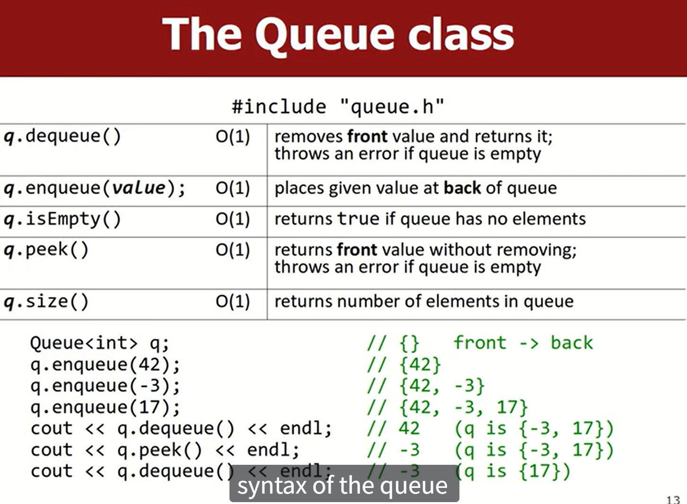
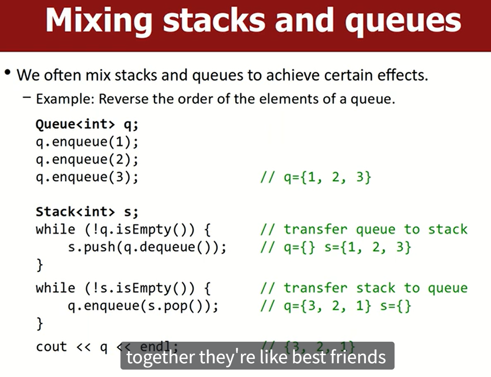
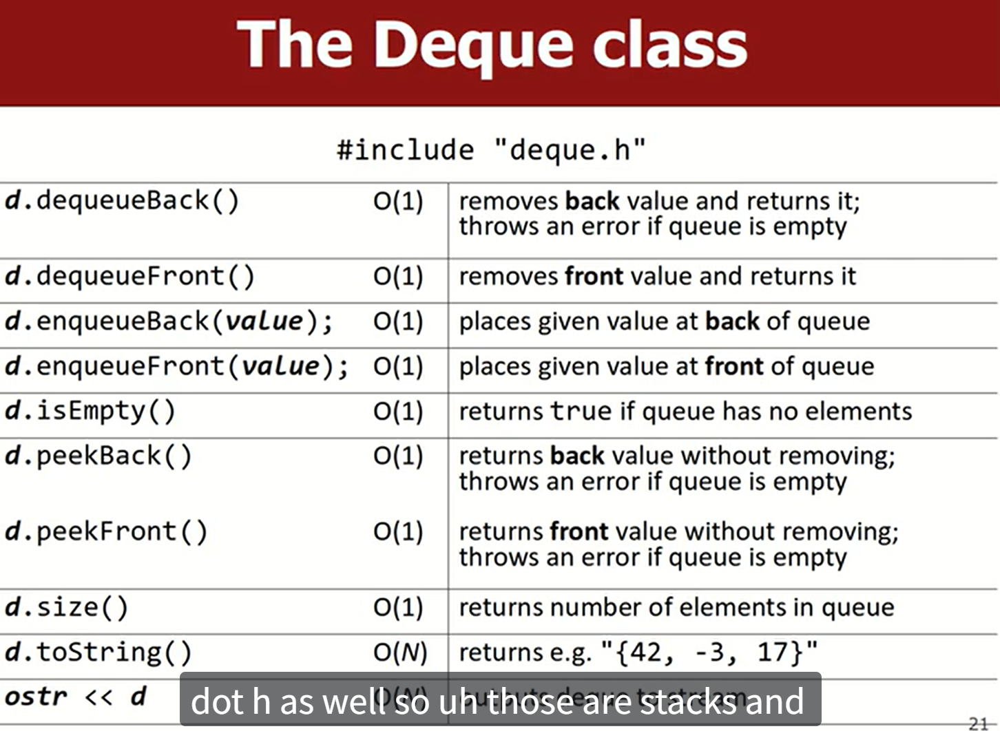

## 📚 C++ STL `std::stack` 详解

`std::stack` 是 C++ 标准模板库（STL）中的**容器适配器 (Container Adapter)** 之一。它不是一个独立的底层容器，而是通过封装其他基础容器（如 `std::deque`、`std::list` 或 `std::vector`）来实现栈（Stack）数据结构的功能。

### 1\. 核心概念：后进先出 (LIFO)

栈（Stack）是一种线性数据结构，它遵循**后进先出 (Last In, First Out - LIFO)** 的原则。
想象一下一叠盘子：你最后放上去的盘子，总是你第一个拿下来的。

  * **插入 (Push)** 和 **删除 (Pop)** 操作都只在栈的**一端**进行，这一端被称为**栈顶 (Top)**。

### 2\. 底层实现容器 (Underlying Container)

`std::stack` 默认使用 `std::deque` (双端队列) 作为其底层容器。你也可以在声明时指定使用 `std::list` 或 `std::vector`。

```cpp
#include <stack>
#include <deque> // 默认的底层容器
#include <list>
#include <vector>

// 默认：使用 std::deque
std::stack<int> s1;

// 显式指定使用 std::vector (需要保证 vector 支持 back/push_back/pop_back)
std::stack<int, std::vector<int>> s2;

// 显式指定使用 std::list
std::stack<int, std::list<int>> s3;
```

**为什么默认是 `std::deque`？**
因为 `std::deque` 在两端进行插入和删除操作都是 $O(1)$ 时间复杂度，这非常适合实现栈和队列。对于栈来说，它只需要一端的 $O(1)$ 操作（即 `push_back`/`pop_back`/`back`），而 `std::deque` 和 `std::vector` 都能高效实现。

### 3\. 主要成员函数 (Member Functions)

`std::stack` 提供的所有操作都具有 $O(1)$ 的时间复杂度。

| 函数名 | 描述 | 返回值/操作 | 复杂度 |
| :--- | :--- | :--- | :--- |
| **`push(const T& val)`** | **入栈**。将元素 `val` 复制或移动到栈顶。 | `void` | $O(1)$ |
| **`pop()`** | **出栈**。移除栈顶的元素。 | `void` (无返回值) | $O(1)$ |
| **`top()`** | **访问栈顶**。返回栈顶元素的引用。 | `T&` 或 `const T&` | $O(1)$ |
| **`empty()`** | **判空**。检查栈是否为空。 | `bool` | $O(1)$ |
| **`size()`** | **大小**。返回栈中元素的数量。 | `size_type` | $O(1)$ |
| **`swap(stack& other)`** | **交换**。与另一个栈交换内容。 | `void` | $O(1)$ |

> **注意：** `pop()` 函数不返回被移除的元素。如果需要获取栈顶元素，必须先调用 `top()`。

### 4\. 使用示例

```cpp
#include <iostream>
#include <stack>

void print_stack_info(const std::stack<int>& s) {
    if (s.empty()) {
        std::cout << "栈为空。\n";
    } else {
        std::cout << "栈的大小: " << s.size() 
                  << ", 栈顶元素: " << s.top() << "\n";
    }
}

int main() {
    std::stack<int> s;

    // 1. push() - 入栈
    s.push(10);
    s.push(20);
    s.push(30); 
    // 栈当前状态 (从底到顶): 10, 20, 30
    
    std::cout << "--- 1. 初始状态 ---\n";
    print_stack_info(s); // 栈的大小: 3, 栈顶元素: 30

    // 2. top() - 访问栈顶
    std::cout << "--- 2. 访问栈顶 ---\n";
    std::cout << "当前栈顶: " << s.top() << "\n"; // 30

    // 3. pop() - 出栈
    s.pop(); // 移除 30
    // 栈当前状态 (从底到顶): 10, 20

    std::cout << "--- 3. 第一次 pop 后 ---\n";
    print_stack_info(s); // 栈的大小: 2, 栈顶元素: 20

    s.pop(); // 移除 20
    // 栈当前状态 (从底到顶): 10

    std::cout << "--- 4. 第二次 pop 后 ---\n";
    print_stack_info(s); // 栈的大小: 1, 栈顶元素: 10
    
    // 4. empty() - 判空
    s.pop(); // 移除 10
    
    std::cout << "--- 5. 再次 pop 后 ---\n";
    print_stack_info(s); // 栈为空。

    return 0;
}
```

-----

## 📝 题目示例：有效的括号 (Valid Parentheses)

这是一个经典的利用栈来解决的问题，通常在 LeetCode 上会遇到。

### 题目描述

给定一个只包括 `'('`，`')'`，`'{'`，`'}'`，`'['`，`']'` 的字符串 $s$，判断字符串是否**有效**。

有效字符串需满足：

1.  **左括号**必须用相同类型的**右括号**闭合。
2.  **左括号**必须以正确的顺序闭合。

**示例：**

  * `"()[]{}"` 是有效的。
  * `"([{}])"` 是有效的。
  * `"(]"` 是无效的。
  * `"{["` 是无效的。

### 栈解法思路

1.  **遇到左括号**：直接将其 **`push`** 入栈。
2.  **遇到右括号**：
      * 首先检查栈是否**为空**。如果为空，说明没有对应的左括号，直接返回 `false`。
      * 检查栈顶元素 `s.top()` 是否是当前右括号对应的**左括号**。
          * 如果是，说明匹配成功，将栈顶元素 **`pop`** 出栈。
          * 如果不是，说明括号顺序错误或类型不匹配，返回 `false`。
3.  **遍历结束**：
      * 如果栈**为空**，说明所有括号都成功匹配，返回 `true`。
      * 如果栈**不为空**，说明有未匹配的左括号，返回 `false`。

### C++ 代码实现

```cpp
#include <string>
#include <stack>
#include <iostream>

class Solution {
public:
    bool isValid(std::string s) {
        std::stack<char> char_stack;
        
        for (char c : s) {
            if (c == '(' || c == '{' || c == '[') {
                // 1. 遇到左括号，入栈
                char_stack.push(c);
            } else {
                // 2. 遇到右括号
                
                // 2.1 栈为空，没有匹配的左括号
                if (char_stack.empty()) {
                    return false;
                }
                
                char top_char = char_stack.top();
                char_stack.pop(); // 假设匹配成功，先移除栈顶
                
                // 2.2 检查是否匹配
                if (c == ')' && top_char != '(') {
                    return false;
                } else if (c == ']' && top_char != '[') {
                    return false;
                } else if (c == '}' && top_char != '{') {
                    return false;
                }
            }
        }
        
        // 3. 遍历结束后，检查栈是否为空。为空则所有括号都匹配了。
        return char_stack.empty();
    }
};

int main() {
    Solution sol;
    std::cout << "()[]{} is valid: " << sol.isValid("()[]{}") << "\n"; // 1 (true)
    std::cout << "([{}]) is valid: " << sol.isValid("([{}])") << "\n"; // 1 (true)
    std::cout << "(] is valid: " << sol.isValid("(]") << "\n";       // 0 (false)
    std::cout << "{[ is valid: " << sol.isValid("{[") << "\n";         // 0 (false)
    std::cout << "}} is valid: " << sol.isValid("}}") << "\n";       // 0 (false)
    return 0;
}
```

希望这个讲解能够帮助你理解 C++ STL `std::stack` 的实现和应用！

## Queue





## Deque

