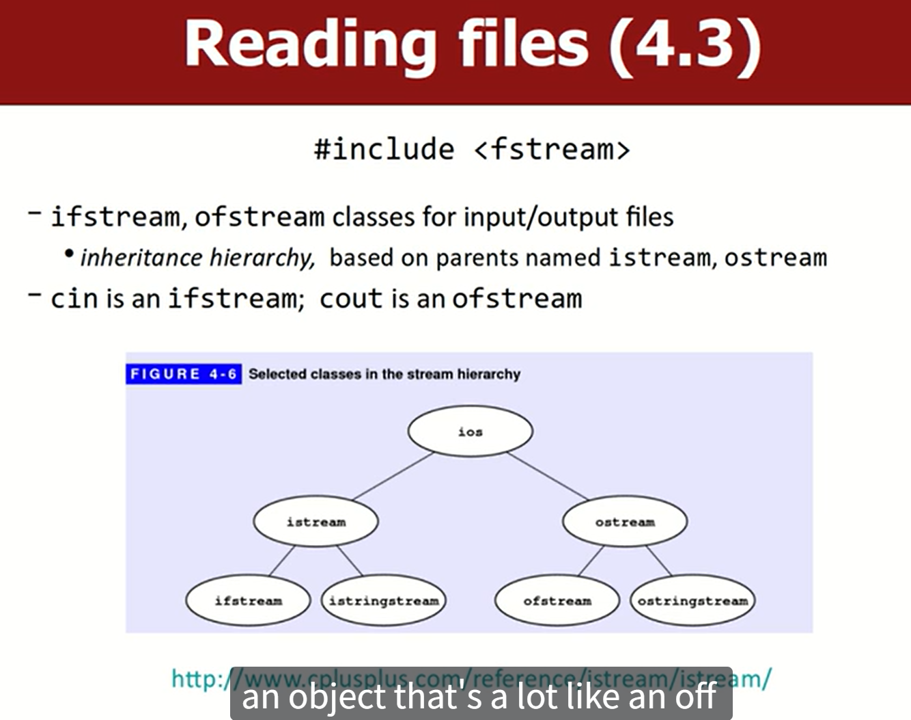
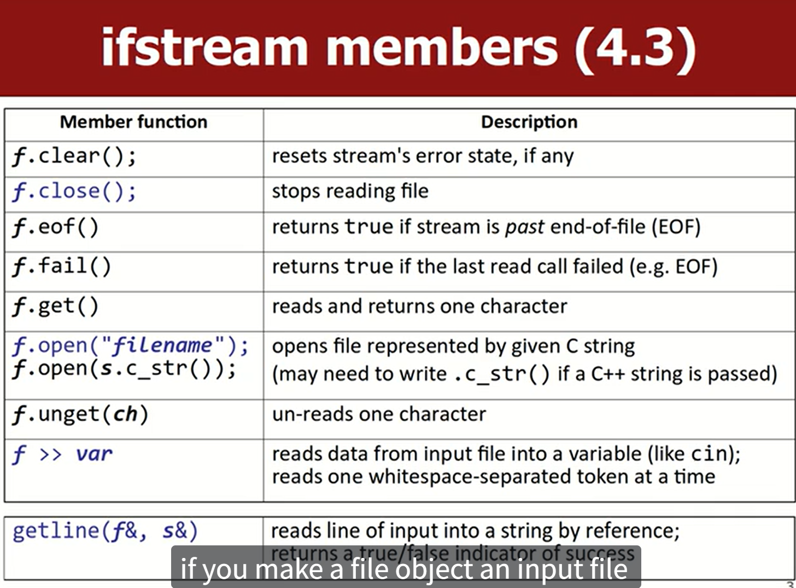
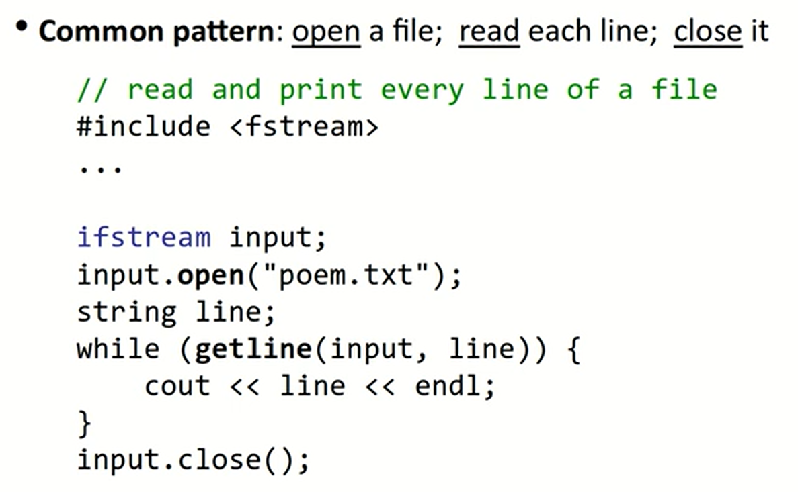
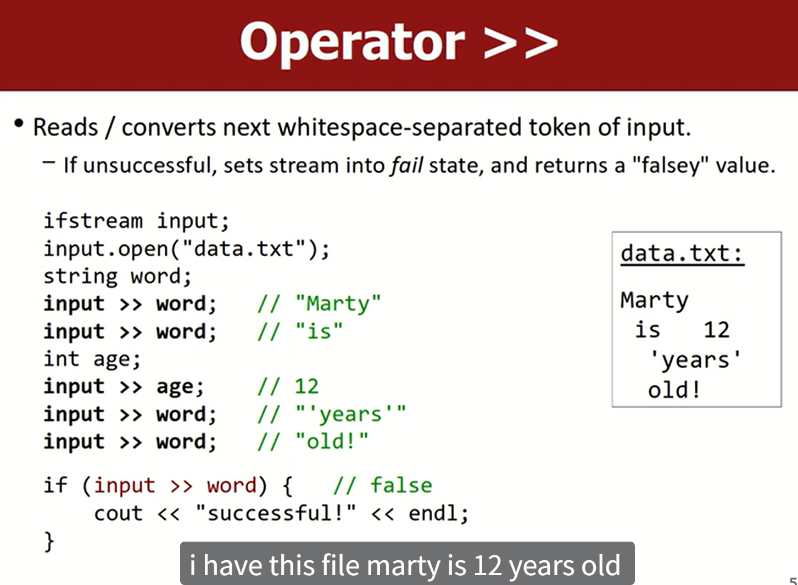
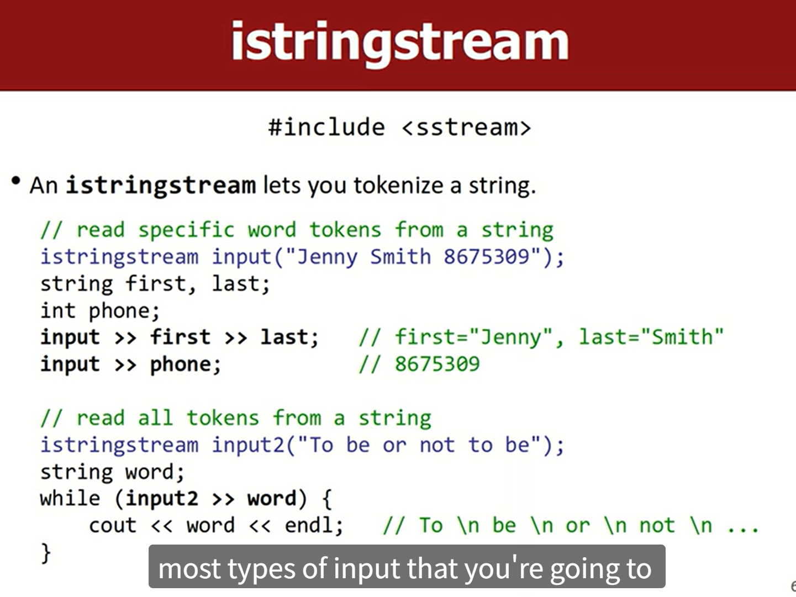
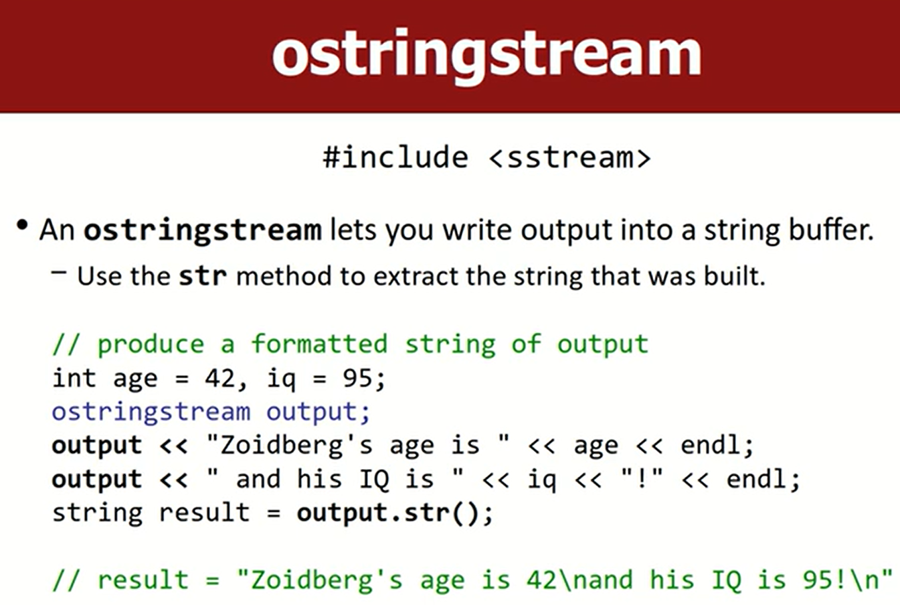

## Reading Files

`include <fstream>`



- `cin` 是 ifstream 对象，表示标准输入流
- `cout` 是 ofstream 对象，表示标准输出流

和普通的 `cin` / `cout` 一样的原因是共享了代码

### ifstream member functions

```cpp
ifstream f;
```



例子：




`istringstream` 和 `ostringstream` 可以将字符串切分。即将输入/输出流重定向到字符串上（说人话就是将输入/输出写入字符串），再从字符串中读取/写入。




这个比直接构建字符串快
