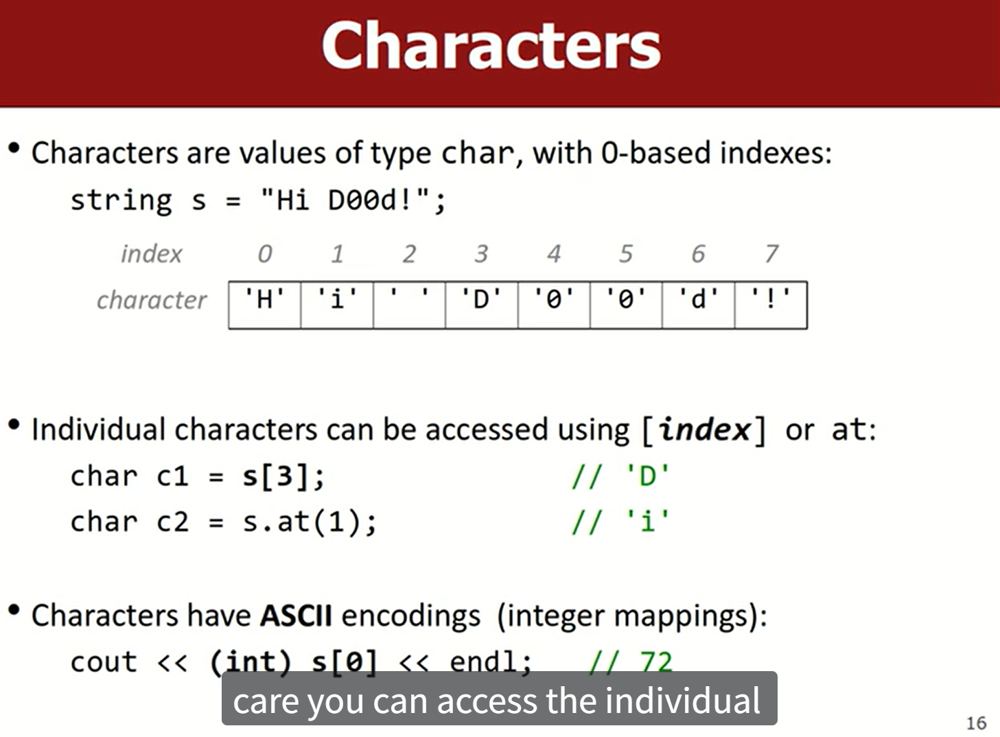
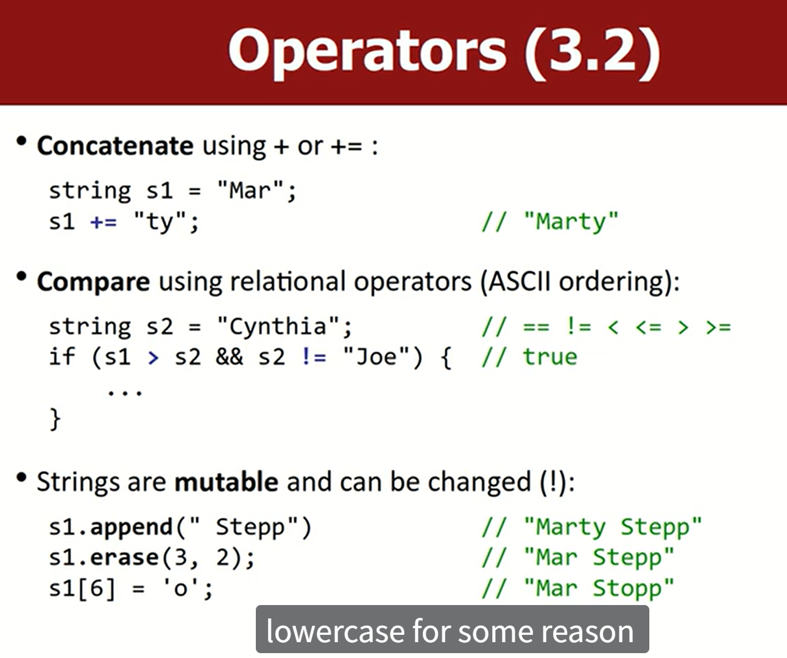
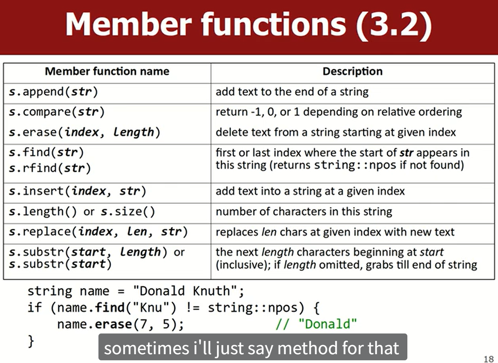
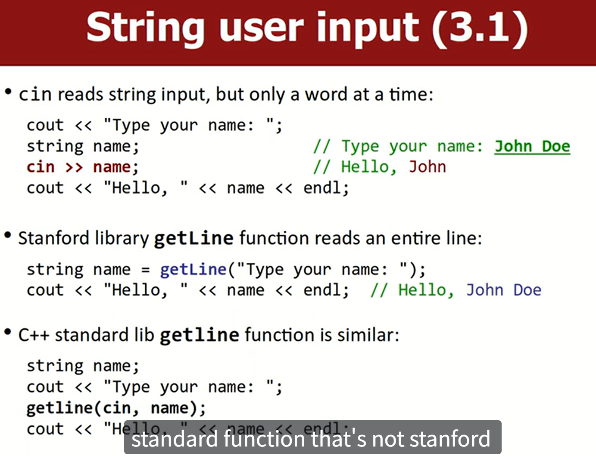
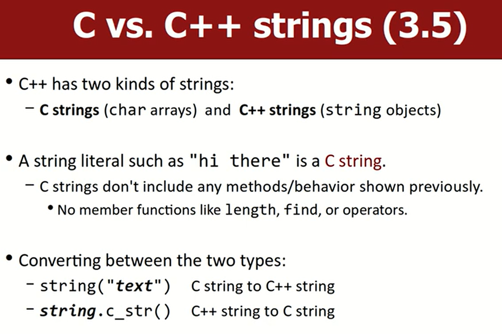
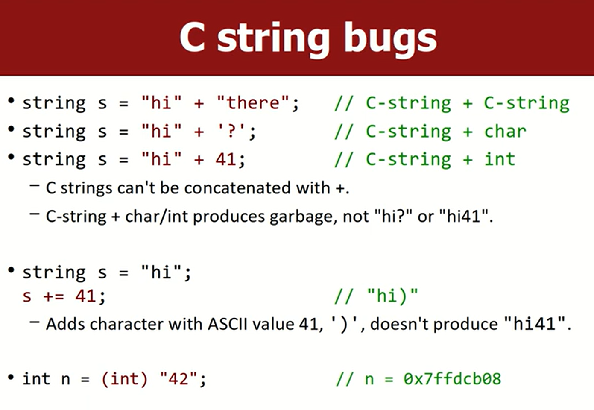
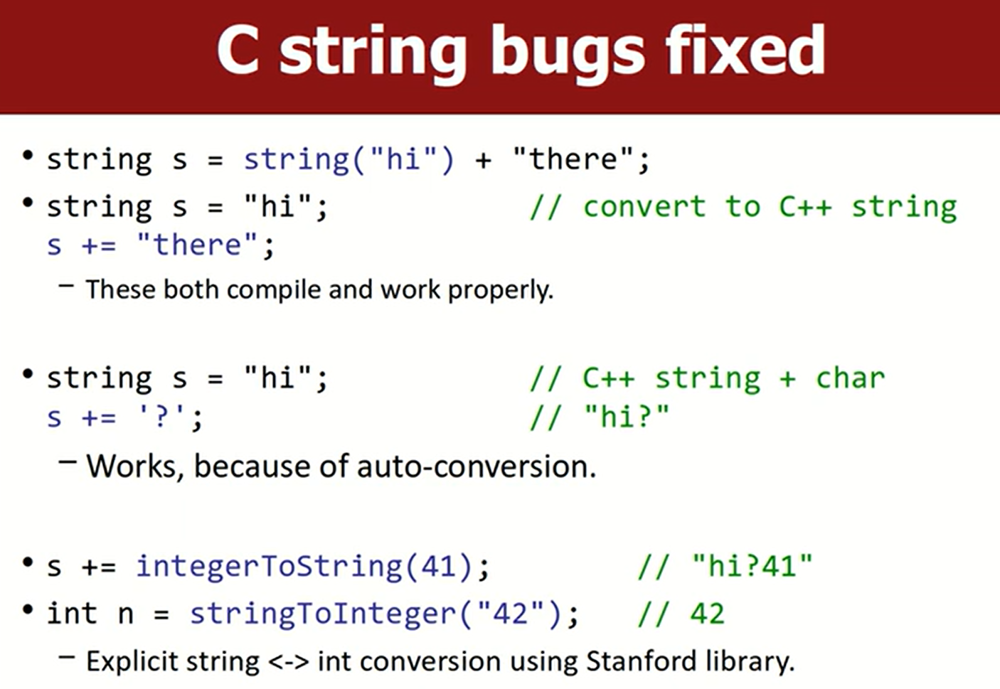

`include<sting>`
 

## Operators

cpp 可以直接修改字符串，不像 C 语言字符串是不可变的字符数组（修改的话会返回新的字符串）。

## Member Functions

`find` 和 `rfind` 如果没有找到，返回 `std::string::npos`，不是负值。

- `r` 代表 reverse，从后往前找。
- `find` 返回子串第一次出现的位置，`rfind` 返回子串最后一次出现的位置（也是第一个字符的 index）。

## Input

`cin` & `cout`，是一个对象，用于接收 / 给予标准输入输出流中的东西，`cout`返回值还是 `cout`，所以可以连续输出。`>>` & `<<`，给谁就指向谁

## Two Kinds of Strings

- `"hello"` 是 C 语言 string
- `string s = "hello";` 是 cpp 的 string，即将 C 语言字符串转换成 cpp string 对象

`int n = (int) 42` `n` 里面存的是地址！

用加法的话，只要有一个是 cpp string，结果就是 cpp string。