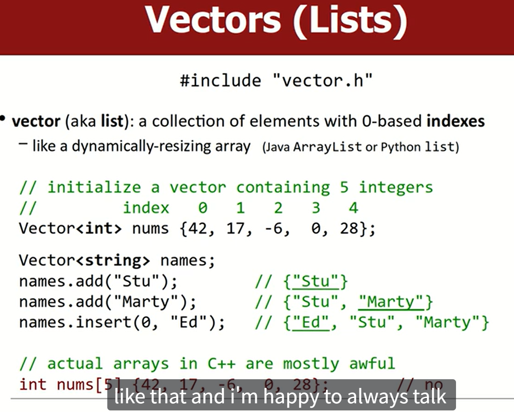
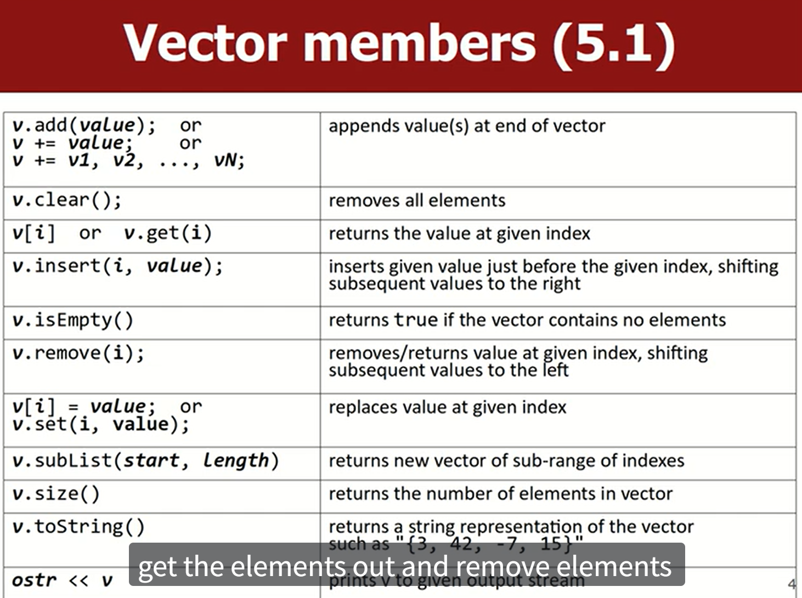
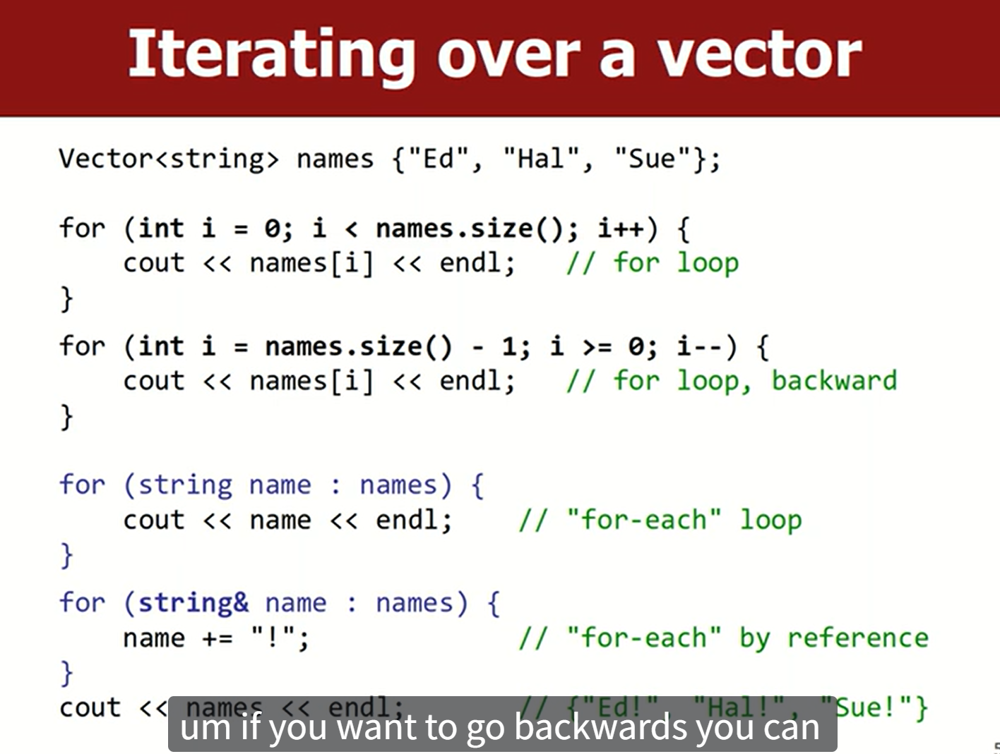
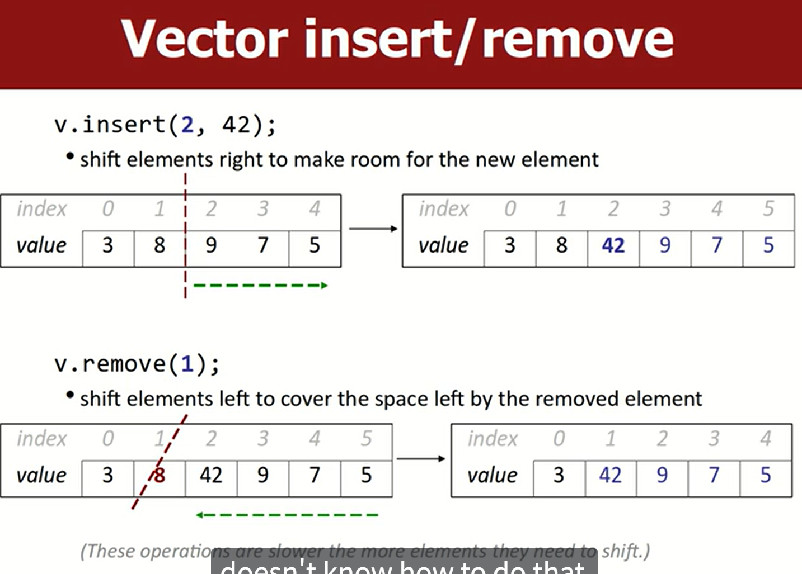
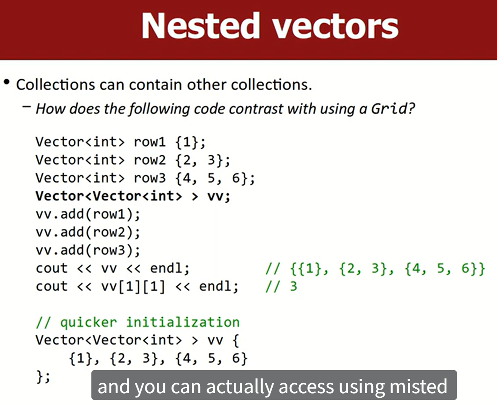
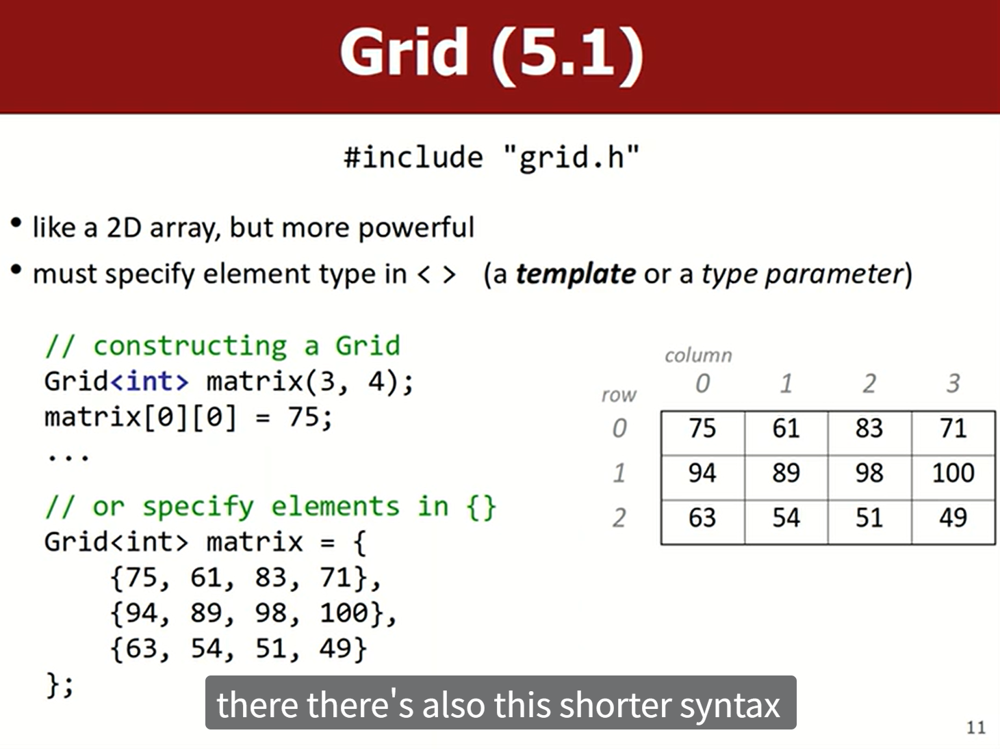
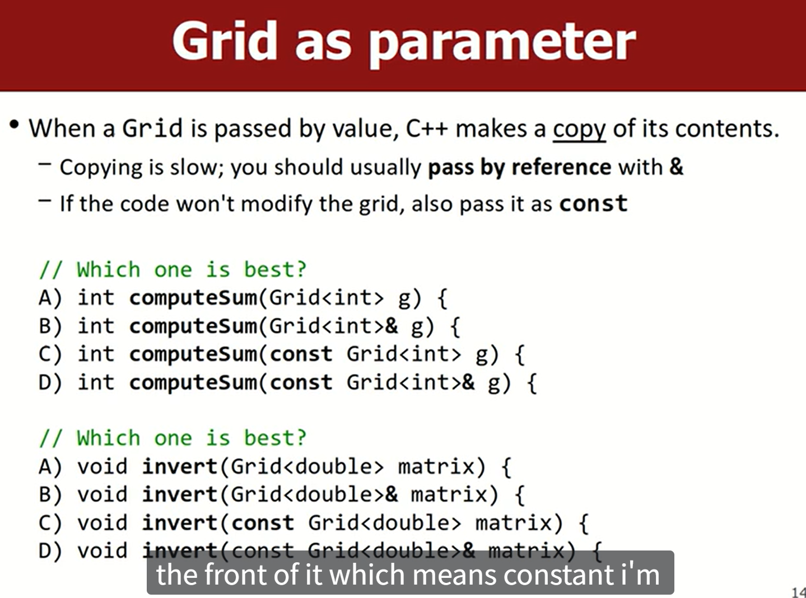

## Vector 

python 里的 list, java 里的 ArrayList(可变长度)。

`#include <vector>` or `#include "vector.h"` (Stanford C++ Library)



cpp里面确实有 `array` 例如 `int num[10]`,但是特别差, 不用

### Member Functions



### Iterators



后面两种迭代方法是 C++11 引入的，简化对容器（如数组、`std::vector`、`std::string` 等）中所有元素进行迭代的操作

形式:

```cpp
for (declaration : collection) {
    // 使用 declaration 访问 collection 中的每个元素
}
```

一般用引用来避免不必要的元素拷贝

一般用这个遍历方法来修改元素, 删除元素不行

cpp 的 `vector` 只能存一种类型的元素, 想存多种类型需要用 `pointer`。

### Insert and Remove



### Nested Vectors



用 grid 比 nested vector 更多.


## Grid（Stanford C++ Library）

`#include "grid.h"`




grid 都要用 reference 传参，因为 copy 一    个 grid 太耗时了。

可以用 `const` 防止修改 grid。