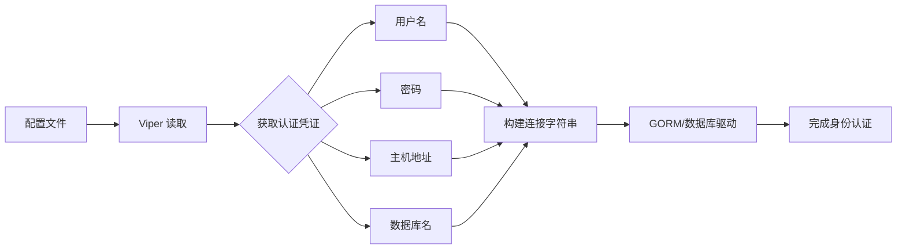

## viper

Viper 通过读取配置文件来实现数据库连接中的身份认证部分，流程如下。

```mermaid
graph LR
A[配置文件] --> B[Viper 读取]
B --> C{获取认证凭证}
C --> D[用户名]
C --> E[密码]
C --> F[主机地址]
C --> G[数据库名]
D & E & F & G --> H[构建连接字符串]
H --> I[GORM/数据库驱动]
I --> J[完成身份认证]
```