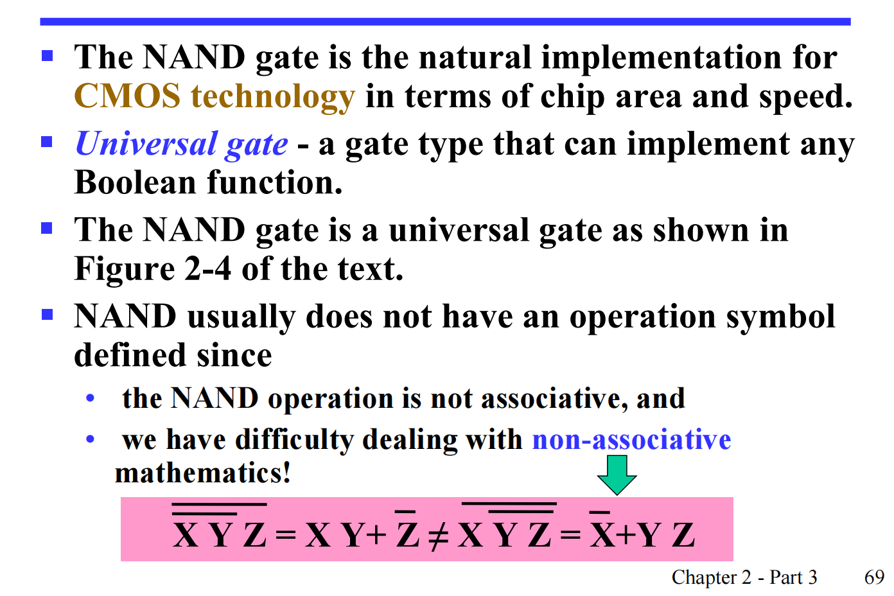
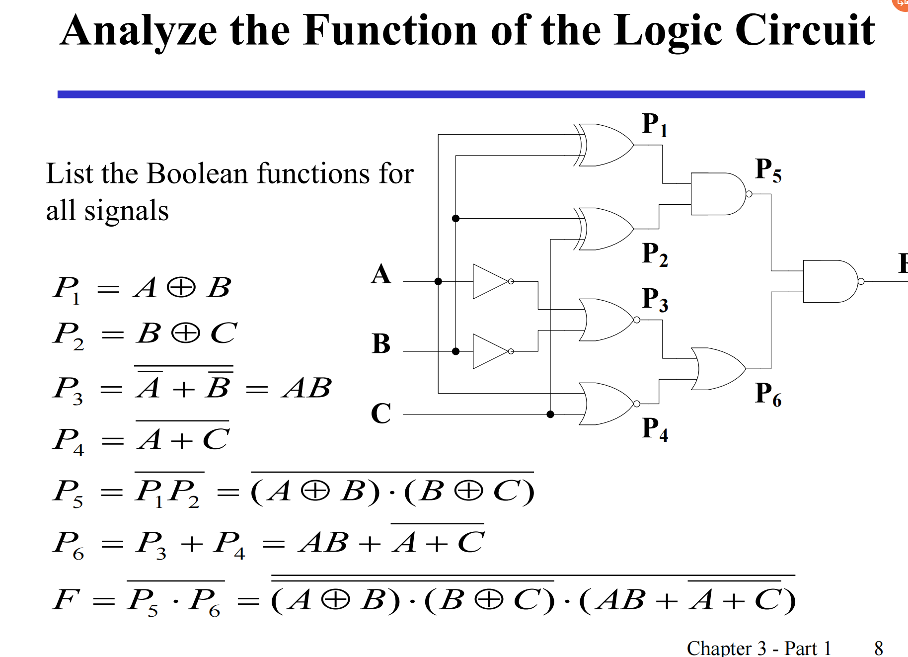
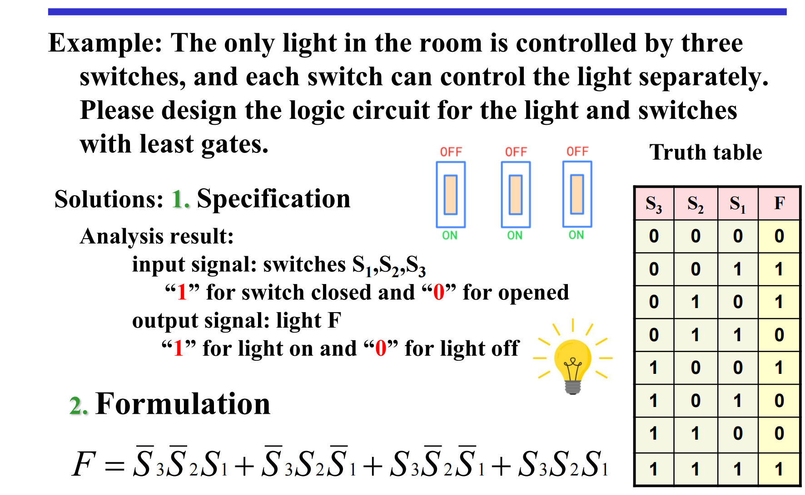
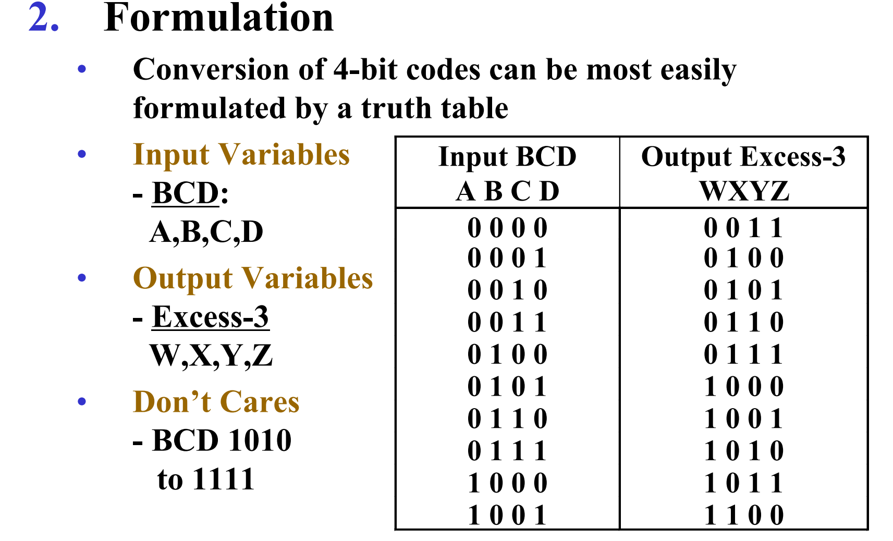
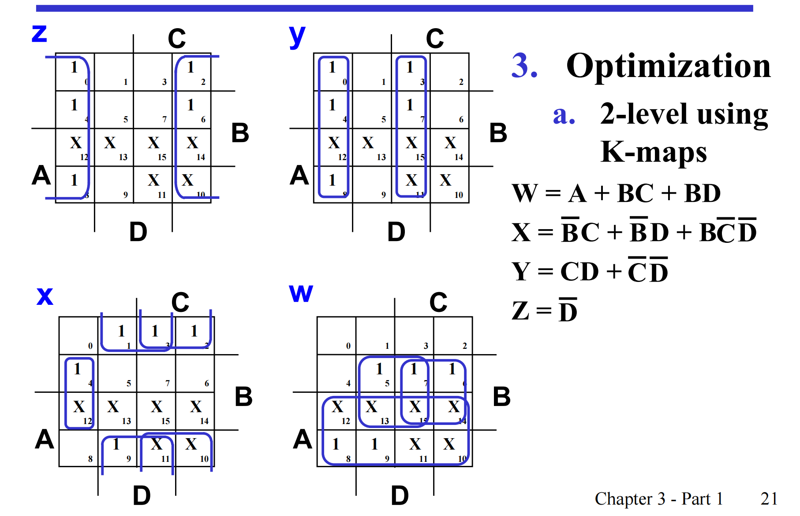

门

## 布尔变量

逻辑算子/逻辑操作

- and: multi乘
- or: and加
- not: '/~/$\above$

!!! info "用加号乘号原因"

    真值表（Truth table）结果相同

In boolean algebra, $1 + 1 = 1$, In algebra, $1 + 1 = 2$, 做题中要区分

机械开关relay —— 真空电磁管vacuum tube —— 三极管transistor

门，就是数学的函数

- and D
- or 弯的
- not 小圆圈表示取反

输入输出关系：用波形图（分input和output）可视化电路功能，穷举输入（n维向量），观察输出

其他复合门

- 与非门：先与后bubble
- 或非门
- 异或：不相同结果为1，否则为0；为1的条件比“或”更苛刻
- 同或：与异或相反，相同为1；价值是判断两个变量是否恒等

通用门：与非、或非

- 定义：功能完备，用其可以表示其他所有门，即可以表示与或非即可因为与或非可以表示所有

!!! info "即全功能连接词"

    

与非的代数特性不好，故无法做优化

一般逻辑是：先与或非，再代数变换做优化，再换成与非/或非

## 门延时

门延时会造成开关错误，成为“冒险”，可复现性差

在四种表示方法中，真值表和波形图不变，因其只看结果；表达式可以进行变换，相应的，电路也可变，因其表示内部实现过程

## 布尔代数

$$X + YZ = (X + Y)(X + Z)很重要$$

德摩根定律：与和或互换

优先级：括号parentheses —— not —— and（乘） —— or（加）

### 对偶定理

对偶变换：interchange  AND and OR, interchange 0 and 1, variables remain unchanged, 再添加括号维持 **运算顺序不变**！

自对偶，i.e.，dual = origin

吸收率

应用：一个等式推出另一个等式

### 换元法

讲左边右边所有某东西换成另外的东西

### 互补定理

应用：用互补定理逆定理证明德摩根，即欲证 $\overline{A + B} = \overline{A}×\overline{B}$ ，即证$A + B$ 和 $\overline{A}×\overline{B}$ 互反

### 表达式取反（反函数）

规则

- 交换与或
- 变量取反
- 0/1互换
- 运算顺序一致

方法二：德摩根

$$\overline{A + B} = \overline{A}×\overline{B}$$
$$\overline{AB} = \overline{A}+\overline{B}$$

- 记忆德摩根：break the line, change the sign
- 方法：上面直接加拔，用德摩根化简，里面是多个也可德摩根

### 应用

- 电路设计与评估，即算真值表
- 证明
- 化简

**一致性定律**：常考！

记忆：有一对取反的变量，分别与不同的两个

$AB和\overline{A}C各吸收一半BC$

应用：反向用，先补一个冗余项，用它干别的事

化简例题

法二：第一步反用consensus，补一项 $A\overline{B}$

Canonical form 规范形式

退到规范型（与真值表对应），用最小化定理实现优化

从真值表推表达式：看着表达式真值，**把1的情况或在一起（最小项之和）/把0的情况与在一起（最大项之积）**

最大/小项：每个都项包含所有变量，自己or反变量，每个都对应一组输入

最小项：对每一个最小项，有且仅有一组输入使得其值为1，也就是对应真值表中一行：这个变量是原变量：取1；是反变量：取0，使得最小项为1

对于n个变量的真值表，有 $2^n$ 个最小项

最小项的表示：小写m，角标为输入的二进制对应的十进制

最大项

- 中间或
- 每个最大项：仅有一组输入使其为0，变量是原变量则取0，反变量则取1
- 和下标对应的那组输入使得其为0
- 每个都为1
- 大写M

写法

- 字母升序
- 

输入/对应的索引（下标） 和 对应的最大项/最小项（双向转换）：见上面1/0与原/反变量对应关系 + 十进制/二进制转换

##### 相同索引（输入）的最小项。最大项关系

二者为反函数：用德摩根/真值表

$$M_i \quad is \quad the \quad complement \quad of \quad m_i$$

#### 用最小项/最大项表示真值表

- 找到所有1的，最小项之和
- 找到所有0的，最大项之积

最小项之和理解："isAvailable"

#### 将

**补成最小项**

victorywang712 noughq

- 缺啥补啥：相对于包含所有变量，缺什么；补的东西，是乘缺的东西的互补定理（原和反的或）
- 乘开，全都是最小项，重复的消去

补成最大项

- 用分配律变积
- 补缺项：用 $0 = z × \~z$

**求反函数**

14：30

**最小项之和/最大项之积转换**

- 缺的式子，用另一个

两个表示的关系：不是对偶不是取反，没有关系

**对应的电路**

两层输入结构：最小项之和先与后或，最大项之积先或后与

标准型 Standard form

- SOP：积之和 —— 最小项之和

- POS：和之积 —— 最大项之积

    - 区别：每一项不需要所有变量完备

    - 相同点：积/和的形式

从canonical form 化简成standard form 简单

- 定理：最小化定理

- 方法：找两个仅差一个项不同的两个项，两个合起来；再用一些结合律

