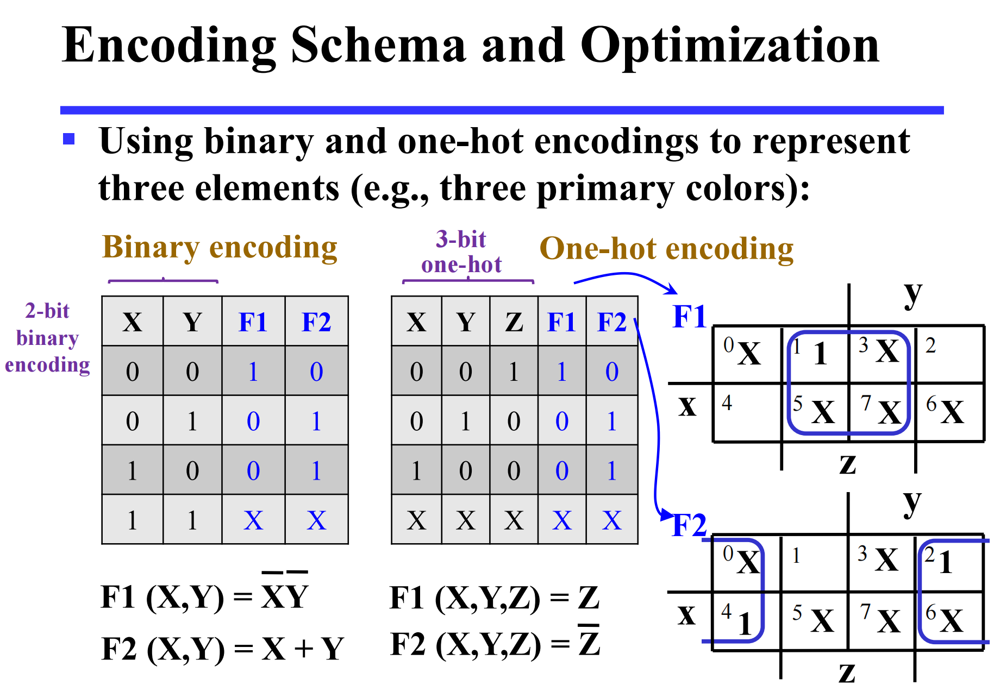
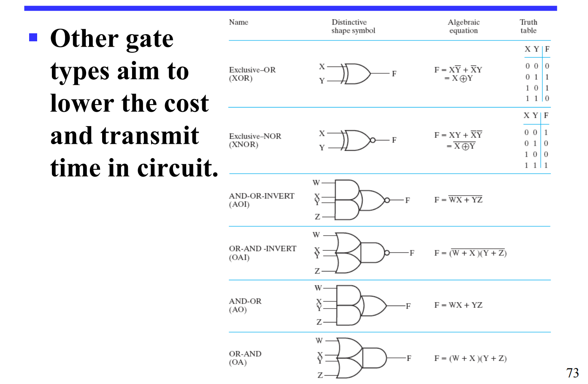
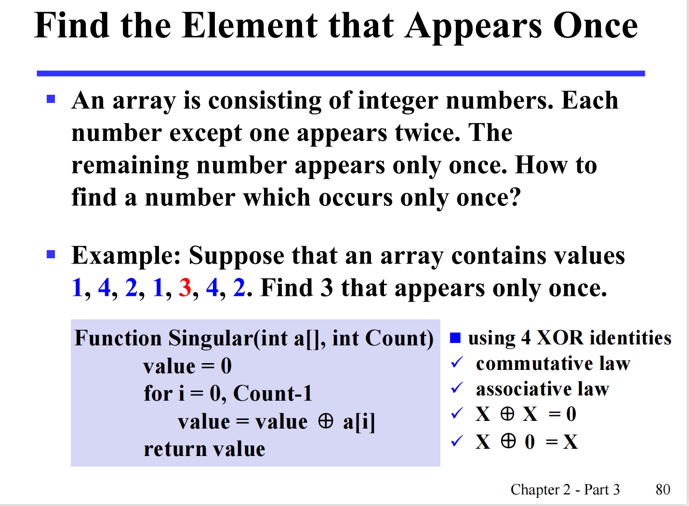
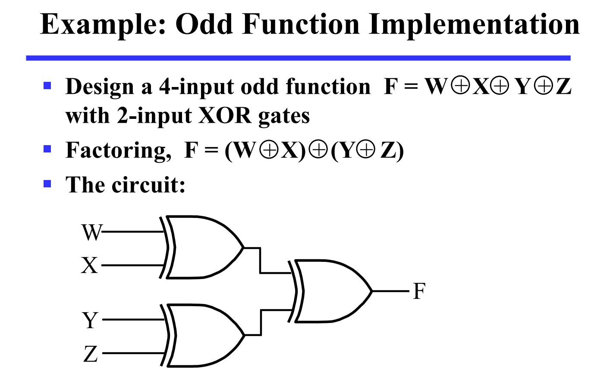
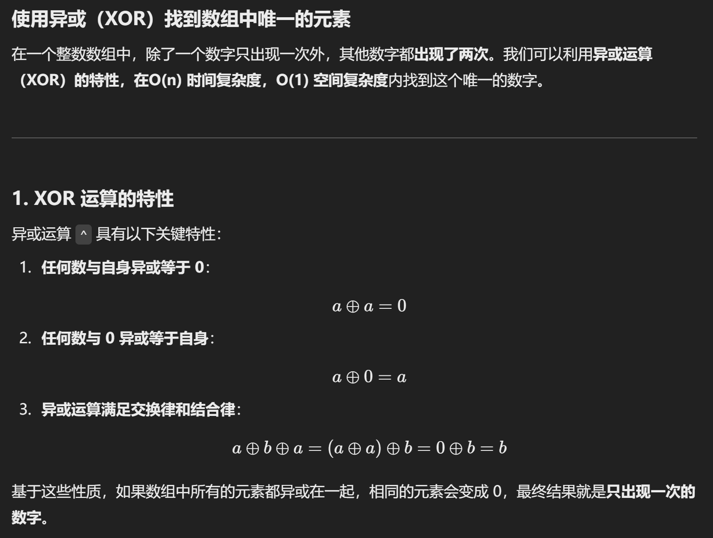
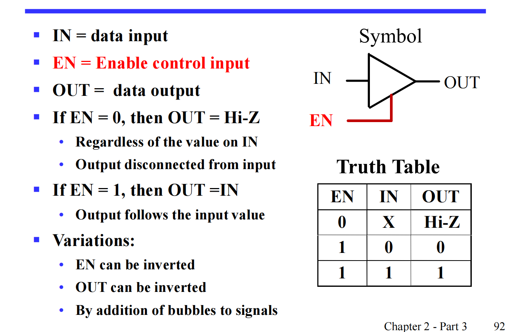
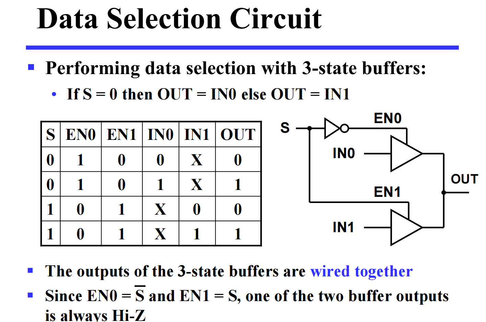

## 布尔表达式的代价

### 文字代价L

数出现的变量个数，肯定不行的

问题：只数了第一层

### 门输入代价G/GN

- G：除了非门之外所有门的输入个数

- GN：包含非门，所有门输入个数

**给表达式判断门输入代价**

先数出文字代价，再按计算顺序数出来所有的项，每一个项都加1

> 每一个计算项都有一个输出，做下一层的计算（输入）

G = 10

## 优化

### 卡诺图 K-Map

从到SOP/POS方法：将仅有一个变量差异的两个最小项/最大项用最小化定理合起来约简

目标：将二者在空间上靠近

方法：一维真值表变n维卡诺图

特点：**相邻**两个最小项的编码/索引**只一位不同**：应用格雷码

周围也有1，成square

有1的地方，**框包含 $2^n$ 个相邻的含1的格子的矩形**，一个格子可以用两次（代数表达式：重复加一项不影响结果）

最小项之和 —— SOP   
最大项之积 —— POS

相邻/含1的框出，读取几个格子中不变的变量：每个变量都看，看哪个没变，没变的都写出

三维：$yz$ 用格雷码的顺序排，每个格子对应的索引都要填对！不是连续的

- 这是第二种画图方法，一样的：只填1 不用填0，非变量也可以不写

框 $2^n$ 的原因：其他都一样，$2^n$ 的可以合并成1，例如 $xy + x~y + ~xy + ~x~y$

三维及以上：空间折叠

框的方法：

- 贪心法：尽可能多（否则得人工优化）
- 都圈出，可以重复的啊

例题：

有优化选项的项不可以再圈：不再圈3和7

#### 四维变量

排布方法：x y方向各放两个变量

空间折叠：

注意！这对吗

??? success ""

    这不对！

    中间四个已经各自有优化方法了

#### 五维及以上

[b站](https://www.bilibili.com/video/BV1Nq4y1k71R?spm_id_from=333.337.search-card.all.click)

自由项：并非所有项都会在输入中发生，实际上填入X，但是我们可以尽可能规定他为1（最小项）/0（最大项）进行优化

$\sum d$ : 就是自由项

注意题目要求：POS/SOP

如果要POS：

- 法一：先取反函数，可以在原式上直接取反函（除了 $\sum d$ 和 $\sum _m$ 的）

- 法二：直接用最大项，圈0，X尽可能看成0，读不变的变量时候反一下

例题

不同编码方式对输入输出复杂度的影响

蕴含项 —— 主🐖蕴含项（所有的框，贪心法） —— 基本主蕴含项（包含别人没有的最小项的框） 

算法：先合并基本主蕴含项，剩下的再合并最大的(要做最小覆盖)主蕴含项

唯一包含x的不算

### 继续人工优化

从POS/SOP做成多层电路：提公因式

结果：门输入代价可能上升可能下降

## 其他门

### NAND：与非门

逻辑上 == 先非后或

缺陷：没有结合律，优化机会小

### NOR：或非门

### 其他

#### 异或/同或

多维：奇函数/偶函数

多个变量异或 == 奇函数，多个变量同或 == 偶函数

奇数个变量为1则结果为1

构造奇函数利用异或的结合律构造电路

用处：奇函数做偶校验，偶函数做奇校验

### Buffer 缓冲门

提高电平，由于1入多

### 3-State Buffer 三态门

用于多入1，不能硬连接，每一个输出线连一个三态门

但是电路有延时，出现同时导通的瞬间

### 复杂门

名称：

- A
- O
- I
- A、O、I的顺序按电路逻辑操作顺序