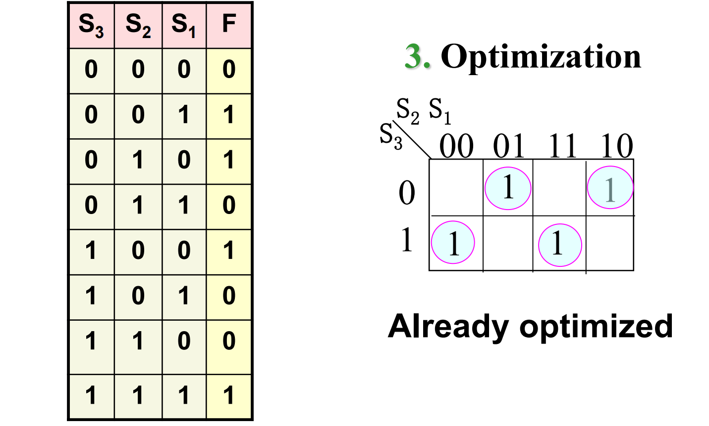
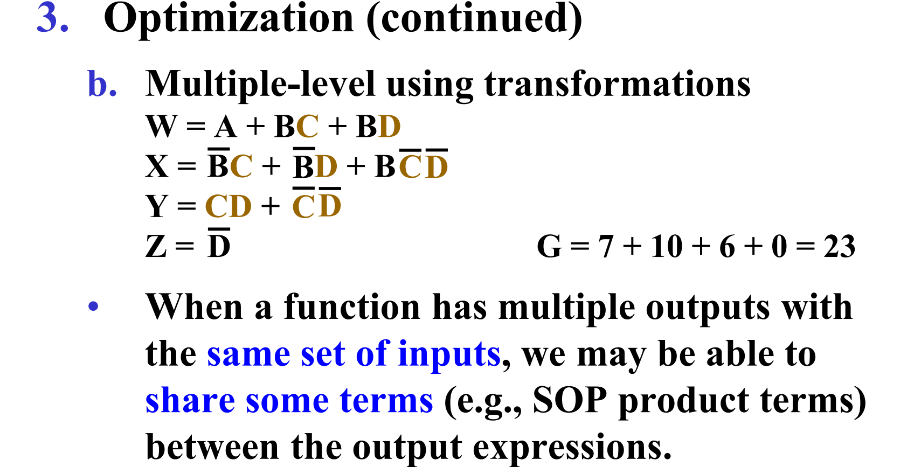
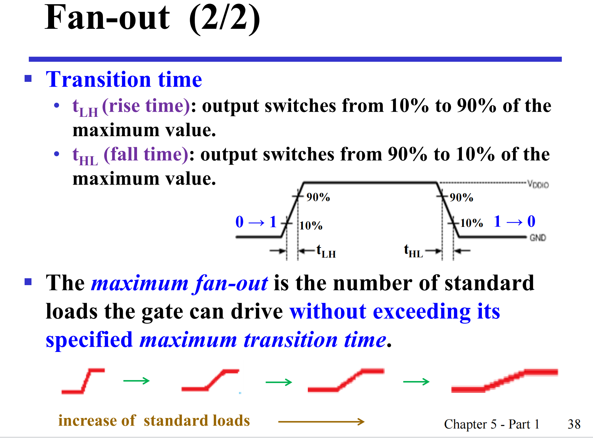

组合电路

定义：m个输入n个输出，输出仅由输入决定

有n个表达式，m个输入分别控制输出

## 组合电路分析


**方法**

1. 分层

    - 非不算

2. 分层写表达式

    - 分层标注节点，写“过程式”
    - 认电路符号

3. 展开化简

    - 异或按照定义变与或非
    - 化简
4. 画真值表
5. 推出功能


## 组合电路设计


**方法**


**示例**


- 设计真值表：考虑需求 / 定义的值 0/1 的含义
- 根据真值表写最小项之和



（奇函数天然优化）


```verilog
module lamp_control(s1,s2,s3,F );
input s1,s2,s3;
output F;
wire s1,s2,s3,f;

assign F= (~s3&~s2&s1) | (~s3&s2&~s1) | (s3&~s2&~s1) | (s3&s2&s1) ;
endmodule
``` 

**示例2**

表 1 其实就是真值表，用上自由项

W X Y Z 分别有几个 1 ，对应 ABCD 分别是什么


卡诺图优化

联合优化：四个合起来看，提取公因式




输入多：分层

eg：9输入分成 3 * 3 再加一个合并的第四个


## 技术参数


fan-in：栅入参数 input个数

fan-out：能带几个负载

### fan-in

每个门上面有压降，不是0电阻

fan-in 是 ：输出为正确的情况下最多的input个数，（最大识别为1的电压 - 最小的） / 每处压降


### fan-out

标准负载：1输入1输出的非门

看的是带几个标准负载，不同负载与标准负载成倍数

转换时间 $t_{LH} $ 和 $t_{HL}$，想变到最后变化之间的时间

从0到1，给电容式负载充电，负载多充电能力下降，电平转换时间延长，电路要求工作速度，最大电平转换时间对应的是fan-out



### propagation delay 传播延迟时间

定义：输入端变化到输出端变化之间的延迟时间 $t_{PHL}$ $t_{PLH}$，端到端时间差

- **别和转换时间混掉**

计算：

- 控制变量法：将其他输入都开绿灯
    - 那么与非门变成一个非门，因为另一路输入规定 = 1
- 聪输出一个一个往前推，找
- 最后每个加和

有时取 $t_{PHL}$ 和 $t_{PLH}$ 的最大值/平均值作为每个门的传播延迟时间

读波形图：取中点时间差


#### transport delay 传输延时 

将无延时的波形图后移传输延时时间

#### inertial delay 阻尼延时

电容会滤波，小的毛刺信号会被吸收，例如拒绝时间 = 5ns，小于他则无法传输

以上是两种传播延时的模型

#### 实际计算

传输延时 + 标准负载数 * SL

## 基本功能模块

### 使能

相当于开关


- 与使能
- 或使能

三态门使能与其不同，那个disabe之后输出是高阻状态

### decoder 解码器 / 译码器

- 输入；编码压缩信号，连续的
- 输出：离散信号，用于控制

少输入多输出

要求：输入 < 输出


!

m输入n输出的译码器：m个非门和n个m输入的与门，但是m大之后与门的fan-in太大

优化：


递归分解的思想，类似归并排序

#### 三八译码器

法一：


法二：


多层电路

- 好处：输入被复用，门输入代价低
- 坏处：传输延迟时间大

再加一个使能信号，一般用与使能


如果将使能信号看作输入，将 a/b 看成通道选择，变成信号分离器

功能是将 a/b 的输入分离开在不同端输出

用两个24译码器也可以组成38译码器：自底向上设计

高位作为使能信号


#### 用途

实现任何函数：对应的最小项最后或起来


七段数码管：原理是每一个输出管理一个发光二极管，两种接法（共阳极/共阴极），亮/不亮给的电平不一样


### encoder 编码器

多输入少输出

结果读取：

### 多路选择器

### 信号分配器
