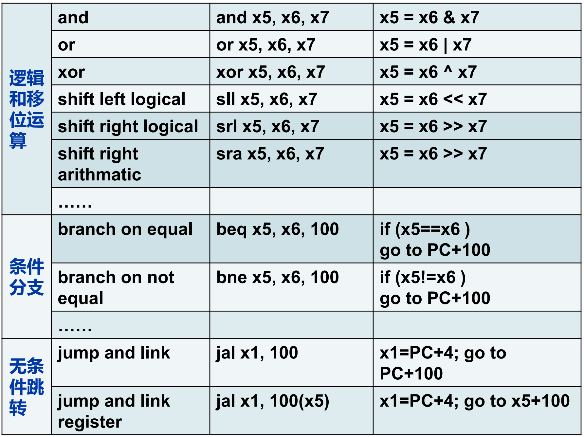
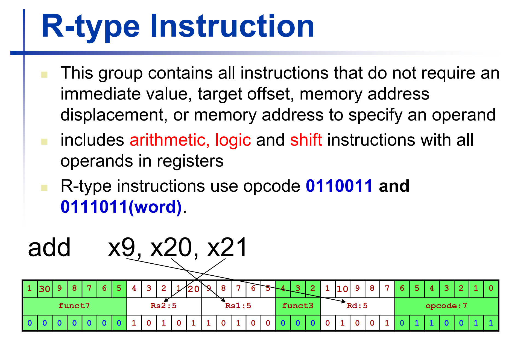
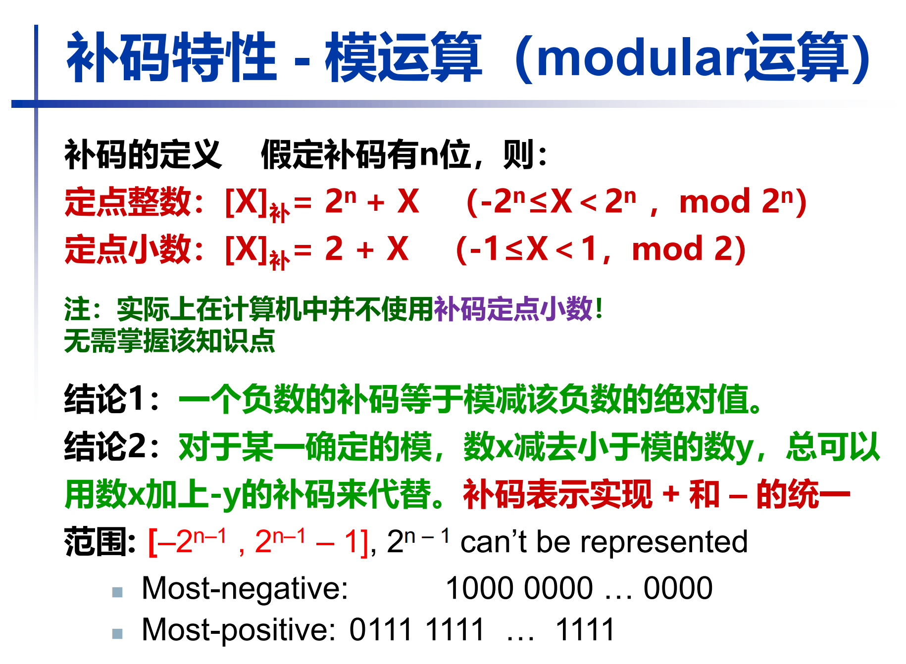

## 基本概念
汇编语言就是一套指令集，不同 CPU 都不一样

指令集两个流派：CISC（复杂指令集）和 RISC（精简指令集）

存储程序思想：将程序和数据都存放在内存中，CPU 通过指令来访问和操作这些数据。

### RISC-V Instruction Set

RISC-V 是什么？

是一种 **开放的 CPU 指令集架构（ISA, Instruction Set Architecture）**。

> 💡 “指令集架构”就像是定义 CPU 能理解的“语言”和“规则”。

所以：

* Intel 的 x86、AMD64 是一种架构
* ARM 是一种架构
* **RISC-V 也是一种架构**

不同厂商（如 SiFive、阿里平头哥、华为、NVIDIA 等）可以根据 **RISC-V 架构规范** 自行设计 CPU，只要遵守它定义的指令集格式。


ISA：指令集体系结构

[RISC-V Foundation](https://riscv.org/)

[RISC-V 指令集手册](https://riscv.org/wp-content/uploads/2017/05/riscv-spec-v2.2.pdf)

学习时候可以下载模拟器运行，因为自己的电脑是 x86 架构的

## 寄存器 (register)

寄存器是 **CPU 内部** 的高速存储单元，用于临时存储数据和指令。

RISC-V 有 32 个通用寄存器（x0 - x31），每个寄存器 **32 位**（4 字节）。自然的，占的空间越小，速度越快。

| 寄存器别名     | 对应寄存器编号     | 寄存器用途           |
| --------- | ----------- | --------------- |
| `$zero`   | `x0`        | 常量 0，始终为 0      |
| `$at`     | `x1`        | 汇编器临时寄存器        |
| `$v0`-`$v1` | `x10`-`x11` | 返回值寄存器（函数返回值）   |
| `$a0`-`$a3` | `x10`-`x13` | 参数寄存器（函数参数）     |
| `$t0`-`$t7` | `x5`-`x12`  | 临时寄存器（调用者不保留）   |
| `$s0`-`$s7` | `x8`-`x15`  | 保存寄存器（调用者保留）    |
| `$t8`-`$t9` | `x16`-`x17` | 临时寄存器（调用者不保留）   |
| `$k0`-`$k1` | `x28`-`x29` | 内核模式寄存器（操作系统使用） |
| `$gp`     | `x3`        | 全局指针            |
| `$sp`     | `x2`        | 栈指针             |
| `$fp`     | `x8`        | 帧指针（也可以用 `$s0`） |
| `$ra`     | `x1`        | 返回地址寄存器         |


使用的时候要有良好的习惯，因为汇编可以操作最底层的东西，破坏力大。


## 指令

特点：指令做的事情少（比高级语言少）


从寄存器拿出来数，给到加法器，结果放回寄存器

add immediate: 立即数加：立即数是有固定位数的，不能太大

数据传送的原因：不能对内存里的数直接操作，只能是寄存器中的数或者立即数，如果对内存的数操作的话，得先把内存的数加载（load）到寄存器中，操作完之后再放回内存去（store）



### 指令格式

RISC-V 指令长度固定为 32 位，分为以下几种格式：

- R 型（寄存器类型）：用于算术和逻辑运算
- I 型（立即数类型）：用于加载、存储和算术运算
- S 型（存储类型）：用于存储数据到内存
- B 型（分支类型）：用于条件跳转
- U 型（上位立即数类型）：用于加载高位立即数
- J 型（跳转类型）：用于无条件跳转

## 算术操作

约定：汇编语言一行只写一条指令，后面可以用 `#` 注释

```assembly
add a, b, c # a gets b + c
```

!!! info "软件设计的规则"

    Simplicity favors regularity

    - regular makes implementation easier
    - simplicity makes it cost less to design, verify, and maintain

Example:

```c
f = (g + h) - (i + j);
```

```assembly
add t0, g, h   # temp t0 = g + h
add t1, i, j   # temp t1 = i + j
sub f, t0, t1  # f = t0 - t1
```

数据传送：如果寄存器不够用了，就得先把寄存器的数存到内存里（store），等用的时候再从内存里加载（load）到寄存器

!!! success "像机器一样思考"

    用会编写代码的时候，用机器一样的方式思考

    - 在内存还是寄存器
    - 在内存的什么位置

## R-type Instruction



R 型指令：只需要寄存器，没有包括内存 / 立即数 / 偏移

R 型指令的机器码中：

- 操作码：头上的7位，0000000
- 功能码：尾上的7位，用来区分具体哪个操作

!!! info "R-type Instruction 对应的机器码详解"

    **⚙️ 三、以 R-type（寄存器操作类）为例**

    典型指令：

    ```asm
    add x10, x11, x12
    ```

    机器码结构如下：

    ```
    | funct7 | rs2 | rs1 | funct3 | rd | opcode |
    | 7 bits | 5 b | 5 b | 3 bits | 5 b | 7 bits |
    |31..25  |24..20|19..15|14..12 |11..7|6..0  |
    ```

    ---

    **🔍 各字段含义：**

    | 字段         | 位宽  | 含义                   | 举例（add）                           |
    | ---------- | --- | -------------------- | --------------------------------- |
    | **opcode** | 7 位 | 指明这是哪一类指令（算术/跳转/加载等） | `0110011`                         |
    | **rd**     | 5 位 | 目标寄存器编号（结果写入哪）       | x10 = `01010`                     |
    | **funct3** | 3 位 | 功能码：细分同类操作           | `000` 表示 add/sub                  |
    | **rs1**    | 5 位 | 源寄存器 1 编号            | x11 = `01011`                     |
    | **rs2**    | 5 位 | 源寄存器 2 编号            | x12 = `01100`                     |
    | **funct7** | 7 位 | 功能码：再细分 add/sub      | `0000000` 表示 add，`0100000` 表示 sub |

    ---

    **✅ 举例：`add x10, x11, x12`**

    | 字段     | 二进制       | 说明            |
    | ------ | --------- | ------------- |
    | funct7 | `0000000` | 表示加法          |
    | rs2    | `01100`   | x12           |
    | rs1    | `01011`   | x11           |
    | funct3 | `000`     | 同类操作（add/sub） |
    | rd     | `01010`   | x10           |
    | opcode | `0110011` | R-type 算术类    |

    最终拼起来：

    ```
    0000000 01100 01011 000 01010 0110011
    ```

    这是 32 位机器码（二进制）：

    ```
    0000000_01100_01011_000_01010_0110011
    ```

    转换为十六进制就是：

    ```
    0x00C58533
    ```

!!! info "其他类型指令对应的机器码"


    **⚙️ 二、六种基本格式的 32 位分配对比**

    | 类型         | 结构          | 用途        | 有哪些字段   |                       |           |                           |              |                  |             |         |
    | ---------- | ----------- | --------- | ------- | --------------------- | --------- | ------------------------- | ------------ | ---------------- | ----------- | ------- |
    | **R-type** | `funct7     | rs2       | rs1     | funct3                | rd        | opcode`                   | 寄存器对寄存器运算    | 3个寄存器 + 2个功能码    |             |         |
    | **I-type** | `imm[11:0]  | rs1       | funct3  | rd                    | opcode`   | 寄存器 + 立即数（如 `addi`, `lw`） | 1个寄存器 + 立即数  |                  |             |         |
    | **S-type** | `imm[11:5]  | rs2       | rs1     | funct3                | imm[4:0]  | opcode`                   | 存储指令（`sw`）   | 2个寄存器 + 立即数（分两段） |             |         |
    | **B-type** | `imm[12]    | imm[10:5] | rs2     | rs1                   | funct3    | imm[4:1]                  | imm[11]      | opcode`          | 条件分支（`beq`） | 立即数跨段编码 |
    | **U-type** | `imm[31:12] | rd        | opcode` | 高位立即数（`lui`, `auipc`） | 大立即数（20位） |                           |              |                  |             |         |
    | **J-type** | `imm[20]    | imm[10:1] | imm[11] | imm[19:12]            | rd        | opcode`                   | 无条件跳转（`jal`） | 跳转偏移立即数          |             |         |

    ---

    **🔍 三、详细举例对比**

    *🟦 1. R-type（寄存器运算）*

    ```asm
    add x5, x6, x7
    ```

    ```
    | funct7 | rs2 | rs1 | funct3 | rd | opcode |
    | 7 b | 5 b | 5 b | 3 b | 5 b | 7 b |
    | 0000000 | 00111 | 00110 | 000 | 00101 | 0110011 |
    ```

    ➡️ 三个寄存器，无立即数。

    ---

    *🟨 2. I-type（立即数/加载类）*

    ```asm
    addi x5, x6, 10
    ```

    ```
    | imm[11:0] | rs1 | funct3 | rd | opcode |
    | 12 b | 5 b | 3 b | 5 b | 7 b |
    | 000000001010 | 00110 | 000 | 00101 | 0010011 |
    ```

    ➡️ 一个寄存器 + 一个立即数（12位）。

    ---

    *🟩 3. S-type（存储）*

    ```asm
    sw x5, 8(x6)
    ```

    ```
    | imm[11:5] | rs2 | rs1 | funct3 | imm[4:0] | opcode |
    | 7 b | 5 b | 5 b | 3 b | 5 b | 7 b |
    | 0000000 | 00101 | 00110 | 010 | 01000 | 0100011 |
    ```

    ➡️ 两个寄存器 + 分段的立即数（因为要拼偏移）。

    ---

    *🟥 4. B-type（条件分支）*

    ```asm
    beq x5, x6, offset
    ```

    ```
    | imm[12] | imm[10:5] | rs2 | rs1 | funct3 | imm[4:1] | imm[11] | opcode |
    | 1 b | 6 b | 5 b | 5 b | 3 b | 4 b | 1 b | 7 b |
    ```

    ➡️ 立即数分散编码（为了节省空间）。

    ---

    *🟧 5. U-type（高位立即数）*

    ```asm
    lui x5, 0x12345
    ```

    ```
    | imm[31:12] | rd | opcode |
    | 20 b | 5 b | 7 b |
    ```

    ➡️ 大立即数（高 20 位直接写入）。

    ---

    *🟪 6. J-type（跳转）*

    ```asm
    jal x1, offset
    ```

    ```
    | imm[20] | imm[10:1] | imm[11] | imm[19:12] | rd | opcode |
    | 1 b | 10 b | 1 b | 8 b | 5 b | 7 b |
    ```

    ➡️ 跳转偏移量（立即数）跨字段分布。


???- info "寄存器个数：RISC-V ISA 寄存器为什么只能有32个寄存器"


    RISC-V 的每条指令是 **32 位机器码**。
    以最常见的 **R-type（寄存器操作指令）** 为例：

    ```
    | funct7 | rs2 | rs1 | funct3 | rd | opcode |
    | 7 bits | 5 b | 5 b | 3 bits | 5b | 7 bits |
    | 31..25 |24..20|19..15|14..12 |11..7|6..0  |
    ```

    其中：

    * `rd` ：目标寄存器编号（5 位）
    * `rs1`：源寄存器 1 编号（5 位）
    * `rs2`：源寄存器 2 编号（5 位）

    👉 每个寄存器编号用 **5 位二进制表示**

    ---

    **5 位能表示多少个寄存器？**

    5 位二进制最多能表示 ( 2^5 = 32 ) 种组合。

    也就是寄存器编号从：

    ```
    00000 → 11111
    ```

    对应：

    ```
    x0 → x31
    ```

??? info- "寄存器位数"

    | 架构          | 每个寄存器宽度 | 名称       |
    | ----------- | ------- | -------- |
    | RV32I       | 32 位    | 32 位寄存器  |
    | RV64I       | 64 位    | 64 位寄存器  |
    | RV128I（实验中） | 128 位   | 128 位寄存器 |


汇编语言是用的助记符

机器码就是32位 / 64位的二进制

操作数类型

* 寄存器
* 立即数
* 内存地址：在 RISC-V 里面没有，因为是先把内存的数加载到寄存器里，再操作寄存器，但是在 x86 等 ISA 里面有

## Memory Operands

如果程序在内存里面放不下，则放到硬盘。内存和硬盘的数据交换的单位是 page（页），一般是 4KB，也有 8KB。内存和寄存器的数据交换就比较自由，可以 1Byte，也可以 0.5Byte

在内存中寻址的方法是通过 **地址** 找，按照字节寻址，内存中，**一个地址就是 1 Byte**

在内存中存储的时候，要求 对齐，原因是：

CPU 访问内存是按字（word）为单位读取的，一个“字”通常就是 4 字节（32 位）。例如对于 int 类型（4 字节），它的地址必须是 4 的倍数（0x0, 0x4, 0x8, ...）。如果不是的话，就横跨了两个 word，CPU 需要进行两次内存访问，效率低下。


### 内存地址

用基地址 + 偏移量（offset）来表示内存地址

- 偏移量是：数量 * 数据类型大小（占的字节数）

字节序：


RISC-V 是小端序，就是低位存在低地址，即从右往左写

内存操作示例：


偏移量写在外面，作为一个立即数

## Immediate Operands

立即数：直接写在指令里的数

`addi` 


### The Constant Zero

`x0` is the constant 0, which cannot be overwritten.

It is useful for: move between registers

```assembly
# move x5 to x6
add x6, x5, x0  # x6 = x5 + 0
```

## 数的表示

### 无符号数 Unsigned Binary Integers

Given a n-bit number, 

$$x = \sum_{i=0}^{n-1} b_i 2^i$$

where $b_i \in \{0, 1\}$

我们上课用的是 64 位 RISC-V 的表示方法

### 进制转化


小数：从小数点开始，往左找，往右找，对于16 / 8进制，都是 4 / 3 位一组，不够则在后面补0


导致了浮点数的不精确表示

简便方法：


### 有符号数

#### 补码表示法

最高位（Bit 63）决定正负：

Bit 63 is sign bit
- 1 for negative numbers
- 0 for non-negative numbers

在 n 位二进制中，$-x ≡ 2^n - x (mod 2^n)$

```
补码(-x) = 2^n - x
```

$2^n$ 实际上是高一位的1，被忽略了，所以加 $2^n$ 相当于没加，所以把负数加 $2^n$



其中，$n$ 是二进制位数

结论：负数的补码等于其绝对值的二进制，各位取反，再加一。

将32位数扩展为64位数的方法：

- 有符号数： sign extension，即在高位补符号位

    - 负数：高位补1
    - 正数：高位补0

- 无符号数： zero extension，即在高位补0


#### 原码表示法

用二进制表示数值的绝对值，符号位用来表示正负，正数符号位为0，负数符号位为1。

浮点数用的就是原码表示法。

缺点：

- 有两个0：+0 和 -0
- 运算复杂：加减法需要考虑符号位，增加了运算的复杂性。


#### 移码表示

将数值加上一个固定的偏移量（bias），使得所有数值都变为非负数，一般来说，n位二进制的偏移量为 $2^{n-1}$。

作用：可以简化比较，尤其是浮点数的比较。

