## 基本概念
汇编语言就是一套指令集，不同 CPU 都不一样

指令集两个流派：CISC（复杂指令集）和 RISC（精简指令集）

存储程序思想：将程序和数据都存放在内存中，CPU 通过指令来访问和操作这些数据。

### RISC-V Instruction Set

RISC-V 是什么？

是一种 **开放的 CPU 指令集架构（ISA, Instruction Set Architecture）**。

> 💡 “指令集架构”就像是定义 CPU 能理解的“语言”和“规则”。

所以：

* Intel 的 x86、AMD64 是一种架构
* ARM 是一种架构
* **RISC-V 也是一种架构**

不同厂商（如 SiFive、阿里平头哥、华为、NVIDIA 等）可以根据 **RISC-V 架构规范** 自行设计 CPU，只要遵守它定义的指令集格式。


ISA：指令集体系结构

[RISC-V Foundation](https://riscv.org/)

[RISC-V 指令集手册](https://riscv.org/wp-content/uploads/2017/05/riscv-spec-v2.2.pdf)

学习时候可以下载模拟器运行，因为自己的电脑是 x86 架构的

## 寄存器 (register)

寄存器是 **CPU 内部** 的高速存储单元，用于临时存储数据和指令。

RISC-V 有 32 个通用寄存器（x0 - x31），每个寄存器 **32 位**（4 字节）。自然的，占的空间越小，速度越快。

| 寄存器别名     | 对应寄存器编号     | 寄存器用途           |
| --------- | ----------- | --------------- |
| `$zero`   | `x0`        | 常量 0，始终为 0      |
| `$at`     | `x1`        | 汇编器临时寄存器        |
| `$v0`-`$v1` | `x10`-`x11` | 返回值寄存器（函数返回值）   |
| `$a0`-`$a3` | `x10`-`x13` | 参数寄存器（函数参数）     |
| `$t0`-`$t7` | `x5`-`x12`  | 临时寄存器（调用者不保留）   |
| `$s0`-`$s7` | `x8`-`x15`  | 保存寄存器（调用者保留）    |
| `$t8`-`$t9` | `x16`-`x17` | 临时寄存器（调用者不保留）   |
| `$k0`-`$k1` | `x28`-`x29` | 内核模式寄存器（操作系统使用） |
| `$gp`     | `x3`        | 全局指针            |
| `$sp`     | `x2`        | 栈指针             |
| `$fp`     | `x8`        | 帧指针（也可以用 `$s0`） |
| `$ra`     | `x1`        | 返回地址寄存器         |


使用的时候要有良好的习惯，因为汇编可以操作最底层的东西，破坏力大。


## 指令

特点：指令做的事情少（比高级语言少）

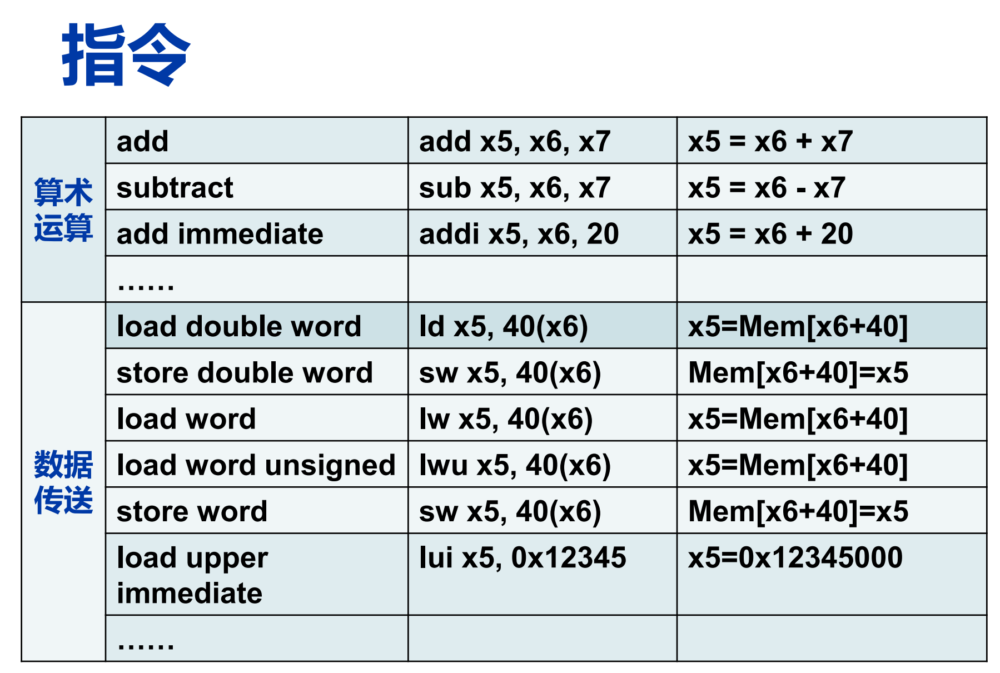

从寄存器拿出来数，给到加法器，结果放回寄存器

add immediate: 立即数加：立即数是有固定位数的，不能太大

数据传送的原因：不能对内存里的数直接操作，只能是寄存器中的数或者立即数，如果对内存的数操作的话，得先把内存的数加载（load）到寄存器中，操作完之后再放回内存去（store）

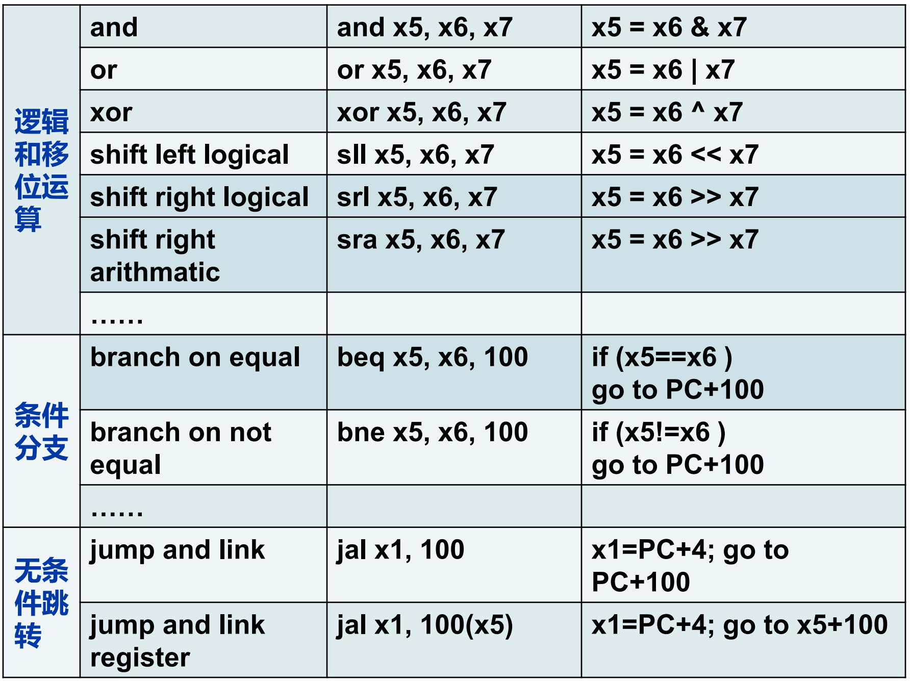

### 指令格式

RISC-V 指令长度固定为 32 位，分为以下几种格式：

- R 型（寄存器类型）：用于算术和逻辑运算
- I 型（立即数类型）：用于加载、存储和算术运算
- S 型（存储类型）：用于存储数据到内存
- B 型（分支类型）：用于条件跳转
- U 型（上位立即数类型）：用于加载高位立即数
- J 型（跳转类型）：用于无条件跳转

## Arithmetic Operations

约定：汇编语言一行只写一条指令，后面可以用 `#` 注释

```assembly
add a, b, c # a gets b + c
```

!!! info "软件设计的规则"

    Simplicity favors regularity

    - regular makes implementation easier
    - simplicity makes it cost less to design, verify, and maintain

Example:

```c
f = (g + h) - (i + j);
```

```assembly
add t0, g, h   # temp t0 = g + h
add t1, i, j   # temp t1 = i + j
sub f, t0, t1  # f = t0 - t1
```

数据传送：如果寄存器不够用了，就得先把寄存器的数存到内存里（store），等用的时候再从内存里加载（load）到寄存器

!!! success "像机器一样思考"

    用会编写代码的时候，用机器一样的方式思考

    - 在内存还是寄存器
    - 在内存的什么位置

### R-type Instruction

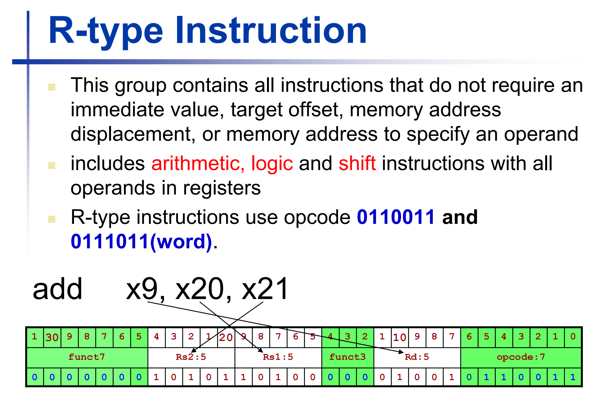

R 型指令：只需要寄存器，没有包括内存 / 立即数 / 偏移

R 型指令的机器码中：

- 操作码：头上的7位，0000000
- 功能码：尾上的7位，用来区分具体哪个操作

!!! info "R-type Instruction 对应的机器码详解"

    **⚙️ 三、以 R-type（寄存器操作类）为例**

    典型指令：

    ```asm
    add x10, x11, x12
    ```

    机器码结构如下：

    ```
    | funct7 | rs2 | rs1 | funct3 | rd | opcode |
    | 7 bits | 5 b | 5 b | 3 bits | 5 b | 7 bits |
    |31..25  |24..20|19..15|14..12 |11..7|6..0  |
    ```

    ---

    **🔍 各字段含义：**

    | 字段         | 位宽  | 含义                   | 举例（add）                           |
    | ---------- | --- | -------------------- | --------------------------------- |
    | **opcode** | 7 位 | 指明这是哪一类指令（算术/跳转/加载等） | `0110011`                         |
    | **rd**     | 5 位 | 目标寄存器编号（结果写入哪）       | x10 = `01010`                     |
    | **funct3** | 3 位 | 功能码：细分同类操作           | `000` 表示 add/sub                  |
    | **rs1**    | 5 位 | 源寄存器 1 编号            | x11 = `01011`                     |
    | **rs2**    | 5 位 | 源寄存器 2 编号            | x12 = `01100`                     |
    | **funct7** | 7 位 | 功能码：再细分 add/sub      | `0000000` 表示 add，`0100000` 表示 sub |

    ---

    **✅ 举例：`add x10, x11, x12`**

    | 字段     | 二进制       | 说明            |
    | ------ | --------- | ------------- |
    | funct7 | `0000000` | 表示加法          |
    | rs2    | `01100`   | x12           |
    | rs1    | `01011`   | x11           |
    | funct3 | `000`     | 同类操作（add/sub） |
    | rd     | `01010`   | x10           |
    | opcode | `0110011` | R-type 算术类    |

    最终拼起来：

    ```
    0000000 01100 01011 000 01010 0110011
    ```

    这是 32 位机器码（二进制）：

    ```
    0000000_01100_01011_000_01010_0110011
    ```

    转换为十六进制就是：

    ```
    0x00C58533
    ```

!!! info "其他类型指令对应的机器码"


    **⚙️ 二、六种基本格式的 32 位分配对比**

    | 类型         | 结构          | 用途        | 有哪些字段   |                       |           |                           |              |                  |             |         |
    | ---------- | ----------- | --------- | ------- | --------------------- | --------- | ------------------------- | ------------ | ---------------- | ----------- | ------- |
    | **R-type** | `funct7     | rs2       | rs1     | funct3                | rd        | opcode`                   | 寄存器对寄存器运算    | 3个寄存器 + 2个功能码    |             |         |
    | **I-type** | `imm[11:0]  | rs1       | funct3  | rd                    | opcode`   | 寄存器 + 立即数（如 `addi`, `lw`） | 1个寄存器 + 立即数  |                  |             |         |
    | **S-type** | `imm[11:5]  | rs2       | rs1     | funct3                | imm[4:0]  | opcode`                   | 存储指令（`sw`）   | 2个寄存器 + 立即数（分两段） |             |         |
    | **B-type** | `imm[12]    | imm[10:5] | rs2     | rs1                   | funct3    | imm[4:1]                  | imm[11]      | opcode`          | 条件分支（`beq`） | 立即数跨段编码 |
    | **U-type** | `imm[31:12] | rd        | opcode` | 高位立即数（`lui`, `auipc`） | 大立即数（20位） |                           |              |                  |             |         |
    | **J-type** | `imm[20]    | imm[10:1] | imm[11] | imm[19:12]            | rd        | opcode`                   | 无条件跳转（`jal`） | 跳转偏移立即数          |             |         |

    ---

    **🔍 三、详细举例对比**

    *🟦 1. R-type（寄存器运算）*

    ```asm
    add x5, x6, x7
    ```

    ```
    | funct7 | rs2 | rs1 | funct3 | rd | opcode |
    | 7 b | 5 b | 5 b | 3 b | 5 b | 7 b |
    | 0000000 | 00111 | 00110 | 000 | 00101 | 0110011 |
    ```

    ➡️ 三个寄存器，无立即数。

    ---

    *🟨 2. I-type（立即数/加载类）*

    ```asm
    addi x5, x6, 10
    ```

    ```
    | imm[11:0] | rs1 | funct3 | rd | opcode |
    | 12 b | 5 b | 3 b | 5 b | 7 b |
    | 000000001010 | 00110 | 000 | 00101 | 0010011 |
    ```

    ➡️ 一个寄存器 + 一个立即数（12位）。

    ---

    *🟩 3. S-type（存储）*

    ```asm
    sw x5, 8(x6)
    ```

    ```
    | imm[11:5] | rs2 | rs1 | funct3 | imm[4:0] | opcode |
    | 7 b | 5 b | 5 b | 3 b | 5 b | 7 b |
    | 0000000 | 00101 | 00110 | 010 | 01000 | 0100011 |
    ```

    ➡️ 两个寄存器 + 分段的立即数（因为要拼偏移）。

    ---

    *🟥 4. B-type（条件分支）*

    ```asm
    beq x5, x6, offset
    ```

    ```
    | imm[12] | imm[10:5] | rs2 | rs1 | funct3 | imm[4:1] | imm[11] | opcode |
    | 1 b | 6 b | 5 b | 5 b | 3 b | 4 b | 1 b | 7 b |
    ```

    ➡️ 立即数分散编码（为了节省空间）。

    ---

    *🟧 5. U-type（高位立即数）*

    ```asm
    lui x5, 0x12345
    ```

    ```
    | imm[31:12] | rd | opcode |
    | 20 b | 5 b | 7 b |
    ```

    ➡️ 大立即数（高 20 位直接写入）。

    ---

    *🟪 6. J-type（跳转）*

    ```asm
    jal x1, offset
    ```

    ```
    | imm[20] | imm[10:1] | imm[11] | imm[19:12] | rd | opcode |
    | 1 b | 10 b | 1 b | 8 b | 5 b | 7 b |
    ```

    ➡️ 跳转偏移量（立即数）跨字段分布。


???- info "寄存器个数：RISC-V ISA 寄存器为什么只能有32个寄存器"


    RISC-V 的每条指令是 **32 位机器码**。
    以最常见的 **R-type（寄存器操作指令）** 为例：

    ```
    | funct7 | rs2 | rs1 | funct3 | rd | opcode |
    | 7 bits | 5 b | 5 b | 3 bits | 5b | 7 bits |
    | 31..25 |24..20|19..15|14..12 |11..7|6..0  |
    ```

    其中：

    * `rd` ：目标寄存器编号（5 位）
    * `rs1`：源寄存器 1 编号（5 位）
    * `rs2`：源寄存器 2 编号（5 位）

    👉 每个寄存器编号用 **5 位二进制表示**

    ---

    **5 位能表示多少个寄存器？**

    5 位二进制最多能表示 ( 2^5 = 32 ) 种组合。

    也就是寄存器编号从：

    ```
    00000 → 11111
    ```

    对应：

    ```
    x0 → x31
    ```

??? info- "寄存器位数"

    | 架构          | 每个寄存器宽度 | 名称       |
    | ----------- | ------- | -------- |
    | RV32I       | 32 位    | 32 位寄存器  |
    | RV64I       | 64 位    | 64 位寄存器  |
    | RV128I（实验中） | 128 位   | 128 位寄存器 |


汇编语言是用的助记符

机器码就是32位 / 64位的二进制

操作数类型

* 寄存器
* 立即数
* 内存地址：在 RISC-V 里面没有，因为是先把内存的数加载到寄存器里，再操作寄存器，但是在 x86 等 ISA 里面有

### Memory Operands

如果程序在内存里面放不下，则放到硬盘。内存和硬盘的数据交换的单位是 page（页），一般是 4KB，也有 8KB。内存和寄存器的数据交换就比较自由，可以 1Byte，也可以 0.5Byte

在内存中寻址的方法是通过 **地址** 找，按照字节寻址，内存中，**一个地址就是 1 Byte**

在内存中存储的时候，要求 对齐，原因是：

CPU 访问内存是按字（word）为单位读取的，一个“字”通常就是 4 字节（32 位）。例如对于 int 类型（4 字节），它的地址必须是 4 的倍数（0x0, 0x4, 0x8, ...）。如果不是的话，就横跨了两个 word，CPU 需要进行两次内存访问，效率低下。

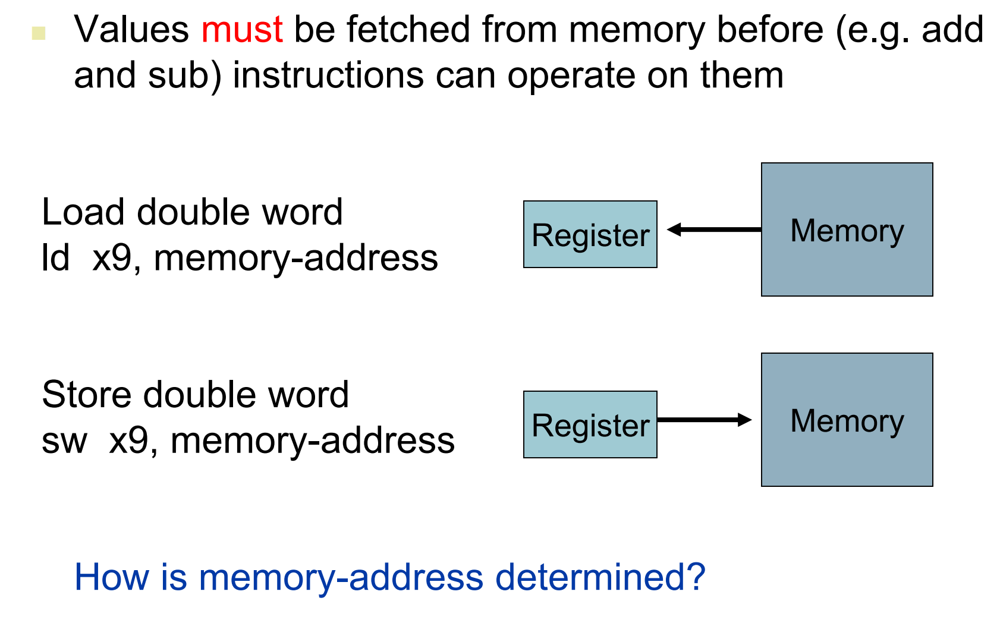

#### 内存地址

用基地址 + 偏移量（offset）来表示内存地址

- 偏移量是：数量 * 数据类型大小（占的字节数）

字节序：

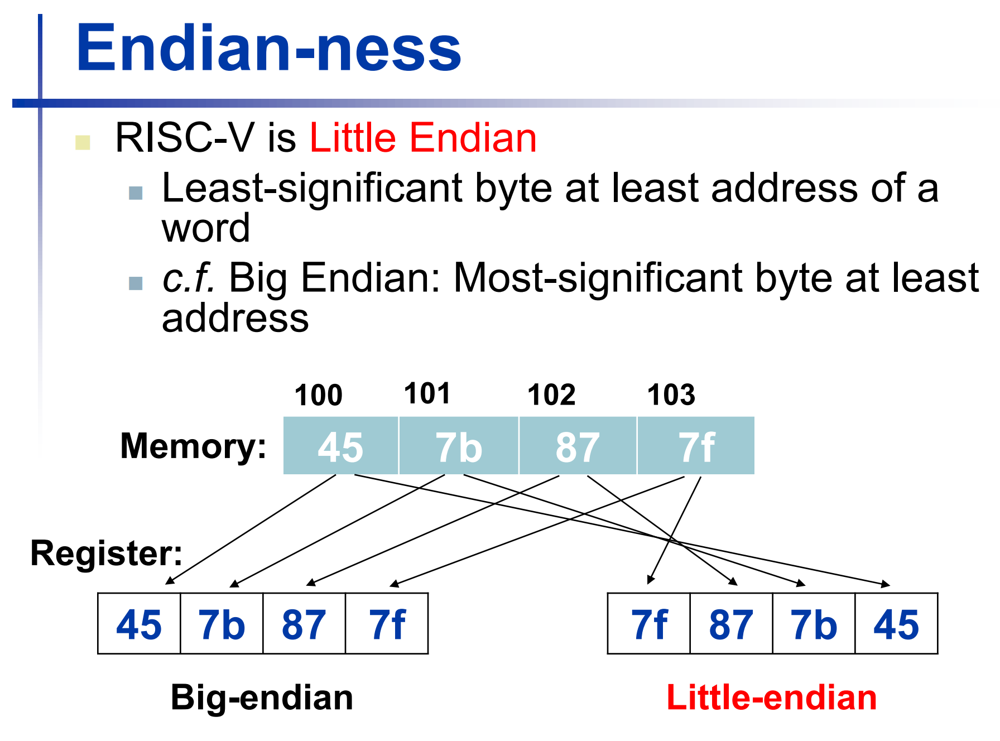

RISC-V 是小端序，就是低位存在低地址，即从右往左写

内存操作示例：

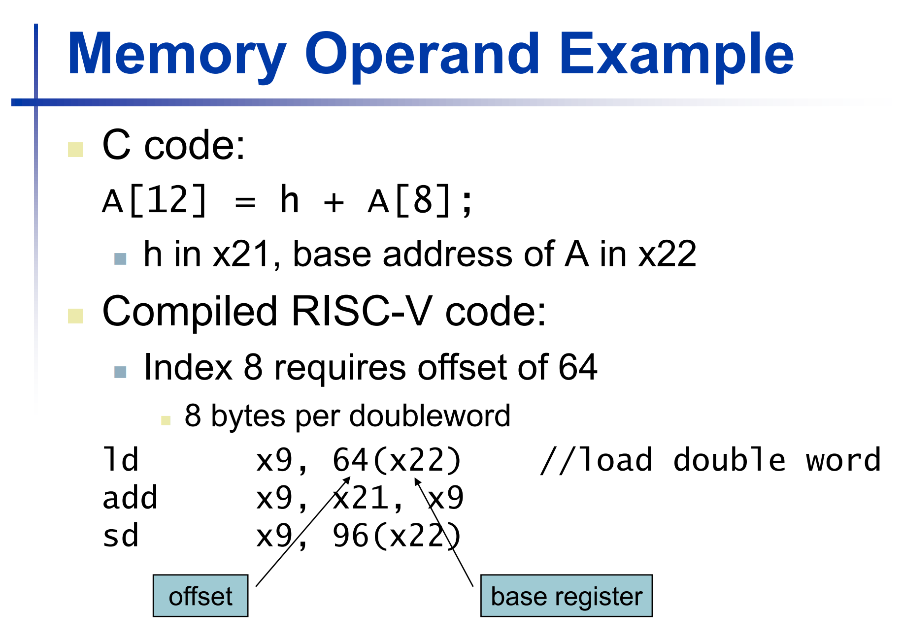

偏移量写在外面，作为一个立即数

### Immediate Operands

立即数：直接写在指令里的数

`addi` 


#### The Constant Zero

`x0` is the constant 0, which cannot be overwritten.

It is useful for: move between registers

```assembly
# move x5 to x6
add x6, x5, x0  # x6 = x5 + 0
```

对于简单指令，要熟悉汇编语言和机器码的翻译过程：

- 寄存器数值就是对应位置的十进制，翻译成二进制
- 操作码等要知道

### I-format Instruction

I: 立即数

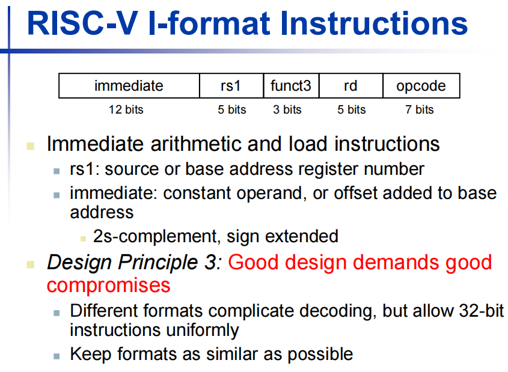

前面12位立即数是用 **补码** 表示的

### S-format Instruction

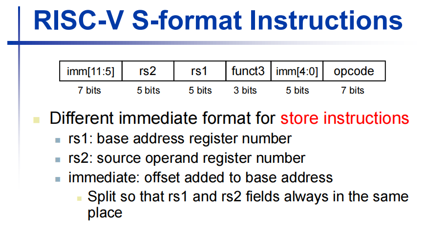

也是立即数型指令

把立即数拆成两部分: `imm[11:5]` and `imm[4:0]`

专门应用于 `store` instruction, 其他立即数指令都是用 I-format

Example:

```c
A[30] = h + A[30] + 1
```

equals to:

```assembly

```

equals to:

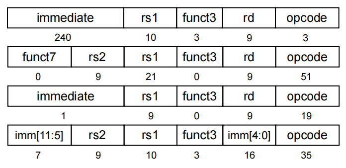
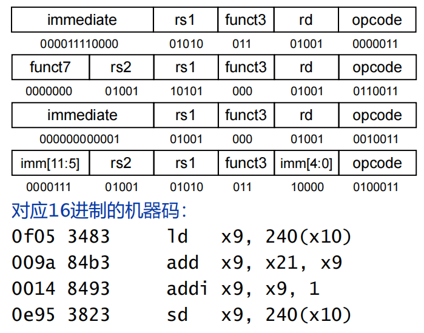

## Store the Program

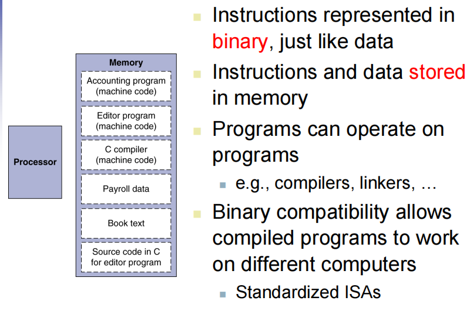

在内存里面，程序和数据都是一样的形式存储的。

## Logic Operantions

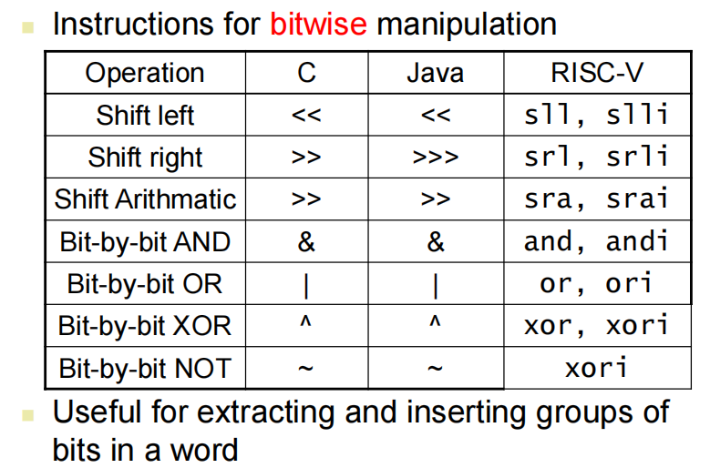


### Shift Operations

`sll`, `slli`, `srl`, `srli`, `sra`, `srai` 

分类：算术移位 / 逻辑移位；左移右移；是否立即数版本

右移时候：

- 算术移位：高位符号扩展

- 逻辑移位：高位补0

逻辑移位 == 乘除法，且移位操作快

对无符号数，右移，前面补0，相当于除

### And Operations

`and x9, x10, x11`  # x9 = x10 & x11

### Or Operations

作用：把数字的某些位设置为 1

### XOR Operations

作用：把数字的某些位取反

立即数的扩展：


## Making Decision

跳转指令

- 有条件跳转：for / while
- 无条件跳转：jump

### Conditional Operation

#### `beq` and `bne`

跳转：

`beq` = branch if equal

```assembly
beq rs1, rs2, L1 
# if(rs1 == rs2) goto L1, meaning: if(rs1 == rs2) branch to instruction labled L1
# PC = PC + (L1 << 1)
```

这里面，**`L1` 是一条指令的标签**

??? info "有关 `PC << 1` 的说明"

    1. "距离"本身已经是 4 的倍数
    因为 RISC-V 32位系统中:

    每条指令长度固定是 4 字节
    所以指令地址一定是 4 的倍数(0x0, 0x4, 0x8, 0xC, ...)
    两条指令之间的"距离"也一定是 4 的倍数
    2. 为什么要左移 1 位(乘以 2)?
    关键在这句话:"又因为RISC-V兼顾16位的操作系统(指令长度为2的倍数)"

    这意味着:

    在 RV32I(32位指令集)中,指令是 4 字节对齐
    在 RV32C(压缩指令集)中,指令可以是 2 字节
    RISC-V 支持混合使用 32位和16位指令
    3. 立即数空间优化
    在分支指令(B-type)中,立即数字段有限(只有12位):

    ```
    | imm[12] | imm[10:5] | rs2 | rs1 | funct3 | imm[4:1] | imm[11] | opcode |
    ```

    注意:立即数只存储 `imm[12:1]`,没有存 `imm[0]`!

    因为:

    最小的跳转单位是 2 字节(16位指令)
    所以偏移量的最低位 `imm[0]` 永远是 0
    硬件直接假设 `imm[0] = 0`,把它省略掉
    实际计算时:

    ```
    实际偏移 = 立即数 << 1  (左移1位,相当于乘以2,补上省略的 imm[0])
    ```

    **完整流程**

    ```
    beq x5, x6, label  # 假设 label 距离当前PC是 +100 字节
    ```

    1. 汇编器计算距离: `label地址 - PC = 100`
    2. 右移1位存入指令: `100 >> 1 = 50` 存入立即数字段
    3. CPU执行时左移1位还原: `50 << 1 = 100`
    4. PC相对跳转: `PC = PC + 100`

- PC relative addressing：PC 相对寻址

即在机器码中，用相对位置的差值（**距离**）表示 `L1`，而不是绝对地址，那么这用的是立即数，说明相对位置差不能太大，否则立即数表示不下。其中，正距离表示向前跳转，负距离表示向后跳转。32位系统指令长度是 4 字节，所以“距离”都是 4 的倍数。又因为RISC-V兼顾16位的操作系统（指令长度为2的倍数），所以跳转地址要左移 1 位（乘以 2），即后面补一个 0。

`PC` 是程序计数器（寄存器），存放下一条要执行的指令地址，由系统自动控制，每次执行完指令，`PC` 会自动加上指令长度（RISC-V 是 4 字节）


`bne` = branch if not equal

```assembly
bne rs1, rs2, L1  # if(rs1 != rs2) goto L1, meaning: if(rs1 != rs2) branch to instruction labled L1
```

例子：

```c
if (i == j) {
    f = g + h;
} else {
    f = g - h;
}
```

```assembly
    bne x22, x23, Else(2)   # if (i != j) goto Else
    add x19, x20, x21  # f = g + h
    beq x0, x0, Exit (1)    # goto Exit
Else: sub x19, x20, x21  # f = g - h
Exit:
```
{ .annotate }

1.  此处其实是一个 **无条件跳转**，即判断条件永远为真（`x0` 恒为   0），所以直接跳转到 `Exit` 标签处。另外此处机器码中立即数是 4

2.  此处翻译成机器码后立即数是 6

!!! info "立即数的计算范例"

    逐条分析立即数
    1. bne x22, x23, Else (地址 0x1000)
    目标: 跳转到 Else 标签（地址 0x100C）

    计算距离:

    机器码中的立即数:

    因为 B-type 指令会自动左移1位（<< 1），所以存储时右移1位。

    二进制: 000000000110 (12位，补码表示)

    2. beq x0, x0, Exit (地址 0x1008)
    目标: 跳转到 Exit 标签（地址 0x1010）

    计算距离:

    机器码中的立即数:

    二进制: 000000000100 (12位，补码表示)

    B-type 指令的机器码格式
    示例：bne x22, x23, Else (立即数 = 6)
    立即数 6 的二进制（13位，因为包含 imm[12:0]，但 imm[0] 永远是0）:

    拆分到机器码各字段：

    - `imm[12]` = 0
    - `imm[10:5]` = 000000
    - `imm[4:1]` = 0011
    - `imm[11]` = 0
    - `rs2` = x23 = 10111
    - `rs1` = x22 = 10110
    - `funct3` = 001 (bne 的功能码)
    - `opcode` = 1100011 (B-type)

    完整机器码:

    总结
    指令	跳转距离（字节）	机器码中的立即数（十进制）	立即数（二进制12位）
    bne x22, x23, Else	12	6	000000000110
    beq x0, x0, Exit	8	4	000000000100
    关键点:

    实际跳转距离是 12 字节和 8 字节
    但机器码中存储的立即数是 6 和 4（右移1位后的结果）
    CPU 执行时会自动左移1位还原成实际偏移量


```c
while (save[i] == k) i += 1
```

- in in x22, k in x24, address of save in x25

```assembly
Loop: slli x10, x22, 3
      add x10, x10, x25   # x10 = &save[i]
      ld x9, 0(x10)      # x9 = save[i]
      bne x9, x24, Exit  # if(save[i] != k) goto Exit
      addi x22, x22, 1    # i += 1
      beq x0, x0, Loop    # goto Loop
Exit:
```

```assembly
slli x10, x22, 3
add x10, x10, x25   # x10 = &save[i]
```

这两句是在计算 `&save[i]`，因为 `save` 是 `double` 类型，占 8 字节（2^3 = 8），所以要把 `i` 左移 3 位（乘以 8）再加上 `save` 的基地址 `x25`。

#### `blt`, `bge`, `bltu`, `bgeu`

`blt` = branch if less than

```assembly
blt rs1, rs2, L1  # if(rs1 < rs2) goto L1, meaning: if(rs1 < rs2) branch to instruction labled L1
```

!!! success "技巧"

    汇编语言中条件指令一般用与高级语言中相反的

`bge` = branch if greater than or equal

有符号数和无符号数的比较

- 有符号数比较：`blt`, `bge`
- 无符号数比较：`bltu`, `bgeu`


因为负数的话将其当作无符号数时候他是非常大的正数

### Basic Block 基本块

一整个完整的没有跳转出去和跳转进来的指令序列

## Procedure Calling 过程调用

变量作用域、参数传递都要自己写

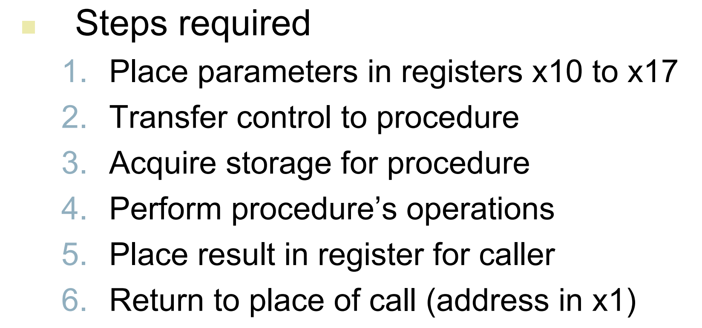

- 约定：`x10` - `x17` 放参数，多了就只能放内存
- 程序栈
- 返回值放 `x10`, `x11`

### `jal` and `jalr`

`jal` = jump and link: Procedure Call

```assembly
jal x1, ProcedureLabel1
```

- 将下一条指令地址（`PC + 4`）存入 `x1`（`$ra`，返回地址寄存器）
- 跳转到 `ProcedureLabel1` 处执行

`jalr` = jump and link register: Return from Procedure

```assembly
jalr x0, 0(x1)
```

- 将返回地址寄存器 `x1` 的值（即 `PC + 4`）存入 `PC`，实现返回

`jarl` 指令也有别的用途

- 无条件跳转
- 高级语言的 `case`

```
# 调用函数 func
jal ra, func        # 跳转到 func，同时保存返回地址到 ra

# 函数体 func:
func:
    ...             # 执行一些操作
    jalr x0, 0(ra)  # 从 ra 返回到调用点
```
1. jal ra, func → 跳到函数，ra 里存返回地址；
2. 函数执行；
3. jalr x0, 0(ra) → 跳回调用处。

### Stack  栈指针

程序栈：每次进入一个程序，都分配一块栈空间

对一块栈空间：顶部地址大，底部地址小，但是栈是从高地址向低地址增长的。

栈指针就是指向栈顶的地址，可以往下增长（分配空间），也可以往上减少（释放空间）

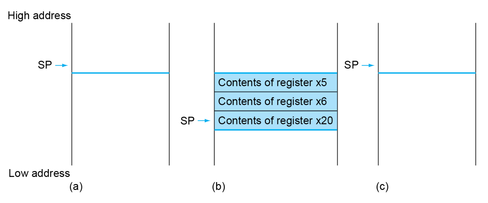

把父程序的三个值放在栈里：当执行完子程序要访问父程序的变量时，可以通过栈指针加上偏移量来访问（类似于恢复现场）

当申请3个寄存器的空间时候，`SP` 要减去 12（3 * 4 字节）

为什么是减：因为栈是从高地址向低地址增长的

