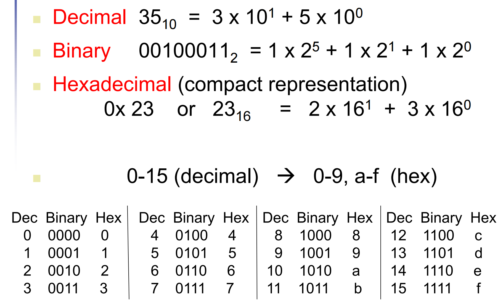
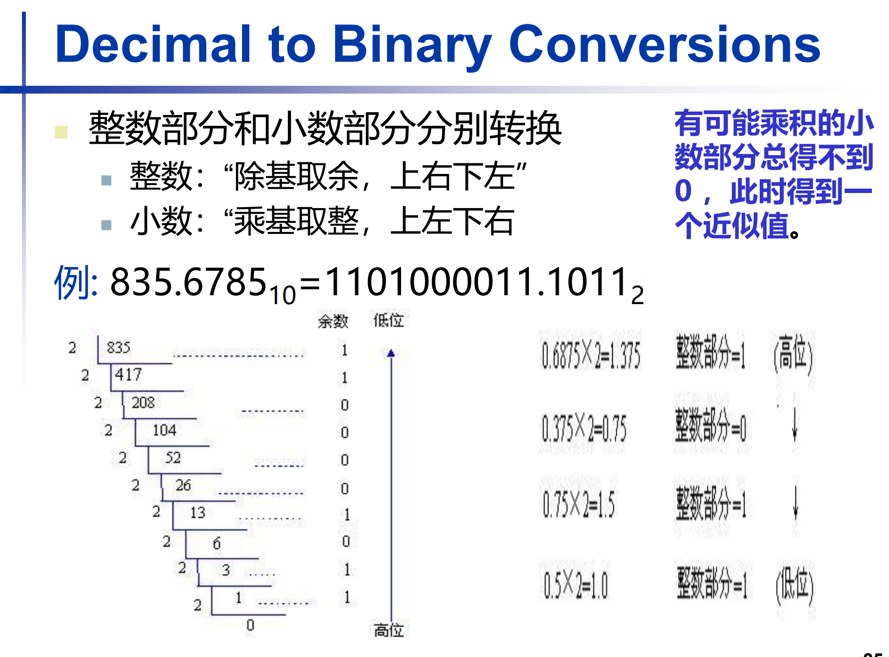
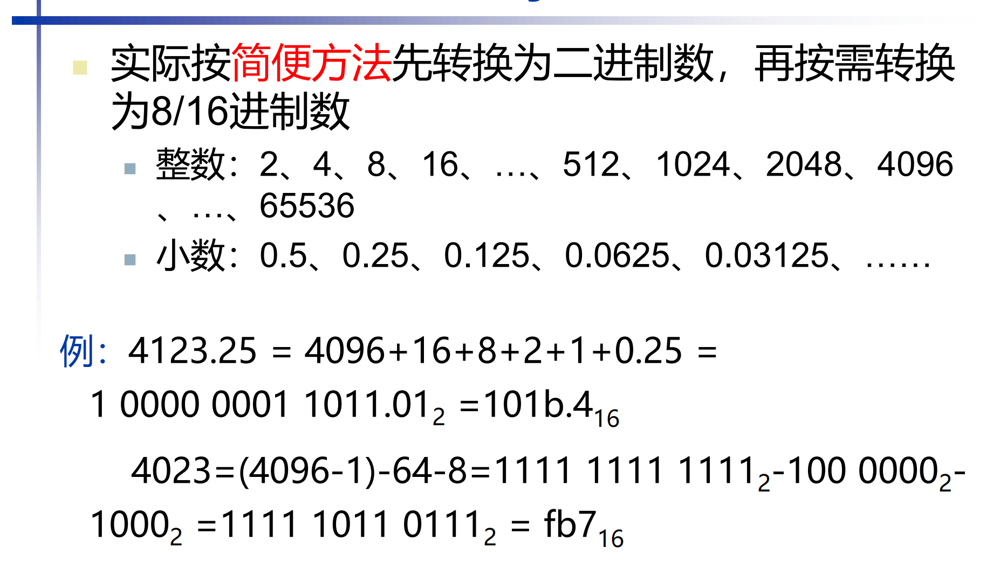
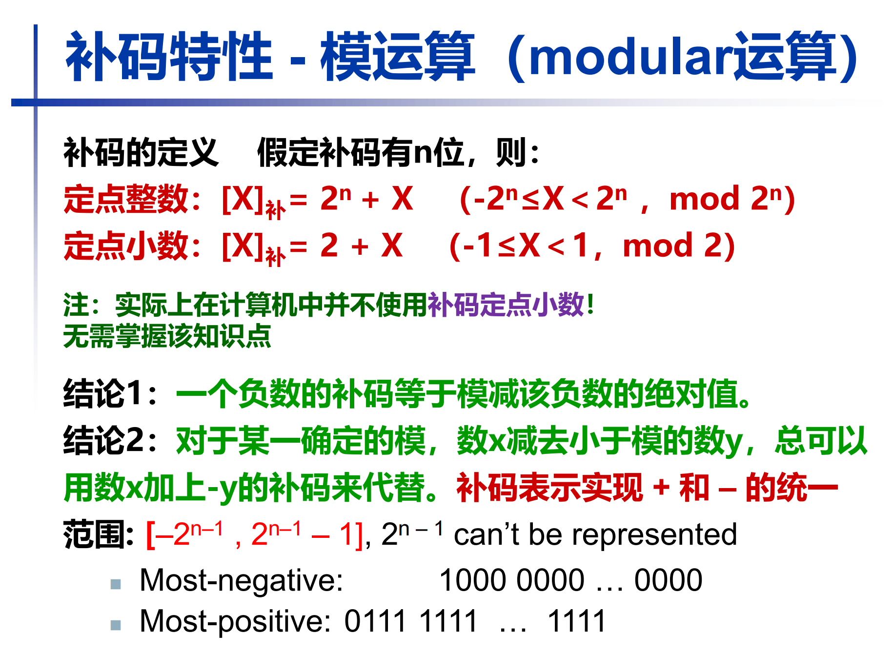
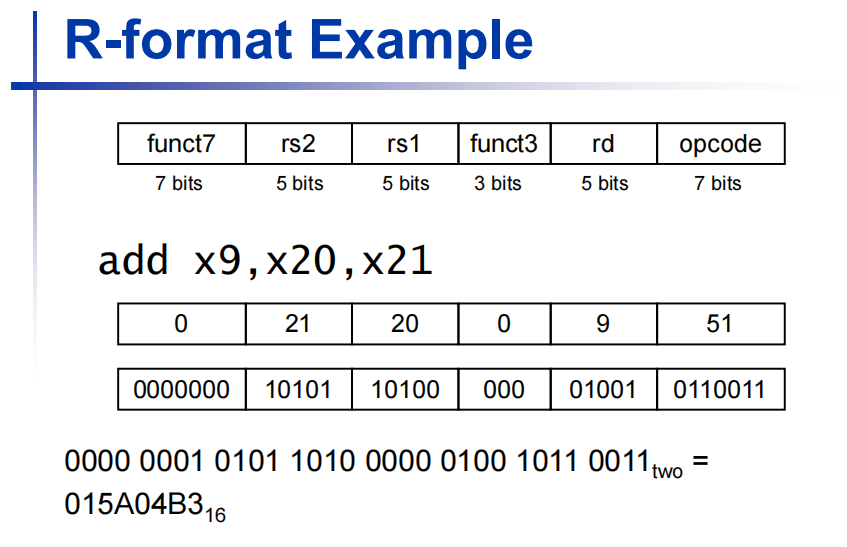

## 数的表示

### 无符号数 Unsigned Binary Integers

Given a n-bit number, 

$$x = \sum_{i=0}^{n-1} b_i 2^i$$

where $b_i \in \{0, 1\}$

我们上课用的是 64 位 RISC-V 的表示方法

### 进制转化



小数：从小数点开始，往左找，往右找，对于16 / 8进制，都是 4 / 3 位一组，不够则在后面补0



导致了浮点数的不精确表示

简便方法：



### 有符号数

#### 补码表示法

最高位（Bit 63）决定正负：

Bit 63 is sign bit
- 1 for negative numbers
- 0 for non-negative numbers

在 n 位二进制中，$-x ≡ 2^n - x (mod 2^n)$

```
补码(-x) = 2^n - x
```

$2^n$ 实际上是高一位的1，被忽略了，所以加 $2^n$ 相当于没加，所以把负数加 $2^n$



其中，$n$ 是二进制位数

结论：负数的补码等于其绝对值的二进制，各位取反，再加一。

将32位数扩展为64位数的方法：

- 有符号数： sign extension，即在高位补符号位

    - 负数：高位补1
    - 正数：高位补0

- 无符号数： zero extension，即在高位补0


#### 原码表示法

用二进制表示数值的绝对值，符号位用来表示正负，正数符号位为0，负数符号位为1。

浮点数用的就是原码表示法。

缺点：

- 有两个0：+0 和 -0
- 运算复杂：加减法需要考虑符号位，增加了运算的复杂性。


#### 移码表示

将数值加上一个固定的偏移量（bias），使得所有数值都变为非负数，一般来说，n位二进制的偏移量为 $2^{n-1}$。

作用：可以简化比较，尤其是浮点数的比较。


