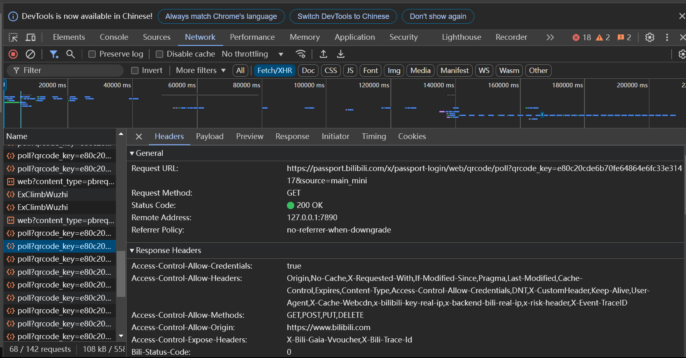

<!--自己学，转码，转全栈工程师-->

# request库
## 前置理论
Chrome —— 右键 —— 检查 —— Network ：所有的1请求

—— Fetch/XHR：网络请求


headers & payload: 请求内容；preview & response：响应内容

到你感兴趣的网站上看看这些数据是怎么来的：世界上的一切数据都是向后端发出请求然后请求来的

你打开网址，浏览器就会get那些数据给你返回

request可以模拟这个请求
## 实操
- requests.get()  ：一般用来请求网址，打开网址；也可以用来获取数据
- requests.post()  ：一般用来获取数据

```python
import requests
response = requests.get(url = "https://buff.163.com/api/index/popular_sell_order?_=1731496240806")
# 在右键——检查——network——（刷新）——左边栏选一个看看——找到想要爬的那个——headers——copy那个Request URL:
print(response.text)
info = response.json()["data"]['goods_infos']
# .text :返回所有内容以文字形式
# .json() : 把json格式的字符串转化为python的字典
# 一般是字典，用字典键值对等语法访问元素
for value in info.values():
    print(f"{value['name']}的价格是{value['steam_price_cny']}元")
```
<!--2:20-->