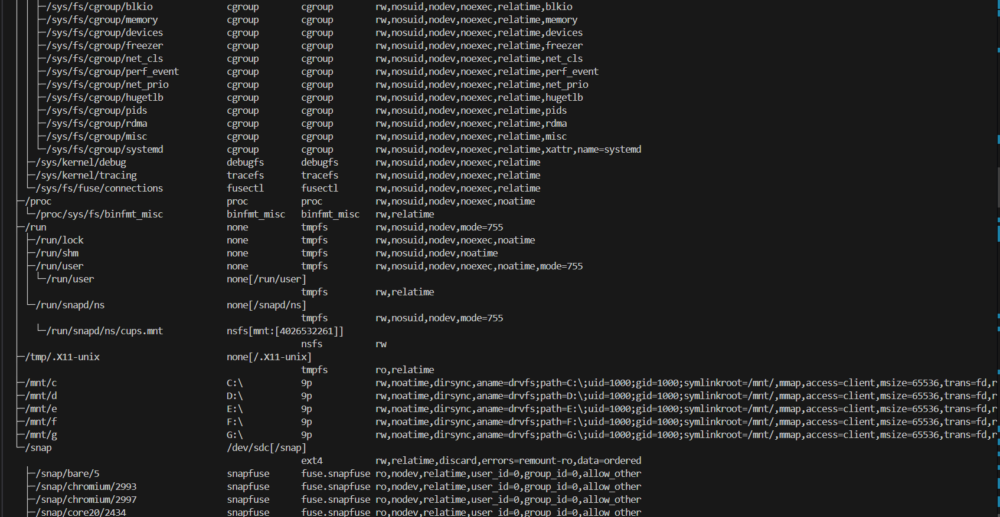
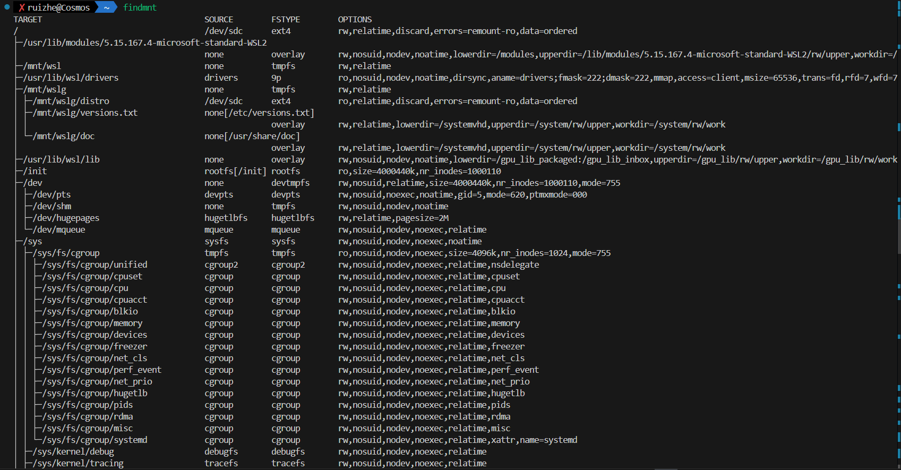
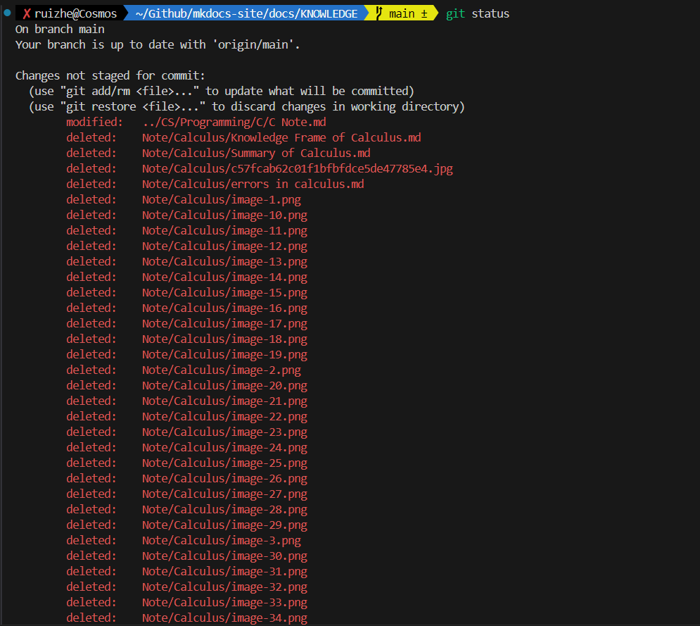
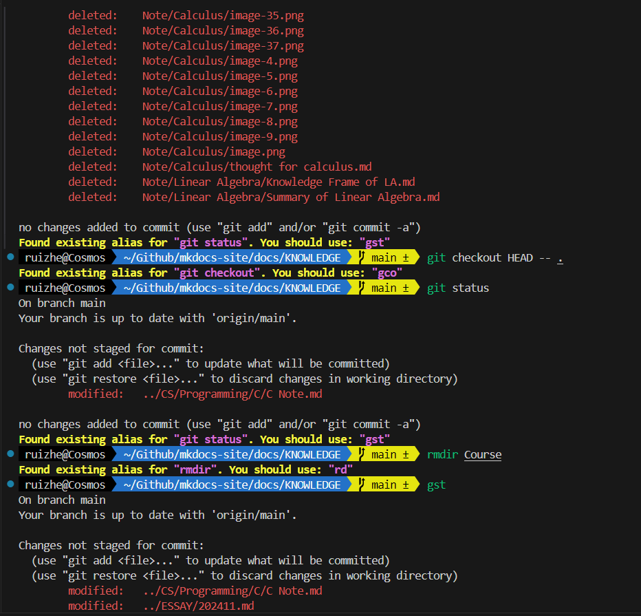
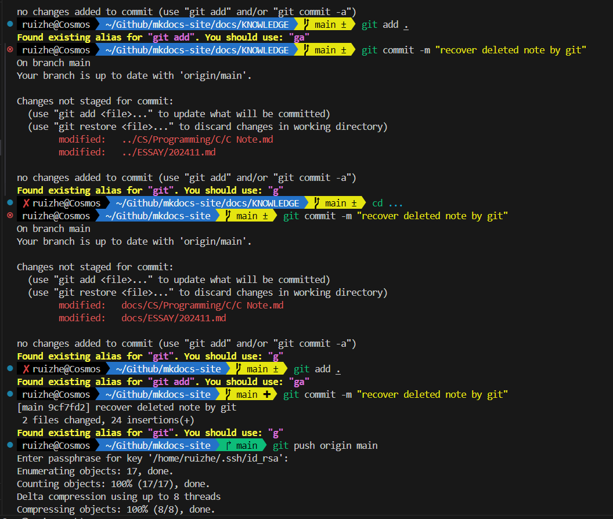
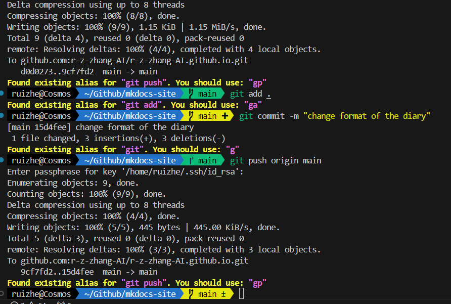

## 2024-11-25
人是万万不能连着写同一门课的两次作业的，因为会恶心到吐……

参考11.25早晨7:30到9:40发生的事情。

试问2个小时用完半个作业本是一种什么体验？

后续：

- 一天花4个小时用完一整个作业本&nbsp;&nbsp;什么水平？

        参考下午16：20到18:30发生的事情。

ZJU的网为什么总是伤害我们的git push origin main呐？

## 2024-11-26

为何生活能如此丰富多彩以至于让我迷失方向、忘记自己的本职工作？

> 事实证明，当人无聊到一定程度的时候，学习真的可以是一件快乐的事。  

>by 咸鱼暄

是我不够无聊吗？

孤独感或许在世界纷纷扰扰之时才愈发强烈。

怎样学会独处？怎样享受孤独？

## 2024-11-27

当代大学生的精神状态 —— 午觉5小时

山西的午觉文化因何而起？

午觉文化何时可以统治世界？

    终于明白git的含金量了

    版本管理最强大的一集

    没有之一!

    我不支持反驳

绝望，无助，万丈深渊深不见底

无知，搜索，天书几篇无法理解

尝试，失败；尝试，失败。

脑中忽然飘过一丝想法 —— 为何不用git？

尝试，一行即成功……

天朗气清，惠风和畅，眼前豁然开朗！

此情此景，不禁吟诗一首

今夜寒风刺骨，机前书写命令。

试用rm -r，却把目录错输。

搜索，搜索！还是git救我。

佑谨哥哥和诗：

挑灯倦意入骨，讲稿全无辞令。

怎将体积误积，又把概率求错。

睡觉，睡觉！代码最后压我。

附上和ChatGPT & terminal 斗争的证明

[问！看不懂！继续问！继续看不懂！](https://chatgpt.com/share/67475067-ccb4-800d-bd8b-736381768827)

## 2024-11-28

甚是无聊，被ddl和学不会的知识压垮的一天。

马上到来的C程实验考，不会；马上到来的SPOCddl，课未上完。

但是似乎上帝并不想让今天过于平淡……

晚上，一对情侣缓缓出现在了我的面前……

熟人……

说实话我学习的时候不希望对面有人的，与云峰哥哥甚是相似

但是这次，不但有人，两个人还亲亲密密搂搂抱抱，男生时不时把头靠在女生肩膀上，男生的手上带着女生的头绳……

不得不把放电脑的空间无限压缩……

不得不把腿收紧，担心碰到nia俩纠缠的双腿

乱我道心！

无心学习，故作此文。

<!-- 工作上，下属不争气，领导看扁我！
领导交给的任务，尽快完成！ -->

## 2024-11-29

浙江大学求是学院云峰学园第二团总支第二次班团例会

开会，确实意识到很多东西，见Obsidian ~

## 2024-11-30

12月会好吗？这个恶性循环何时可以停止？

课程、作业、考试

工作

唯二被耽误的，是学习和提升……

无过多时间，故随后补充

