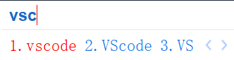

## 2024-12-03

活着好累

活着好累！

活着好累！！

活着好累！！！

人生的意义在哪里？

究竟做什么才能使生活有意义？

活着的意义在哪里？

究竟什么样的人生才算有意义？

我做的每一件事，它的意义在哪里？

为什么？

没什么空虚为什么无聊为什么生活没有意义为什么充满了各种各样的破事？

金钱观？人生观？价值观？世界观？

为什么需要学习？为什么我只会躲进学习的躯壳中转而又在探出头时批判学习？

什么是成熟？

为什么我的精神总有一种撕裂感？

为什么没有一种思想一种观念可以主导我？

精神的空虚！

对孤独的恐惧！

使我无处安身！无处安放自己的灵魂啊！

罢罢罢

12.4 报销车费

12.4 报销宣传单

12.4 询问sqtp报销 1000块钱怎样花掉

12.4 收集学号立项

12.5 微积分小测

12.5 C程小测

12.6 19:00 北四216财务规范训练

12.6 14点 玉泉曹主227留美讲座

12.7 算法大赛

12.9 线代小测

12.10 大英小测

12.13 19点 北4-113 演讲与口才训练

12.14 四级

12.15 C程实验考

12月班会

1000块钱怎么花掉

1.2 8:00 大英期末

1.3 14:00 C程期末

1.4 8:00微积分期末

1.4 10:30 军理期末

1.4 14:00 德法期末

1.6 10:30 线代期末

1.8 青训营考核ddl

1.10 职规期末

学习很累，学习没有意义

学习很爽，学习意义重大

罢！

>任何一种你不喜欢 又摆脱不了的生活就是监狱

>如果你感到痛苦和不自由

>希望你心里永远有一团不会熄灭的火焰

>不要麻木不要被同化

>拼命成为一个有力量破釜沉舟的人

>我们也终将会找到安迪越狱的那把小榔头

>打通一条道路 去拥抱属于我们的世界

>有些鸟儿注定是不会被关在笼子里的

>因为它们的每一片羽毛都闪耀着自由的光辉

Cosmos:
曾经我一直不理解

Cosmos:
不理解为什么你们会对sdf 对自己所处的环境充满怨恨

Cosmos:
曾经自以为自己适应力强

Cosmos:
前两天再看

Cosmos:
不过是麻木了罢

Cosmos:
心中的火苗早已熄灭

Cosmos:
心里面那点光不过是被环境的强光点亮了

Cosmos:
很可悲

Cosmos:
最终活成了一个没有独立之精神自由之思想的躯壳

## 2024-12-04

作于2024.11.5，感慨万千，略作回忆。回忆交织，事件具有蝴蝶效应，故而两日的文字交错着完成。

&nbsp;&nbsp;&nbsp;&nbsp;&nbsp;&nbsp;&nbsp;晚上看电影解说，或许是看的电影过于人间真实，亦因为我的世界过于完美和理想化，没有看到过阴影中的世界，没有看到过光照下的阴暗角落，有些内容的确无法理解，无法理解主人公的行事动机、不能体会到其内心的痛苦与挣扎。因而我心里的痛苦感与压抑感。跑步前看到22:20；晚上学习后又看到睡觉，导致因明日不想再次错过早八小测而计划好的早睡泡汤，2点左右方放下手机。

&nbsp;&nbsp;&nbsp;&nbsp;&nbsp;&nbsp;&nbsp;晨起，微积分复习，lyk给发来昨天（12.4）的考题，略作，概念题一塌糊涂，其他尚可，不禁懊恼为何要花如此长的时间复习微积分，不如多写几道PTA。开始PTA，遇到难题，有一题1.5h方解出……

&nbsp;&nbsp;&nbsp;&nbsp;&nbsp;&nbsp;&nbsp;取大巴发票、询问录音设备并购买、交报销材料、和cjh聊不知所云的内容。

&nbsp;&nbsp;&nbsp;&nbsp;&nbsp;&nbsp;&nbsp;现在想来，我写下的事情竟然是昨天发生的，11.5发生的每一件事情都与前一天的某一件事有极其巨大不可忽视的关联，有恍然感觉是同一天发生的事情！仿佛电影一般，竟不知应怎样发表感慨……

&nbsp;&nbsp;&nbsp;&nbsp;&nbsp;&nbsp;&nbsp;或许是极度缺乏睡眠导致的病症吗？无从知晓……

## 2024-12-05

今天竟然是昨天的后一天！！！

我怎么感觉都过了三两天了啊…… 

突然感觉这种“过了三两天”的感觉才是真的，感觉像过了一年倒不是特别真实……

为什么昨天一天之内能发生那么多事情？为什么今天一天能发生这么多事情？

或许明天也会发出这样的疑问：为什么今天是昨天的后一天啊

苦笑哈哈哈哈哈

&nbsp;&nbsp;&nbsp;&nbsp;&nbsp;&nbsp;&nbsp;早晨，曾无数次担心的事情还是发生了，幸好结果不坏。连续几天都在两三点睡觉后早晨六七点在闹钟响之前起床，自己也曾担心这一天突然起不来，没想到，这种看似无谓的担心竟真的照进现实。因担心遂特意在平时的8:00前定了早晨7:35的闹钟，结果早晨竟然是听着闹钟起来，看表竟然7:45了。幸好没有重蹈覆辙！微积分小测竟然还有错题……

&nbsp;&nbsp;&nbsp;&nbsp;&nbsp;&nbsp;&nbsp;中午破旧的车子终于迎来了压倒它的最后一根稻草，遂全程步行。

&nbsp;&nbsp;&nbsp;&nbsp;&nbsp;&nbsp;&nbsp;C程小测，惨痛的回忆！不愿提及！tmd得了几分？18年没考过如此令人作呕的考试！没得过如此低的分数！和wb一起步行回寝室，被自己气笑了……我想回家……

&nbsp;&nbsp;&nbsp;&nbsp;&nbsp;&nbsp;&nbsp;苦笑……

&nbsp;&nbsp;&nbsp;&nbsp;&nbsp;&nbsp;&nbsp;决定下午先做一下午PTA搞明白每一道题，研究清楚最优解，思考算法，“先做几十道”。之后找个酒吧深夜买醉，放飞罢，如我所说，“我想放飞想发疯，但是理智告诉我不对。”我确实想真正从自己给自己框定的小天地中走出来，体验一次人生的丰富。

&nbsp;&nbsp;&nbsp;&nbsp;&nbsp;&nbsp;&nbsp;结果呢？工作去了，真挺好的其实。现在想想这身体状况还是别喝酒了，怕出事……但是这件事一定要实现！在放假回家之前！

&nbsp;&nbsp;&nbsp;&nbsp;&nbsp;&nbsp;&nbsp;接下来！有请我们的工作日志出场！

工作日志

&nbsp;&nbsp;&nbsp;&nbsp;&nbsp;&nbsp;&nbsp;找梁导交报销材料，他真的好忙啊！！！各种报销：班级活动经费、社会实践、实践活动、答辩、学生组织等等，参加培训活动，指导学生答辩，入党积极分子先关事项，新发展团员相关事项，团费等各种发通知，组织团总支层面活动…… 我看到的必然只是浮在水面上的 $\frac18$，难以想象其余的 $\frac78 \cdots$ $\cdots$ 他还只是一个24岁的研究生啊！难怪，靠在我肩上，伤心道 “干不完了” “快哭了”，难怪，微信上跟同事或下级诉苦，求人办事必各种感谢……

>这到处都是ddl谁能干得完啊！

>咱也不是说不给人家好好干，也不是说啥啥啥的，这太多了根本干不完啊！

>瑞喆 ~ 瑞喆 ~ 瑞喆 ~

>瑞喆，你说是不是一切事情最终都能解决啊……

>干不完了啊……

遂作以下《报销注意事项》

---

报销工作注意事项

&nbsp;&nbsp;&nbsp;&nbsp;&nbsp;&nbsp;&nbsp;亲身参与梁老师的工作，深感不易，报销方面，学生提交的材料错误层出不穷，严重减降低工作速度。遂作以下注意事项，供需要提交报销材料的同学参考。

1. 声明：

    - 本文件为个人创作，非官方文件。如与官方文件有出入，望谅解，一切以群文件中《财务报销办事指南（202310修订）》和浙江大学计财处相关规定等官方文件为准！
    - 由于主要协助老师完成班级活动经费报销，故主要讲其相关事项 ~

1. 原则

    - 所有材料按照第4条所述注意事项确认无误、按第3条所述顺序叠放整理好之后再提交！

2. 需要的材料（前四条罗列顺序即为提交材料时的叠放顺序）
    - 《学生活动预决算表》
    - （若有则附）礼品领用清单、专家评审费、讲课费相关发放表、比赛奖金发放明细（见《学生活动预决算表》，且均有[空白表格](http://cw.zju.edu.cn/a/kbxz/25803.html)，下载并填写。
    - 发票及相关材料：
        - 网约车发票：需附行程单
        - 大额发票：需附支付记录
    
        PS：有关“相关材料”的问题请认真阅读群里发的《财务报销办事指南（202310修订）》，以上仅列出今天遇到的问题。
    
    - 活动方案、通知、新闻稿

    - 另外需给老师提供报销人 姓名 + 学号 + 中国银行（杭州浙大分行）卡号。（在系统中找到该同学并将报销金额转至该卡）

3. 注意事项

    - 《学生活动预决算表》怎么填？
        - 经费项目号码：不填
        - 表格上方时间：申请报销提交材料的时间
        - 人数要求：获奖人数不超过参与人数的 $\frac13$ ，这个获奖包括下方表格中“奖品、纪念品”。
        - 金额：加法算对了再填，与发票的总金额匹配！
        - 核销金额：不填
        - 备注：视情况而定
        - 经办人签字：签名

    - 表格789三排备注的材料有些啥？（由于我只见到了奖品发放清单故只列出该项）
        - 奖品发放清单：人数要求见上

    - 最大的问题：发票！
        - 金额加对！金额加对！金额加对！（按一按计算器也不丢人哈 ~
        - 数量数清！打印全了！别印错了！合计金额要与《学生活动预决算表》上面写的总计相等啊，自己先算一下哈 ~
        - 金额看的是“价税合计”那里，也就是有大写的那里（例如：价税合计（大写）伍拾陆圆柒角玖分 （小写）¥56.79）。
        - 班级经费的话总共是1000元，注意自己这里的额度，超出规定范围的金额将不予以报销。
        - 发票右下角签上名字。

4. 细节问题

    - 注意打印时纸张方向，使叠放的材料夹起来后便于翻看。

    - 注意装订别订书针别压到发票左上角二维码
    
3. 参考网站 / 文件

    - [浙江大学计划财务处](http://cw.zju.edu.cn)

    - 《财务报销办事指南（202310修订）》（见群文件）

    - 《奖品领用确认单》（见群文件）

    - [财务有关空白表格下载（内网可用）](http://cw.zju.edu.cn/a/kbxz/25803.html)

张瑞喆

2024.12.6

---

&nbsp;&nbsp;&nbsp;&nbsp;&nbsp;&nbsp;&nbsp;中间呢也有好多幸福 ~ 梁导请我吃办公室的小零食，他出差带回来的东北特产：酥脆皮 & 糖心、极像驴打滚的小吃、上次团建剩下的水hhh。梁导把零食塞得满嘴跟我说话的样子好可爱~ 又想到他说我经常愣神跟他很像很可爱hhh。and我问他“他们都说我有口音你能不能听出来了？”（满嘴零食）（迟疑半晌）“我们是一个地方的人吗？”。后来他说可能是因为我的很多词汇一听就是我们那的用法。还说我俩去吃个饭，但是他太太太忙了啊哪有时间啊。

&nbsp;&nbsp;&nbsp;&nbsp;&nbsp;&nbsp;&nbsp;中间也听到云峰实践十佳团队答辩相关事项，前十个压分严重，只有2~3个拿上十佳，中间11~15的分高得离谱。准备的PPT、精心修改的文字稿……还有交了材料但又不想入团、不填入团志愿书的阁僚人……好忙……

&nbsp;&nbsp;&nbsp;&nbsp;&nbsp;&nbsp;&nbsp;关于我们的报销，梁导：“买的材料用好！” 一定！

<!-- 感谢xcjj！！！！！！ -->

&nbsp;&nbsp;&nbsp;&nbsp;&nbsp;&nbsp;&nbsp;还是凌晨，和wcy聊天，无数次之后的再一次被巨佬震撼到！太强！其对学习的认知和学习的品质是我终身难以企及的高度。

&nbsp;&nbsp;&nbsp;&nbsp;&nbsp;&nbsp;&nbsp;深夜，结束与wcy的聊天之后，突发奇想0:40~2:44耗时两小时完成报销注意事项。完成之后本计划早睡但转念一想已经3点了不如写完这篇日记。

&nbsp;&nbsp;&nbsp;&nbsp;&nbsp;&nbsp;&nbsp;再就是其他了吧 ~

&nbsp;&nbsp;&nbsp;&nbsp;&nbsp;&nbsp;&nbsp;工作时候，几次感觉呼吸不上：暂时暂停呼吸但小段时间无甚异样，但一段时间过后肺部传来压力感，再次呼吸又有无法深吸气的感觉。疲倦、困乏感脑部在困意来临时的那种感觉不断，几次打哈欠并挤出眼泪。且感觉心跳说不出来的奇怪，这是在我听闻一位同学军训时被查出高血压，当时去校医院做了检查，至今仍在服药，联想到我当时的体检表还要求我做全天的心率测量但我没做，时候所感觉到的。当时医生就说我的心脏问题可能是熬夜导致的……

是身体对我极端且持久的的熬夜行为的控诉罢！熬夜伤身体！不止一位朋友跟我提及！

&nbsp;&nbsp;&nbsp;&nbsp;&nbsp;&nbsp;&nbsp;究竟！是同一天！还是！相隔三两日！无从知晓……

&nbsp;&nbsp;&nbsp;&nbsp;&nbsp;&nbsp;&nbsp;时间？空间？逻辑？一切的一切，缘起是什么？关联又是通过怎样的渠道完成的？难道我也开始思考宇宙的起源了吗？！笑……是否真的存在一种超现实超物质的力量在主导时间，主导我的人生？一切都无从知晓……

&nbsp;&nbsp;&nbsp;&nbsp;&nbsp;&nbsp;&nbsp;试问我知道什么？

## 2024-12-06

4点未睡，看电影，无趣，没有想象中的继续完成并情绪外溢，睡，9点起。

<!-- 

在该干什么的时候干什么 

what a hell

伊力老师说的内驱力？

想想国庆你在干什么，之后发生了什么？

WHY！

-->

## 2024-12-09

方才做了减肥的决定，就被lyk喊出去在银泰吃晚餐，也了解了她的情感故事，不禁思考，所谓的不合适到底是什么？是谁的错？难道她没有任何错误吗？

## 2024-12-10

闲来无事，突然发现自己的输入法完美概括了我的大一上，可作为年终总结罢

## 2024-12-12

凌晨，算在12.12罢。

和lyk出去喝酒，作于酒后，言辞或许与之前略有不同。

耳机里放着戳爷的歌，刚刚喝过的酒13%vol。算是第一次这样吧。本计划找个酒吧，tombar，然而1:30关门，

>什么健康酒吧

扫兴，计划买瓶酒去北街咖啡喝，然而听闻xxy在哪里遂pass掉此计划。

> 不能去，本来还想跟你说点他的事情

> 不能这种情况下跟他俩在一起，多尴尬，且没意思，就是吃狗粮去了

在罗森买好之后，思考去哪，银泉足球场还能进，遂入。

聊呗

三句不离学习。俩人都是在说这个学期没有好好学习。她感觉这个学期都是在玩了，我感觉这个学期每天忙忙碌碌，补前面的课，没有自己往后多学点东西。唉唉唉

>“这周一定要好好学习！”

>“感觉上学期就这样过完了”

好好复习期末！

你知道大一的课程多么重要吗？全是学分高的大课啊

也只能从下学期开始了……

她在不停的唱歌，或许是醉了罢hhh从蓝田的演出曲目到自己随便唱，甚至上厕所之前都必须唱完这首……

我感觉我没有醉啊，就只是脑子有点不清楚，感觉周围眩晕感，想到处挥舞脑袋啊，但是我的言辞还是清楚的，该说什么不该说什么还是比较清楚的罢，就是话有点多了……我俩都在那里不停的说hhh，我当时好像想着自己喝上酒话多很正常，就身边把自己的心声吐露了部分。

不知道呢，知不知道真正醉了是啥概念。只是觉得360毫升13度的酒应该是没醉。唯一可能证明我醉了的证据是左摇右晃感觉那种感觉被放大了……

分别之后，我回到主图，完成本篇。她去找xxy

> 他很生气，说以后他不在不许喝这么多

> 我才发现自己酒量这么小

也有些许失落吧，这么好的一个朋友，有男朋友就是不一样，处处受男朋友的限制，不能跟我为所欲为罢，还是人家男朋友的话为主罢。但是我想找她喝酒，跟她男朋友何干？为何要阻碍我俩？！没有办法啊，可能注定是这样罢，真是一个令人悲伤的故事…… 上一秒也想过，可能我俩的关系注定不会跟和zjf一样罢，转念一想，zjf也会有男朋友罢。唉唉唉，今天看到的精神之恋到底是什么？

想到去的路上，她讲到，不知道为什么，她变得特别患得患失，特别的黏人，有什么事都想和xxy倾诉，特别的依赖他，之前的几个都不是这样，也是她特别主动……

我分析道，可能是离家远了，缺乏安全感罢。她说可能是。我继续发出感慨，为何能和我俩一模一样，这经历都一模一样啊，她也是从我这开始变得患得患失……

女人啊，总是在寻求安全感的路上。

躺下，想睡觉，呼吸不上的感觉再次来袭，还是因为我每天这个点睡觉！3:05了啊，这这这，一旦稍稍停止呼吸，就会有强烈的感觉，难受的感觉。没有办法啊，唯有早睡。

望平安。

打字都左摇右晃，大概是真的醉了罢。