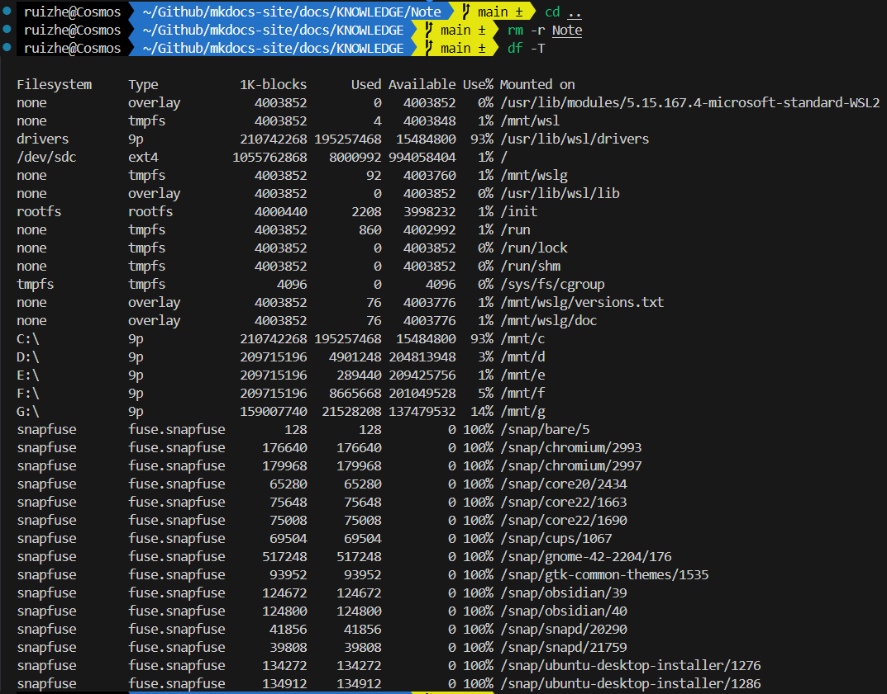
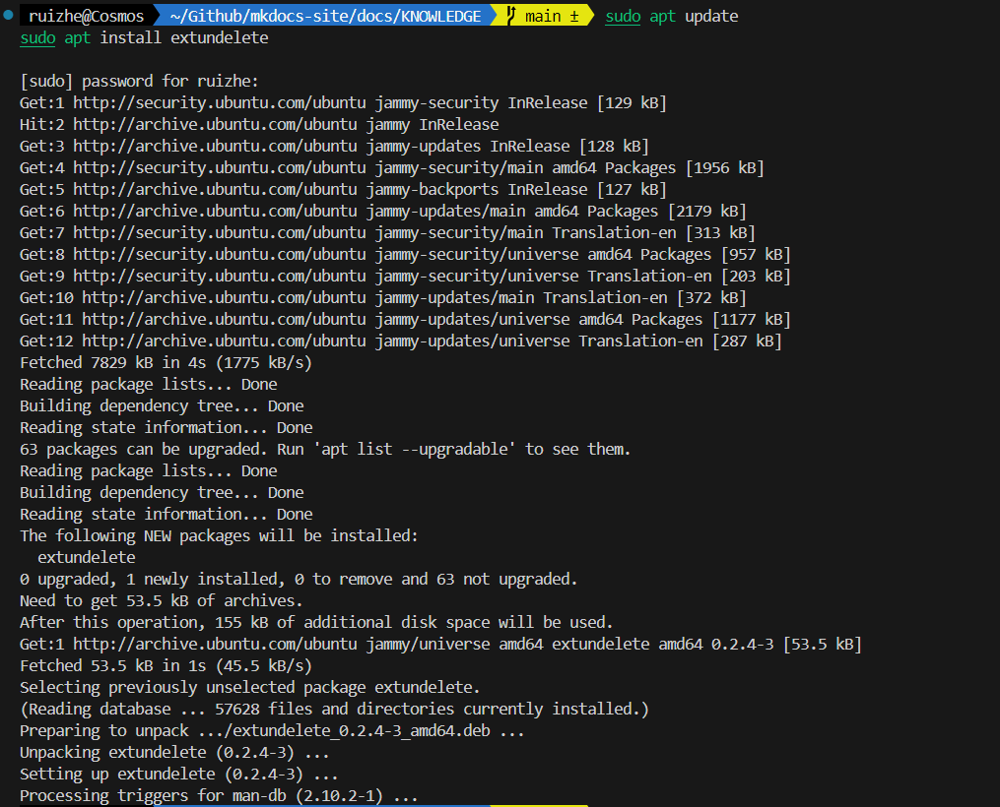
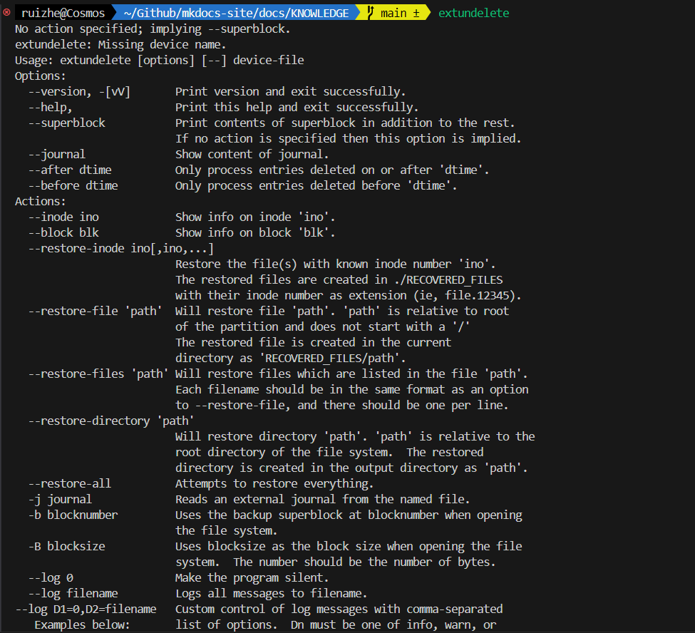
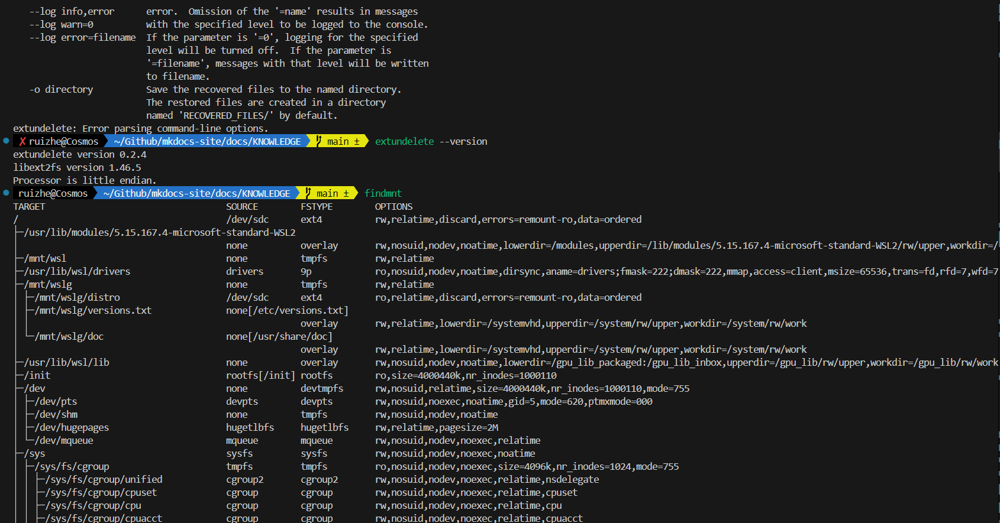
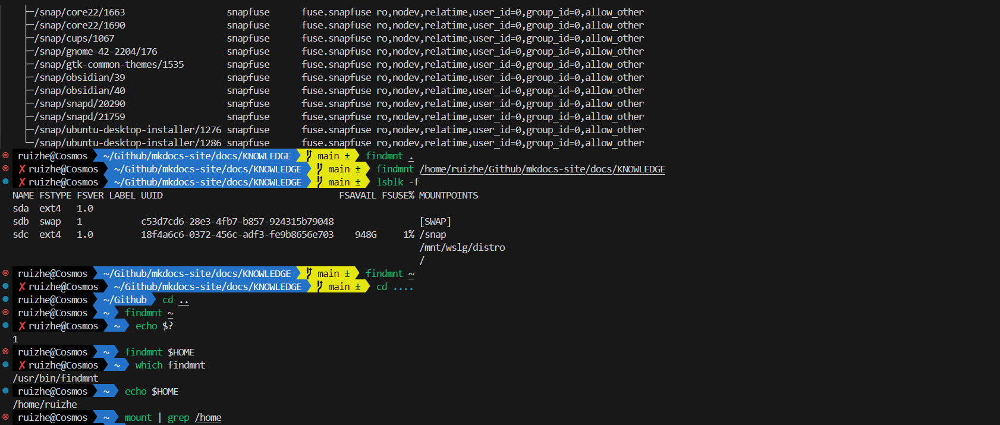
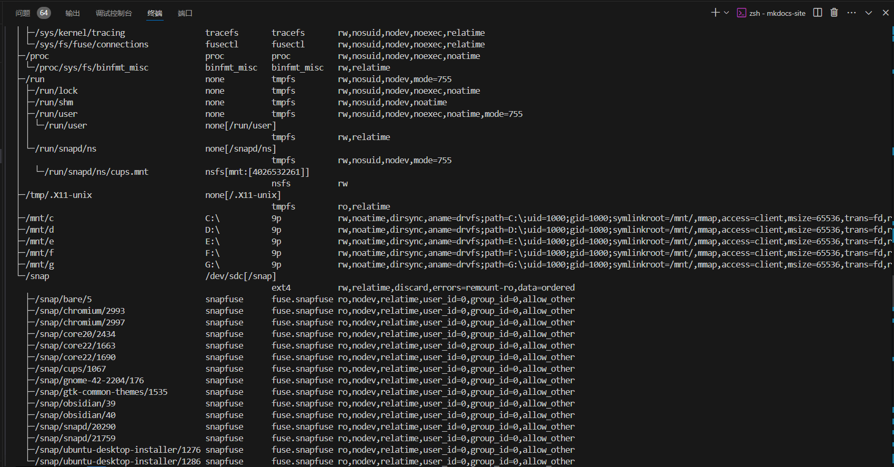
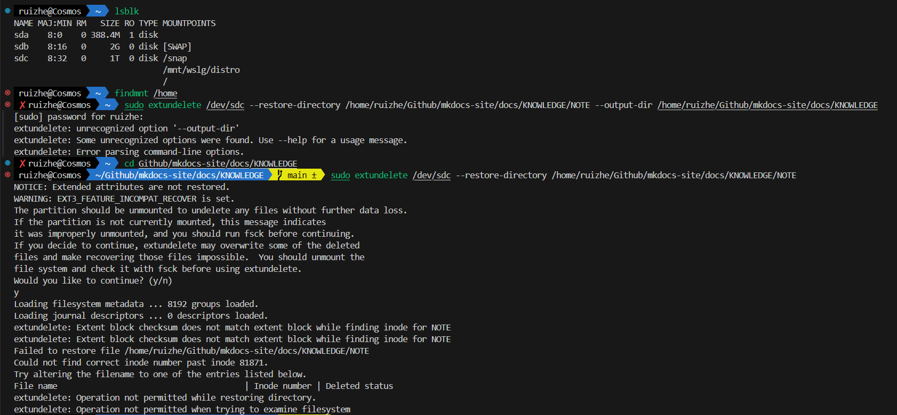
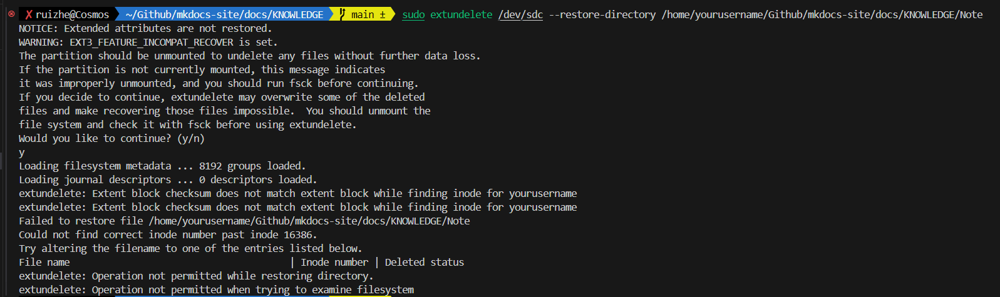

## 2024-11-25
人是万万不能连着写同一门课的两次作业的，因为会恶心到吐……

参考11.25早晨7:30到9:40发生的事情。

试问2个小时用完半个作业本是一种什么体验？

后续：

- 一天花4个小时用完一整个作业本&nbsp;&nbsp;什么水平？

        参考下午16：20到18:30发生的事情。

ZJU的网为什么总是伤害我们的git push origin main呐？

## 2024-11-26

为何生活能如此丰富多彩以至于让我迷失方向、忘记自己的本职工作？

> 事实证明，当人无聊到一定程度的时候，学习真的可以是一件快乐的事。  

>by 咸鱼暄

是我不够无聊吗？

孤独感或许在世界纷纷扰扰之时才愈发强烈。

怎样学会独处？怎样享受孤独？

## 2024-11-27

当代大学生的精神状态 —— 午觉5小时

山西的午觉文化因何而起？

午觉文化何时可以统治世界？

    终于明白git的含金量了

    版本管理最强大的一集

    没有之一!

    我不支持反驳

绝望，无助，万丈深渊深不见底

无知，搜索，天书几篇无法理解

尝试，失败；尝试，失败。

脑中忽然飘过一丝想法 —— 为何不用git？

尝试，一行即成功……

天朗气清，惠风和畅，眼前豁然开朗！

此情此景，不禁吟诗一首

今夜寒风刺骨，机前书写命令。

试用rm -r，却把目录错输。

搜索，搜索！还是git救我。

佑谨哥哥和诗：

挑灯倦意入骨，讲稿全无辞令。

怎将体积误积，又把概率求错。

睡觉，睡觉！代码最后压我。

附上和ChatGPT & terminal 斗争的证明

[问！看不懂！继续问！继续看不懂！](https://chatgpt.com/share/67475067-ccb4-800d-bd8b-736381768827)

## 2024-11-28

甚是无聊，被ddl和学不会的知识压垮的一天。

马上到来的C程实验考，不会；马上到来的SPOCddl，课未上完。

但是似乎上帝并不想让今天过于平淡……

晚上，一对情侣缓缓出现在了我的面前……

熟人……

说实话我学习的时候不希望对面有人的，与云峰哥哥甚是相似

但是这次，不但有人，两个人还亲亲密密搂搂抱抱，男生时不时把头靠在女生肩膀上，男生的手上带着女生的头绳……

不得不把放电脑的空间无限压缩……

不得不把腿收紧，担心碰到nia俩纠缠的双腿

乱我道心！

无心学习，故作此文。

<!-- 工作上，下属不争气，领导看扁我！
领导交给的任务，尽快完成！ -->

## 2024-11-29

浙江大学求是学院云峰学园第二团总支第二次班团例会会议纪要

#### 工作梳理

各班工作梳理梳理

- 2414
    - 新晚
    - 联谊
    - 团支部标识大赛
    - 红旗团支部

- 2413
    - 参观生医工实验室
    - 入团
    - 
- 2412
    - 红旗团支部
    - 读书会
    - 班会 + 想法 + 小组讨论
    - 争创红旗

- 2411
    - 班会
    - 54园级优秀
    - 集体观影
    - 接下来：参观党史馆
    - 

- 2410

    - 班会
    - 主讲人全员参加
    - 集体生日会、游戏
    - 文化衫、帆布袋
    - 求是大先生展览
    - 20届3中全会

- 2409
    - 外国专家
    - 54团支部
    - 标识符
    - 12.1毅行？？？
    - 团支部大会

- 2408
    - 54红旗
    - 标识符
    - 班服
    - 校园骑行
    - 班会

- 2407

    - 班会 按时召开
    - 入团
    - 团员  第一批2 二1 三1？ 团支部20人
    - 毕至居
    - 联谊789
    - logo
    - 团建，吃饭、学长组
    - 班会：理论学习、心理、游戏
    - 志愿者
    - 本科生教育质量大讨论

经费

- 早报销，下周周三下午
- 材料：抬头税号
- 发票（签名）、奖品礼物单、领奖人手写签字、
- 200+俩人签名

#### 心理学习

安全隐患
寝室矛盾
思想状态变化
成绩变化、压力
学习习惯

- 2408
    - 积极性
    - 打卡20人打卡
    - 刷夜？
    - 提问
    - 挺好的：正念冥想、沙盘
    - 期中考完、毕至居
    - 宿舍倾诉，说出来
    - 心理：

- 2409
    - 寝室探讨
    - 领取免费材料
    - 上课热情高
    - 热情积极性
    - 舍友关系无严厉争吵

- 2410

    - 问问题
    - 发题、答案、讨论
    - 氛围好
    - 学习要求严格，压力大

- 2411

    - 学习状态好，方式小规模的课友自习室讨论 
    - 室友问问题，利于沟通
    - C程代码求助
    - 学习打卡，邀请大家分享学习心得，心态分享
    - 压力大：心理委员心理沙盘，育人导师心理讲座，人际关系，分享
    - 4级模考
    - 订材料

- 2412

    - 措施：github共享库、信息共享、同辈辅学、微积分模拟考
    - 集体自习，探讨辩解？
    - 心理中心，身体扫描

    - 转发信息
    - 传授经验
    - 男生寝室走访，心理压力
    - 专业分流
    - 运动、羽毛球赛、约篮球足球

- 2413
    - 集体自习、问卷——没有

    - 资料共享
    - 教材讲义
    - 小测答案、模拟题
    - 2、3个人学、主图约研讨室
    - 男女分工
    - 无集体心理辅导
    - 杭州、浙江心理咨询热线

- 2414
    - 每日一题、公众号发题
    - 有开展，不行
    - 领资料
    - 团建、桌游
    - ？……

同质化！说……

意义

- 各班交流、想法

补充

- 考试：压力大，问题及时反馈给老师

#### 吐槽大会

寝室关系：吵醒，

流程走一遍

老师忙 ~ 

ddl提前，提前发题型。每天去轰炸他，

提前量：从自己出发，层层施压不要，学生组织：教教我，现在好好学~学会

节奏快，群多，信息看不全

班委团委对工作的掌握，快速解决自己工作的活动

责任感

吃小亏好，干的事多，经验提升，长远

独立做很多事

规划、卷：？

**找到适合自己的路，坚定走下去，机会路径很多，适合自己**

江浙沪高校恶性事件层出不穷

- 班里同学的思想动态关注，调整自己的心理状态
- 防御条件？安全？很安全啊！校外人员入校管制
- 大众的心理出问题

98十大有趣的事情，对浙大的未来认识全面，人生的未来蒙上了一层迷雾，背后是很复杂的
- 理性看待
- 关注官方消息，不信谣不造谣不传谣
- 及时汇报
- 管好自己：自己别做有披露的事情，有违规则的事情，行事不张扬
- 学校有评价体系，不符合这个标准，仅此而已

科研成果

学校发展，与日俱下……

重要的是我们自己是什么样子
- 高校人员流动

学校的发展靠谁？各位

每个人都做局外人，没有融入感，大学人际脱节的感觉
- 自私自利人之本性
- 我人好？
- 寝室矛盾及时解决罢

不是完全没有退路就会推

朵朵98：情绪化严重、谣言

网络平台上的体现理性是不可能的

突发事件：11.1条例：突发事件一把公开

其实我发现一个问题，刚刚那个班汇报说宿舍关系好，各种和谐；但是又提到了宿舍确实有矛盾；说明了这个分享报喜不报忧？或者有夸大成分？

不要被撞了or撞别人，精神创伤、身体损伤

游客：校方在管，想进图书馆：严词拒绝；帮人预约入校严厉处罚

#### 问题梳理

- 班委工作汇报

    - 现象：工作汇报和吐槽大会上的言论存在前后矛盾

        - 例如每个班心理委员都说本班学生心理状态积极向上，但是会有同学的未来发展被蒙上了一层迷雾

        - 例如对寝室关系和学习情况的评价基本都是经常互相沟通讨论解决问题，但是会有寝室没有人买水，会有同学反映存在人际关系的淡漠和疏离，每个人都做局外人

    - 问题

        - 有些工作做的不到位，例如心理委员没有真正深入了解同学的心理状态
    
        - 工作汇报报喜不报忧，或者说由于工作不到位导致没有发现“忧”

- “吐槽大会”
    
    - 真实反映出同学们的心理状态，很有意义

    - 工作节奏快、ddl繁重、信息繁杂、安全担忧（安全事故&交通安全）、关注学校未来发展（恰恰体现了浙大青年的责任感）、对人际关系的思考（争当局外人）

《局外人》

