## 边际效用分析

### 效用

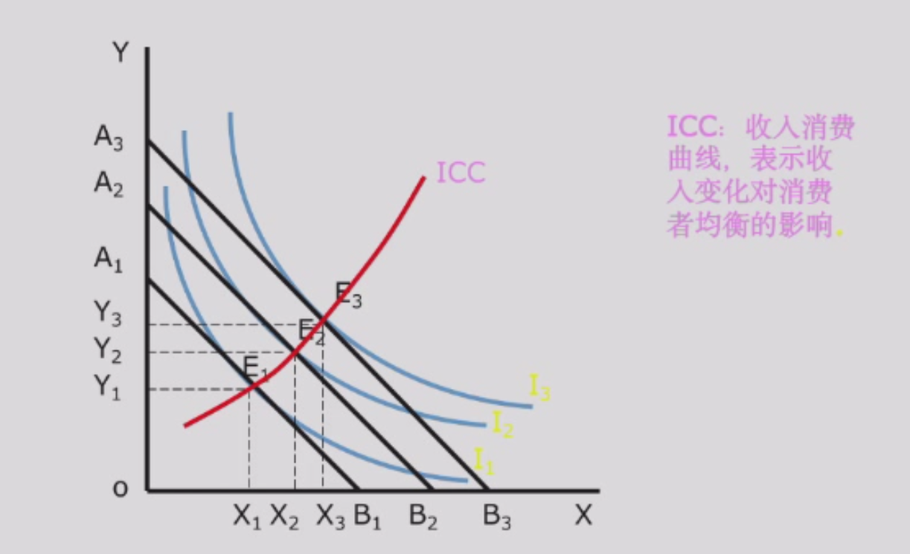

效用 Utility：从某种行为（不一定是消费每种物品）中获得的满足感，消费者主观感受

边际效用 Marginal Utility 递减

效用很难衡量，其绝对值不重要，重要的是不同商品的效用排序。多数时候用货币来衡量效用。

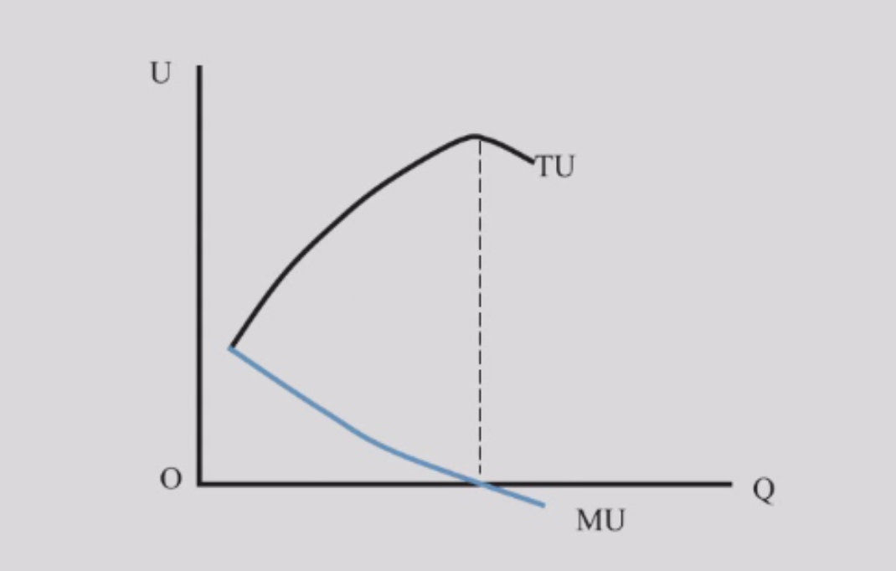

### 消费者均衡

条件：

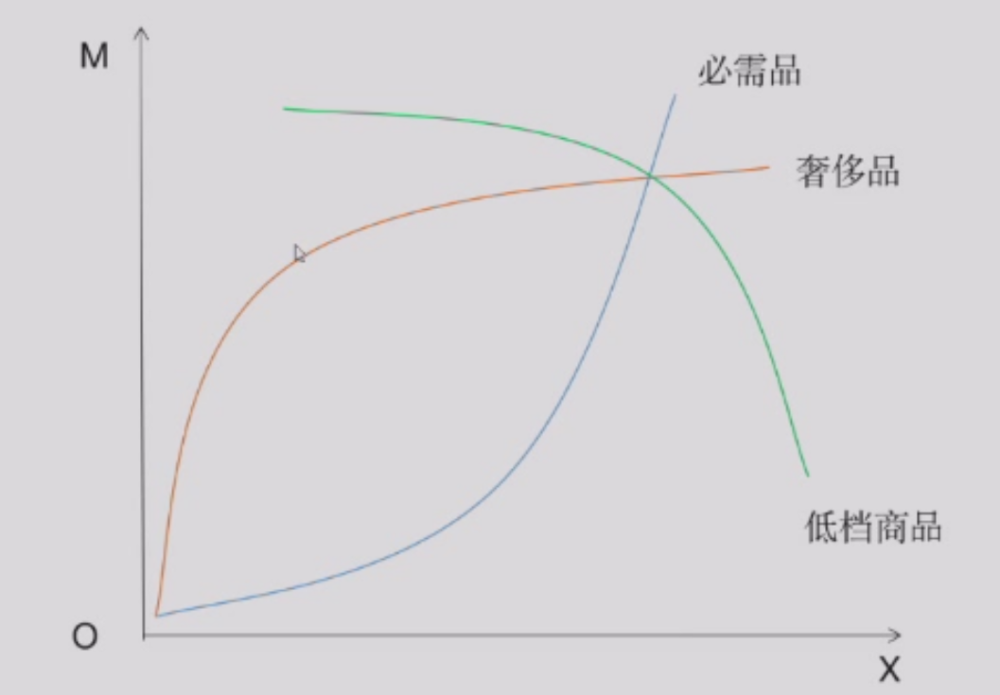

约束条件：收入等于支出

实现条件：拿钱买商品，每一块钱带来的边际效用相等

> MU 是边际效用，P 是价格，不是 $M \times U$...

理解为什么相等：1块钱买 A 商品带来的边际效用大于买 B 商品带来的边际效用，则多买 A 少买 B ，直到相等

### 需求曲线推导

$P = \frac{\lambda}{MU}$, MU 递减，需求曲线也就递减，因为消费者从商品那里获得了边际效用，才会有需求

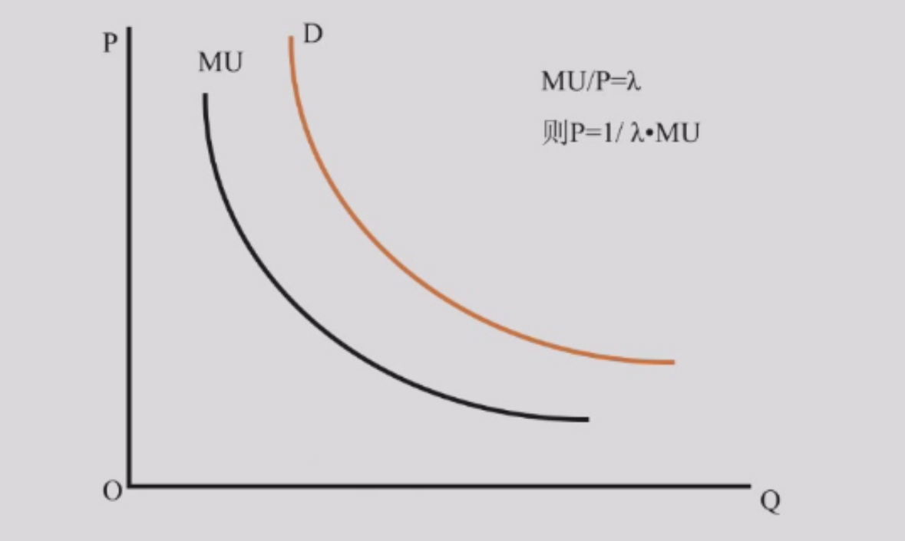

这里需求曲线指的是愿意支付的价格而非标价：

| 特征 | 视角一：价格-数量关系（宏观） | 视角二：价格是边际效用（微观/主观） |
| :---: | :---: | :---: |
| **提问方式** | **“如果”** 市场价格是 $P_1$，消费者会**购买多少数量** $Q_1$？ | **“如果”** 市场上已经有 $Q_1$ 的商品，消费者**愿意为最后一单位商品支付多少价格** $P_1$？ |
| **关注点** | 价格**决定**需求量。 | 数量**决定**消费者对价值的判断。 |
| **曲线读法** | **横向读法：** 从价格 ($P$) 到数量 ($Q$)。 | **纵向读法：** 从数量 ($Q$) 到价格 ($P$)。 |
| **您描述的** | **“价格越高需求越少，两个宏观的量构成的曲线。”** (标准教科书入门描述) | **“看市场上有多少数量的商品，消费者的预期是多少价格。”** (更深刻的经济学含义) |
| **经济学含义** | **需求定律** (Law of Demand) | **边际利益曲线** (Marginal Benefit Curve) / **愿意支付的价格** (WTP) |

### 消费者剩余

消费者在自愿的交易中是获利的！  

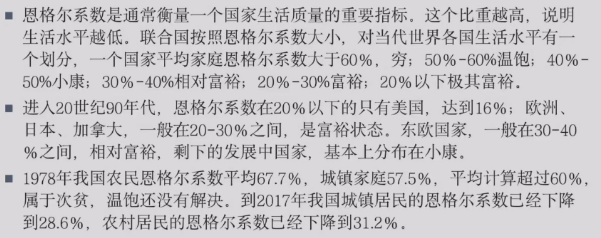

计算：愿意出的价钱 - 实际付出的价钱，如果多件商品就是 $\sum (WTP - P)$

消费者剩余作用：衡量消费者在交易中的获利程度，反映消费者福利水平。

## 消费者偏好

偏好 Preference

### 理性偏好公理

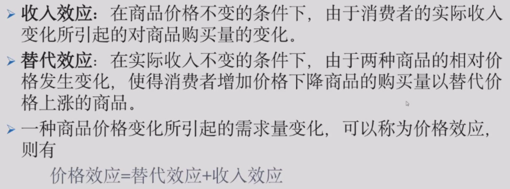

理性偏好有上面三个公理

比较的符号：$\succ$ 表示偏好，$ \sim $ 表示无差异，$ \prec $ 表示不偏好

当多维度比较、集体比较时，可能会出现循环偏好，违反传递性公理

### 无差异曲线

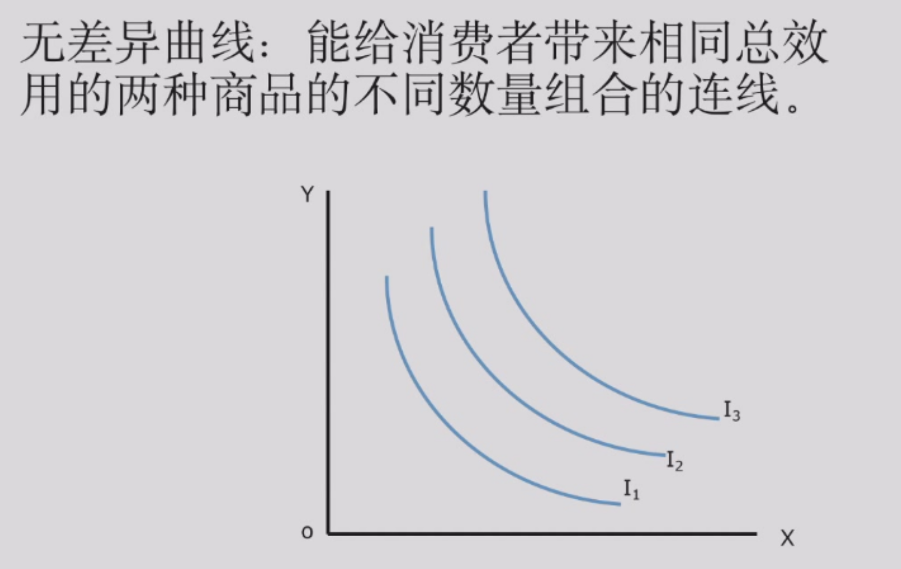

X 轴 Y 轴分别表示两种商品的数量

一条无差异曲线右上方的点更好

无差异曲线的特征

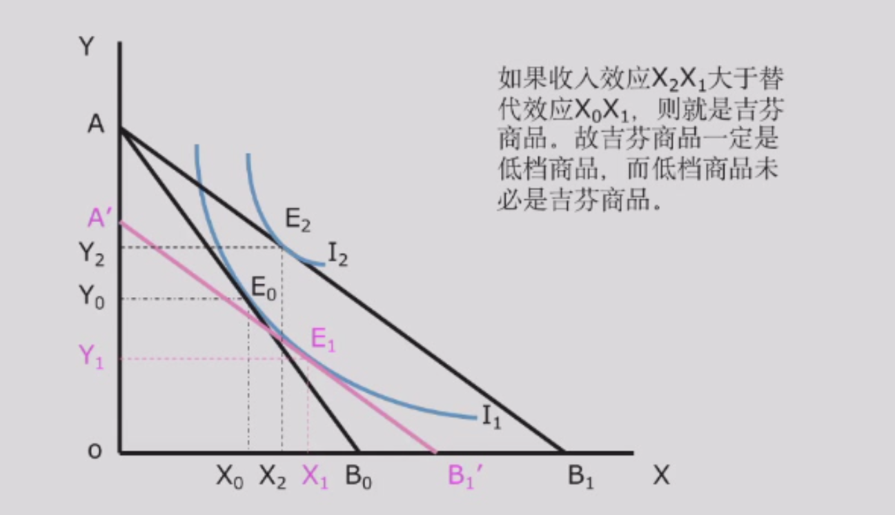

斜率为负：因为两种商品都是“多多益善”（前提：两种商品都是好的商品），要保持效用不变，增加一种商品的数量，必须减少另一种商品的数量

### 边际替代率 

Marginal Rate of Substitution, MRS

商品的边际替代率，就是无差异曲线斜率绝对值

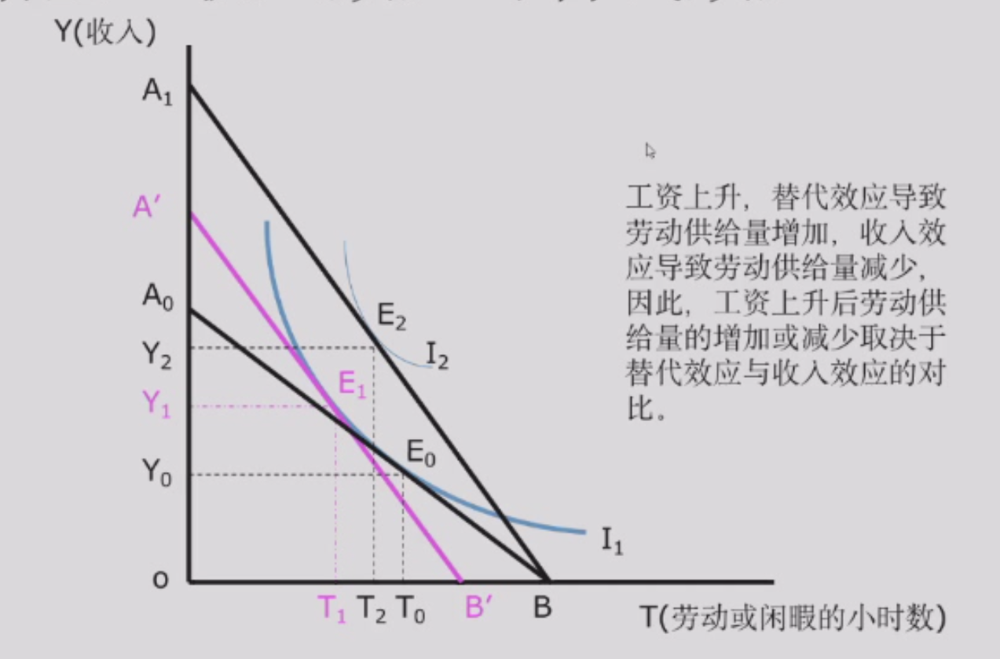

边际替代率递减：随着 X 商品数量的增加，消费者愿意放弃的 Y 商品数量越来越少

直觉上可以理解：当我有很多面包，为了得到一单位牛奶，我愿意放弃很多面包；但当我面包不多时，为了得到一单位牛奶，我就不愿意放弃那么多面包了

解释（公式推导）：

假设效用函数为 $U(X,Y)$，无差异曲线上的点满足 $dU = 0$，则

$$\frac{\partial U}{\partial X} dX + \frac{\partial U}{\partial Y} dY = 0$$
$$MRS_{XY} = -\frac{dY}{dX} = \frac{\partial U / \partial X}{\partial U / \partial Y} = \frac{MU_X}{MU_Y}$$

而随着 $X$ 增加，$MU_X$ 递减；且 $Y$ 减少，$MU_Y$ 递增，所以 $MRS_{XY}$ 递减

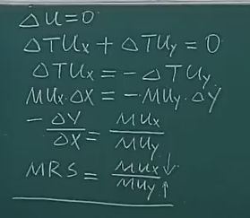

极端例子：完全互补品，完全替代品

完全替代品：

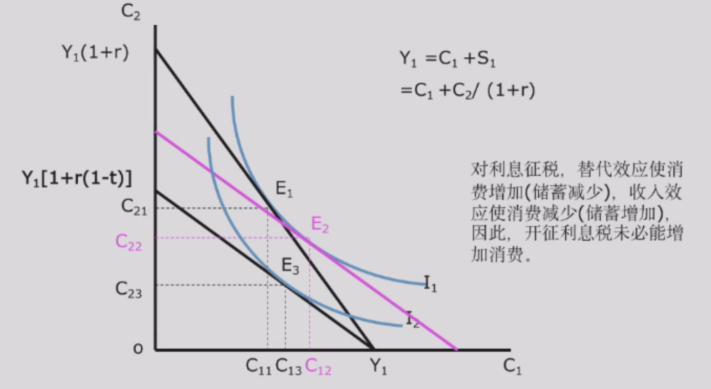

完全互补品：

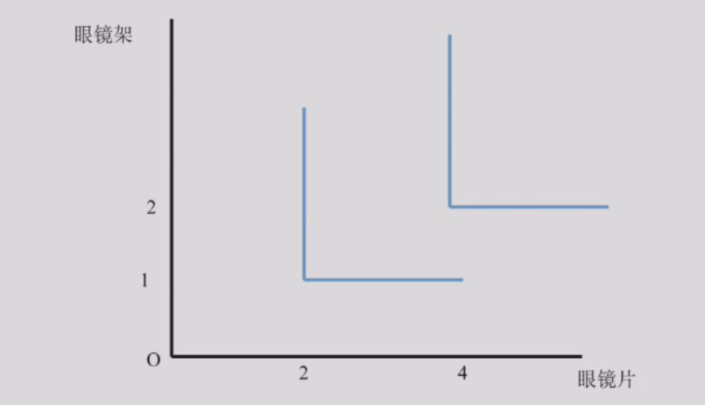

L 型：因为值增加一个不增加另一个是没有意义的，效用是一样的。

一定在拐点消费，因为多买一个不买另一个没有效用

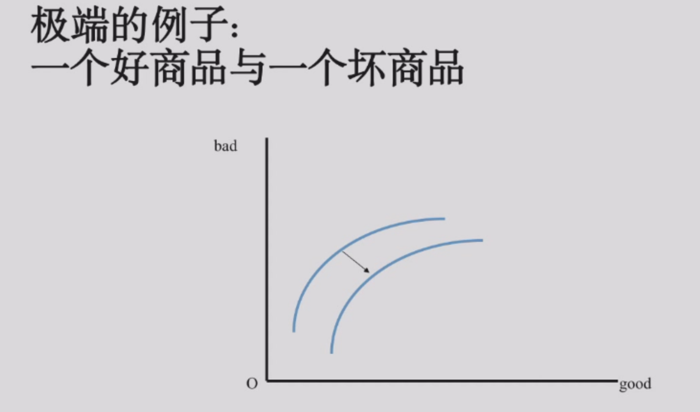

- 右下的是效用大的：可以固定一个看另一个
- 斜率逐渐减小因为坏商品多，得拿更多的好商品来平衡

## 消费预算线

预算线外面的点是买不起的，里面的点是买得起的

当收入增加（价格不变）时，预算线平行外移，斜率不变

只有一种商品价格变化时，预算线绕和另一个轴的交点旋转，涨价时变陡（往里面旋转），降价时变平缓（往外面旋转）

多个变化：画线就行

- 三个变化倍数一样，预算直线不变

## 消费者均衡的实现

无差异曲线和消费预算线的切点

理解：首先肯定得在消费预算线上面，另外保证效用最大，即无差异曲线尽可能往右上方

拐角解

实际上在下面切点但是 Y < 0 不可行

计算题：

消费者均衡的实现条件：

$$MRS_{XY} = \frac {MU_X}{MU_Y} = \frac{P_X}{P_Y}$$

$$\text{MU}_X = \frac{\partial U(x, y, \dots)}{\partial x}$$

> 原因：边际效用 ($MU_X$) 是指在其他商品的消费量保持不变的条件下，消费者增加一单位商品 $X$ 的消费所引起的总效用 ($U$) 的增量。因此，它的数学表达式就是效用函数 $U$ 对商品 $X$ 的消费量 $x$ 的偏导数

图解：

补充：cobb-Douglas 效用函数：$U = A X^a Y^b$

此时，消费者都会将收入按照固定比例 $a : b$ 来购买 $X$ 商品和 $Y$ 商品，即

$$X^* = \frac{a}{a+b} \frac{M}{P_X}$$
$$Y^* = \frac{b}{a+b} \frac{M}{P_Y}$$

## 需求曲线的推导

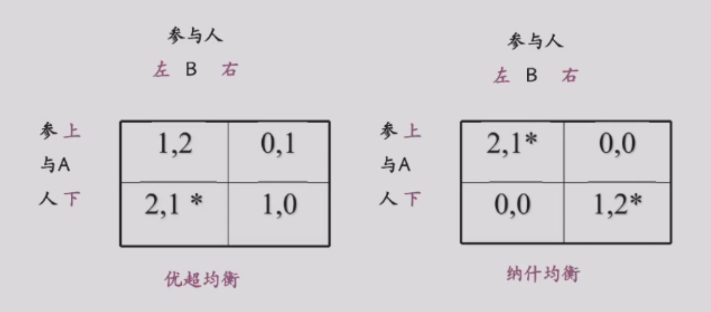