## 生产和生产函数

### 企业

有限公司的：

- 股东责任有限，投入多少钱承担多少钱的责任
- 具有连续性，公司不会因为股东的变动而解散，独立于股份持有者

#### 企业的目标

利润最大化

$$\pi = TR - TC$$

- TR: total revenue 总收入，$TR = P \times Q$
- TC: total cost 总成本，

### 生产和生产要素

- 劳动：体力和脑力
- 土地：地上森林，地下矿藏等
- 资本：human made aid to production，人造的东西又投入生产
- 企业家才能：区分“脑力劳动”的点在组织管理整个企业，承担风险，

### 生产函数

生产函数的形式

固定比例：生产这么多东西要用的生产要素比例是固定的

柯布-道格拉斯生产函数：

- A: 技术水平
- α, β: 生产要素的产出弹性，反映各个生产要素对产出的贡献程度

产出弹性：

$$\frac{\partial Q/Q}{\partial L/L} = \frac{\partial Q}{\partial L} \times \frac{L}{Q} = \frac{A \cdot \alpha \cdot L ^{\alpha - 1} \cdot K^\beta}{A \cdot L^\alpha \cdot K^\beta} = \alpha$$

## 短期生产分析

### 短期生产函数

短期和长期的区分标准：是否所有的生产要素都可以变化，在这个时间段内变不了就是短期

TP: total product 总产量
AP: average product 平均产量
MP: marginal product 边际产量

都是关于劳动的，AP 是每个劳动单位平均生产多少产品，MP 是增加一个劳动单位能多生产多少产品

AP：和原点连线的斜率

图中直线 OB 是最大 AP 的点，就是曲线的切线，且这个点的 MP = AP，故 MP 穿过 AP 的最高点

证明：

理解：边际量大于平均量时，平均量上升，反之下降

### 边际收益递减

最佳组合，例子，工人和机器

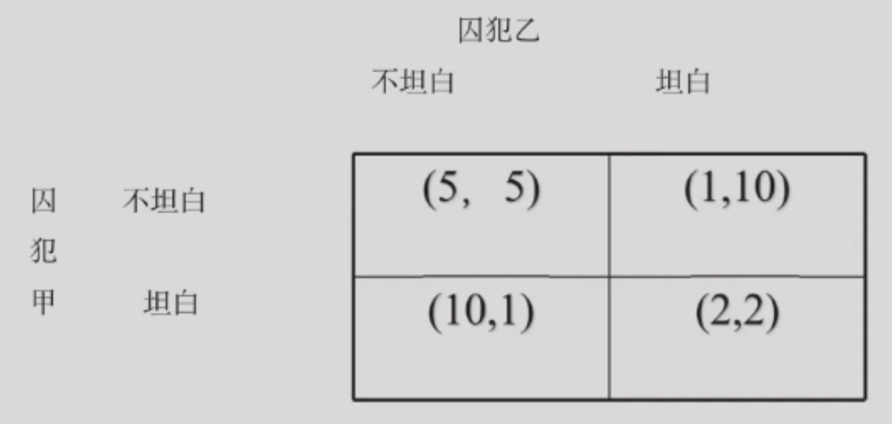

### 短期生产的三个阶段

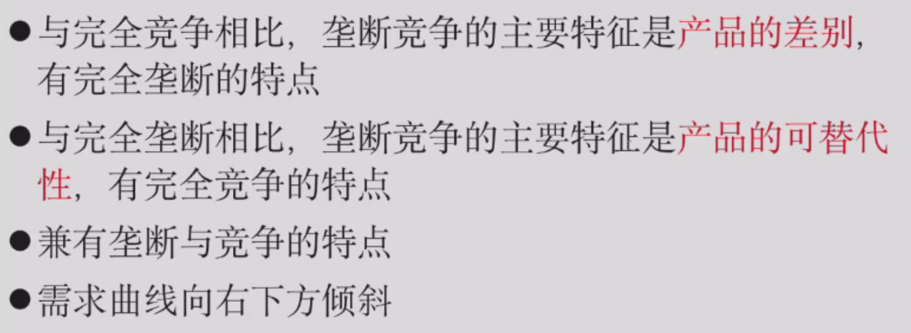

- 肯定不会在第三阶段，边际产量为负，减少 L 就能降低成本
- 第一阶段，总有动力去增加 L，因为 AP 一直在提高
- 肯定在第二阶段生产

### 生产要素的产出弹性

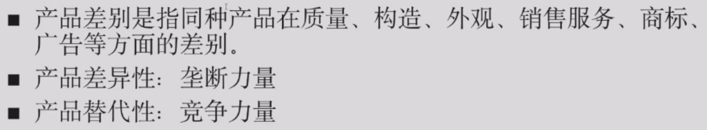

## 长期生产分析

### 等产量曲线

类似：无差异曲线（一一映射）

### 边际技术替代率递减

边际技术替代率 (MRTS: marginal rate of technical substitution)

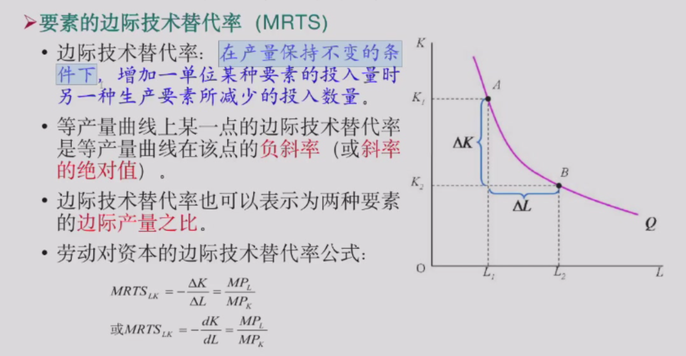

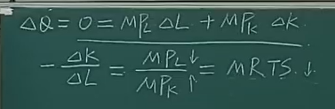

!!! info "数学原理：全微分"

    对于一个二元函数 $z = f(x, y)$，如果它在点 $(x, y)$ 可微，那么它的全微分 $dz$ 或 $df$ 为：
    
    $$df = \frac{\partial f}{\partial x} dx + \frac{\partial f}{\partial y} dy$$

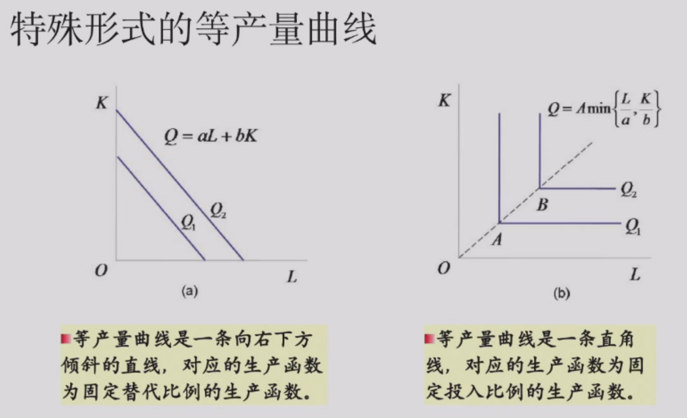

### 等成本线

本质上等于消费者的预算约束线

- L的价格：wage 工资（w）
- K的价格：rental rate 租金（r）
- 斜率：-w/r，两者的相对价格

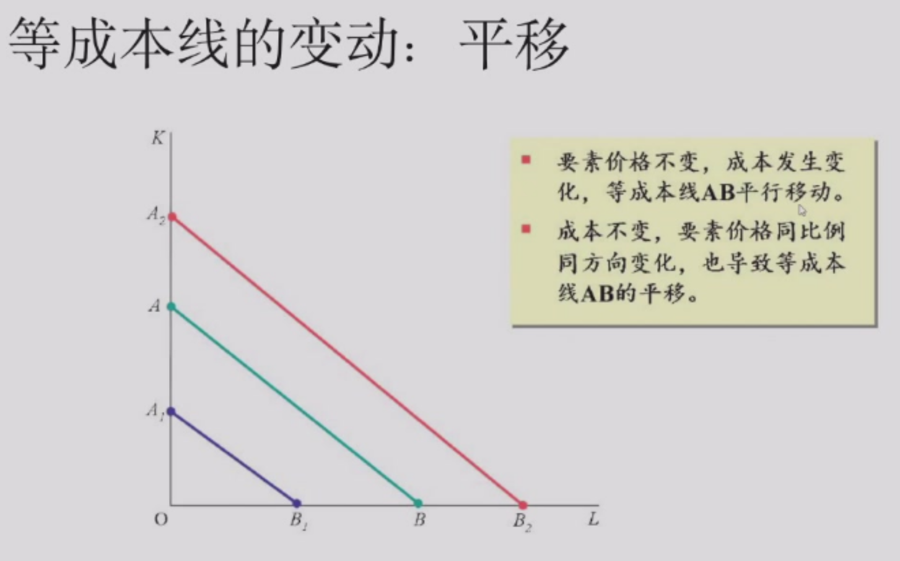
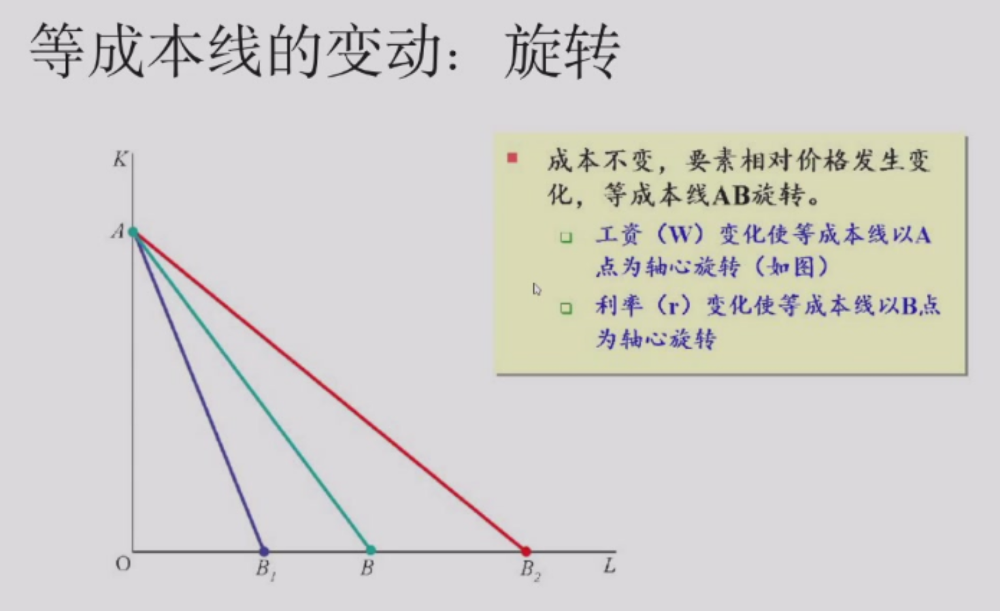

工资上涨，可以买更少的 L，L轴的截距变小，等成本线绕 K 轴的截距旋转

### 生产要素最优组合的确定

两种情况：
1. 成本既定，产量最大化
2. 产量既定，成本最小化

其中：$\frac{MP_L}{w} = \text{每花一块钱在 L 上能多生产多少产品}$
$\frac{MP_K}{r} = \text{每花一块钱在 K 上能多生产多少产品}$

约束条件：边际产出之比等于价格之比

### 生产扩张线

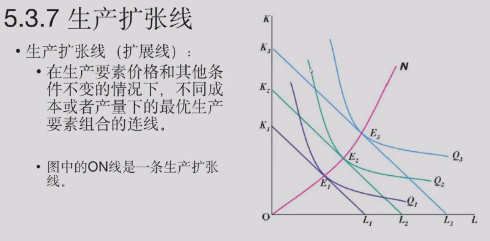

### 规模收益

- 规模收益递增：产出增加的比例大于投入增加的比例
- 其他两种同理

必须得同比例变化

当企业从小到大，一般会依次经历规模收益递增，规模收益不变，规模收益递减三个阶段

判断生产函数的规模收益类型的方法：

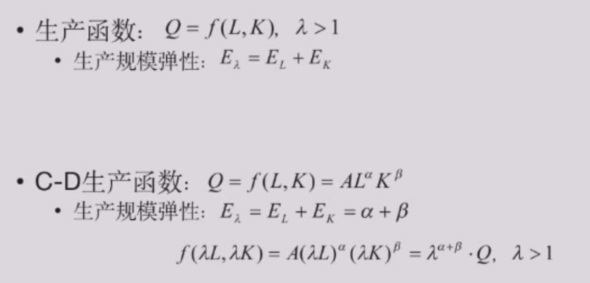

$$\text{产出对劳动的弹性} + \text{产出对资本的弹性} = \text{规模报酬弹性}$$

$$\epsilon = \epsilon_L + \epsilon_K$$

### 要素价格变化的效应

同理。

- 转动：替代效应
- 平移：产量效应

## 成本

经济学中的成本指的是机会成本

### 机会成本

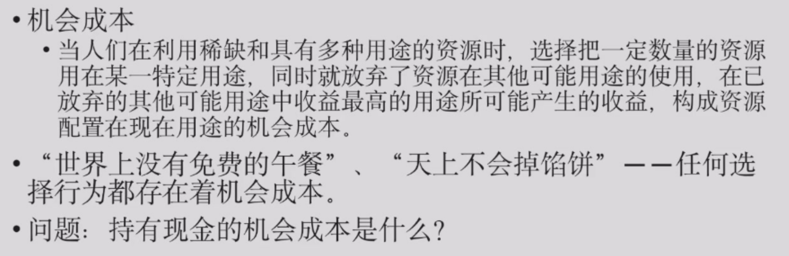

其他用途中收益最高的那个

### 成本概念

机会成本/会计成本

显性成本/隐性成本

> 隐性成本：企业使用自己拥有的生产要素的机会成本

!!! info "例子"

    1. 企业主用自己拥有的厂房生产产品：房子的租金是隐性成本，且是机会成本的考虑对象之一

    2. 企业主自己在企业工作：自己的工资是隐性成本，叫做“正常利润”。

经济利润/会计利润

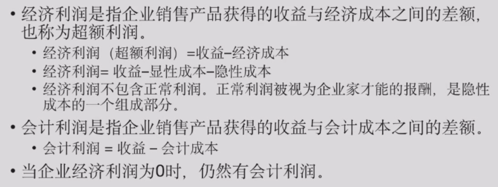

正常利润：是隐性成本的一部分，是企业主投入自己时间和资源的机会成本，不算在经济利润中

**所有的经济成本都是机会成本，而经济成本被拆分成显性和隐性两种形式。**

沉没成本/可回收成本

### 短期成本分析

- 可变成本（variable cost）：可变要素产生的成本
- 固定成本（fixed cost）：固定要素产生的成本
- 平均成本：总的除以产量

$$TC = TFC + TVC$$
$$ATC = \frac{TC}{Q} = AFC + AVC$$
$$AVC = \frac{TVC}{Q}$$
$$AFC = \frac{TFC}{Q}$$
$$MC = \frac{d TC}{d Q} = \frac{d TVC}{d Q}$$

短期成本分类：

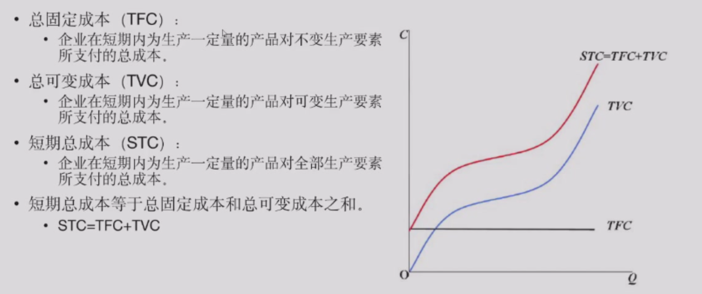
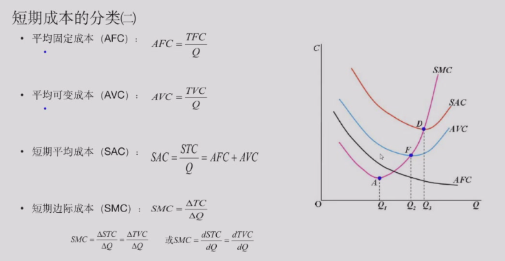

SMC 曲线依次穿过 AVC 和 SAC 的最低点

???+ info "证明"

    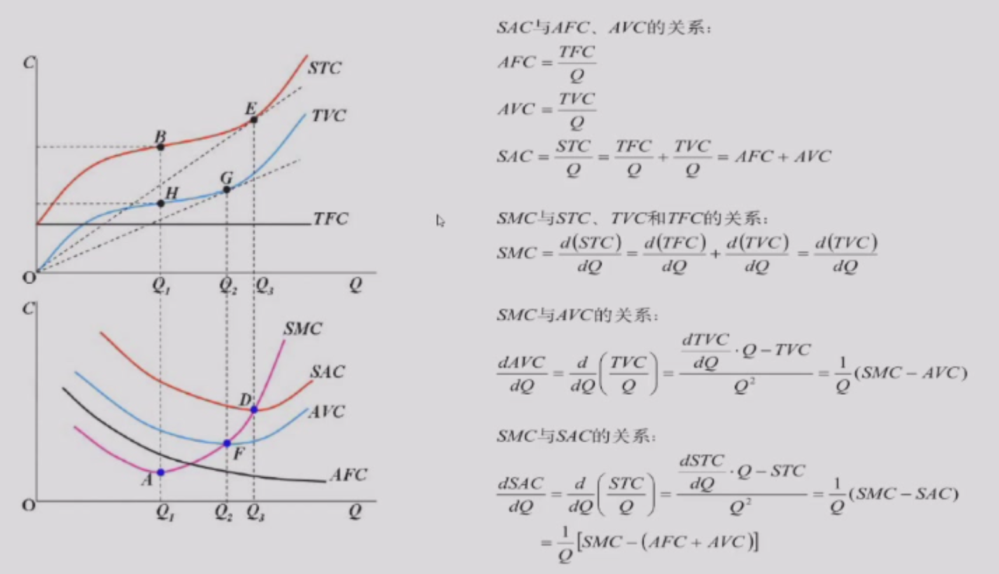

类比：MP 穿过 AP 的最高点
