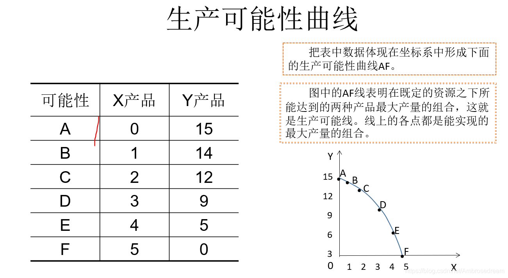

!!! question ""

    - 什么是经济学？
    - 基本理论分类
    - 研究方法

## 什么是经济学

!!! warning ""

    在资源稀缺的情况下，个体如何选择？这些选择如何通过市场机制影响资源配置？

    - 选择：无处不在

分工，提高效率（机器 / 人员分工）

“能满足需要的经济物品总是稀缺的”

生产、分配、消费的过程中形成的 **规则** ，规则在演进

供给 / 需求，借用了物理学的平衡理论

基本的假设：**人会利用各种信息，使得自身利益最大化**

!!! info ""

    你想干什么 —— 你能干什么 —— 你干了什么

- 消费者的目标：自身效率最大
- 生产者的目标：自身利益最大
- 目标：赚很多的钱
- 限制：法律法规、道德舆论、技术
- 结构：选择，最优的选择

与自然科学不同的是，作为社会科学的经济学现象无法重复进行，受制于历史社会条件

### 经济学与资源配置和利用

矛盾：资源的稀缺性和人的欲望的多样性和无限性；于人类的愿望而言，经济物品和产生这些物品的资源是稀缺的，**选择如何利用现有资源生产经济物品满足人类欲望** 。

人类欲望的性质

- 无限性
- 多样性

    ```
    从人的一生讲，欲望无处不在
    ```

资源的特点

- 稀缺性：基本假设，相对于人类的需求而言是稀缺的

    ```
    稀缺的相对性：100人涂答题卡，20钢笔，80铅笔，铅笔数量多，但铅笔是稀缺的。
    ```

- 用途的可选择性：一种资源多种用途，两种及以上资源的组合利用

经济物品 —— 免费物品

因为稀缺，产生了各种问题：

- 生产什么
- 通货膨胀

经济学告诉人们如何选择

!!! success ""

    微观经济学的核心：**资源配置问题**

举一个例子，三国演义，赤壁之战中，为什么关羽会放走曹操？孙权为什么要和刘备合作？司马懿面对空城计时候为什么不进去？

### 生产可能性曲线（PPC）

定义：在一定技术条件下，充分有效利用各种资源生产各种物品按不同比例组合的最大可能产量

形状：上凸的曲线
曲线：用既定资源生产两种产品的最大数量组合的连线

- 曲线上：充分利用资源
- 曲线内：资源闲置
- 曲线外：当前资源 / 技术条件下无法实现
- 资源增加 / 技术进步：右移



割线斜率：边际转换率

割线斜率增加：边际转换率递增，单位产品的机会成本递增

- 也就是说，增加等量 A 产品，放弃的 B 产品递增

到底在那个点：与两种商品的价格有关，与经济类型有关（市场 / 调控）