## 为什么用弹性

弹性定义：百分比之比

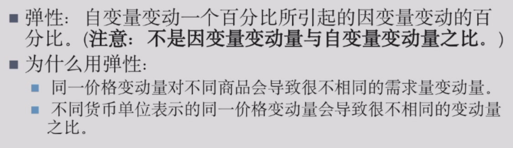

## 需求价格弹性

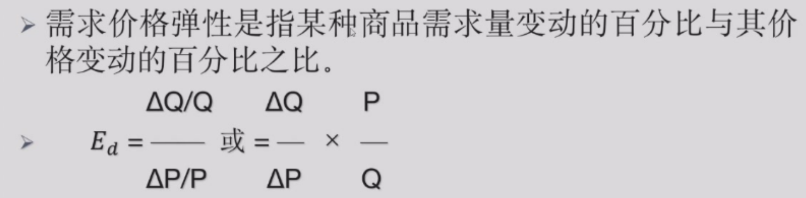

价格变化一个百分点的时候需求变化多少个百分点

### 计算公式

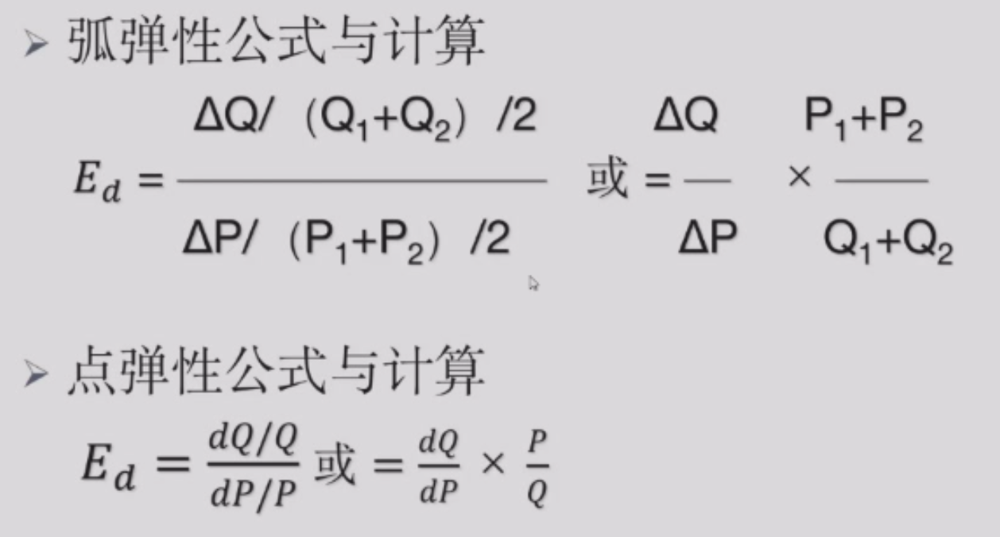

注意变化量带符号（负号）！

点弹性：某一个点，变化一个小量 $d多少$

一般都是负号的，但是题目中说正数就是取过绝对值。

另外，说弹性大/小说的是绝对值

### 需求价格弹性分类

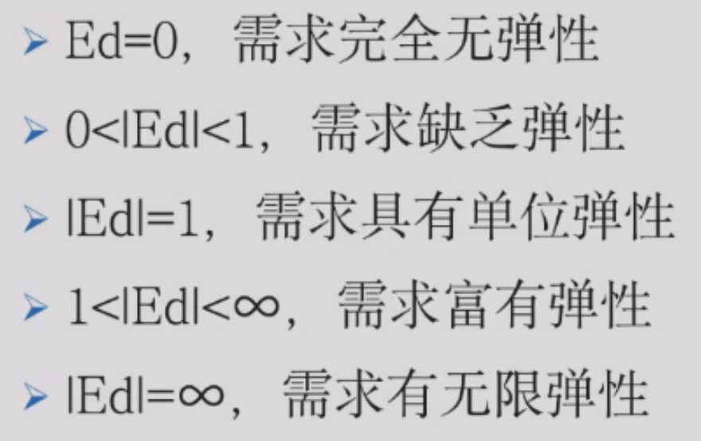

- 需求富有弹性：对价格敏感
- 需求缺乏弹性：对价格不敏感
- $E_d = 0$: 药物
- $E_d = \infty$: 完全竞争市场（商场里面所有商家都卖一样的东西，一涨价消费者就跑路）

### 影响需求价格弹性的主要因素

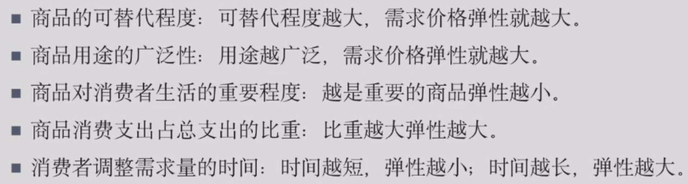

可替代性

用途，也就是可替代性，用途广，也就是在不同领域都有替代品，同可替代性。

时间：例如汽油，短期（5天一个月）该开车还得开，长期（10年）新能源

其他因素：

- 紧迫性/重要程度/可以推迟的吗
- 特殊商品例如成瘾商品，弹性小，例如毒品

### 弹性与斜率

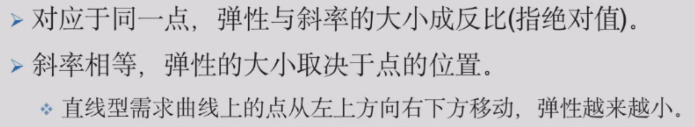

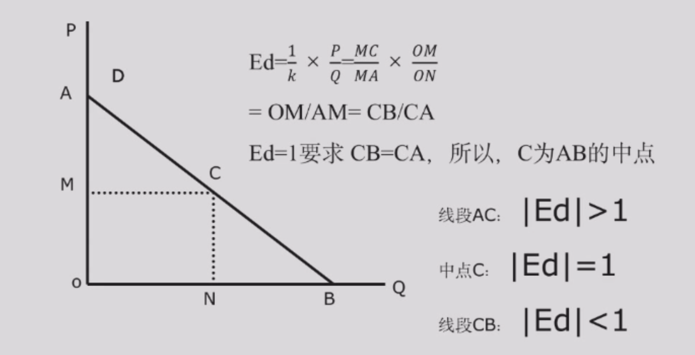

线上中间的点的弹性是1

一条直线上每个点的弹性不同，对应的弹性的分类也不同

### 弹性和收益

收益 $TR$：收入 Total Revenue, 总收入

$$TR = P * Q$$

- 假设所有物品都按平均价格卖出
- 不考虑成本，就是收入不是利润

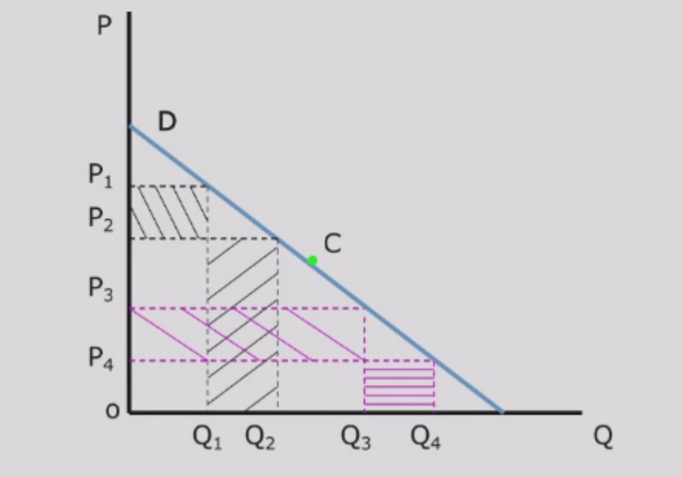

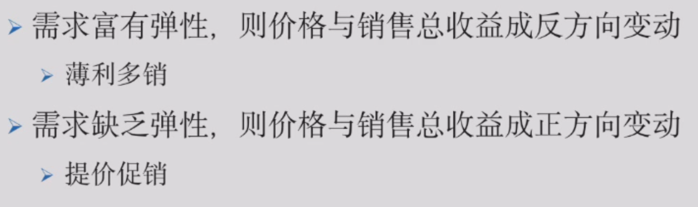

理解：

- 富有弹性：对价格不敏感，价格降低 Q 增加很大，TR 跟着变化幅度大的 Q 变化，增加
- 缺乏弹性：对价格不敏感，P 变化幅度比 Q 大，P 减少 TR 减少

### 需求价格弹性分类

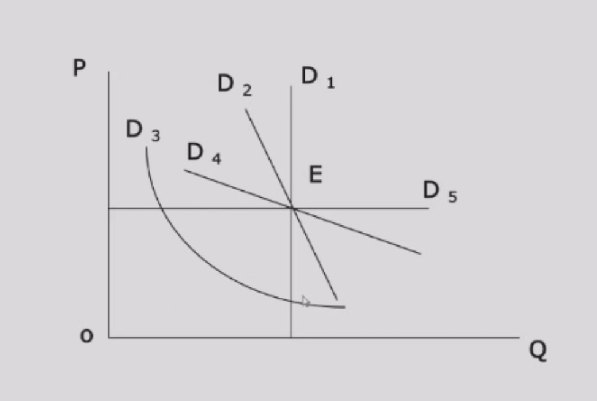

## 需求收入弹性

定义：收入变动一个百分点时候需求变动多少个百分点

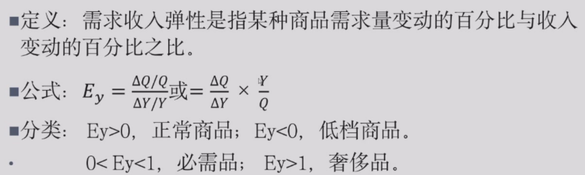

分类：

- 见价格理论部分“正常商品/低档商品”
- $(0, 1)$: 收入上升比需求上升多，即收入上升了对那个物品的需求上升没那么多，不管收入怎样都需要它，即必需品。想食物，不管收入多少都要吃
- $(1, +\infty)$: 奢侈品，工资降低很多，肯定先削减奢侈品的消费而非食物

## 需求交叉弹性

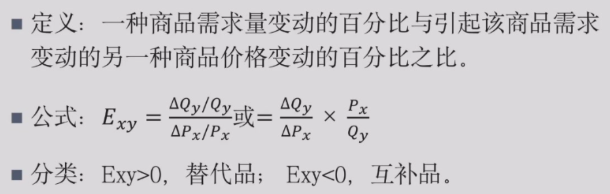

定义：x价格变动一个百分点，y的需求变动多少个百分点

通过计算$E_xy$判断替代品/互补品

## 供给价格弹性

### 定义

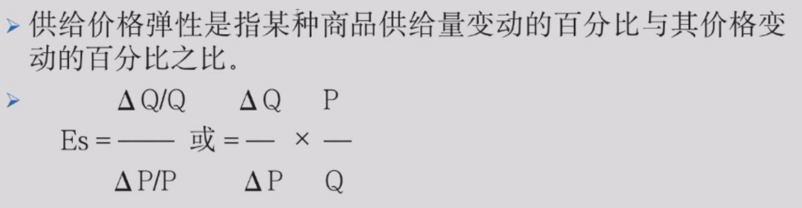

### 公式

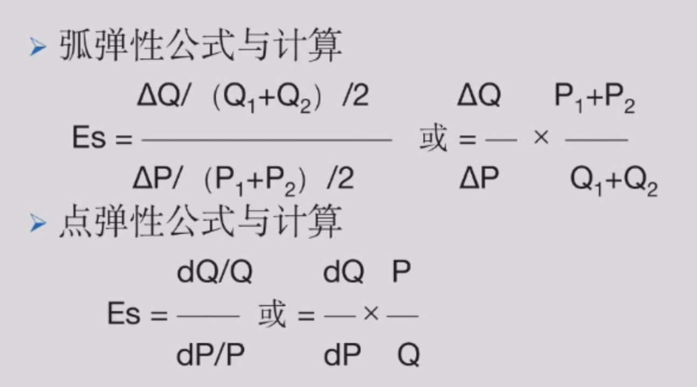

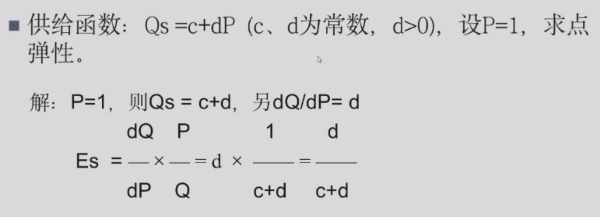

- 基本类似需求价格弹性

### 分类

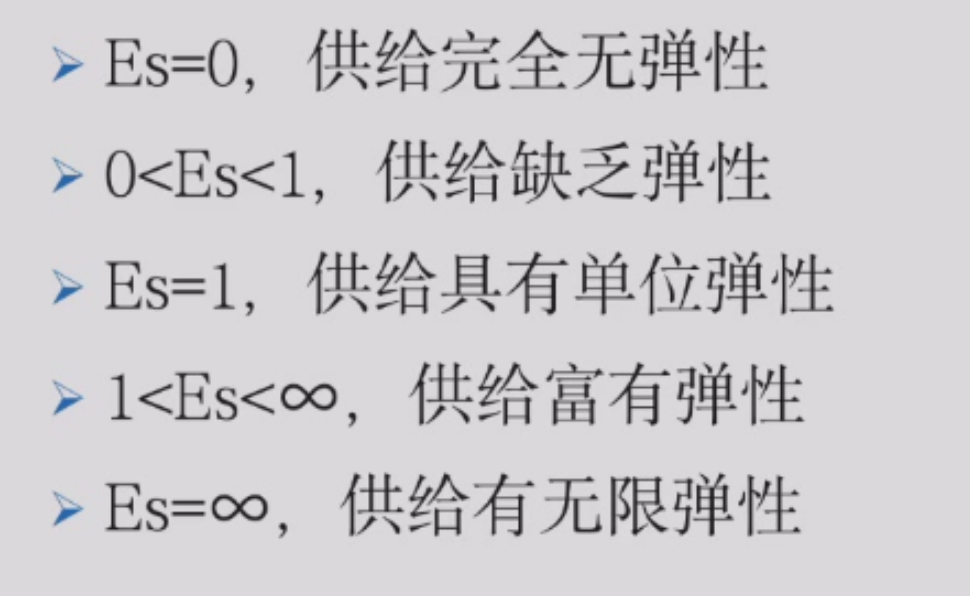

- E_s = 0: 数量固定的，例如土地/剧院

### 影响因素

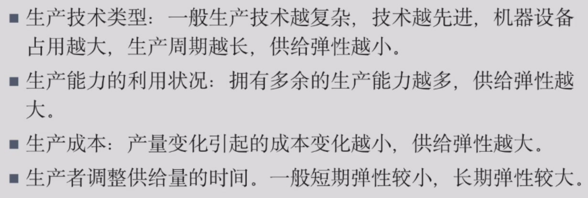

核心：**生产和储存的灵活程度**

- 技术：技术限制没办法灵活的调整产量，供给变化难
- 利用状况：例如工厂满负荷无闲置就不能灵活调整产量
- 生产成本：生产（供给）变多，原料需求变多，涨价，成本变化，涨价很快则没办法大幅度提高供给

其他因素：

- 储存的方便程度：好储存当价格变化大可以快速增多供给，不好储存则得现生产，弹性小

## 弹性理论的应用

### 谷贱伤农

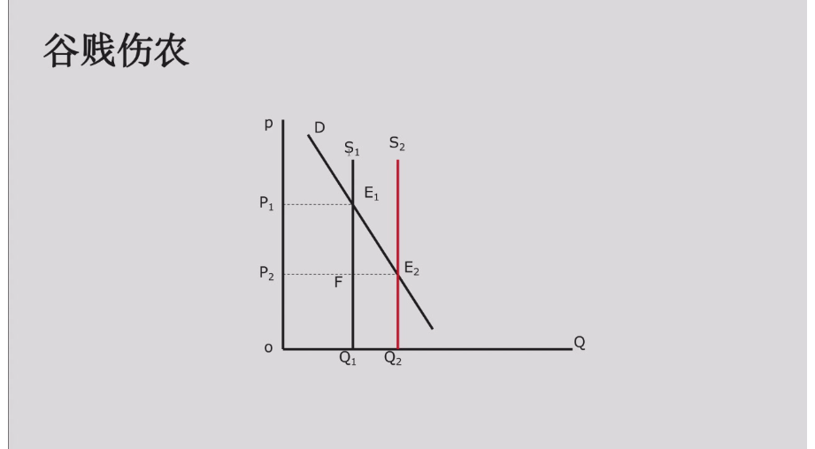

- 对粮食的供给是不随价格变化或者随价格变化很小，因为生产多少就是多少且不好储存之类的
- 对粮食的需求随价格变化：缺乏弹性，因为必需品

新均衡点形成：供给增加，但需求曲线 ($D$) 缺乏弹性，因此新的市场均衡价格 $P^*$ 会大幅下降，而均衡数量 $Q^*$ 虽然增加，但增加的幅度较小。

总收益变化： 农民的总收益 ($TR$) 为 $P \times Q$。

- 因为 $|E_d| < 1$（需求缺乏弹性），所以价格下降带来的收益损失（$P$ 减少）大于销售量增加带来的收益增加（$Q$ 增加）。
- 结果： $TR_{新} < TR_{旧}$，即丰收反而让农民的总收入减少。

结论： “谷贱伤农”的推导，关键在于供给增加和需求缺乏弹性，而不是需求增加。

### 税赋分担理论

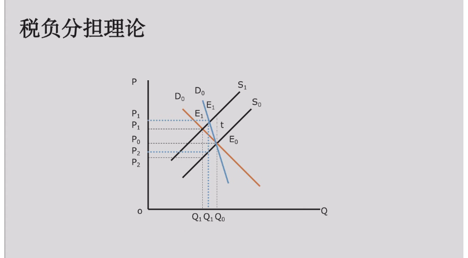

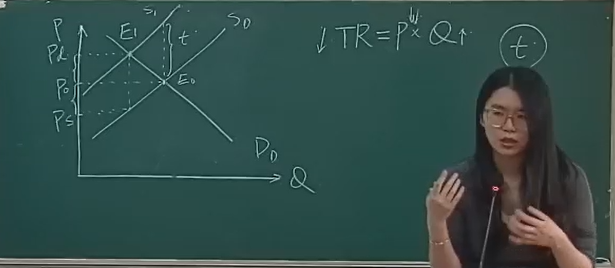

征税会改变曲线：

- 对卖家征税，减少供给，同样价格下数量减少，两条供给曲线纵坐标差（$\Delta P$）是 $t$
- 对买家征税，减少需求，同样价格下数量减少，两条需求曲线纵坐标差（$\Delta P$）是 $t$

找到新的均衡点，再做垂线和原来曲线交点，纵坐标差是 t ，两个坐标的纵坐标就是卖家收到的钱和买家付出的钱。和原来均衡点的纵坐标相比，两端差值就是买家和卖家分别承担的税收。

结论：对买家征税和对卖家征税的结果相同

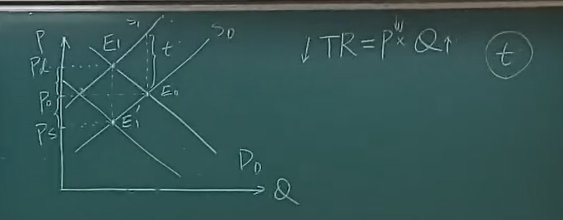

画图时候甚至可以不用移动曲线，直接画出高度为 t 的竖线，生产者收入和消费者开销就知道了

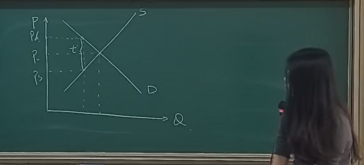

税收归宿（Tax Incidence）

理解：“缺乏弹性”意味着市场一方（无论是消费者还是生产者）对价格的变化反应非常小，他们难以通过改变购买或生产数量来逃避税收。

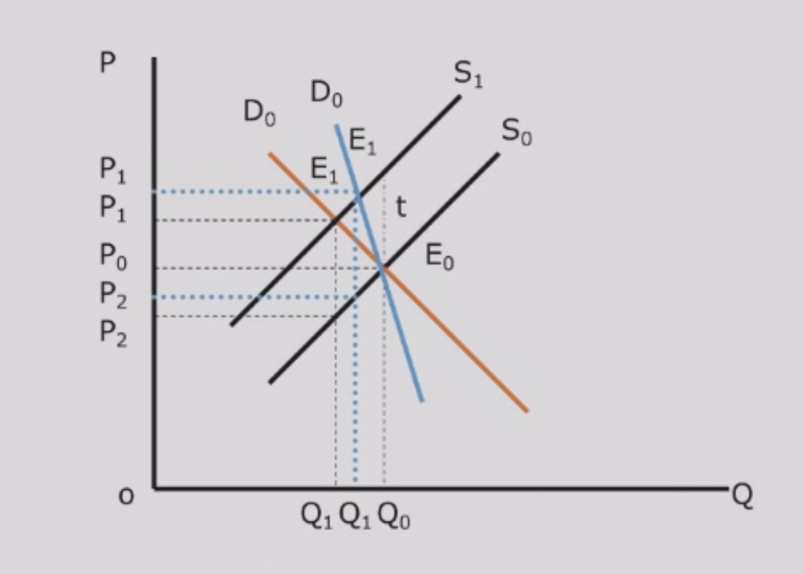

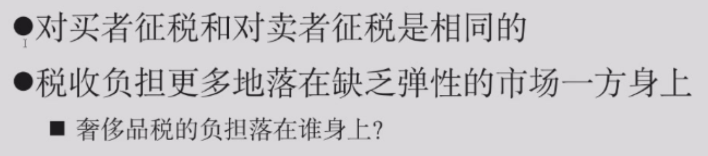

有税收之后，$P_d \ne P_s$

分开写（if 线性）：

$$Q_d = b + k \times P_d$$

$$Q_s = c - m \times P_s$$

公式

用 $E_D$ 表示需求价格弹性，用 $E_S$ 表示供给价格弹性。消费者承担的税负比例： $$\frac{E_S}{E_S + |E_D|}$$ 生产者承担的税负比例： $$\frac{|E_D|}{E_S + |E_D|}$$ 结论： 弹性越小，其绝对值（或 $E_D$ 的绝对值）越大，该方承担的税负比例就越高。例如，当 $|E_D|$ 接近于 0 时（需求完全无弹性），消费者承担的税负比例接近于  $\frac{E_S}{E_S} = 1$（全部税负）。

举个🌰

- 奢侈品税：消费者弹性高，因为不是必须，且在消费比重中占比大。所以负担在生产商上。

- 烟草税：消费者弹性低，因为成瘾，所以负担在消费者。

### 蛛网模型

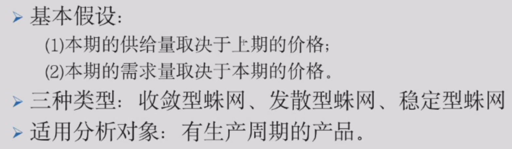

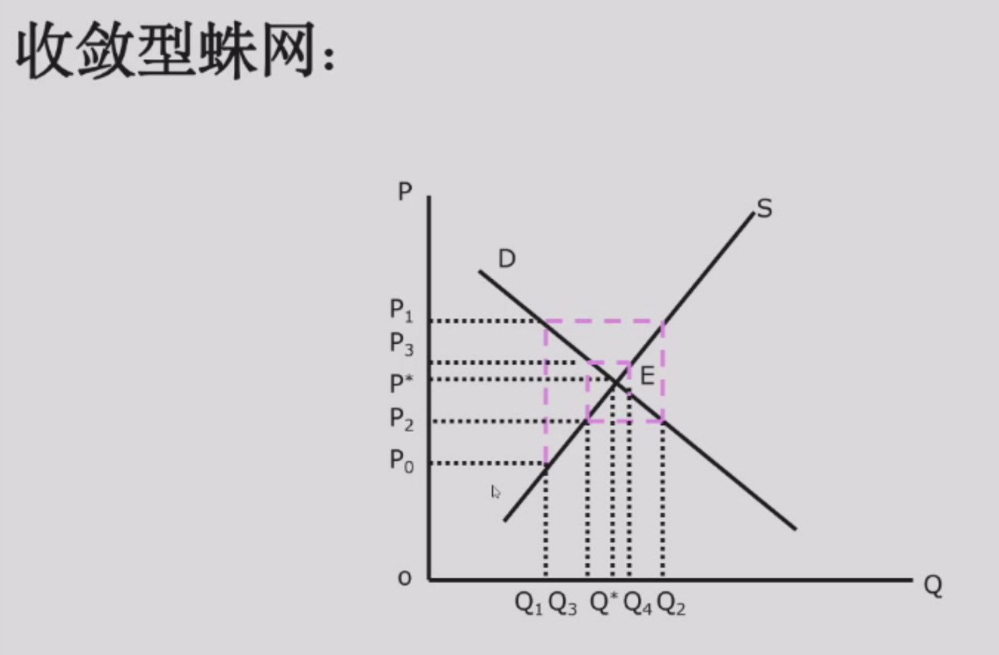

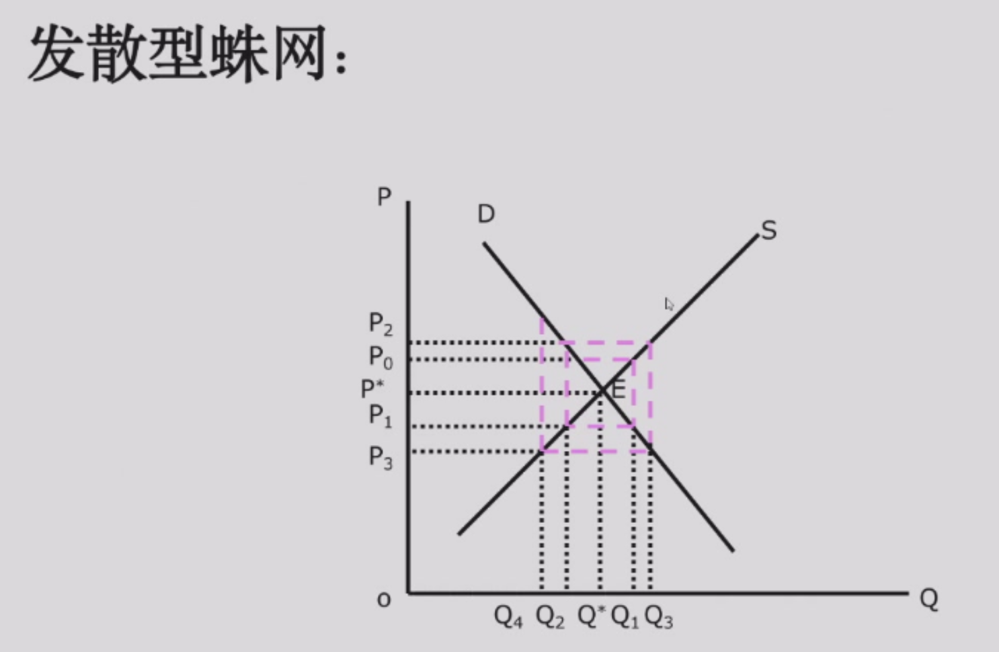

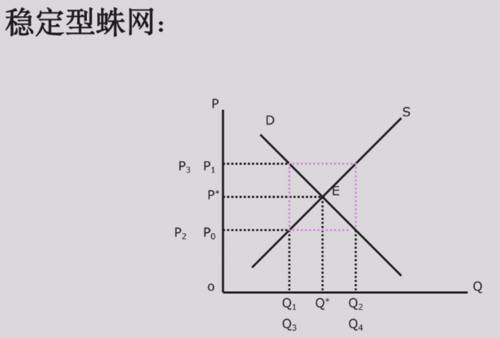

逻辑：

- $P_{n-1}$ 通过需求曲线 $D$ 决定 $Q_n$

    - 理解：这个过程发生在生产之前，就是通过上一期的需求决定生产多少
- $Q_n$ 通过供给曲线 $S$ 决定 $P_n$

    - 理解：生产出来之后供给和价格的关系看供给曲线

三类蛛网模型的条件

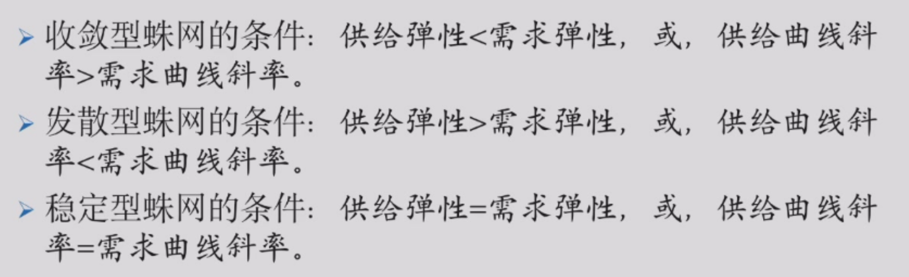

理解：特殊性是供给的滞后性，供给越灵活，滞后性越严重，不能匹配当期的市场，越不容易到均衡点

例子：农产品