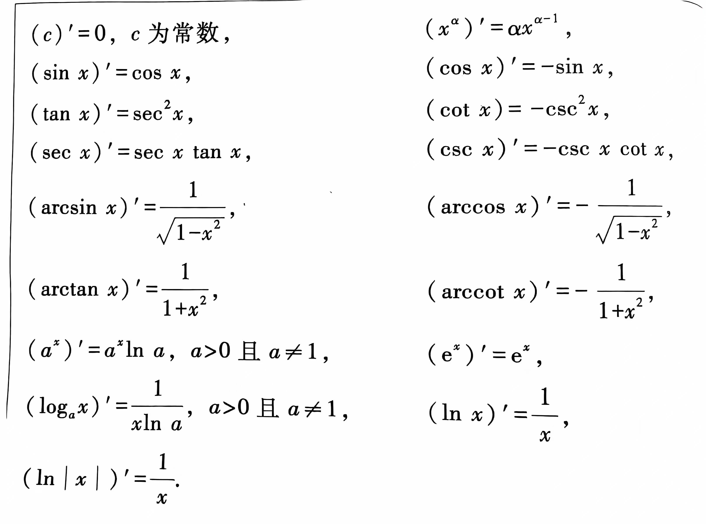

Welcome to the world of Caculus!
## 极限
动态的，动态的语言刻画

有极限 == 收敛
### 定义
- 数列
	- 内容：$ε-N$（$|a_n - a| < ε$）
	- 题型：用定义证明
		核心：求N
- 函数
	- 内容：$ε-δ$
	- 分类：6个：$x_0$(双侧，两个单侧)，无穷大（正负两个，一个无穷大）

- 注意：
	- 绝对值
	- “任意，总存在，使得”助记

!!! warning "背一遍几个定义"

	=== "数列"

		上册P16

	=== "函数"

		上册P33

### 性质
直观上了解认识，跟自己的做题联系

#### 唯一性

- 数列/函数
	- 内容：极限存在则唯一
#### 有界性
- 作用：用于放缩
- 数列
	- 内容：收敛数列必有界（有界：$|a_n| <= M$）
	- 证明：定义 + 前面的用max函数
	- 推论：若无界，则发散
		- 证明：收敛数列有有界性，逆否命题真
	- 关联：有界数列不一定收敛 —— 单调有界准则
- 函数
	- 内容：$\mathring{U}(x_0)$ 有界
#### 保不等式性
- 数列
	- 内容：俩收敛数列极限小的那个n充分大时项也小
	- 证明：
		1. max  
		2. 基本全在邻域内
		3. ε = 半差值（两极限值的半差值）
- 函数
	- 内容：$\mathring{U}(x_0)$ 可比

#### 保号性
- 数列
	- 内容：极限大于0，则存在小于极限大于0常数η，n充分大时项都大于η
	- 地位：保不等式性推论
	- 证明：$b_n$ = η
- 函数
	- 内容：$\mathring{U}(x_0)$ 局部保号
#### 不等式性质
- 数列
	- 内容：俩收敛数列n充分大时项都大or大于等于的那个极限大于等于（注意有没有等号）
	- 证明：反证法，用保不等式性
- 函数
    - 内容：$\mathring{U}(x_0)$ ，函数值和极限都是 $\geq$
#### 四则运算
- 数列
	- 条件：
	    1. 俩数列极限存在，四则运算后极限也存在  
		2. 有限项
- 极限和很多运算可交换
- 除法：分母为0不行
- 函数：复合
	- 作用：变量代替法
	- 公式：
$\lim_{x \to x_0} g(f(x)) = \lim_{u \to u_0} g(u) = A$: when $x \to x_0$, $u = f(x) \to u_0$

### 判别法则
- 单调有界：充分
	- 数列：
		- 内容：单调有界数列必有极限
	- 函数：
		- 内容：单侧单调有界函数必有单侧极限
- Cauchy收敛：充要
	- 内容：两值之差小于ε
- 夹逼定理
	- 内容：俩收敛（有极限）数列/函数极限都为a，n充分大都有$c_n$在他俩中间，则$c_n$收敛于a
	- 证明：定义 + 取绝对值
- 海涅定理：充要
    - 内容：$x_0$ 处函数极限存在 $<=>$ 任意以 $x_0$ 为极限且含于 $\mathring{U}(x_0)$ 的数列${x_n}$ , $f(x_n)$极限存在且相等
	- [图解海涅定理](https://www.bilibili.com/video/BV1RA4y1R7XD/?spm_id_from=333.337.search-card.all.click&vd_source=8c18aee74e3464bf775d55d00f7a43de)

- 函数极限不存在：充要
	- $f(x_n)$ 极限不相等 $\to$ 常用
	- 有一个 $f(x_n)$ 极限不存在
### 无穷小与无穷大
#### 有界量与无界量
***邻域！***

有界：邻域内有界

无界：在 $\textcolor{red}x \textcolor{red}\to \textcolor{red}{x_0}$ 时是无界量
：任意区间，任意M，存在$x'$
#### 无穷小阶的比较
- 等价无穷小
- thm : x ~ y <=> x = y + o(x)
- 本质：忽略高阶小量
- 加减不能换 —— 看阶数变不变：看泰勒

无穷大也有阶的比较，任意东西都有

## 函数
### 单调性
别忘了定义

### 连续性
#### 定义
1. 极限值 = 函数值
2. $ε-δ$语言,$|x - x_0|$, $|f(x) - f(x_0)$
3. $\lim_{Δx \to 0}{Δy} = 0$
#### 判定：充要
$x_0$ 处左连续&右连续 <=> 连续

#### 性质
重要性质：连续意义下，极限运算符和f可交换
##### 局部性质
连续函数的局部性质：同极限性质

复合函数的连续性：某点内连续，外对应函数值处连续，则复合函数在该点连续

推论：内某点处极限对应的外的那一点连续，复合函数在该点连续

##### 闭区间上连续函数的性质
闭区间连续，则必有最大最小值、上下界

初等函数、基本初等函数定义域上都连续：利用极限符号与f可交换
### 凹凸性与拐点
- 凹凸性
	- 定义
	- 注意：**某段区间内，局部性质**
	- 判定定理：
		二阶导
	- 证明：用到了拉格朗日型余项的泰勒公式

- 拐点
	- 定义
	- 注意
	- 判定定理——必要条件
	- 拐点嫌疑点
		- 二阶导＝0
		- 二阶不可导点
	- 判定定理——充分条件

### 图像描绘
1. 定义域、与坐标轴交点
2. 奇偶性、周期性
3. 单调区间+极值
   凹凸区间+拐点
   表格法，可分可合
4. 渐近线
	有定义，求值；没定义，求单侧极限
	定义域分段，一个一个看
	1. 定义域闭区间（则无渐近线），则求f(a), f(b), 用实心点画出端点
	2. 定义域开区间，则求左端点的右极限，右端点的左极限
		1. 极限常数，空心圆点
		2. 极限无穷，x=a铅直渐近线 24‘解释
	3. 无穷区间
		1. 求单侧极限
			1. 极限存在是A，y=A水平渐近线
			2. 极限无穷，求斜渐近线
				![[Pasted image 20241107083323.png]]
				1. 公式：可求出k，b则有斜渐近线
				   $k = lim_{x \to \infty} \frac{f(x)}{x}$
				   $b = lim_{x \to \infty}[f(x) - kx]$ 
				2. 证明
					1. 假设有斜渐近线
					2. 点到直线距离，极限的定义与求解
5. 用辅助点：知x求y值，定位

### 曲率
- 定义
	- 平均曲率
	- 某点处曲率
- 公式 <!--9:15-->
	- $k = \frac{|y''|}{(1 + y'^2)^{\frac32}}$
- 曲率圆
	- 现推，解方程组
	![[Pasted image 20241107093111.png]]
- 杂项
	- 直线就是R = $\infty$的圆，直线与任意一个圆上点的个数相同

## 导数
### 定义
导数 = 增量比的极限

导数存在：可导

#### 左右导数

设 $f(x)$ 在点 $x_0$ 的左邻域 $U_-(x_0)$ 内有定义，若极限 

$$
\lim_{\Delta x \to 0^-} \frac{\Delta y}{\Delta x} = \lim_{\Delta x \to 0^-} \frac{f(x_0 + \Delta x) - f(x_0)}{\Delta x} = \lim_{x \to x_0^-} \frac{f(x) - f(x_0)}{x - x_0}
$$

存在，则称 $f(x)$ 在点 $x_0$ 左可导，此极限值称为 $f(x)$ 在点 $x_0$ 的左导数，记作 $f'_{-}(x_0)$。

 
设 $f(x)$ 在点 $x_0$ 的右邻域 $U_+(x_0)$ 内有定义，若极限  

$$
\lim_{\Delta x \to 0^+} \frac{\Delta y}{\Delta x} = \lim_{\Delta x \to 0^+} \frac{f(x_0 + \Delta x) - f(x_0)}{\Delta x} = \lim_{x \to x_0^+} \frac{f(x) - f(x_0)}{x - x_0}
$$

存在，则称 $f(x)$ 在点 $x_0$ 右可导，此极限值称为 $f(x)$ 在点 $x_0$ 的右导数，记作 $f'_{+}(x_0)$。

导数存在的充要条件：左右导数存在且相等

#### 可导与连续
可导必连续，连续不一定可导

### 公式

1 的导数是 0

### 高阶导数

1. 
$$
(u \pm v)^{(n)} = u^{(n)} \pm v^{(n)}
$$

2. 
$$
(cu)^{(n)} = c u^{(n)}, \ \text{其中} \ c \ \text{为常数}
$$

3. 莱布尼茨公式
$$
(uv)^{(n)} = C_n^0 u^{(n)}v^{(0)} + C_n^1 u^{(n-1)}v^{(1)} + \cdots + C_n^k u^{(n-k)}v^{(k)} + \cdots + C_n^n u^{(0)}v^{(n)}
$$

$$
= \sum_{k=0}^n C_n^k u^{(n-k)}v^{(k)}, \ \text{其中} \ v^{(0)} = v, \ u^{(0)} = u.
$$

## 中值定理
### 极值与最值
#### 极值
- 极值点
	- 定义：邻域内最大or最小
	- **注意**：极值不是用导数 = 0 定义的！不可导点也可以成为极值点
	- 极值怀疑点：驻点 + 导数不存在点

- 费马定理
	- 若：取到极值，*导数存在*，则：导数为零

- 判定
	- 第一充分条件
		- 条件：邻域内连续，去心邻域内可导
		- 判定：$x_0$两侧异号(极大先正后负；极小……)
		- 证明：单调性 + 极值定义
	- 第二充分条件
		- 条件：驻点处二阶可导
		- 判定：
			- 二阶导大于零：极小值
			- 二阶导小于零：极大值
			- （二阶导等于零：另谋他法）
		- 证明：[[Knowledge Frame of Caculus#^68518e|函数极限保号性]]

#### 最值
- 最值怀疑点：区间端点 + 极值怀疑点（驻点 + 导数不存在点） ^a591e9
- 若函数在区间（任何类型的区间都行）上存在唯一的极值点，则其为相应的最值点：无需与端点函数值比较
![[Pasted image 20241107002631.png]]
### 三个中值定理
##### 关系
Cauchy ——g(x) = x——> Lagrange ——f(a) = f(b)——> Rolle
#### 罗尔定理
![[IMG_4006.png]]

##### 条件
3个
##### 定理证明
在最大值or最小值处：最大值、最小值在区间内

##### 理解
等高段函数中间必有水平切线
##### 应用
- 题型一：一阶常微分方程等式证明
	- 识别
		- 求证方程为一阶常微分方程等式
		- 所给函数的条件中有上面一张图片中条件(1)和(2)，再给出一个函数值f(n) = k (是用来推条件(3)的：原函数)
	- 方法：
		- 求证的式子变形 ——> RHS = 0
		- 构造辅助函数（积分找原函数…）
		- 对辅助函数用罗尔
	- 例题：
		![[IMG_4008.png]]![[IMG_4010.png]]

#### 拉格朗日中值定理
##### 条件
2个

##### 定理证明
用罗尔：同用罗尔解题型一的方法，辅助函数就构造最简单的那个就行

##### 理解
存在切线斜率 = 割线斜率

##### 定理变型
存在ξ， \[f(a) - f(b)] / (a - b) = f '(ξ)
f($x_0$ + Δ$x$) - f($x_0$) = f '($x_0$ + θΔ$x$)Δ$x$  (0 < θ < 1 )
##### 应用
- 题型一：不等式证明问题
	- 识别：
		- 类型一：函数值相减，变量值相减
		- 类型二：没有相减：减0 or 加a减a
	- 方法：
		1. 选定区间
		2. 构造形式
	- 例题：
	![[Pasted image 20241105085005.png]]
	遗失部分：$f''(x) > 0, f(0) = 0$ 
#### 柯西中值定理
![[IMG_20241029_102629.jpg]]

##### 条件
3个
##### 理解
讨论函数比和导数比

##### 应用
- 识别
	- 有差，但没有$x_1$ - $x_2$，有俩函数值的差
	
##### 例题
![[IMG_20241029_104215.jpg]]

## 泰勒定理
- 引入
	- 多项式函数表示为$(x-x_0)$的幂次和，求系数：求n阶导，分别代入$x_0$，得到$(x-x_0)^k$前的系数：
	$$a_k=\frac{f^{(k)}(x_0)}{k!}$$
	- 进一步，将任意函数表示成这样的形式
- 内容
	![[Pasted image 20241107093357.png]]
1. 拉格朗日
$$
P_n(x) = \sum_{k=0}^{n} \frac{f^{(k)}(x_0)}{k!}(x-x_0)^k
$$

- 证明
	![[Pasted image 20241105150509.png]]
	![[Pasted image 20241105150806.png]]![[Pasted image 20241105150842.png]]
- 变型
	![[Pasted image 20241105151045.png]]
- 麦克劳林
$$
e^x = \sum_{n=0}^{\infty} \frac{x^n}{n!} = 1 + x + \frac{x^2}{2!} + \frac{x^3}{3!} + \cdots
$$

$$
\sin(x) = \sum_{n=0}^{\infty} \frac{(-1)^n x^{2n+1}}{(2n+1)!} = x - \frac{x^3}{3!} + \frac{x^5}{5!} - \cdots
$$

$$
\cos(x) = \sum_{n=0}^{\infty} \frac{(-1)^n x^{2n}}{(2n)!} = 1 - \frac{x^2}{2!} + \frac{x^4}{4!} - \cdots
$$

$$
\ln(1+x) = \sum_{n=1}^{\infty} \frac{(-1)^{n+1} x^n}{n} = x - \frac{x^2}{2} + \frac{x^3}{3} - \cdots
$$

$$
\frac{1}{1-x} = \sum_{n=0}^{\infty} x^n = 1 + x + x^2 + x^3 + \cdots \quad \text{for} \quad |x| < 1
$$

$$
(1+x)^a = \sum_{n=0}^{\infty} \binom{a}{n} x^n = 1 + ax + \frac{a(a-1)}{2!}x^2 + \frac{a(a-1)(a-2)}{3!}x^3 + \cdots
$$

皮亚诺

$$x —>0$$ 
^c8f5ca

$$
e^x = 1 + x + \frac{x^2}{2!} + \frac{x^3}{3!} + \cdots + \frac{x^n}{n!} + o(x^n)= \sum_{n=0}^{\infty} \frac{x^n}{n!} + o(x^n)
$$

$$
\sin(x) = x - \frac{x^3}{3!} + \frac{x^5}{5!} - \cdots +\frac{(-1)^n x^{2n+1}}{(2n+1)!} + o(x^{2n+1})= \sum_{n=0}^{\infty} \frac{(-1)^n x^{2n+1}}{(2n+1)!} + o(x^{2n+1})
$$

$$
\cos(x) = 1 - \frac{x^2}{2!} + \frac{x^4}{4!} - \cdots + \frac{(-1)^n x^{2n}}{(2n)!}+ o(x^{2n})= \sum_{n=0}^{\infty} \frac{(-1)^n x^{2n}}{(2n)!} + o(x^{2n})
$$

$$
\ln(1+x) = x - \frac{x^2}{2} + \frac{x^3}{3} - \cdots + \frac{(-1)^{n+1} x^n}{n}+ o(x^n)= \sum_{n=1}^{\infty} \frac{(-1)^{n+1} x^n}{n} + o(x^n)
$$

$$
\frac{1}{1-x} = 1 + x + x^2 + x^3 + \cdots + x^n+ o(x^n)= \sum_{n=0}^{\infty} x^n + o(x^n) \quad \text{for} \quad |x| < 1
$$

$$
(1+x)^a = 1 + ax + \frac{a(a-1)}{2!}x^2 + \frac{a(a-1)(a-2)}{3!}x^3 + \cdots + \frac{a(a-1)(a-2)\cdots(a-n+1)}{n!}x^n + o(x^n)= \sum_{n=0}^{\infty} \binom{a}{n} x^n + o(x^n)
$$

注意！
1. 
	![[Pasted image 20241105154803.png]]
2. 
	![[Pasted image 20241105155156.png]]
3. 
	![[Pasted image 20241105155302.png]]

