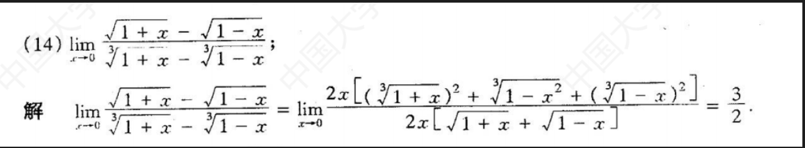
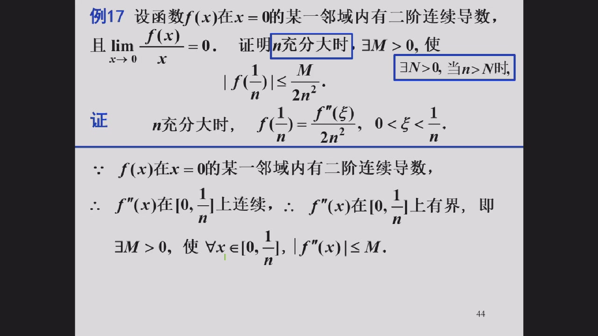
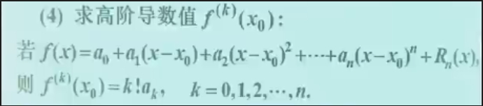
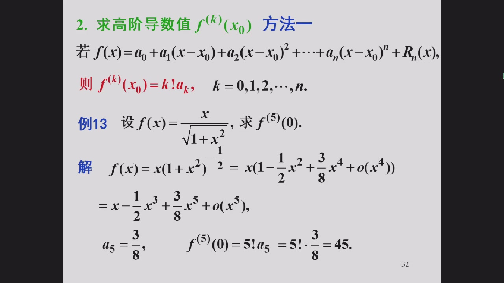

Welcome to the world of Caculus!
![[Pasted image 20241029165639.png]]

Click here and start your trip of calculus !

Nature and nature's laws,

Lay hid in night,

God said,

Let Newton be!

And all was light

For it is unworthy of excellent men to lose hours like slaves in the labor of calculation which could safely be relegated to anyone else if machines were used.                                                                                           —— Leibniz

马克思写过阅读微积分著作的笔记，从哲学的高度分析了微积分中的一些问题，
他把做微积分习题当作一种休息

# Limit
## 极限的证明问题
### 思想

- 目标意识
- 不等号意识(证明题)
	- 按着不等号方向寻找下一步思路/方向（我需要哪个方向的不等号，在条件/之前的里面找）

### 方法——定义法
#### 本质
用各种方法，化简至可求$δ(ε)$ or $X(ε)$，求出它就行。

类型1：化简至$n$ or $x$的简单的式子即可

类型2：化简至$k|x - x_0|$形式
#### 类型1. 数列极限 & $x \to\infty$型函数极限
方法：
1. 想定义，结构对应
2. 相减，列不等式ε & x or n
3. 放缩
4. 求出定义中的N or X

例题：上册P32、P53课后习题
#### 类型2. $x \to x_0$型函数极限
常规：

方法：
1. 列不等式
2. ***重点：***随便找一个常数$c$(半邻域的长度即 $δ$)，利用$x$属于邻域，框定$x$的范围
3. ***核心：***用该范围放缩不等式（有目标意识不等号意识），使之变成$k|x - x_0|$形式
4. 用邻域，代入$δ$，求出$δ(ε)$
5. 取$δ = min\{δ(ε), c\}$

例题：上册P53课后习题

其他题型：

核心/本质不变：放缩一开始列出来的不等式（有目标意识不等号意识），使之变成$k|x - x_0|$形式

## 极限的求解方法
### 理解

几乎全在极限值的***ε邻域内***
——P20 ^251156
### 公式
#### 极限

1. 
$$\lim_{x \to 0} \frac{\sin x}{x} = 1$$ 

（**说明**：仅当 $0/0$ 型时可用）

2. 
$$\lim_{x \to \infty} \left(1 + \frac{1}{x}\right)^x = e$$

$$\lim_{x \to 0} \left(1 + x\right)^{\frac{1}{x}} = e$$

$$\lim_{x \to 0} \left(1 - x\right)^{\frac{1}{x}} = e^{-1}$$
（**说明**：必须满足 $1^\infty$ 型）

1. 
$$\lim_{x \to 0} \frac{\ln(1 + x)}{x} = 1$$  

**证明**： 

$\lim_{x \to 0} \ln(1 + x)^{\frac{1}{x}} = \ln e = 1$ 

2. 
$$\lim_{x \to 0} \frac{e^x - 1}{x} = 1$$ 

**证明**：  

令 $t = x$, 则 $\lim_{x \to 0} \frac{e^x - 1}{x} = \lim_{t \to 0} \frac{e^t - 1}{t} = 1$

3. 
$$\lim_{x \to 0} \frac{a^x - 1}{x} = \ln a \quad (a > 0, a \neq 1)$$  

**证明**： 

$
\lim_{x \to 0} \frac{a^x - 1}{x} 
= \lim_{x \to 0} \frac{e^{x \ln a} - 1}{x} 
= \ln a \cdot \lim_{x \to 0} \frac{e^{x \ln a} - 1}{x \ln a} 
= \ln a \cdot 1 
= \ln a
$

5. 
$$\lim_{x \to 0} \frac{(1 + x)^\alpha - 1}{x} = \alpha \quad (\alpha \in \mathbb{R})$$  

$$等价于：(记这个别记上面那个) $$

$$(1 + x)^α = 1 + αx$$ 

**证明**：  

$
\lim_{x \to 0} \frac{(1 + x)^\alpha - 1}{x} 
= \lim_{x \to 0} \frac{e^{\alpha \ln(1+x)} - 1}{x} 
= \alpha \cdot \lim_{x \to 0} \frac{\ln(1 + x)}{x} 
= \alpha \cdot 1 
= \alpha
$

---

总结公式：

- $$\lim_{x \to 0} (1 + x)^{\frac{1}{x}} = e$$
- $$\lim_{x \to 0} \frac{\ln(1 + x)}{x} = 1$$
- $$\lim_{x \to 0} \frac{e^x - 1}{x} = 1$$
- $$\lim_{x \to 0} \frac{a^x - 1}{x} = \ln a$$
- $$\lim_{x \to 0} \frac{(1 + x)^\alpha - 1}{x} = \alpha$$

#### 等价无穷小
- $\sin x \sim x \quad \arcsin x \sim x$
- $\tan x \sim x \quad \arctan x \sim x$
- $1 - \cos x \sim \frac{1}{2}x^2$
- $\ln(1 + x) \sim x \quad e^x - 1 \sim x$
- $\sqrt[n]{1 + x} - 1 \sim \frac{x}{n}$
- $(1 + x)^\alpha \sim 1 + \alpha x$

---

#### 幂指函数极限
核心：

$$
\lim u(x)^{v(x)} = \lim e^{v(x) \ln u(x)}
$$ 

**若**  

$$\lim_{x \to x_0} u(x) = a, \quad \lim_{x \to x_0} v(x) = b$$  

**则**  

$$\lim_{x \to x_0} u(x)^{v(x)} = a^b$$  

**证明**：  

$
\lim_{x \to x_0} u(x)^{v(x)} = \lim_{x \to x_0} e^{v(x) \ln u(x)}  
= e^{\lim_{x \to x_0} v(x) \ln u(x)}
$  

又因 $\lim_{x \to x_0} v(x) \ln u(x) = b \ln a$，得  

$
\lim_{x \to x_0} u(x)^{v(x)} = e^{b \ln a} = a^b
$ 

特别地：
当 $u(x) \to 1, v(x) \to \infty$ 时，即$1^\infty$型

等价无穷小：

- 只有要替换的内容是无穷小才可用：想用之前一定要检查一下是不是无穷小！！！

- 只有要替换的内容是无穷小才可用：想用之前一定要检查一下是不是无穷小！！！
### 方法

#### 复杂题目求解的一般思路
1. 用[[Summary Of Calculus#^792d61|技巧]]化简式子
2. 往常见/已知模型极限上靠/化
3. 用技巧 and 下述基本方法简化式子
#### 〇、先化简！先化简！
- 方法：
	- 等价无穷小
	- 换元

#### 一、估值，再定义证明
- 直接法
- 放缩法
	- 目的：
		- 能算
		- 好算（含n的项少且简洁）—— 上册P19 例9、例10
	- 方法：
		- 首先搞清不等号方向
		- 具体式子放缩——用技巧，有目标，有方法
			- 项多：直接舍弃 or 变0/1/K—— 上册P19 例9、例10
		- 抽象式子放缩——用性质
			- 有界性
			- 保号性
	- 上位思想：
		1. 你放缩不能光盯着式子一直看，想着去咋放缩，（上册P23）
		   而应该：品味式子的结构，朝着你心里想的那个方向去写，先猜后证！
		   其实你的数学感觉挺好的，所以抓住你每个感觉，想办法实现它：找到它成立的条件并尽量靠近它
	    2. 本质目的：好算
	       所以，大胆随意放缩，咋好算咋能算咋来放完证一下是对的即可
	- 实例：
		- 三角：看目标选用
			- 泰勒公式
			- 有界性：别学了泰勒就忘了还能放成1 or -1
#### 二、四则运算

- 注意：
	- 每个极限都存在
	- 分母不为零
	- 仅对有限项
	- 无限项：先求和，再极限
- 大胆用！将每个目测极限存在的式子提出来
#### 三、变形使之能用四则运算来求

- 变形方法：
	- 三角恒等变换：和差化积 积化和差！
		- 积化和差 ：乘积大法好！
			- —> 1-cos—>与x的幂等价无穷小
			- —> 有界 * 无穷小
		

#### 四、利用无穷小 * 有界函数 = 无穷小

#### 五、夹逼定理

- 核心：先猜后证
- 根据感觉or数学基本常识or对数学的理解猜出答案，再放缩找两个不等号
- 用处：
	1. 有取整函数
    : 利用取整的不等式
	2. 递推不等式
    : 反复用递推不等式放缩直到不能用为止
	3. 极限 = a < b
    

#### 六、0/0型
（一）、因式分解约去0因子
- 用处：有理函数
- 方法：
	- 因式：（x - x0）
	- 直到化到没有分母（每次都检查分子分母是否为零，若是则还可分，想怎么分）
- 技巧：常数的拆分

（二）、根式有理化
- 用处：根式

#### 七、无穷/无穷型
分子分母同时除以次数最大的无穷大使得某些项变成无穷小

####  八、等价无穷小

- 注意：
    - 只有乘积 or 商时才可替换
    - 外面有指数啥的都不行，只有乘积商
    ![[Pasted image 20241105101358.png]]
    - 无穷小啊 ：—>0时：检查！
    - 换时随意换
- 用处：
    - 去根号
    - 去三角

#### 九、幂指函数极限

变e

#### 十、单调有界准则
- 用处：
    - 用递推关系给出的数列
- 做法：
    - 法一：
        - 单调：
            - 法一：一个用递推公式换
            - 法二：两个都用递推公式换，得出an - an-1  and  an-1 - an-2的关系，用数学归纳法
        - 有界：
            法一：随便放缩
            法二：数学归纳法
        - 求极限：
            设极限等于x，对递推关系两边同时求极限，n—>∞时an = an-1 = x
    - 法二：（相当于放缩时有目标了）
        - 算出来极限
        - 极限和前几项比大小（看上界or下界），数学归纳法证明上界or下界
        - 证明单调：用上面求出的界
        - 求出极限（卷子上写）
    

注意：正负号

#### 十一、夹逼定理

（一）有取整函数
    : 利用取整的不等式

（二）递推不等式
    : 反复用递推不等式放缩直到不能用为止

（三）极限 = a < b
    

#### 十二、分段函数分界点处的极限
方法：
    先求左右极限，再用定义（左右相等则为那个值，有一个不存在则极限不存在）

#### 十三、L'Hospital法则
##### 条件
3个
1. $lim_{x \to x_0}f(x)$ = 0 or $\infty$, $lim_{x \to x_0}g(x)$ = 0 or $\infty$
2. $x$属于$x_0$ 的某去心邻域内，f'(x), g'(x)都存在，g'(x) != 0
3. $lim_{x \to {x_0}} \frac {f(x)} {g(x)}$ = A or $\infty$ 
**三个条件逐一检查**，*都满足才可以用*
##### 证明

##### （一）数列
- 题型：未定式的数列极限
- 方法：转化成函数
- 原理：海涅定理
- 注意：满足1～3条件
- 格式：最后一行
![[IMG_20241029_115056.jpg]]

##### （二）函数
- 题型：
	- 未定式的函数极限
- 注意事项：

！先用前面求极限方法，实在不行再洛必达（不是首选）

！洛必达法则有条件，满足条件才可以用

![[IMG_20241029_104606.jpg]]

- 其他：
- 转化
![[IMG_20241029_111417.jpg]]
![[IMG_20241029_111651.jpg]]
DA：1/2

![[IMG_20241029_112248.jpg]]

- 不要死板教条
- 换成分数即可，保证分母等于0
- 再换元：整体，灵活运用

![[IMG_20241029_112656.jpg]]

幂指函数：全化成e为底，不用判断
![[IMG_20241029_113344.jpg]]

![[IMG_20241029_113453.jpg]]
![[IMG_20241029_113647.jpg]]

凡是 ln1 —> +1 -1 再等价无穷小
![[IMG_20241029_114232.jpg]]

不熟悉的三角函数：换掉
![[IMG_20241029_114509.jpg]]

答案是4/PI ？错了！

![[Pasted image 20241105100713.png]]
![[Pasted image 20241105101834.png]]
求极限：$lim_{x \to 0^+}{(\frac{1-cosx}{x^2})}^\frac1x$
![[Pasted image 20241105101919.png]]
![[Pasted image 20241105102141.png]]

![[Pasted image 20241105104135.png]]

![[Pasted image 20241105105209.png]]

![[Pasted image 20241105110341.png]]

#### 十四、Taylor's Theorem
公式
	[[Knowledge Frame of Caculus#^c8f5ca|点击查看公式]]
要点
	用带皮亚诺型余项的泰勒公式
	展开到出现分母的那个x的次数为止，
	若为乘积式，则要保证第一个括号的首项成第二个括号的末项为分母的那个x的次数 & 第二个括号的首项成第一个括号的末项为分母的那个x的次数
		例题：
			![[Pasted image 20241105160142.png]]
			此题用洛必达也可

### 技巧

^792d61

#### 一、换元
灵活换元！
t = 1/x 较常见
#### 二、提公因式/提相同结构

^e6c631

名曰“提相同结构”：将常数提出，剩下的东西可换元  A+B = A(1 + B/A)

#### 三、放缩反解
换元——反解——放缩——简化
—— 上册P19 例10

#### 四、同除
分子分母同除最大的的那个

#### 五、补项

目的：凑
凑已有形式—— 上册P21证明乘法
凑关系：补的项是已有项间的桥梁
凑好看的形式·，凑有利于计算的形式，凑***美***的式子——数学之美在于完美

#### 六、常数的拆分
#### 七、定义式绝对值
得到两个方向的不等号 —> 放缩/找范围用

#### 八、取倒式
无穷大量 —取倒式—> 无穷小：可以用四则运算
### 特殊结构与代数处理

- 根式
	- 有限次：有理化

		例题：上册P54-8（13）
	
	- n次根式：因式分解

		相对性：1次~n次 <=> $\frac1n$次~1次

		例题：上册P35 例4

- 二项式：
    操作：展开 
    要求：整数指数——不行就放缩＋取整（上册P23L15）
    类似：
        n次根号：设一个（换元）再变n次根号展开（上册P19L10）

- ($a^0$ - 1) / 0 
	推导方法：化e指数 —> 等价无穷小
	结论：lna
	化到他：
		t * ($a^m$ - $a^n$) : 提出$a^n$ , 外面用乘除凑1/(m - n)项，不能是加减！（乘除：那个分式再求极限，之后再用四则运算法则）

- 1 ^ 无穷大
	化到他：
		底数+1 -1，指数凑出+恒等变形补出剩余
		剩余部分求极限：用本章别的方法
- 底与幂：同底不同幂，同幂不同底
	[[Summary Of Calculus#^e6c631|提出相同结构]]
	
### 其他
1. lim=a<b —> ε=(a-b)/2 ：取中点
2. 善用max min函数取最大or最小
3. 趋向无穷大：指数函数 > 幂函数 > 对数函数

## 求极限时的注意事项

- 注意哪个是变量哪个是常量
- 注意变量趋向于哪里
- 正负号！
	x趋于-∞：换元成t = -x
- 只有要替换的内容是无穷小才可用：想用之前一定要检查一下是不是无穷小！！！
# Derivative

## 导数的求解方法

### 技巧

### 分段函数在端点处导数
用定义，求左右导数

### 反函数求导
严格用定义，写${\rm d}x$/${\rm d}y$，中途不要x和y交换

### 隐函数求导
法一：
	两边同时对x求导
注意事项：
	别忘了y是x的函数，复合函数
法二：
    [[Summary Of Calculus#^97a0e1|一阶微分形式不变性]]
### 高阶导数
方法：
- 基本函数用公式
- 找规律
- 莱布尼茨公式：
	复杂，故应先尽量化简，化成有高阶导数公式的函数的加减

### 参数式函数求导数
都用dy/dx，写上公式
都是补dt（高阶导数亦然，因为我们写的f‘ g’都是关于t的导数，所以在求二阶导时，要补出dt才能用公式）
注意：二阶导是对x导，一阶t/2千万不能二阶是1/2

### 极坐标方程求导
化参数方程再求导
## 求导时的注意事项

- 结果只能用x, y表示，若有其x', y' 等，应化成x, y
- 别忘了复合函数
- 求导前先化简，求完也要化简，但是不做要求
	n阶：将X的系数整理成+1可防止套公式时出错：将-移到式子和式子之间别放在X的系数钱
	高阶一定得化简
	有ln一定先化简：ln自身可化简
	假分式（分子次数大于等于分母）
	    先分离常数

![[IMG_4002.png]]![[IMG_4001.png]]
![[IMG_4003.png]]
![[IMG_4005.png]]
# Differential
## 微分的求解方法
#### 显函数
法一：用导数
法二：用微分：两边同时微分，
	初等函数：dy = f‘(x)dx
	四则运算：导数公式中“导”换成“微”
#### 隐函数
法一：先隐函数求导
法二：一阶微分不变性
    两侧同时微分，但是 x和y同等地位的变量，即不再考察x和y的函数关系，对x怎样操作就对y怎样操作
    eg：乘积xy：xdy+ydx ^97a0e1

隐函数某一点处的微分：
	由于结果中有X和Y那么求某一点出的导数或者微分，要将那一点出的横坐标或纵坐标带入原方程解除纵坐标或横坐标

### 近似计算
#### 微分法
f(x0 + Δx) = f(x0) + f'(x0) * Δx
原理：忽略了dx的高阶无穷小量
注：o(dx)实际上有，对具体函数可能看得清晰一点，但抽象的公式中并不知道它是哪算出来的，就是因为具体函数有所以补上去的

![[IMG_3998.png]]
——>取x0 = 0，Δx = x
得到的实际上是等价无穷小公式
![[IMG_3999.png]]

#### 泰勒公式法
方法
	用拉格朗日型余项的
![[Pasted image 20241106224944.png]]

# Mean Value Theorem
### 极值与最值
[[Knowledge Frame of Caculus#^a591e9|点击查看知识体系]]
最值嫌疑点：不可导点(不可导点嫌疑点见下）、驻点、端点
    一定得是闭区间上的
极值嫌疑点：不可导点、驻点

#### 极值点的判定与极值的求解
##### 显函数
方法
	简单函数：第一充分条件
普通函数
	同高中
复杂函数
	何谓复杂：导函数难求、存在不可导点（分段、导函数定义域断开）
	做法：
		找不可导嫌疑点：
			一阶导数没定义的点
			分段函数的分段点
		列表讨论
		用充分条件判定
	例题：
		求函数$f(x)=1-\frac32x^{-\frac13}$的极值
		![[Pasted image 20241105142209.png]]
##### 隐函数
方法
	统一用：第二充分条件
		原因：因为$y'$是$x和y$的函数，你不知道$x$属于$x_0$左右范围时$y'$正负
	求一阶导 —— 令$y'=0$，得$x和y$等式 —— 将其带入$y$，得到驻点的横纵坐标
	求二阶导 —— 带入$y',x,y$，得到$y''$，看正负用第二充分条件
例题：
	![[Pasted image 20241105135656.png]]
### 罗尔定理
一、理解
等高段函数中间必有水平切线

二、应用
	题型一：一阶常微分方程等式证明
		识别
			求证方程为一阶常微分方程等式
			所给函数的条件中有上面一张图片中条件(1)和(2)，再给出一个函数值f(n) = k (是用来推条件(3)的：原函数)
		方法：
			求证的式子变形 ——> RHS = 0
			构造辅助函数（积分找原函数…）
			对辅助函数用罗尔
		例题：
			![[IMG_4008.png]]![[IMG_4010.png]]

### 拉格朗日中值定理
一、理解
	存在切线斜率 = 割线斜率
二、应用
	题型一：不等式证明问题
		识别：
			类型一：函数值相减，变量值相减
			类型二：没有相减：函数值相加
				做法：减0 or 加a减a
			给出几个特殊点处函数值 eg : $f(0) = 0$
		方法：
			选定区间
			构造形式
			从区间内找点，将其分为两个子区间，分别用拉格朗日
			从结论出发，联系定理，逆推目标
		例题：
		![[Pasted image 20241105085005.png]]
		遗失部分：$f''(x) > 0, f(0) = 0$ 
		![[Pasted image 20241105092644.png]]
		遗失部分：$[a,b)连续$
		![[Pasted image 20241105093345.png]]
		遗失部分：$f(a) = f(b)$ ,存在$\xi$ 
		方法：区间内找点，将其分为两个子区间，分别用拉格朗日
		![[Pasted image 20241105095636.png]]
		遗失部分：$[0,+\infty)二阶可导$， $(0,a)$取得最大值，$f'(a)$
### 柯西中值定理
一、理解
	讨论函数比和导数比

二、应用
	识别
		有差，但没有$x_1$ - $x_2$，有俩函数值的差
	例题
	![[IMG_20241029_104215.jpg]]

# Taylor's theorem
## 公式
1. 泰勒公式
- 带拉格朗日型余项
$$
f(x) = P_n(x) + R_n(x) = \sum_{k=0}^{n} \frac{f^{(k)}(x_0)}{k!}(x-x_0)^k + \frac{f^{(n + 1)}(ξ)}{(n + 1)!}(x-x_0)^{n + 1}
$$
其中，$ξ$属于$(x_0, x)$ or $ξ = x_0 + θ(x - x_0)$，$P_n(x)$称为泰勒多项式，$R_n(x)$称为拉格朗日型余项

- 带皮亚诺型余项
$$
f(x) = \sum_{k=0}^{n} \frac{f^{(k)}(x_0)}{k!}(x-x_0)^k + o((x - x_0)^n)
$$
其中$o((x - x_0)^n)$为高阶无穷小

2. 麦克劳林
- 带拉格朗日型余项

一般形式：
$$
f(x) = \sum_{k=0}^{n} \frac{f^{(k)}(0)}{k!}x^k + \frac{f^{(n + 1)}(ξ)}{(n + 1)!}x^{n + 1} = \sum_{k=0}^{n} \frac{f^{(k)}(0)}{k!}x^k + \frac{f^{(n + 1)}(θx)}{(n + 1)!}x^{n + 1}
$$	

常用公式

$$
e^x = \sum_{n=0}^{\infty} \frac{x^n}{n!} = 1 + x + \frac{x^2}{2!} + \frac{x^3}{3!} + \cdots
$$

$$
\sin(x) = \sum_{n=0}^{\infty} \frac{(-1)^n x^{2n+1}}{(2n+1)!} = x - \frac{x^3}{3!} + \frac{x^5}{5!} - \cdots
$$

$$
\cos(x) = \sum_{n=0}^{\infty} \frac{(-1)^n x^{2n}}{(2n)!} = 1 - \frac{x^2}{2!} + \frac{x^4}{4!} - \cdots
$$

$$
\ln(1+x) = \sum_{n=1}^{\infty} \frac{(-1)^{n+1} x^n}{n} = x - \frac{x^2}{2} + \frac{x^3}{3} - \cdots
$$

$$
\frac{1}{1-x} = \sum_{n=0}^{\infty} x^n = 1 + x + x^2 + x^3 + \cdots \quad \text{for} \quad |x| < 1
$$

$$
(1+x)^a = \sum_{n=0}^{\infty} \binom{a}{n} x^n = 1 + ax + \frac{a(a-1)}{2!}x^2 + \frac{a(a-1)(a-2)}{3!}x^3 + \cdots
$$

皮亚诺

$$x —>0$$ 

$$
e^x = 1 + x + \frac{x^2}{2!} + \frac{x^3}{3!} + \cdots + \frac{x^n}{n!} + o(x^n)= \sum_{n=0}^{\infty} \frac{x^n}{n!} + o(x^n)
$$

$$
\sin(x) = x - \frac{x^3}{3!} + \frac{x^5}{5!} - \cdots +\frac{(-1)^n x^{2n+1}}{(2n+1)!} + o(x^{2n+1})= \sum_{n=0}^{\infty} \frac{(-1)^n x^{2n+1}}{(2n+1)!} + o(x^{2n+1})
$$

$$
\cos(x) = 1 - \frac{x^2}{2!} + \frac{x^4}{4!} - \cdots + \frac{(-1)^n x^{2n}}{(2n)!}+ o(x^{2n})= \sum_{n=0}^{\infty} \frac{(-1)^n x^{2n}}{(2n)!} + o(x^{2n})
$$

$$
\ln(1+x) = x - \frac{x^2}{2} + \frac{x^3}{3} - \cdots + \frac{(-1)^{n+1} x^n}{n}+ o(x^n)= \sum_{n=1}^{\infty} \frac{(-1)^{n+1} x^n}{n} + o(x^n)
$$

$$
\frac{1}{1-x} = 1 + x + x^2 + x^3 + \cdots + x^n+ o(x^n)= \sum_{n=0}^{\infty} x^n + o(x^n) \quad \text{for} \quad |x| < 1
$$

$$
(1+x)^a = 1 + ax + \frac{a(a-1)}{2!}x^2 + \frac{a(a-1)(a-2)}{3!}x^3 + \cdots + \frac{a(a-1)(a-2)\cdots(a-n+1)}{n!}x^n + o(x^n)= \sum_{n=0}^{\infty} \binom{a}{n} x^n + o(x^n)
$$

## 题型一、求极限
- 方法：用皮亚诺型余项的泰勒公式
	- 展几项？
		- 一部分（分子or分母）只有单项式
		   另一部分出现该单项式的系数次幂为止；

		   若为乘积AB：A首项 * B末项 = 该单项式系数次幂 && B首项 * A末项 = 该单项式系数次幂，决定了末项到哪
		- 均为复杂式子
		   - 本质：求出等价无穷小
		   - 所以：分子分母分别展到首项出现为止：和or差式的左右两端对照着展，到那一项消不了，成为首项为止
		   该方法也适用于上面的情况，反正就是出首项
		   - 例题：
			求$lim_{x \to 0} \frac{x^2e^{2x} + ln(1 - x^2)}{xcosx - sinx}$  
			![[Pasted image 20241106221706.png]]
			最后一步再加：上下同除$x^3$, 再用四则运算法则

	- 最后一项的后面写上$o(x^k)$
		- 不写就是错的
		- 最后一项x是几次k就写几

## 题型二、近似计算
[[Summary Of Calculus#泰勒公式法|用拉格朗日型余项的泰勒公式做近似计算]]

## 题型三、证明题
方法：
- 特殊点处的函数值在特殊点处展开成泰勒公式
	- 特殊点
		- 各阶导数已知的点
		- 区间端点
		- 区间中点
		- 题目涉及的点

例题：

第一步是书上的例题

开区间上连续函数不能推出有界，定理是闭区间上连续函数有界

中点在端点处展开，端点在中点处展开

## 间接法求泰勒公式

## 求高阶导数
### 法一、泰勒公式法
原理：

方法：
1. 将函数用泰勒展开化为多项式函数
	- 注意：四则运算的函数可以分开化啊
2. 用上述原理($a_k = \frac{f^{(n)}(x_0)}{k!}$)找到对应项即得。

例题：

错误原因：分子分母同除了x，将所得式子展开：
- 一、不知道可以分开展。
- 二、看 x or x 的函数趋于多少：出现$\frac1x$, 他是$+\infty$啊怎么能。
### 法二、常微分方程法
方法：

# Function
## 拐点与凹凸性
[[Knowledge Frame of Caculus#凹凸性与拐点|点击查看知识体系]]
方法：
	同极值点 —— 一阶导变二阶导即可
例题：
	![[Pasted image 20241107081034.png]]

## 曲率
[[Knowledge Frame of Caculus#曲率|点击查看知识体系]]
注意：转角：直线转过的角度，不是俩直线成的任意一个角
# Question Type

## 微分中值定理

一、叙述并证明三个中值定理
	10.29Tue. TWW12:00 上册P116
二、 关于方程根的个数问题
	证明方程至少有k个根or存在根
		零点存在性定理
	证明至多有多少个根
		罗尔中值定理 + 反证法

