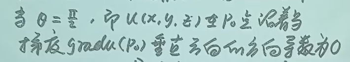
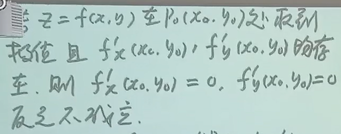
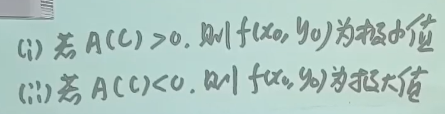
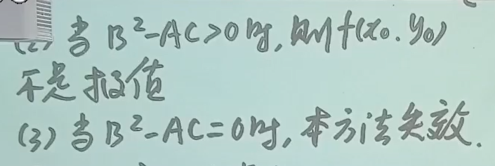

## 页首涂鸦

$$Work \; Hard, \; Play\;  Hard$$

$$为什么一个人能自律成这样？？？$$

$$真的一天都在写写写学学学没有停下来过啊！！！$$

$$数学化学轮换着学，手机放身后书架上$$

{ width="300" }
{ width="300" }

## 引入

多元函数，二元函数的性质与多元函数完全一致，与一元函数不同，故拿二元函数为例研究多元函数

## 多元函数的基本量

### 定义域

1. 使得表达式有意义
2. 考虑实际意义

也要在二维坐标系中画出图形，范围看内外

!!! info ""

    曲线将平面分成两部分 / 曲面将空间分成两部分，两边的不等式相反，可以找一边的一个特殊点看不等号方向

### 邻域

即距离小于一个数的

## 多元函数的极限

### 定义

称为二重极限

可以沿着不同的路径趋于中间那个点，任意路径

!!! success "判断极限不存在的方法"

    1. 不同路径极限不同：多，选择路径靠观察力
    2. 某一路径没有极限：少

### 性质

与一元函数一样的

### 求解

!!! success ""

    1. 通常转化为一元函数极限

    2. 多元函数有夹逼定理

    3. 利用连续性转化为求在该点处函数值

!!! warning ""

    找到一个空心邻域，在该邻域上有一些点没定义没关系，按正常方法求解即可

    空心邻域和定义域交集非空即可

!!! warning ""

    二次极限 $\ne$ 二重极限，这两个是完全无关的极限，不存在充分/必要条件关系

    

!!! success "路径法"

    齐次式趋于原点：

    - 取 $y = kx$
    - 极限一般都不存在
    
    

    

无穷小乘有界啊啊

??? info "答案"

    
    

## 多元函数的连续性

在某点的极限 = 该点处的函数值

初等多元函数 **在定义域区域上都连续**；初等多元函数就是一个解析式给出的函数（即不是分段函数）

!!! success ""

    则求极限问题变成求在那一点处函数值问题，因为，初等 + 有定义则连续 + 连续则转化为求值

/// caption
全增量和偏增量
///

### 有界闭区域上连续多元函数的性质

闭区域定义

包含该区域边界的区域

例如 $x^2$ 是闭区域因为边界是空集，肯定被包含

性质一：一定能找到最大值和最小值

性质二：值域为 $[最小值，最大值]$，且有界

性质三：零值点定理：端点函数值乘积小于0则存在零值点

## 多元函数的偏导数

$\frac{\partial z}{\partial x}$ 这个不代表比值，只是一个记号

本质上是一个一元函数导数

### 偏导数定义

### 求偏导数的方法

!!! success "求偏导函数方法"

    1. 将一个视为常数，对另一个用一元函数导数
    2. 用偏导数定义：其他自变量都是确定值，对需要的那个求导

!!! success "求某点偏导数方法"

    1. 求出导函数，代入点
    2. 代入其中一个自变量，求一元函数导数
    3. 用偏导数定义：适用于在孤立点（那个点单独定义了函数值）上的偏导数，类似于一元函数区间分界点处导函数。孤立点只能用定义。

!!! success "指数底数均有变量"

    1. 变成以e为底
    2. 两侧同时取对数 

### 偏导数的存在性

根本判据：定义法，极限存在就说明存在偏导

必要条件：求偏导再代入对应点，这个方法不能判断偏导数是否存在

在 $(x_0, y_0)$ 处连续和在该处两个偏导数存在是两个毫无关系的东西，谁也不能推出对方

### 轮换

要求：$x$ 和 $y$ 地位相同且取值相同

### 偏导数的几何意义

$f'_x(x_0, y_0)$ 表示曲面A和平面B的交线在点 $(x_0, y_0, z_0)$ 处切线与 $Ox$ 轴正向夹角的正切值。其中曲面A为 $z = f(x, y)$，平面B为 $y = y_0$。因为将 $y$ 看成常数 $y_0$ 之后也就相当于两面联立。

另一个同理。

### 多元函数高阶偏导数

**符号表示**

$\frac{\partial^2 z}{\partial x^2}$

$\frac{\partial^2 f}{\partial x \partial y}$ 先对谁偏导分母上谁就写前面，这个代表先对x偏

其中，“连续”隐含如下条件：

对于初等多元函数，不同顺序的二阶偏导函数，求一个就行

$$\frac{\partial^n z}{\partial x^n}$$

## 多元函数的全微分

$$ \text{全微分}\; dz = A \Delta x + B \Delta y$$

$$ 其中, A = f'_x(x, y) ,\; B = f'_y(x, y), \; \Delta x = dx, \; \Delta y = dy$$

$记 \; o(\Delta x) = \alpha \Delta x$

/// caption
可微必连续

不连续则不可微
///

/// caption
可微的必要条件
///

可微则偏导均存在,反之不成立. 逆否: 至少有一个偏导数不存在, 则不可微

!!! warning ""

    可微比偏导数存在更严格

证明: 用偏导数的定义  $\lim_{\Delta x \to 0} \frac {\Delta _x z}{\Delta x}$, 这时 $\Delta y = 0$ (因为偏 $x$)

/// caption
证明是否可微
///

/// caption
证明分片函数在 $(0, 0)$ 点是否可微
///

/// caption
可微的充分条件: 偏导函数连续则可微
///

!!! success "求全微分的方法"

    用公式

    - 二元函数

        设 \( z = f(x, y) \) 在点 \( (x_0, y_0) \) 处可微，则全微分公式为：
        \[
        dz = \frac{\partial f}{\partial x} \bigg|_{(x_0, y_0)} dx + \frac{\partial f}{\partial y} \bigg|_{(x_0, y_0)} dy
        \]

    - n元函数

        对于 \( n \) 元函数 \( u = f(x_1, x_2, \dots, x_n) \)，全微分公式推广为：

        \[
        du = \sum_{i=1}^n \frac{\partial f}{\partial x_i} dx_i = \frac{\partial f}{\partial x_1} dx_1 + \frac{\partial f}{\partial x_2} dx_2 + \cdots + \frac{\partial f}{\partial x_n} dx_n
        \]

        其中：
        - \( \frac{\partial f}{\partial x_i} \) 是函数对第 \( i \) 个变量的偏导数，
        - \( dx_i \) 是自变量 \( x_i \) 的微小增量。

!!! success "近似计算"

    全微分公式中忽略小量

    

## 多元复合函数的偏导数

/// caption
存在性定理
///

内层不要求可微

$$\frac{\partial z}{\partial x} = \frac{\partial z}{\partial u} * \frac{\partial u}{\partial x} + \frac{\partial z}{\partial v} * \frac{\partial v}{\partial x}$$

$$\frac{\partial z}{\partial y} = \frac{\partial z}{\partial u} * \frac{\partial u}{\partial y} + \frac{\partial z}{\partial v} * \frac{\partial v}{\partial y}$$

因变量对中间变量分别偏导, 中间变量对x偏导, 相乘再相加。一元函数全是求导，多元函数全是偏导

/// caption
偏导结构图
///

/// caption
全导数
///

/// caption
外函数是三元函数
///

!!! success ""

    外函数有连续的二阶偏导：等价于
    
    - 放心求，可微
    - 二阶偏导两种顺序相等，需要合并化简

!!! warning ""

    一定集中精力，求对一个的偏导，将另一个看成常数，谨记公式

## 全微分一阶形式不变性

即当 $x = g(s, t), y = h(s, t)$ 时，该式也成立，且此时也有 $dz = \frac{\partial z}{\partial s} * ds + \frac{\partial z}{\partial t} * dt$

**也就是对一阶全微分，无论是中间变量还是自变量，都可以这样拆开求微分**

!!! success "求多元复合函数的偏导数"

    

    把微分写成 $u 和 v$ 的函数分别乘两个自变量/中间变量在求和的式子，偏导数就是那个函数

## 全微分的四则运算

!!! info ""

    和一元函数一样

??? info ""

    因为是 $r 和 \theta$ 的函数，所以要化成 $dr 和 d\theta$

    法一：

    
    
    

    法二：

    

## 方程确定多元函数的偏导数

### 多元隐函数定义

!!! warning ""

    这里 $z$ 是 $x 和 y$ 的函数，整体是一个复合函数

///caption
定义
///
### 方程确定多元函数的偏导数

!!! success "这类题做题方法"

    1. 公式
    2. 全微分一阶形式不变性

        - 具体方法见下
    3. 推导公式的过程
        
        - 两侧同时偏导

/// caption
推导过程
///

公式：

$$\frac{\partial z}{\partial x} = - \frac{F'_x}{F'_z}$$

!!! warning ""

    1. 都是对中间变量偏导

    2. 记忆：$x$ 和 $z$ 交换位置，前面有一个负号
    
    3. 对一个偏导时将另一个看成常数

    3. 成立条件：偏导数连续 & $F'_z$ 不为零

!!! success ""

    那么，对二元方程确定的一元隐函数，该公式也成立

/// caption
一元隐函数偏导数公式
///

!!! success "一阶微分形式不变性的应用"

    隐函数偏导能直接用公式做的题目一般都能用**一阶微分形式不变性**解决

    

    步骤：

    1. 见到等式就两侧微分
    2. 想办法造出来 $dx \;dy \;dz$：微分的四则运算 
    3. 移项合并同类项，得到形如 $dz = f(x, y)dx + g(x, y)dy$ 的式子，那么 $f是z对x的偏导$，$g是z对y的偏导$

/// caption
例题
///

??? info ""

    一阶微分形式不变性：

    
    

    公式法：

    

## 方程组确定的多元函数组的偏导数

!!! success "这类题做题方法"

    1. 全微分一阶形式不变性

        - 具体方法见上
    2. 推导公式的过程
        
        - 两侧同时偏导

m 个方程 n 个变量 $ \to $ m 个函数，n - m 个自变量，即 m 个 n - m 元函数。谁是自变量谁是因变量看题目所求偏导形式

## 多元函数的方向导数和梯度

### 方向导数

方向导数：沿某一方向函数的变化率

/// caption
定义
///

!!! info "定义"

    设 \( f: \mathbb{R}^n \to \mathbb{R} \) 为多元函数，在点 \( P \) 处可微，\( \mathbf{u} = (u_1, u_2, \dots, u_n) \) 为单位向量，则 \( f \) 在点 \( P \) 沿方向 \( \mathbf{u} \) 的**方向导数**定义为：
    \[
    D_{\mathbf{u}} f(P) = \lim_{h \to 0} \frac{f(P + h\mathbf{u}) - f(P)}{h}
    \]
    其值表示函数沿 \( \mathbf{u} \) 方向的瞬时变化速率。

!!! tip "人话 —— 方向导数"

    定义域内取一个点，找一个方向，点周围有一个邻域，在这个方向上且在邻域内取一个点，两个点对应的函数值差除以两点距离。即，在这个方向上因变量变化率

    { width = "300" }

偏导数并不是特殊的方向导数

在某点 对 $x$ 的偏导 = 沿 $x$ 轴正向的导数 = $-$ 沿 $x$ 轴负向的导数, y z 同理

/// caption
方向导数存在的充分条件及计算公式
///

!!! tip "人话 —— 方向导数存在的充分条件"

    在某点可微则任意方向方向导数存在
    
!!! info ""

    三个角分别是反向矢量与轴的夹角，也是对应方向上的单位矢量

!!! warning ""

    分片函数在孤立点处的方向导数必须得用定义求

公式：

\[
D_{\mathbf{u}} f(P) = \nabla f(P) \cdot \mathbf{u} = \sum_{i=1}^n \frac{\partial f}{\partial x_i}(P) \cdot u_i
\]

- **二元函数** \( f(x, y) \)：

    \[
    D_{(u_1, u_2)} f(x_0, y_0) = \frac{\partial f}{\partial x}(x_0, y_0) \cdot u_1 + \frac{\partial f}{\partial y}(x_0, y_0) \cdot u_2
    \]

- **三元函数** \( f(x, y, z) \)：

    \[
    D_{(u_1, u_2, u_3)} f(x_0, y_0, z_0) = \frac{\partial f}{\partial x} u_1 + \frac{\partial f}{\partial y} u_2 + \frac{\partial f}{\partial z} u_3
    \]

**其中，$u$ 是对应方向上的单位矢量**，$u = (u_1, u_2, u_3, \cdots, u_n) = (\cos \alpha _1, \cos \alpha _2, \cos \alpha _3, \cdots, \cos \alpha _n)$，$\alpha _i$ 是该矢量与每个坐标轴正向的夹角

### 梯度

**定义：**

!!! tip "人话 —— 梯度"

    就是在某点处几个偏导数值组成的向量

**运算法则：**

线性运算法则

!!! info ""

    线性运算法则都是用定义证明的

/// caption
用梯度计算方向导数公式的几何意义
///

/// caption
用梯度计算方向导数公式
///

换种写法：

\[
D_{\mathbf{u}} f(P) = \nabla f(P) \cdot \mathbf{u}
\]

/// caption
方向导数的极值问题
///

!!! success ""

    问哪个方向的导数最大 $\Leftrightarrow$ 求梯度 $\Leftrightarrow$ 求偏导

## 多元函数的极值

!!! info ""

    一元函数极值怀疑点：驻点 + 导数不存在点

!!! success "重要思想"

    研究多元函数：转化为一元函数

/// caption
取到极值的必要条件
///

!!! tip "人话 —— 取到极值的必要条件"

    在该点取到极值则偏导数都等于0

证明方法：转化成一元函数

!!! info "一元函数极值点的判断"

    一元函数在某点的二阶导数：
    
    - 大于零极小值
    - 小于零极大值
    
    !!! success "记忆"
    
        大小对立

!!! success "极值点的求解"

    极值怀疑点：

    0. 在区间内部（不含边界）
    1. 偏导数都等于零的点（驻点 / 稳定点）
    2. 至少有一个偏导数不存在

    求解极值怀疑点方法：

    1. 求偏导，令其等于0
    2. 找到偏导没有定义的点

    判断极值怀疑点是否是极值点：

    - **对于驻点**：求三个二阶偏导数，看他们的关系，即用如下充分条件
    - **对于偏导数不存在点 和 $B^2 - AC = 0$ 的点**：用定义：在邻域内看是不是最大 / 最小的

/// caption
多元函数极值点充分条件
///

证明：多元函数的泰勒展开，展开式第一项移项之后整理成二次函数，二次项系数A，一次项系数2B，常数项C，用判别式 + 正负 判断其是否恒成立

!!! info ""

    一元函数中定理：在区间上连续的函数，如果有唯一极值，则他是相应最值。即唯一极大值就是最大值唯一极小值就是极小值。

    **他在多元函数中不成立**

## 多元函数的最值

### 求解方法

定理：在**有界闭**区域上连续，则一定有最大值 & 最小值

- 有界
- 闭区域：包含边界

!!! success ""

    最值怀疑点：

    1. 内部：极值怀疑点
    2. 边界：边界上的最大 / 最小值

    判断是否是最大 / 最小值：求出函数值，比大小

### 应用题

!!! info ""

    如果只有一个极值点：可以想办法说清楚该函数只有最大值 / 只有最小值

## 多元函数的条件极值

多元函数条件极值的求解可以通过构造拉格朗日函数来实现。以函数 \( f(x, y) \) 在约束条件 \( g(x, y) = 0 \) 下的极值问题为例，步骤如下：

!!! success ""

    拉格朗日乘数法

1. **构造拉格朗日函数**：

    \[
    \mathcal{L}(x, y, \lambda) = f(x, y) + \lambda g(x, y)
    \]

2. **求偏导并解方程组，即求拉格朗日函数的驻点**：

    - 参数可以不求，但如果必须求出参数才能得出变量值那就求

    \[
    \begin{cases}
    \frac{\partial \mathcal{L}}{\partial x} = \frac{\partial f}{\partial x} + \lambda \frac{\partial g}{\partial x} = 0 \\
    \frac{\partial \mathcal{L}}{\partial y} = \frac{\partial f}{\partial y} + \lambda \frac{\partial g}{\partial y} = 0 \\
    \frac{\partial \mathcal{L}}{\partial \lambda} = g(x, y) = 0
    \end{cases}
    \]

    解得 \( (x, y, \lambda) \)，其中 \( (x, y) \) 即为极值怀疑点，如果算最大最小值：再进一步算函数值得到最大值 / 最小值。

!!! info "约束条件的本质"

    1. **单约束**：  
    例如 \( g(x, y) = 0 \)，表示在求解 \( f(x, y) \) 的极值时，变量 \( x, y \) 必须始终满足 \( g(x, y) = 0 \)。  
    - **几何意义**：在平面上，\( g(x, y) = 0 \) 定义了一条曲线，极值点必须在这条曲线上（如直线、圆等）。

    2. **多约束**：  
    如果有多个约束条件，例如： 

    $$
    \begin{cases}
    g_1(x, y, z) = 0 \\
    g_2(x, y, z) = 0
    \end{cases}
    $$ 

    此时约束条件构成一个方程组，变量必须同时满足所有方程。  
    - **几何意义**：在三维空间中，两个约束方程的交集可能是一条曲线或一个点。

    - 具体实例：如果有 \( m \) 个约束条件 \( g_1 = 0, g_2 = 0, \dots, g_m = 0 \)，则需引入 \( m \) 个拉格朗日乘数 $ \lambda_1, \lambda_2, \dots, \lambda_m $ ，构造拉格朗日函数：

    $$
    \mathcal{L}(x, y, z, \dots, \lambda_1, \lambda_2, \dots) = f(x, y, z, \dots) - \sum_{i=1}^m \lambda_i \cdot g_i(x, y, z, \dots)
    $$

    - 通过求偏导并解方程组（方程数量 = 变量数 + 约束数）：

        $$
        \begin{cases}
        \frac{\partial \mathcal{L}}{\partial x} = 0 \\
        \frac{\partial \mathcal{L}}{\partial y} = 0 \\
        \vdots \\
        g_1(x, y, \dots) = 0 \\
        g_2(x, y, \dots) = 0 \\
        \vdots
        \end{cases}
        $$

!!! success "灵活"

    复杂的 $f$ 函数（题目中给出）和与其有关的形式简单的 $g$ 函数显然在同样的点处取极值，则构造拉格朗日函数时可以用 $g$ 代替 $f$

    例如，$f(x) = \sqrt{x^2 + y^2 + z^2}$，则用 $g(x) = x^2 + y^2 + z^2$，最后求出来结果还是代入 $f$。再如 $|z| \to z^2$

    !!! success ""

        曲线到 $xy$ 平面的距离最大值：距离是 $|z|$, 即 $f(x, y, z) = |z|$，约束条件是曲线方程（两个曲面联立，即双约束条件）

!!! success "如果限制条件是不等式"

    直接对原函数（不带限制条件）求极值怀疑点，
    
    - 如果发现不在限制范围内，则内部没有极值怀疑点，则在边界，转换为等式
    - 如果有，那个就是极值怀疑点
    
!!! success "其他曲线"

    多个方程确定的曲线，例如三角形，其实是复杂了，但是按部就班🆗

**例题解析**：

**例1**：求 \( f(x, y) = x^2 + y^2 \) 在约束 \( x + y = 1 \) 下的极值。

- 构造拉格朗日函数：

    \[
    \mathcal{L}(x, y, \lambda) = x^2 + y^2 - \lambda (x + y - 1)
    \]

- 求偏导并解方程组：

    \[
    \begin{cases}
    2x + \lambda = 0 \\
    2y + \lambda = 0 \\
    x + y = 1
    \end{cases}
    \]

    解得 \( x = y = \frac{1}{2} \)，极值为 \( \left(\frac{1}{2}, \frac{1}{2}\right) \)，对应 \( f \) 的最小值 \( \frac{1}{2} \)。

**结论**：
多元函数条件极值的拉格朗日乘数法通过引入乘数 \( \lambda \) 将约束优化问题转化为无约束问题，解方程组得到极值点。拉格朗日乘数的几何意义是目标函数与约束条件的梯度在极值点处共线。

**多约束条件**

## 多元偏导数在几何中的应用

### 空间曲线方程的切线

割线方向向量的极限，割线方向向量为 $(\delta x, \delta y, \delta z)$，同除 $\delta t$ （参数），得到的就是三个偏导数。

切线方程为：

!!! success ""

    先化成参数方程

    !!! warning ""

        参数不一定是特殊的字母例如 $t$ $a$ $u$ $v$，可以是 $x$ 或者 $y$，只要是一个 **几个方程都包含的** 变量就行

### 空间曲面的切平面和法线

给出 $z = f(x, y)$ 平面方程

!!! success "空间曲线用一般式（两曲面联立）表示求切线/法平面"

    1. 两曲面切平面交线为切线
    2. 两曲面法向量叉乘结果为法平面法向量

    !!! info "原因"

        曲线在曲面上，则曲线的切线在曲面的切面上

