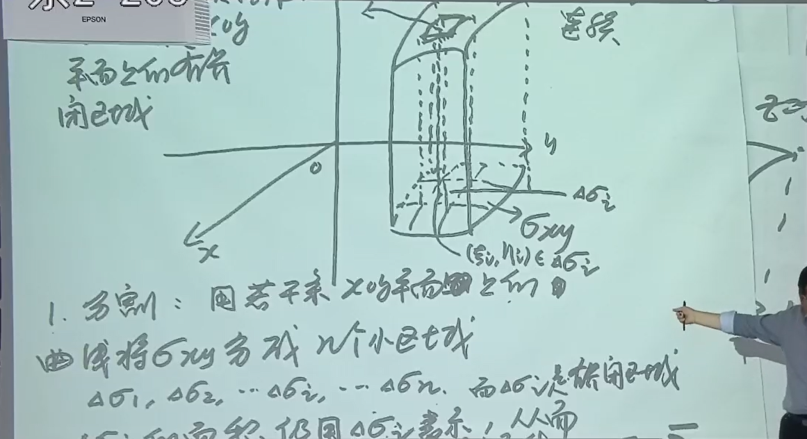
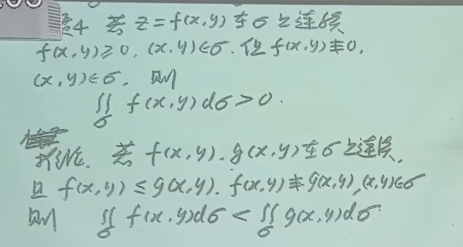

{ width="300" }
/// caption
Stanford University
///

## 引入

多元函数，二元函数的性质与多元函数完全一致，与一元函数不同，故拿二元函数为例研究多元函数

## 基本量

### 定义域

1. 使得表达式有意义
2. 考虑实际意义

也要在二维坐标系中画出图形，范围看内外

!!! info 

    曲线将平面分成两部分 / 曲面将空间分成两部分，两边的不等式相反，可以找一边的一个特殊点看不等号方向

### 邻域

即距离小于一个数的

## 极限

### 定义

称为二重极限

可以沿着不同的路径趋于中间那个点，任意路径

!!! success "判断极限不存在的方法"

    1. 不同路径极限不同：多，选择路径靠观察力
    2. 某一路径没有极限：少

### 性质

与一元函数一样的

### 求解

!!! success

    1. 通常转化为一元函数极限

    2. 多元函数有夹逼定理

    3. 利用连续性转化为求在该点处函数值

!!! warning

    找到一个空心邻域，有一些点没定义没关系，按正常方法求解即可

    空心邻域和定义域交集非空即可

!!! warning

    二次极限 $\ne$ 二重极限，这两个是完全无关的极限，不存在充分/必要条件关系

    

!!! success "路径法"

    齐次式趋于原点：

    - 取 $y = kx$
    - 极限一般都不存在
    
    

    

    

无穷小乘有界啊啊

??? info

    
    

## 连续

在某点的极限 = 该点处的函数值

初等多元函数 **在定义域区域上都连续**；初等多元函数就是一个解析式给出的函数（即不是分段函数）

!!! success

    则求极限问题变成求在那一点处函数值问题，因为，初等 + 有定义则连续 + 连续则转化为求值

### 有界闭区域上连续多元函数的性质

闭区域定义

包含该区域边界的区域

例如 $x^2$ 是闭区域因为边界是空集，肯定被包含

性质一：一定能找到最大值和最小值

性质二：值域为 $[最小值，最大值]$，且有界

性质三：零值点定理：端点函数值乘积小于0则存在零值点

## 多元函数的偏导数

$\frac{\partial z}{\partial x}$ 这个不代表比值，只是一个记号

本质上是一个一元函数导数

### 偏导数定义

### 求偏导数的方法

!!! success "求偏导函数方法"

    1. 将一个视为常数，对另一个用一元函数导数
    2. 用偏导数定义：其他自变量都是 $x_0$, $y_0$ 之类的，对需要的那个求导

!!! success "求某点偏导数方法"

    1. 求出导函数，代入点
    2. 代入其中一个自变量，求一元函数导数
    3. 用偏导数定义：适用于在孤立点（那个点单独定义了函数值）上的偏导数，类似于一元函数区间分界点处导函数。孤立点只能用定义。

!!! success "指数底数均有变量"

    1. 变成以e为底
    2. 两侧同时取对数 

### 偏导数的存在性

根本判据：定义法，极限存在就说明存在偏导

必要条件：求偏导再代入对应点，这个方法不能判断偏导数是否存在

在 $(x_0, y_0)$ 处连续和在该处两个偏导数存在是两个毫无关系的东西，谁也不能推出对方

### 轮换

要求：$x$ 和 $y$ 地位相同且取值相同

### 偏导数的几何意义

$f'_x(x_0, y_0)$ 表示曲面A和平面B的交线在点 $(x_0, y_0, z_0)$ 处切线与 $Ox$ 轴正向夹角的正切值。其中曲面A为 $z = f(x, y)$，平面B为 $y = y_0$。因为将 $y$ 看成常数 $y_0$ 之后也就相当于两面联立。

另一个同理。

### 多元函数高阶偏导数

**符号表示**

$\frac{\partial^2 z}{\partial x^2}$

$\frac{\partial^2 f}{\partial x \partial y}$ 先对谁偏导分母上谁就写前面，这个代表先对x偏

其中，“连续”隐含如下条件：

对于初等多元函数，不同顺序的二阶偏导函数，求一个就行

$$\frac{\partial^n z}{\partial x^n}$$

## 多元函数的全微分

$$ \text{全微分}\; dz = A \Delta x + B \Delta y$$

$记 \; o(\Delta x) = \alpha \Delta x$

/// caption
可微必连续

不连续则不可微
///

/// caption
可微的必要条件
///

可微则偏导均存在,反之不成立. 逆否: 至少有一个偏导数不存在, 则不可微

证明: 用偏导数的定义  $\lim_{\Delta x \to 0} \frac {\Delta _x z}{\Delta x}$, 这时 $\Delta y = 0$ (因为偏导)

/// caption
证明是否可微
///

/// caption
证明分片函数在 $(0, 0)$ 点是否可微
///

/// caption
可微的充分条件: 偏导函数连续则可微
///
