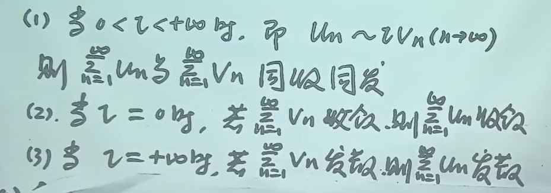
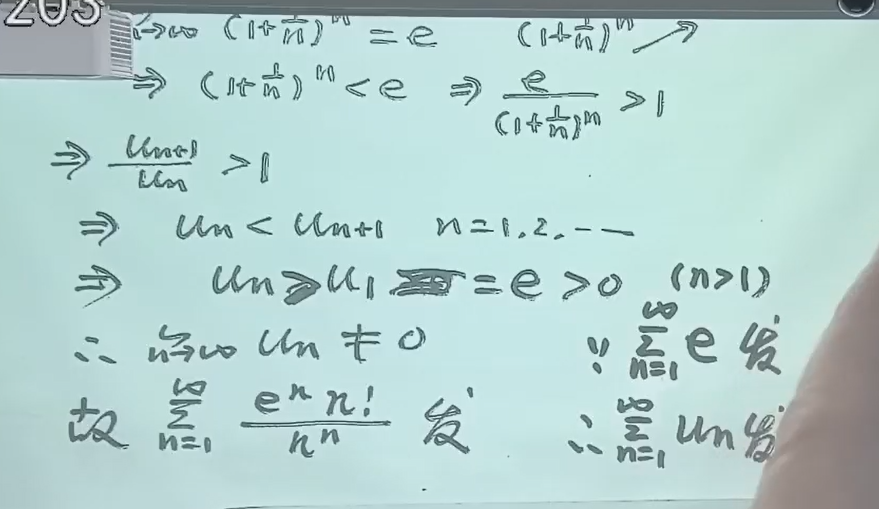
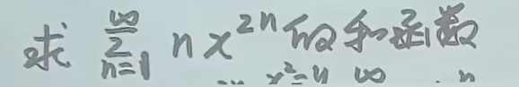

{ align=left }

$$Work \;Hard, \;Play \;Hard.$$

{ align=left }

<figure markdown="span">
  { width="300" }
  <figcaption>HKU-html</figcaption>
</figure>

{ width="300" }
/// caption
HKU-caption
///

## 题型

1. 判断正项级数敛散性
2. 判断一般级数敛散性
3. 求幂级数的收敛区间/收敛域/和函数
4. 函数展开成幂级数
5. 数项级数求和
6. 利用函数在某点处的展开求函数高阶导数
    - 第二学期考高阶导数一定用幂级数

## 导言

!!! info "级数的起源"

    对于泰勒公式，想对左右积分/求导，但是有一个余项，搞不成，如果最后一项的极限为0，圆满了。

一个问题：无限个数相加是否是一个数

!!! info "数学知识的逻辑"

    实际问题 —— 抽象成定义（记作等式） —— 几何意义 —— 定义证明 —— 性质/定理/方法 —— 证明题 —— 应用题

## 定义

1. 数列的相加得到一个形式上的和（两个省略号），记作 $\sum ^\infty_{n = 1} u_n$

2. $u_n$ 一般项
3. **部分和** $S_n$，有 $\sum^ \infty _{n = 1} u_n = \lim_{n \to \infty} S_n$，其等于 $S$ （$S$ 得是实实在在一个数）则级数收敛，不存在则级数发散

!!! success "数列收敛发散和级数收敛发散方法互通"

    因为，数列 $a_n$ 敛散性 $\Leftrightarrow$ 级数 $\sum ^\infty_{n = 1} (a_n - a_{n-1})$ 敛散性，这里要假设 $a_0 = C$，$C$ 为常数，一般设为 $0$

    数列极限方法：

    1. 化简
    2. 转化为和式极限 --> 积分（定积分/广义积分……）
    3. 夹逼定理
    4. 单调有界

## 重要级数

### 等比/几何级数 

- $|q| \lt 1$，收敛，$\sum^ \infty _{n = 1} aq^{n-1} = \frac a{1-q}$
- $|q| \ge 1$，发散
    - $|q| \gt 1$，无穷
    - $|q| = 1$，无穷
    - $|q| = -1$，n为奇/偶的子数列极限存在但不相等

!!! warning 

    - 公比 $q \ne 0/1$，公比 $q$ 必须为常数（前后项比固定）

### p 级数

$\sum ^\infty _{n=1} \frac1{n^p}$

- $|q| \le 1$，发散

- $|q| \gt 1$，收敛

!!! success "证明方法"

    在某一区间上常数用不等式转为变量

    证明有界：上面 + 单调有界

## 收敛级数的性质

### 线性运算法则

!!! warning

    和积分一样，只有线性性质，没有乘除运算法则

### “改变性质”

改变/删除/添加有限项，敛散性不变，和肯定变了

> 类似数列极限

!!! success "用法"

    从某一项开始，判断敛散性即可，不用从首项

### 加括号

收敛级数，任意添加括号，依然收敛，和不变，但是是不一样的级数了。

**反之不成立**，**如果是正项级数，反之成立**。

!!! warning 

    其实是有限项和无限项的区别，有限项中成立的结合律在无限项中不一定成立，成立前提是收敛

!!! info+ "原理"

    1. **原级数收敛性**：设原级数 \(\sum a_n\) 收敛于和 \(S\)，即部分和 \(S_N = a_1 + a_2 + \cdots + a_N\) 满足 \(\lim_{N \to \infty} S_N = S\)。

    2. **添加括号后的新级数**：任意添加括号后，新级数为 \(\sum b_k\)，其中每个 \(b_k\) 是原级数中若干连续项的和（如 \(b_1 = a_1 + a_2\)，\(b_2 = a_3 + a_4 + a_5\) 等）。新级数的部分和 \(T_m = b_1 + b_2 + \cdots + b_m\) 对应原级数的某个部分和 \(S_{N_m}\)（\(N_m\) 为前 \(m\) 个括号包含的原项数之和）。

    3. **子序列收敛性**：由于原级数收敛，其部分和数列 \(\{S_N\}\) 的任意子序列（如 \(\{S_{N_m}\}\)）均收敛到同一极限 \(S\)。因此，新级数的部分和 \(T_m = S_{N_m}\) 也收敛于 \(S\)。

    !!! info+ "为什么是子序列"

        子列：从原数列取出一部分项生成的数列。现在这个加括号之后，和数列就变成跳跃的那种，原和数列中间有些项就没有了因为有括号变成新的 \(T_m = b_1 + b_2 + \cdots + b_m\) 了

!!! success "用处"

    将几项合并成好看的东西再求和

### 项趋于零

若级数收敛，则通项的极限 = 0；**反之不一定成立，即通项极限 = 0不能推出级数收敛**

!!! success "用法"

    在求数列极限时，如果猜到其极限 = 0，可以求和发现收敛，得出数列极限为0

逆否命题成立：通项极限不为0（存在且不为0 / 不存在）则级数发散

!!! success "用法" 

    判断极限 **是否发散**，先看通项极限。注意 = 0 不能推出收敛！

## 正项级数收敛性的判别法

### 思路总结

思考步骤：

1. 一般项和后一项有公因式：比值判别法
2. 一般项有n次方：根值判别法
3. 比较判别法的极限形式
4. 比较判别法
5. 单调有界
6. 线性运算法则
7. 一般项极限不为0，发散
8. 定义
9. 积分判别法
10. 柯西收敛准则

### 单调有界

定理：正项级数的前n项和有上界 $\Leftrightarrow$ 收敛

### 比较判别法

正项级数，**大于某个确定的正整数时每项**（原本是每项都大，事实上改变前k项不改变敛散性）大的收敛则每项小的收敛，小的发散则大的发散；反之不成立

!!! success 

    猜敛散，放缩
    

高中不等式

转化成正项级数 + 线性运算法则

!!! success

    经常用 n元基本不等式链

#### 比较判别法极限形式

!!! success

    其实就是**找等价量**，$u_n$ 是要判断的那个 $v_n$ 是自己找的：不要教条于放大 / 缩小，看比值为1，等价即可

- 证明：极限定义，将绝对值展开成两边

!!! success

    指数有变量：换成 $e$ 指数，再用等价量

$\sum _{n=1}^ \infty (\sqrt [n] n - 1)$

### 比值判别法

$n \to \infty$ 时后一项比前一项：

- 小：级数收敛
- 大：发散
- 相等：失效

!!! success

    适用于前一项和后一项公因式比较多的情况

### 根值判别法

$n \to \infty$ 时一般项的n次方根

- 小于1：收敛
- 大于1：发散
- 等于1：失效

!!! success

    适用于有n次方根 / n次幂

    有阶乘一定比值

### 积分判别法

\(u(n) = f(n), f(n)在[1, \infty ] 非负单调连续，\int _1^ \infty f(x) dx 与 \sum_1 ^ \infty u_n 同收同发\)

其中，将 \([1, \infty]\) 改为 \([k, \infty]\) 亦可。

$\frac{(n + 1)^n}{n^n}$ 极限是 $e$

### 例题

!!! success 

    当含参数级数比值判别法，参数取a时比值极限 = 1，要代入这个a值，研究这个极限式，利用判断敛散性其他方法，结合不等式，判断敛散

!!! success 

    灵活，比较判别法直接放缩分子成一个常数

\(\sum _{n = 1} ^ \infty\frac{\ln n}n\) 发散：因为 $n > 3$ 时 $\ln n > ln3 > 1$ 

## 绝对收敛

$\sum _{n = 2} ^ \infty |u_n| 收敛则 \sum _{n = 2} ^ \infty u_n 收敛$

证明：利用 $0 < a + |a| < 2a$

级数的敛散性情况

- 绝对收敛：绝对值收敛，原级数收敛
- 条件收敛：绝对值发散，原级数收敛
- 发散

## 一般级数敛散性判断

### 方法总结

1. 公因式：绝对值比值
2. n次幂：根值
3. 算绝对值：
    - 收敛：原来的收敛
    - 发散：如果是交错级数，用莱布尼茨判别法，若收敛则原级数条件收敛
4. 线性运算
5. 线性运算
6. 定义

### 绝对值的比值判别法

后一项的绝对值比前一项的绝对值：

- 小：绝对收敛
- 大：发散
- 相等：失效

### 绝对值的根值判别法

基本同上 ~

### 交错级数的莱布尼茨判别法

!!! success

    判断单调性：可以用对应函数

!!! success

    最重要的内容就是灵活，俗称代数变形能力

## 幂级数

函数项级数：每项都是函数，即 $u_(x) + u_(x) + u_(x) + \cdots + u_n(x) + \cdots = \sum _{n = 1}^ \infty u_n(x)$。我们关注的是在 $x$取何值时这个和式收敛 / 发散

使得和收敛的 $x_0$ 成为收敛点，收敛点的集合为收敛域

和函数是 $x$ 的函数，记作 $S(x)$，求和函数的目的是可以直接带入 $x$ 得到某点的级数和（用于数项级数）

特别的，当每一项都是幂，即通项 $a_n(x - x_0)^n$ 时，称为幂级数，又称为泰勒级数，$x_0 = 0$ 称为麦克劳林级数，

!!! info 

    现在要研究泰勒级数的收敛域，才能求级数

*这里先用绝对值的比值判别法*

!!! info 

    想想推导过程，中间有一步是从极限中提出来 $|x - x_0|$

后一项与前一项比完之后剩下：$|x - x_0|, \frac{a_n}{a_{n + 1}}$，设 $\lim _{n \to \infty}\frac{|a_n|}{|a_{n + 1}|} = R$，因为比值判别法，将得到当式子与 1 比较，得到：

- $|x - x_0| < R$ 绝对收敛
- $|x - x_0| > R$ 发散
- $|x - x_0| = R$ 代入x的值用判断数项级数方法做

另，当级数有n次幂，则用根值判别法：$R = \lim_{n \to \infty} \frac 1{\sqrt[n]{|a_n|}}$

$R = 0$ or $R = \infty$ 同样成立

R 称为收敛半径，$(x_0 - R, x_0 + R)$ 为收敛区间

这样的也是标准的：**通过提出一个什么东西可以化标准则他就是标准的**。因为后面的标准部分 $×$ 前面的常数不改变敛散性

!!! success "$2n$ 次幂非标准的做法"

    变量代换：$y = (x-x_0)^2$，最后变量要换回来。

    找到规律：对于指数是 $kn + b$ 的，直接按照正常的方法求出来再讲结果开 $k$ 次根号

### 收敛幂级数的性质

**线性和**

收敛半径：

- 两个收敛半径不一样：则幂级数的收敛半径是原来两个的最小值
- 收敛半径一样：和的收敛半径小于等于原来的

**乘法**

**除法**

乘过去变成乘法

### 收敛区间上收敛幂级数的性质

**性质一**

极限运算和求和符号可以交换

$$\lim_{n \to \infty} \sum_{n = 1}^ \infty a_nx^n = \sum_{n = 1}^ \infty lim_{n \to \infty}a_nx^n$$

（$S(x)$ 在收敛区间内连续）

**性质二：逐项可导**

导数的和 = 和的导数

在收敛区间上，幂级数和函数的导数等于逐项导数的和，则该和函数任意有限次可导，且每次导数的收敛半径不变，且k次导之后 $\sum$ 的下界变成了 $k$ 因为每次第一项为常数导数为0

**性质三：逐项可积**

无限项的积分的和 = 和的积分

!!! info 
    
    积分下限为中心点 $x_0$，上限就是积分变量 $x$，且将积分上限和积分变量都写成 $x$，因为好算。

    - 下限中心点：牛莱公式减数为0
    - 都写成x：形式上的东西，不用换来换去

在收敛区间上，幂级数和函数的积分等于逐项积分的和，则该和函数任意有限次可积，且每次积分的收敛半径不变

### 求幂级数和函数/收敛区间/收敛域

!!! success "收敛半径求解方法"

    法一：$\lim_{n \to \infty}\frac{a_n}{a_{n + 1}}$

    法二：顺带发现：导数/积分收敛半径不变，则如果导数/积分后的级数是可以看出来收敛区间的级数，则就是同样的收敛区间

!!! success "和函数的求解方法"

    核心：转化为已知的。例如 $\sum_{n = 0}{\infty} \frac{x^n}n$ 通过求导转化为等比级数

    - 转化的方法：先先求导后积分/先积分后求导

    - 要求：第一步之后好求；积分上限为变量x下限为中心点

    !!! success

        可以连续多次积分/求导

    !!! success "收敛域边界点和函数的求法"

        定理：级数在一点处收敛，则在该点处的和等于和函数在该点处的极限，如果和函数在该点连续，则该点处的和等于和函数在该点处的函数值

**两个重要的幂级数求和**

$$\sum_{n = 1}{\infty} \frac{x^n}n = -\ln(1-x), x \in [-1, 1)$$

$$\sum_{n = 1}{\infty} nx^{n - 1} = \frac1{(1-x)^}2$$

!!! warning

    这个下限一定是1，如果不是需要补项

!!! warning 

    这里肯定能提出来x因为对于 $\sum$ 来说n在变，与x无关

!!! success 

    变量代换是求幂级数和函数的重要方法。

    变量代换之后，求和上下界也要变化

$令 x^2 = y$

!!! success

    线性运算法则也很常用

!!! warning 

    x 取中心点 $x_0$ 时候级数不一定是0！要带入看

## 函数展开成幂级数

### 泰勒公式直接展开

定理：余项为0 $\Leftrightarrow$ 泰勒展开即为对应f(x)在$x_0$处级数展开

步骤

1. 求 $f^{(n)}(x)$ 并代入 $x = x_0$
2. 写成泰勒级数
3. 求收敛区间
4. 验证在收敛区间内哪一点 $\lim_{n \to \infty} R_n(x) = 0$，一般在收敛区间内都有该式成立，那么就需要 **想办法证明余项极限为0**
5. 

一般用麦克劳林展开式：$x = x_0$

误差分析：

- 找到误差：n+1 项之后的所有项
- 学会放缩：随便放缩

!!! info "$\sin x$ 展开式记忆"

    sin 是奇函数，所以只有奇数次幂，且与分母阶乘一样，正负交错，第一项是等价无穷小 x

!!! success

    

这个注意首项单独考虑

!!! success "函数展开为幂级数的方法"

    1. 线性运算，复杂的化为简单的
    2. 变量代换
    3. 先求导后积分，积分时下限 $x_0$，这种方法在反三角函数很常见
    4. 先积分后求导

    5. 熟练麦克劳林展开式，要展开成 $(x - x_0)$ 泰勒级数：$令 x - x_0 = t$，则 $f(x) = f(x_0 + t)$

对于一个展开式，有如下等式：

即唯一性定理，也可以用图一二式求某一点的n阶导数

!!! success "七个麦克劳林展开式"

!!! warning "端点能否展开"

    原函数（和函数）在这一点有定义且**连续**，展开后的级数在这里**收敛**，则可以展开

不要拆开分别算：因为合并 $\sum$ 很难

??? info "答案"

    

    怎样能出现 $n + 2$：$n + 1$ 次方积分

!!! success 

    求数项级数的和：利用幂级数的和函数或展开幂级数，对幂级数中 $x$ 赋值

## 求解函数某点处的n阶导数

利用公式：

$$S^{(n)}(x_0) = a_nn!$$

一般情况下 $x_0 = 0$：即麦克劳林级数

!!! warning

    级数展开式中，x的幂次就是前面系数的角标，所以这里 $a_{2m} = \frac1{m!}$, $a_{2m+ 1} = 0$，即只有偶次的

## 函数的傅里叶展开

### 引入

关于周期函数

一个周期为 $2l$ 的周期函数是否可以表示为无限个简单的周期函数之和

研究三角函数系：

该三角函数系中：两个不同的函数的乘积在 $-l$ 到 $l$ 上积分为0，不同的函数的乘积在 $-l$ 到 $l$ 上积分大于0：即正交向量组，线性无关，是线性空间中一组基；乘起来积分是线代里定义的内积

1/3：奇函数；2：带公式；4/5：积化和差

### 将周期函数展开成傅里叶级数并求其和函数

$$a_n = \frac12 \int^l_{-l} f(x)\cos \frac{n \pi x}l \mathrm{d}x ，n = 0, 1, 2, \cdots$$

$$b_n = \frac12 \int^l_{-l} f(x)\sin \frac{n \pi x}l \mathrm{d}x ， n = 1, 2, 3, \cdots$$

求解思想：利用正交性，求 $a_m$ 就乘 $a_m$ 对应的那个三角函数，将其变成非零而其他都变0

!!!  info "上面的定理用人话说就是"

    函数的傅里叶级数的和函数在x点的值等于原来函数在该点左右极限的平均值，如果在那个点连续，当然等于那个点的函数值

!!! success "计算傅里叶展开的步骤"

    1. 首先得是周期函数，周期写成 $2l$

    2. 计算 $a_0$, $a_n$, $b_n$

        - $a_0$ 用牛莱公式就能求；$a_n$, $b_n$ 一般得用分部积分
        - $-l$ 到 $l$ 积分：利用给的 $f(x)$ 奇偶性：$f(x)$ 奇函数 $a_0$, $a_n$ 为0 且 $b_n$ 化成2倍 $0$ 到 $l$ 积分；偶函数反之

    3. 成功展开之后就求和函数

    3. 如果只给出 $f(x)$ 在 $[-1, l)$ 上的表达式：中间 $S(x) = f(x)$，端点：$S(l) = S(-l) = \frac{f(-l + 0) + f(l - 0)}2$，即左端点右极限和右端点左极限平均值；其他周期区间上用平移，则知道 $[-l, l)$ 上 $S(x)$，外面利用周期性平移得出表达式

    !!! info 

        $S(x)$ 是周期函数！

<!-- 绝对收敛才可以交换 -->

### 有限区间上函数的傅里叶展开

利用延拓的思想将部分区间上的图像拓展成周期函数

实际上，在 $[-l, l)$ 上均可换成小 $f$，这个区间外部的和用 $S(x)$，这是一个周期函数

!!! warning

    

    这样n变成k的目的是消去 $(-1)^n$

### 利用傅里叶级数求数项级数和

!!! success 

    根据一个函数在某区间上的傅里叶展开，取 $x$ 为某特殊值，得到所求数项级数 / 与其有密切关系的东西。

    这里代入的x值有几种情况：

    - 区间中点
    - 区间端点

    得到的式子：

    - $x$ 没了
    - 剩下的求和式与所求数项级数有关

、

### 在半区间上将函数展成正弦级数/余弦级数

!!! success "程式化步骤"

    [苏德矿 2025-03-11 1小时处](https://classroom.zju.edu.cn/livingroom?course_id=69958&sub_id=1510228&tenant_code=112)

    1. 奇展开：$a_n = 0$，带公式求 $b_n$；偶展开：$b_n = 0$，带公式求 $a_0$ 和 $a_n$

    2. 化简

    3. 得到开区间上和函数，也就是原来的函数

    4. 单独计算端点函数值，得到闭区间上表达式

实际上，那个级数是大 $F$ 的展开，但是在 $(0, l)$ 区间内 $F = f$ 

!!! success

    正弦级数的和函数是一个分段函数：俩端点都是0，有一个端点不符合整体表达式。所以最后像这样写

求其他区间上 $S(x)$

余弦展开同理

!!! success

    一定要学会利用 $S(x)$ 的性质：

    - 周期函数，周期为 $2l$
    - 如果都是余弦，则偶函数；都是正弦则奇函数

