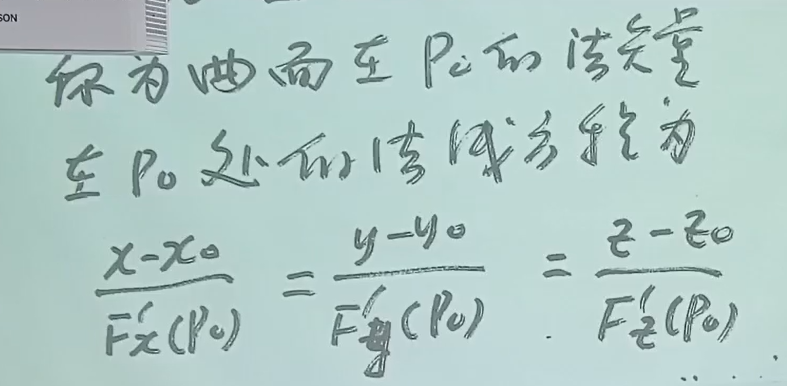
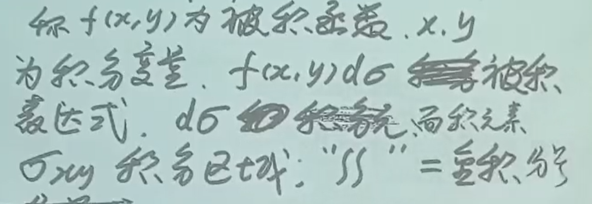
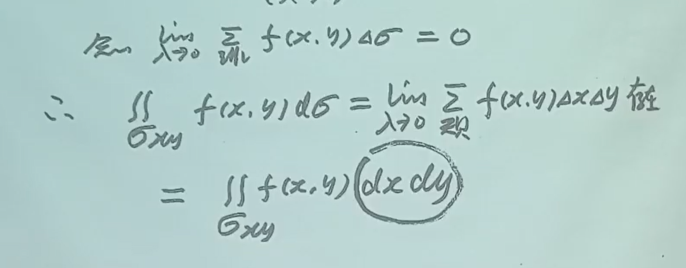

## 导言

!!! info "级数的起源"

    对于泰勒公式，想对左右积分/求导，但是有一个余项，搞不成，如果最后一项的极限为0，圆满了。

一个问题：无限个数相加是否是一个数

!!! info "数学知识的逻辑"

    实际问题 —— 抽象成定义（记作等式） —— 几何意义 —— 定义证明 —— 性质/定理/方法 —— 证明题 —— 应用题

## 定义

1. 数列的相加得到一个形式上的和（两个省略号），记作 $\sum ^\infty_{n = 1} u_n$

2. $u_n$ 一般项
3. **部分和** $S_n$，有 $\sum^ \infty _{n = 1} u_n = \lim_{n \to \infty} S_n$，其等于 $S$ （$S$ 得是实实在在一个数）则级数收敛，不存在则级数发散

!!! success "数列收敛发散和级数收敛发散方法互通"

    因为，数列 $a_n$ 敛散性 $\Leftrightarrow$ 级数 $\sum ^\infty_{n = 1} (a_n - a_{n-1})$ 敛散性，这里要假设 $a_0 = C$，$C$ 为常数，一般设为 $0$

    数列极限方法：

    1. 化简
    2. 转化为和式极限 --> 积分（定积分/广义积分……）
    3. 夹逼定理
    4. 单调有界

## 重要级数

### 等比/几何级数 

- $|q| \lt 1$，收敛，$\sum^ \infty _{n = 1} aq^{n-1} = \frac a{1-q}$
- $|q| \ge 1$，发散
    - $|q| \gt 1$，无穷
    - $|q| = 1$，无穷
    - $|q| = -1$，n为奇/偶的子数列极限存在但不相等

!!! warning 

    - 公比 $q \ne 0/1$，公比 $q$ 必须为常数（前后项比固定）

### p 级数

$\sum ^\infty _{n=1} \frac1{n^p}$

- $|q| \le 1$，发散

- $|q| \gt 1$，收敛

!!! success "证明方法"

    在某一区间上常数用不等式转为变量

    证明有界：上面 + 单调有界

## 收敛级数的性质

### 线性运算法则

!!! warning

    和积分一样，只有线性性质，没有乘除运算法则

### “改变性质”

改变/删除/添加有限项，敛散性不变，和肯定变了

> 类似数列极限

!!! success "用法"

    从某一项开始，判断敛散性即可，不用从首项

### 加括号

收敛级数，任意添加括号，依然收敛，和不变，但是是不一样的级数了。

**反之不成立**，**如果是正项级数，反之成立**。

!!! warning 

    其实是有限项和无限项的区别，有限项中成立的结合律在无限项中不一定成立，成立前提是收敛

!!! info+ "原理"

    1. **原级数收敛性**：设原级数 \(\sum a_n\) 收敛于和 \(S\)，即部分和 \(S_N = a_1 + a_2 + \cdots + a_N\) 满足 \(\lim_{N \to \infty} S_N = S\)。

    2. **添加括号后的新级数**：任意添加括号后，新级数为 \(\sum b_k\)，其中每个 \(b_k\) 是原级数中若干连续项的和（如 \(b_1 = a_1 + a_2\)，\(b_2 = a_3 + a_4 + a_5\) 等）。新级数的部分和 \(T_m = b_1 + b_2 + \cdots + b_m\) 对应原级数的某个部分和 \(S_{N_m}\)（\(N_m\) 为前 \(m\) 个括号包含的原项数之和）。

    3. **子序列收敛性**：由于原级数收敛，其部分和数列 \(\{S_N\}\) 的任意子序列（如 \(\{S_{N_m}\}\)）均收敛到同一极限 \(S\)。因此，新级数的部分和 \(T_m = S_{N_m}\) 也收敛于 \(S\)。

    !!! info+ "为什么是子序列"

        子列：从原数列取出一部分项生成的数列。现在这个加括号之后，和数列就变成跳跃的那种，原和数列中间有些项就没有了因为有括号变成新的 \(T_m = b_1 + b_2 + \cdots + b_m\) 了

!!! success "用处"

    将几项合并成好看的东西再求和

### 项趋于零

若级数收敛，则通项的极限 = 0；**反之不一定成立，即通项极限 = 0不能推出级数收敛**

!!! success "用法"

    在求数列极限时，如果猜到其极限 = 0，可以求和发现收敛，得出数列极限为0

逆否命题成立：通项极限不为0（存在且不为0 / 不存在）则级数发散

!!! success "用法" 

    判断极限 **是否发散**，先看通项极限。注意 = 0 不能推出收敛！

## 正项级数收敛性的判别法

### 思路总结

思考步骤：

1. 一般项和后一项有公因式：比值判别法
2. 一般项有n次方：根值判别法
3. 比较判别法的极限形式
4. 比较判别法
5. 单调有界
6. 线性运算法则
7. 一般项极限不为0，发散
8. 定义
9. 积分判别法
10. 柯西收敛准则

### 单调有界

定理：正项级数的前n项和有上界 $\Leftrightarrow$ 收敛

### 比较判别法

正项级数，**大于某个确定的正整数时每项**（原本是每项都大，事实上改变前k项不改变敛散性）大的收敛则每项小的收敛，小的发散则大的发散；反之不成立

!!! success 

    猜敛散，放缩
    

高中不等式

转化成正项级数 + 线性运算法则

!!! success

    经常用 n元基本不等式链

#### 比较判别法极限形式

!!! success

    其实就是**找等价量**，$u_n$ 是要判断的那个 $v_n$ 是自己找的：不要教条于放大 / 缩小，看比值为1，等价即可

- 证明：极限定义，将绝对值展开成两边

!!! success

    指数有变量：换成 $e$ 指数，再用等价量

$\sum _{n=1}^ \infty (\sqrt [n] n - 1)$

### 比值判别法

$n \to \infty$ 时后一项比前一项：

- 小：级数收敛
- 大：发散
- 相等：失效

!!! success

    适用于前一项和后一项公因式比较多的情况

### 根值判别法

$n \to \infty$ 时一般项的n次方根

- 小于1：收敛
- 大于1：发散
- 等于1：失效

!!! success

    适用于有n次方根 / n次幂

    有阶乘一定比值

### 积分判别法

\(u(n) = f(n), f(n)在[1, \infty ] 非负单调连续，\int _1^ \infty f(x) dx 与 \sum_1 ^ \infty u_n 同收同发\)

其中，将 \([1, \infty]\) 改为 \([k, \infty]\) 亦可。

$\frac{(n + 1)^n}{n^n}$ 极限是 $e$

### 例题

!!! success 

    当含参数级数比值判别法，参数取a时比值极限 = 1，要代入这个a值，研究这个极限式，利用判断敛散性其他方法，结合不等式，判断敛散

!!! success 

    灵活，比较判别法直接放缩分子成一个常数

\(\sum _{n = 1} ^ \infty\frac{\ln n}n\) 发散：因为 $n > 3$ 时 $\ln n > ln3 > 1$ 

## 绝对收敛

$\sum _{n = 2} ^ \infty |u_n| 收敛则 \sum _{n = 2} ^ \infty u_n 收敛$

证明：利用 $0 < a + |a| < 2a$

级数的敛散性情况

- 绝对收敛：绝对值收敛，原级数收敛
- 条件收敛：绝对值发散，原级数收敛
- 发散

## 一般级数敛散性判断

### 方法总结

1. 公因式：绝对值比值
2. n次幂：根值
3. 算绝对值：
    - 收敛：原来的收敛
    - 发散：如果是交错级数，用莱布尼茨判别法，若收敛则原级数条件收敛
4. 线性运算
5. 线性运算
6. 定义

### 绝对值的比值判别法

后一项的绝对值比前一项的绝对值：

- 小：绝对收敛
- 大：发散
- 相等：失效

### 绝对值的根值判别法

基本同上 ~

### 交错级数的莱布尼茨判别法

!!! success

    判断单调性：可以用对应函数

!!! success

    最重要的内容就是灵活，俗称代数变形能力

## 幂级数

函数项级数：每项都是函数，即 $u_(x) + u_(x) + u_(x) + \cdots + u_n(x) + \cdots = \sum _{n = 1}^ \infty u_n(x)$。我们关注的是在 $x$取何值时这个和式收敛 / 发散

使得和收敛的 $x_0$ 成为收敛点，收敛点的集合为收敛域

和函数是 $x$ 的函数，记作 $S(x)$，求和函数的目的是可以直接带入 $x$ 得到某点的级数和（用于数项级数）

特别的，当每一项都是幂，即通项 $a_n(x - x_0)^n$ 时，称为幂级数，又称为泰勒级数，$x_0 = 0$ 称为麦克劳林级数，

!!! info 

    现在要研究泰勒级数的收敛域，才能求级数

*这里先用绝对值的比值判别法*

!!! info 

    想想推导过程，中间有一步是从极限中提出来 $|x - x_0|$

后一项与前一项比完之后剩下：$|x - x_0|, \frac{a_n}{a_{n + 1}}$，设 $\lim _{n \to \infty}\frac{|a_n|}{|a_{n + 1}|} = R$，因为比值判别法，将得到当式子与 1 比较，得到：

- $|x - x_0| < R$ 绝对收敛
- $|x - x_0| > R$ 发散
- $|x - x_0| = R$ 代入x的值用判断数项级数方法做

另，当级数有n次幂，则用根值判别法：$R = \lim_{n \to \infty} \frac 1{\sqrt[n]{|a_n|}}$

$R = 0$ or $R = \infty$ 同样成立

R 称为收敛半径，$(x_0 - R, x_0 + R)$ 为收敛区间

这样的也是标准的：**通过提出一个什么东西可以化标准则他就是标准的**。因为后面的标准部分 $×$ 前面的常数不改变敛散性

!!! success "$2n$ 次幂非标准的做法"

    变量代换：$y = (x-x_0)^2$，最后变量要换回来。

    找到规律：对于指数是 $kn + b$ 的，直接按照正常的方法求出来再讲结果开 $k$ 次根号

### 收敛幂级数的性质

**线性和**

收敛半径：

- 两个收敛半径不一样：则幂级数的收敛半径是原来两个的最小值
- 收敛半径一样：和的收敛半径小于等于原来的

**乘法**

**除法**

乘过去变成乘法

### 收敛区间上收敛幂级数的性质

**性质一**

极限运算和求和符号可以交换

$$\lim_{n \to \infty} \sum_{n = 1}^ \infty a_nx^n = \sum_{n = 1}^ \infty lim_{n \to \infty}a_nx^n$$

（$S(x)$ 在收敛区间内连续）

**性质二：逐项可导**

导数的和 = 和的导数

在收敛区间上，幂级数和函数的导数等于逐项导数的和，则该和函数任意有限次可导，且每次导数的收敛半径不变，且k次导之后 $\sum$ 的下界变成了 $k$ 因为每次第一项为常数导数为0

**性质三：逐项可积**

无限项的积分的和 = 和的积分

