## 概念

定义: 是一个表达式, 无穷多个数相加(可相同or不相同)

无穷多个数是否都可以相加 ? 

$$ S = 1 + 2 + 3 + \dots > 2 + 4 + 6 + \dots = 2(1 + 2 + 3 + \dots) = 2S$$

$$ 得 S < 0$$

## 级数的收敛和发散

定义部分和数列 ($S_k$为第一项加到k项), $ lim_{n \to \infty}S_n = S $, 则级数收敛; 若没有极限, 则发散

求级数和其实没用, 核心是判断收敛/发散

**等比级数/几何级数**

$ |q| < 1 时, \Sigma = \frac a{1 - q}$

$ |q| \ge 1 时, 几何级数发散$

$q = -1, 无极限，摆动的$

- 有界数列但没有极限: 证明用归结原理,用"有界数列有极限等价于子列都有极限且相等", 找奇和偶，极限不等

应用: 转化为等比级数来求值

**p-级数**

$$\Sigma^\infty_{n = 1} \frac1{n^p} = 1 + \frac 1{2^p} + \frac 1{3^p} + \dots , p为常数$$

$$当 p \le 1 时, 发散; p \gt 1 时, 收敛$$

思想: 

- 构造积分, 统一被积分函数(形式相同, 变 $x$)

!!! info "构造积分法"

- 单调有界准则证明有极限

应用:

- 其他级数和p-级数比较, 判别收敛和发散
- 级数敛散性判别准则 = 级数收敛发散的定义 + 数列收敛发散的判别准则

## 级数的性质

1. :star:改变有限项, 不影响敛散性

    - 证明: 去掉前k项, 考虑原来和剩下两个级数, 两个的**部分和**只差前面k项的和(是一个常数)

2. 线性性质: 两个收敛级数的线性和收敛, 收敛和发散组合是发散, 发散和发散组合不确定

    - 证明: 分配律结合律 + 极限运算法则(组合的极限 = 极限的组合, 且两个极限都存在)
    - 第二个: 反证法: 用"$ a = (a + b) - b $"
    - 类似数列加减

    - 推论: 分配律(同乘非零常数不改变敛散性)
        - 证明: 两个部分和只差一个常数倍数

    - 应用: 用简单级数的敛散性判断复杂级数的敛散性

3. 结合律: 收敛级数中添加任意个括号, 所得的新级数也收敛, 和不变; 但是发散级数不对了

    - 证明: $B_n 是 A_n的子数列, 所以收敛$

4. 交换律: 不满足, 即收敛级数可以交换出发散级数, 交换之后级数的和是多少都可以做到, 一般不研究

!!! warning 

    无穷多相加和有限项不一样

5. :star:必要条件: 如果级数收敛, 则$lim_{n \to \infty}a_n = 0$ 

    - 推论: 一般项不是0(**没有极限 or 有极限但不是0**), 则发散
    - 注意: 必要条件! 一般项为0, 可能收敛可能发散(反例: p-级数, p > 0 一般项全是0 )
    - 应用: 一般项不是0则发散, 判断敛散性
    

    图片!

## 正项级数收敛性判别

正项级数: 全正 / 某一项后面非负即可(因为改变前面有限项不改变敛散性)

1. (充要)部分和有上界

    - 证明: 单调有界, 正项级数一定单调增(因为全正数)
    - 应用: 放缩部分和表达式, 不用求具体表达式
!!! info 

    正项级数一定收敛 or 发散, 不会振动

2. 比较判别法: 再找一个级数, 一般项比收敛的小则收敛, 一般项比发散的大则发散

    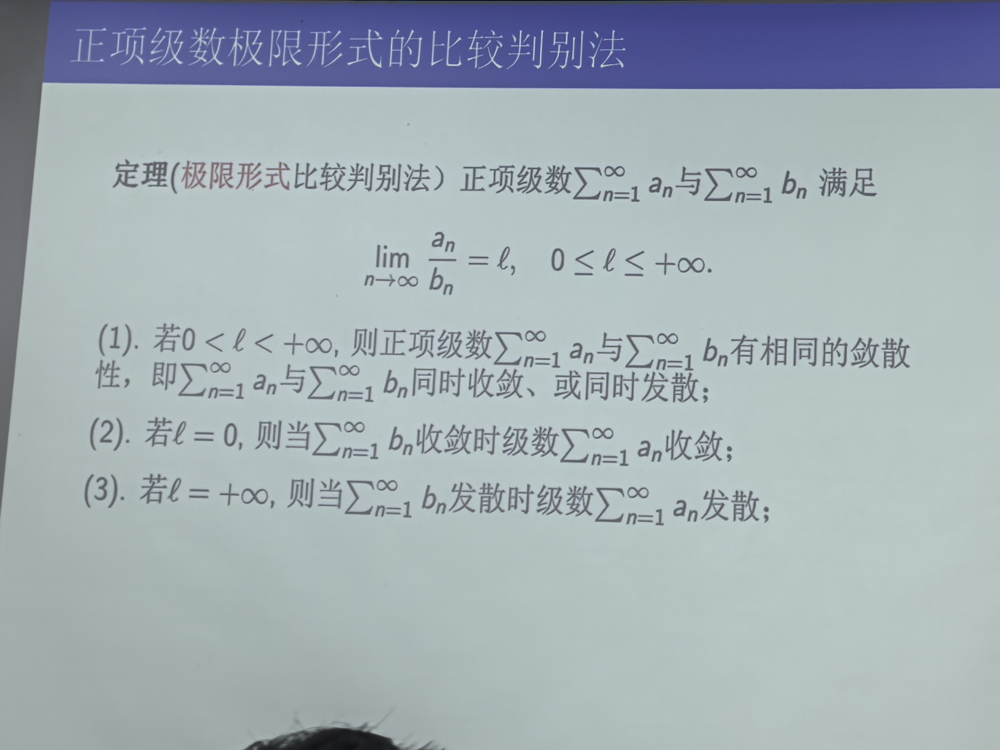
    
    - 证明: 定义
    - 应用: 先猜敛散性, 再根据目标构造"另一个"(**n很大时他跟啥差不多**): 大胆放缩, 有时也用p-级数

3. 极限形式比较判别法: 两个正项级数,看一般项: $lim_{n \to \infty}\frac{a_n}{b_n} = l$

    - 证明: 用极限定义:极限 -> 在邻域, 用上一条
    - 理解: 正常数: 同阶无穷量, 故相同; 为0: 上小下大, 用上一条; 无穷: 上大下小, 用上一条
    - 应用: 与比较判别法一样, 只不过算极限简单
    - 局限: 两个数比无极限则该方法无法判断(不是方法不对), 用比较判别法

    !!! warning "方法"

        估计方法:
        - n趋于无穷大时候的等价无穷大(等价无穷小), 变幂函数估计
        - 最初判断敛散性: 看n无穷大一般项是否为0

        放缩方法: 
        - 常数之类直接扔
        - 将大的分出一部分把小的抵掉, 另一部分够大
        - 分子分母可以分别变化
        - 正弦: 看清内部的趋势, 再确定怎样放缩
        - 对数: (如果可以)将内部变成$(1 + t)$再放缩
        - 根式: 考虑分母有理化, 再将 $\sqrt{n + 1} 变成 \sqrt{n}$

    !!! warning 

        递推公式: 单调有界 + 定义

4. 比值判别法: 

    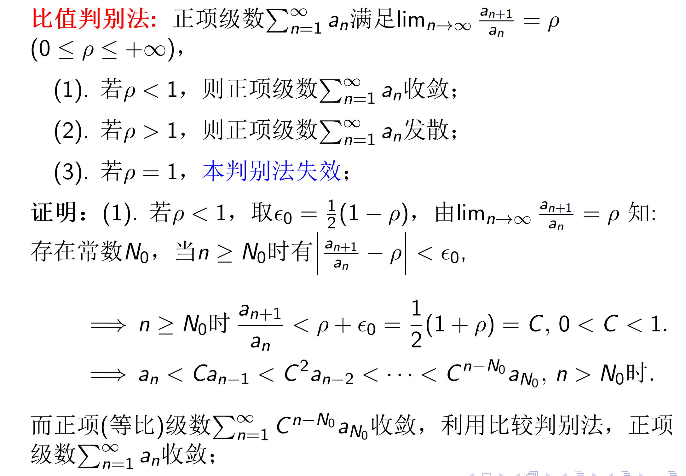
    
    - 应用: 一般项是复杂分式, 很多因子相乘

5. 根值判别法
    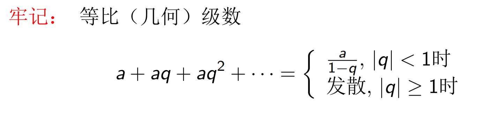
    - 应用: 一般项的指数有 n
    - 关系: 根值不好用那么比值也不行
!!! success "使用顺序" 

    一般项是否为0 --> 比值/根值判别法 --> 比较判别法的极限形式 --> 比较判别法 --> 一般项是否有上界 --> 定义法

6. 积分判别法

    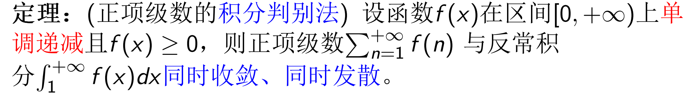

!!! warning "绝对值的应用"

    数列绝对值的极限 $\ne$ 0则数列极限 $\ne$ 0
    
### 例题

随便放缩：大的直接拆出一部分将小的消掉，将 $n$ 看成无穷大之后再放缩

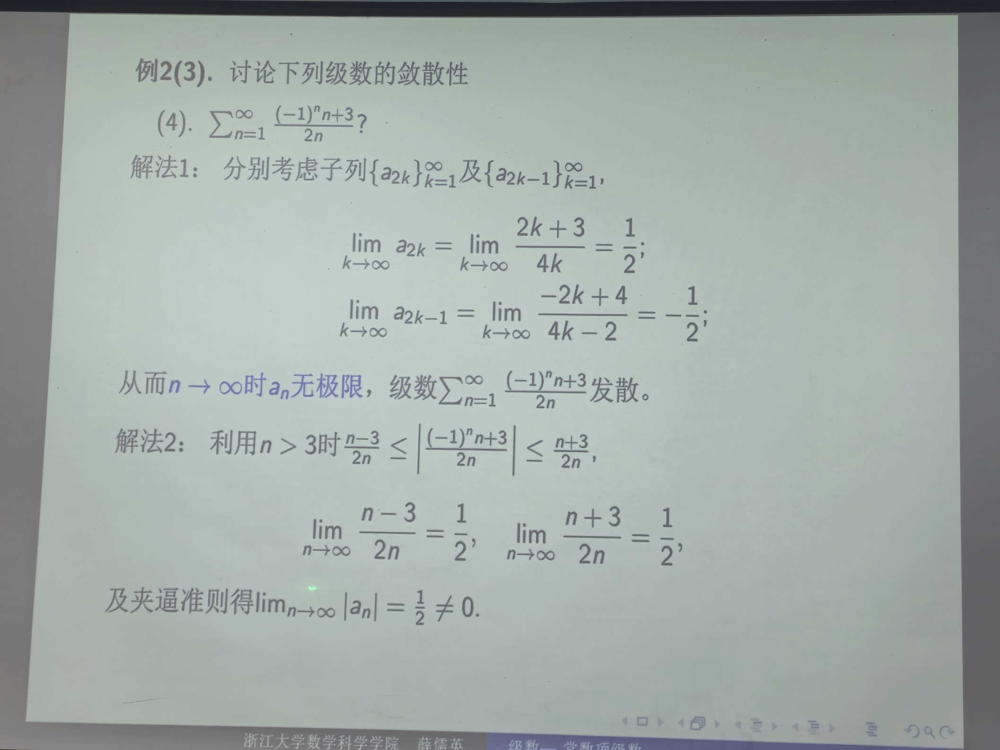

$(-1)^n$ 可以考虑加绝对值，绝对值可以考虑左右界放缩，用夹逼，这个与取整函数很类似

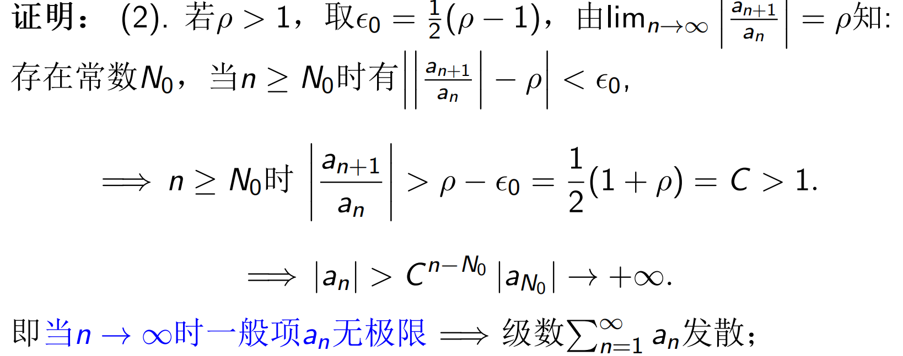

$\sin$ 可以考虑等价无穷量将其搞掉，即放缩成幂

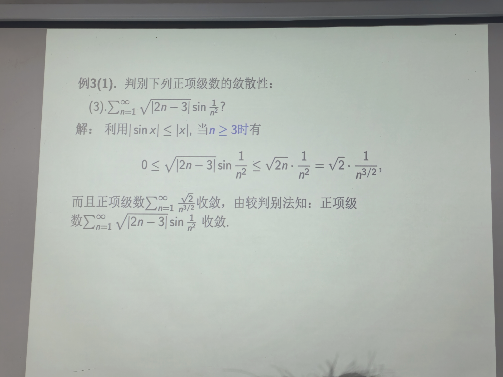

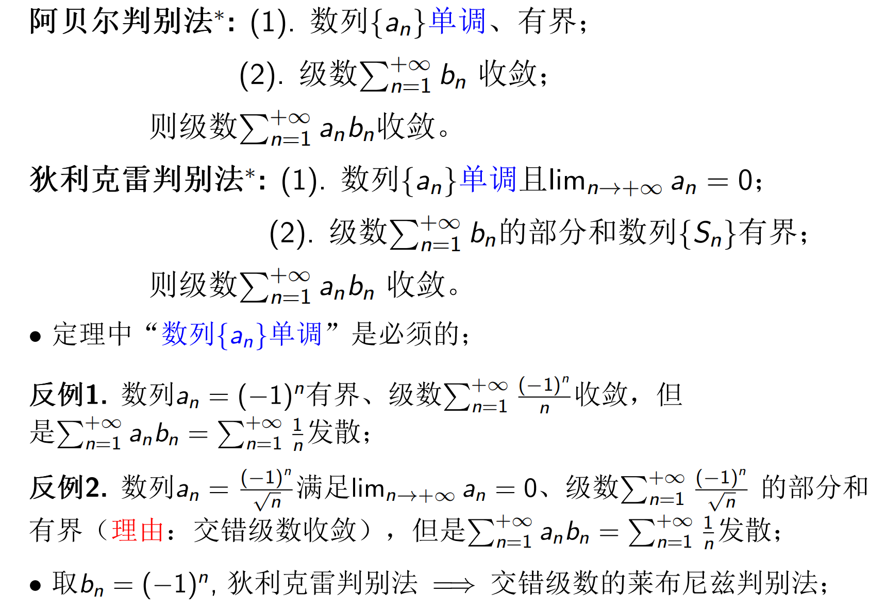

!!! success "方法"
    
    首先猜想其敛散性: 一般项趋于0不代表收敛, 当然, 如果猜错了, 朝着目标继续

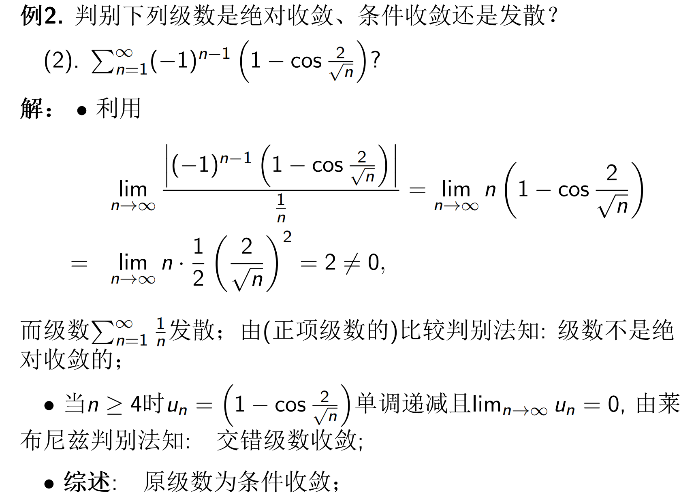
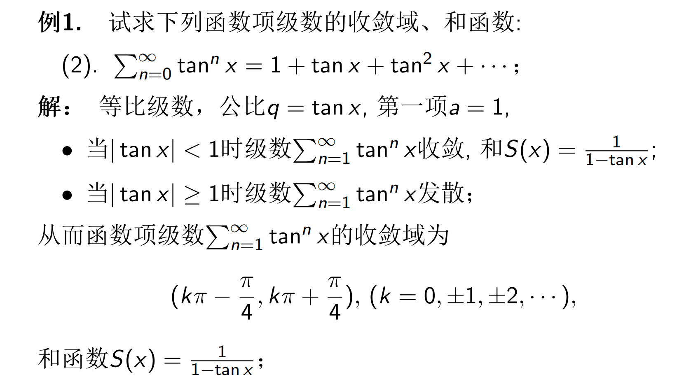
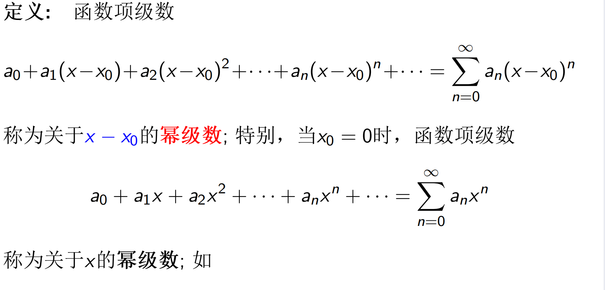
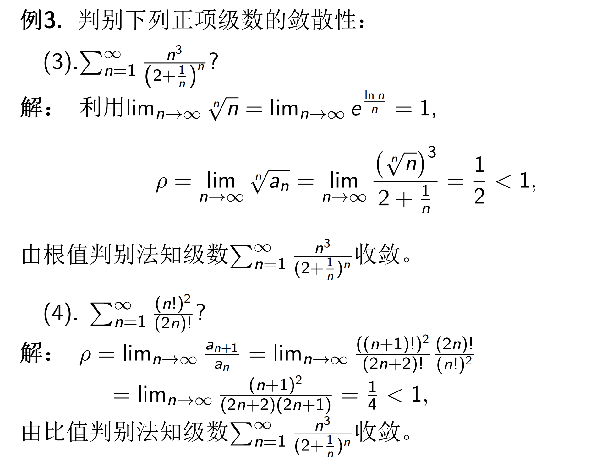
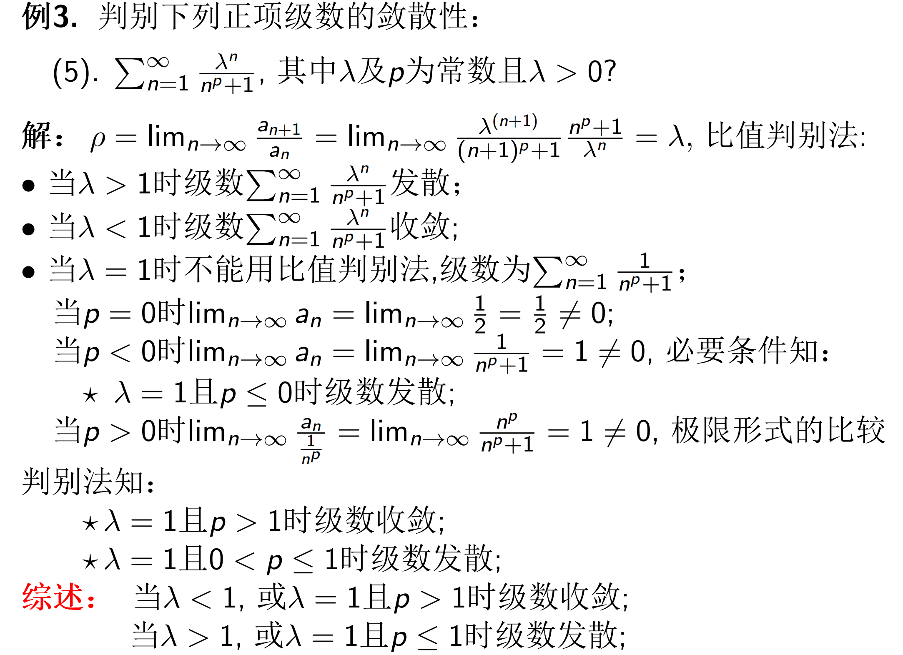
第一步: 实际得分开 p 的范围算

## 一般项级数敛散性判别

### 交错级数

从敛散性来看, 从后面有限项开始交错即成为交错级数

莱布尼茨判别法

- 除符号外单调递减
- 趋向0

**关键点：首先是交错级数，再证明两个条件**

- 单调递减：
    - 单调性，导数

交错p-级数：

## 绝对收敛/条件收敛

定义：一般项加绝对值之后（**变成正项级数**）收敛则称绝对收敛；收敛但不绝对收敛称条件收敛

- 正项级数没有绝对收敛

定理：绝对收敛的级数必收敛

- 证明：

- 应用：判断一般项级数的敛散性：若其绝对收敛（正项级数的判别法很多）则其收敛

比值判别法&根值判别法

- 证明：
    

    - $\gt 1$: 一般项不趋于0，极限定义证明
    

 

!!! info

    一般项级数只没有比较判别法

证明（不）绝对收敛

- 直接是正项级数判别即可

***后面几个题做一下***

一般出题：交错级数，条件收敛

一般思路：判断不是绝对收敛，再用莱布尼茨判别法

## 函数级数

### 幂级数

收敛区间 $\ne$ 收敛域，二者差两个端点，其敛散性得单独考虑

- 收敛区间完全由收敛半径决定，一定是一个开区间
- 求收敛域还得验证端点值代入是否收敛

