Welcome to the world of Caculus!

!!! success "Let's see"

	=== "Isaac Newton"
		
		Nature and nature's laws,

		Lay hid in night,

		God said,

		Let Newton be!

		And all was light

	=== "Gottfried Wilhelm Leibniz"

		For it is unworthy of excellent men to lose hours like slaves in the labor of calculation which could safely be relegated to anyone else if machines were used.              —— Gottfried Wilhelm Leibniz 

	=== "Karl Heinrich Marx"

		马克思写过阅读微积分著作的笔记，从哲学的高度分析了微积分中的一些问题，
		他把做微积分习题当作一种休息

## 极限
### 极限的证明问题
#### 思想

- 目标意识
- 不等号意识(证明题)
	- 按着不等号方向寻找下一步思路/方向（我需要哪个方向的不等号，在条件/之前的里面找）

#### 方法——定义法
##### 本质
用各种方法，化简至可求$δ(ε)$ or $X(ε)$，求出它就行。

类型1：化简至$n$ or $x$的简单的式子即可

类型2：化简至$k|x - x_0|$形式

即，要么去用双侧不等式绝对值号，要么保留绝对值结构

##### 类型1. 数列极限 & $x \to\infty$型函数极限
方法：
1. 想定义，结构对应
2. 相减，列不等式ε & x or n
3. 放缩
4. 求出定义中的N or X

例题：上册P32、P53课后习题
##### 类型2. $x \to x_0$型函数极限
常规：

方法：
1. 列不等式
2. ***重点：***随便找一个常数$c$(半邻域的长度即 $δ$)，利用$x$属于邻域，框定$x$的范围
3. ***核心：***用该范围放缩不等式（有目标意识不等号意识），使之变成$k|x - x_0|$形式
4. 用邻域，代入$δ$，求出$δ(ε)$
5. 取$δ = min\{δ(ε), c\}$

例题：上册P53课后习题

其他题型：

核心/本质不变：放缩一开始列出来的不等式（有目标意识不等号意识），使之变成$k|x - x_0|$形式

### 极限的求解方法
#### 理解

几乎全在极限值的***ε邻域内***
——P20 ^251156
#### 公式
##### 极限

1. 
$$\lim_{x \to 0} \frac{\sin x}{x} = 1$$ 

（**说明**：仅当 $0/0$ 型时可用）

2. 
$$\lim_{x \to \infty} \left(1 + \frac{1}{x}\right)^x = e$$

$$\lim_{x \to 0} \left(1 + x\right)^{\frac{1}{x}} = e$$

$$\lim_{x \to 0} \left(1 - x\right)^{\frac{1}{x}} = e^{-1}$$
（**说明**：必须满足 $1^\infty$ 型）

1. 
$$\lim_{x \to 0} \frac{\ln(1 + x)}{x} = 1$$  

**证明**： 

$\lim_{x \to 0} \ln(1 + x)^{\frac{1}{x}} = \ln e = 1$ 

2. 
$$\lim_{x \to 0} \frac{e^x - 1}{x} = 1$$ 

**证明**：  

令 $t = x$, 则 $\lim_{x \to 0} \frac{e^x - 1}{x} = \lim_{t \to 0} \frac{e^t - 1}{t} = 1$

3. 
$$\lim_{x \to 0} \frac{a^x - 1}{x} = \ln a \quad (a > 0, a \neq 1)$$  

**证明**： 

$
\lim_{x \to 0} \frac{a^x - 1}{x} 
= \lim_{x \to 0} \frac{e^{x \ln a} - 1}{x} 
= \ln a \cdot \lim_{x \to 0} \frac{e^{x \ln a} - 1}{x \ln a} 
= \ln a \cdot 1 
= \ln a
$

5. 
$$\lim_{x \to 0} \frac{(1 + x)^\alpha - 1}{x} = \alpha \quad (\alpha \in \mathbb{R})$$  

$$等价于：(记这个别记上面那个) $$

$$(1 + x)^α = 1 + αx$$ 

**证明**：  

$
\lim_{x \to 0} \frac{(1 + x)^\alpha - 1}{x} 
= \lim_{x \to 0} \frac{e^{\alpha \ln(1+x)} - 1}{x} 
= \alpha \cdot \lim_{x \to 0} \frac{\ln(1 + x)}{x} 
= \alpha \cdot 1 
= \alpha
$

---

总结公式：

- $$\lim_{x \to 0} (1 + x)^{\frac{1}{x}} = e$$
- $$\lim_{x \to 0} \frac{\ln(1 + x)}{x} = 1$$
- $$\lim_{x \to 0} \frac{e^x - 1}{x} = 1$$
- $$\lim_{x \to 0} \frac{a^x - 1}{x} = \ln a$$
- $$\lim_{x \to 0} \frac{(1 + x)^\alpha - 1}{x} = \alpha$$

##### 等价无穷小
- $\sin x \sim x \quad \arcsin x \sim x$
- $\tan x \sim x \quad \arctan x \sim x$
- $1 - \cos x \sim \frac{1}{2}x^2$
- $\ln(1 + x) \sim x \quad e^x - 1 \sim x$
- $\sqrt[n]{1 + x} - 1 \sim \frac{x}{n}$
- $(1 + x)^\alpha \sim 1 + \alpha x$

---

##### 幂指函数极限
核心：

$$
\lim u(x)^{v(x)} = \lim e^{v(x) \ln u(x)}
$$ 

**若**  

$$\lim_{x \to x_0} u(x) = a, \quad \lim_{x \to x_0} v(x) = b$$  

**则**  

$$\lim_{x \to x_0} u(x)^{v(x)} = a^b$$  

**证明**：  

$
\lim_{x \to x_0} u(x)^{v(x)} = \lim_{x \to x_0} e^{v(x) \ln u(x)}  
= e^{\lim_{x \to x_0} v(x) \ln u(x)}
$  

又因 $\lim_{x \to x_0} v(x) \ln u(x) = b \ln a$，得  

$
\lim_{x \to x_0} u(x)^{v(x)} = e^{b \ln a} = a^b
$ 

特别地：
当 $u(x) \to 1, v(x) \to \infty$ 时，即$1^\infty$型
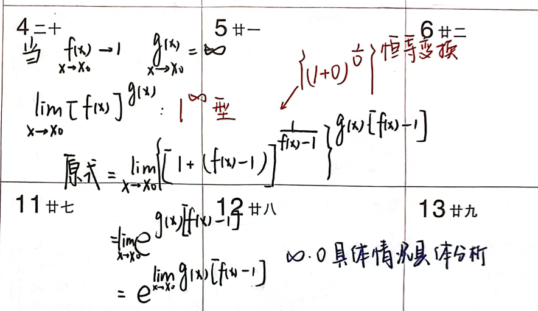

等价无穷小：

- 只有要替换的内容是无穷小才可用：想用之前一定要检查一下是不是无穷小！！！

- 只有要替换的内容是无穷小才可用：想用之前一定要检查一下是不是无穷小！！！
#### 方法

##### 复杂题目求解的一般思路

    灵活、综合运用各种方法

1. 用技巧化简式子

2. 往常见/已知模型极限上靠/化

3. 用技巧 and 下述基本方法简化式子

##### 〇、先化简！先化简！
- 方法：
	- 等价无穷小
	- 换元

##### 一、估值，再定义证明
- 直接法
- 放缩法
	- 目的：
		- 能算
		- 好算（含n的项少且简洁）—— 上册P19 例9、例10
	- 方法：
		- 首先搞清不等号方向
		- 具体式子放缩——用技巧，有目标，有方法
			- 项多：直接舍弃 or 变0/1/K—— 上册P19 例9、例10
		- 抽象式子放缩——用性质
			- 有界性
			- 保号性
	- 上位思想：
		1. 你放缩不能光盯着式子一直看，想着去咋放缩，（上册P23）
		   而应该：品味式子的结构，朝着你心里想的那个方向去写，先猜后证！
		   其实你的数学感觉挺好的，所以抓住你每个感觉，想办法实现它：找到它成立的条件并尽量靠近它
	    2. 本质目的：好算
	       所以，大胆随意放缩，咋好算咋能算咋来放完证一下是对的即可
	- 实例：
		- 三角：看目标选用
			- 泰勒公式
			- 有界性：别学了泰勒就忘了还能放成1 or -1
##### 二、四则运算 & 变形后四则运算

- 注意：
	- 每个极限都存在
	- 分母不为零
	- 仅对有限项
	- 无限项：先求和，再极限
- 大胆用！将每个目测极限存在的式子提出来

- 变形方法：
	- 三角恒等变换：和差化积 积化和差！
		- 积化和差 ：乘积大法好！
			- —> 1-cos—>与x的幂等价无穷小
			- —> 有界 * 无穷小
		

##### 四、利用无穷小 * 有界函数 = 无穷小

##### 五、夹逼定理

- 核心：先猜后证
- 根据感觉or数学基本常识or对数学的理解猜出答案，再放缩找两个不等号
- 用处：
	1. 有取整函数
    : 利用取整的不等式
	2. 递推不等式
    : 反复用递推不等式放缩直到不能用为止
	3. 极限 = a < b
    

##### 六、定积分定义

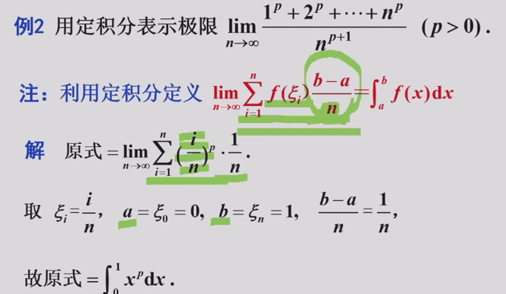

五、六 都用于n项和极限

n项乘积极限：取对数化为n项和

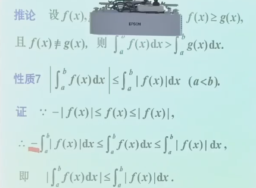

#####  八、等价无穷小

- 注意：
    - 只有乘积 or 商时才可替换
    - 外面有指数啥的都不行，只有乘积商
    ![[Pasted image 20241105101358.png]]
    - 无穷小啊 ：—>0时：检查！
    - 换时随意换
- 用处：
    - 去根号
    - 去三角

##### 九、幂指函数极限

变e

##### 十、单调有界准则
- 用处：
    - 用递推关系给出的数列
- 做法：
    - 法一：
        - 单调：
            - 法一：一个用递推公式换
            - 法二：两个都用递推公式换，得出an - an-1  and  an-1 - an-2的关系，用数学归纳法
        - 有界：
            - 法一：随便放缩
            - 法二：数学归纳法
        - 求极限：
            设极限等于x，对递推关系两边同时求极限，n—>∞时an = an-1 = x
    - 法二：（相当于放缩时有目标了）
        - 算出来极限
        - 极限和前几项比大小（看上界or下界），数学归纳法证明上界or下界
        - 证明单调：用上面求出的界
        - 求出极限（卷子上写）
    

注意：正负号 

##### 十二、分段函数分界点处的极限
方法：
    先求左右极限，再用定义（左右相等则为那个值，有一个不存在则极限不存在）

##### 十三、未定式极限 —— 基本方法 & L'Hospital法则

**基本方法**：

*$frac00$ 型*

（一）、因式分解约去0因子

- 用处：有理函数
- 方法：
	- 因式：（x - x0）
	- 直到化到没有分母（每次都检查分子分母是否为零，若是则还可分，想怎么分）
- 技巧：常数的拆分

（二）、根式有理化
- 用处：根式

*$\frac{\infty}{\infty}$ 型*

分子分母同时除以次数最大的无穷大使得某些项变成无穷小

###### 条件
3个
1. $lim_{x \to x_0}f(x)$ = 0 or $\infty$, $lim_{x \to x_0}g(x)$ = 0 or $\infty$

2. $x$属于$x_0$ 的某去心邻域内，f'(x), g'(x)都存在，g'(x) != 0

3. $lim_{x \to {x_0}} \frac {f(x)} {g(x)}$ = A or $\infty$ 

**三个条件逐一检查**，*都满足才可以用*

###### 证明

###### （一）数列
- 题型：未定式的数列极限
- 方法：转化成函数
- 原理：海涅定理
- 注意：满足1～3条件
- 格式：最后一行
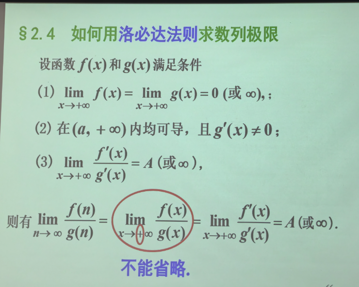

###### （二）函数

- 题型：
	- 未定式的函数极限
- 注意事项：

！先用前面求极限方法，实在不行再洛必达（不是首选）

！洛必达法则有条件，满足条件才可以用

- 条件：

1. 上下0 or $\infty$ 
2. &f 和 g 在 x_0& 去心邻域均可导 

- 其他：
$
0 \cdot \infty, \quad \infty - \infty, \quad 0^0, \quad 1^\infty, \quad \infty^0.
$

**解法**: 转化为 
$\frac{0}{0}$或 $\frac{\infty}{\infty}$

**转化的方法：**

- 换元 例如$\frac1x = t$
- 硬变分式

**类型**：

1) **0 · $\infty$ 型**

**步骤**: 
$0 \cdot \infty \Rightarrow \frac{1}{\infty} \cdot \infty, $
或 
$0 \cdot \infty \Rightarrow 0 \cdot \frac{1}{0}.$

2) $\ \infty - \infty \ \text{型}$

**步骤**:  
$\infty - \infty \Rightarrow \frac{1}{0} - \frac{1}{0} \Rightarrow \frac{0 - 0}{0 \cdot 0}.$

**例**:  

$\lim_{x \to \infty} \left ( x - x^2 \ln\left(1 + \frac{1}{x}\right) \right)$

3) 幂指函数

统一化成以$e$为底

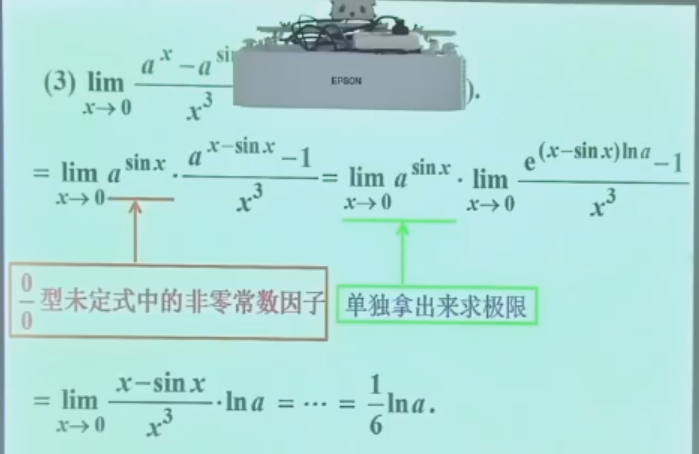

$lim_{x \to 0} \frac{a^x - a^{sinx}}{x^3}$

$lin_{x \to 0^+}{\frac1{x^2} - \frac1{tan^2x}}$

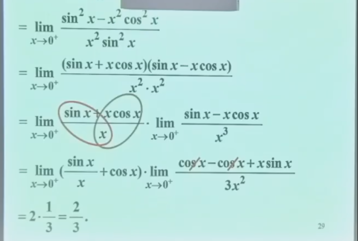

$lim_{x \to 0^+}{(\frac{1-cosx}{x^2})}^\frac1x$

易错：

!!! warning 

	只有指数部分极限存在or常数才可以用直接对底数求极限

	因为用ln之后指数部分来到分母，极限不存在，不能用四则运算，则这里不能单独算

	因此，都用e为底！

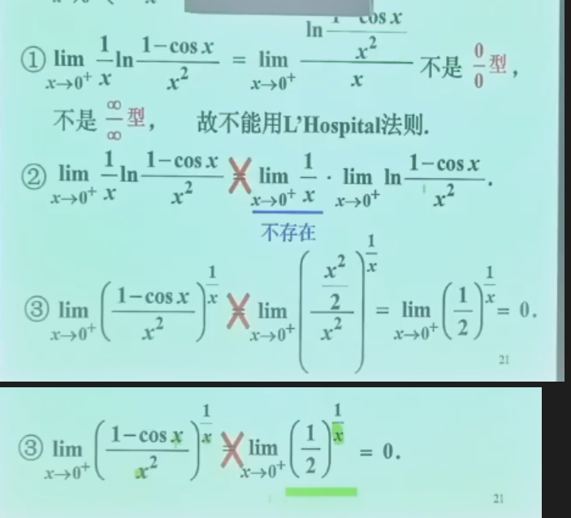
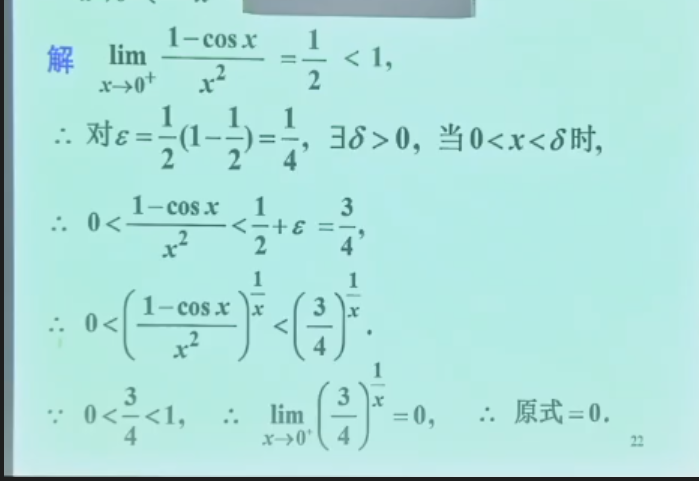
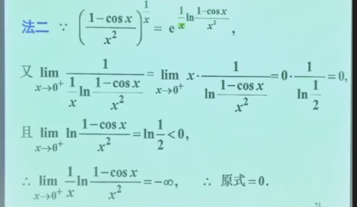

- **总结**

还是多多用前面的方法啊！

泰勒公式（等价无穷小

<!-- 一些题目可以看看ob上面，不过问题不大 -->

##### 十四、Taylor's Theorem
公式再看看

要点

- 用带皮亚诺型余项的泰勒公式

- 展开到出现分母的那个x的次数为止，

- 若为乘积式，则要保证第一个括号的首项乘第二个括号的末项为分母的那个x的次数 & 第二个括号的首项乘第一个括号的末项为分母的那个x的次数

#### 技巧

##### 一、换元
灵活换元！
t = 1/x 较常见
##### 二、提公因式/提相同结构

名曰“提相同结构”：将常数提出，剩下的东西可换元  A+B = A(1 + B/A)

##### 三、放缩反解
换元——反解——放缩——简化
—— 上册P19 例10

##### 四、同除
分子分母同除最大的的那个

##### 五、补项

目的：凑
凑已有形式—— 上册P21证明乘法
凑关系：补的项是已有项间的桥梁
凑好看的形式·，凑有利于计算的形式，凑***美***的式子——数学之美在于完美

##### 六、常数的拆分
##### 七、定义式绝对值
得到两个方向的不等号 —> 放缩/找范围用

##### 八、取倒式
无穷大量 —取倒式—> 无穷小：可以用四则运算
#### 特殊结构与代数处理

- 根式
	- 有限次：有理化

		例题：上册P54-8（13）
	
	- n次根式：因式分解

		相对性：1次~n次 <=> $\frac1n$次~1次

		例题：上册P35 例4
	- 换元：$x = t^{题目出现的所有根指数的最小公倍数}$ $ \to$ 整式
- 二项式：
    操作：展开 
    要求：整数指数——不行就放缩＋取整（上册P23L15）
    类似：
        n次根号：设一个（换元）再变n次根号展开（上册P19L10）

- ($a^0$ - 1) / 0 
	推导方法：化e指数 —> 等价无穷小
	结论：lna
	化到他：
		t * ($a^m$ - $a^n$) : 提出$a^n$ , 外面用乘除凑1/(m - n)项，不能是加减！（乘除：那个分式再求极限，之后再用四则运算法则）

- 1 ^ 无穷大
	化到他：
		底数+1 -1，指数凑出+恒等变形补出剩余
		剩余部分求极限：用本章别的方法
- 底与幂：同底不同幂，同幂不同底
	[[Summary Of Calculus#^e6c631|提出相同结构]]
	
#### 其他

1. $lim=a<b$  $=>$ $ε=\frac{(a-b)}2$ ：取中点
2. 善用max min函数取最大or最小
3. 趋向无穷大：指数函数 > 幂函数 > 对数函数

### 求极限时的注意事项

- 注意哪个是变量哪个是常量
- 注意变量趋向于哪里
- 正负号！
	x趋于-∞：换元成t = -x
- 只有要替换的内容是无穷小才可用：想用之前一定要检查一下是不是无穷小！！！

## 函数
### 拐点与凹凸性
[[Knowledge Frame of Caculus#凹凸性与拐点|点击查看知识体系]]
方法：
	同极值点 —— 一阶导变二阶导即可
例题：
	![[Pasted image 20241107081034.png]]

### 曲率
[[Knowledge Frame of Caculus#曲率|点击查看知识体系]]
注意：转角：直线转过的角度，不是俩直线成的任意一个角

## 导数

### 导数的求解方法

#### 技巧
- 对数求导法

	- 幂指函数
	- 多因式乘积
	- 分式，分子分母包含上面俩
#### 分段函数在端点处导数
用定义，求左右导数

#### 反函数求导
严格用定义，写${\rm d}x$/${\rm d}y$，中途不要x和y交换

#### 隐函数求导
法一：
	两边同时对x求导
注意事项：
	别忘了y是x的函数，复合函数
法二：
    [[Summary Of Calculus#^97a0e1|一阶微分形式不变性]]
#### 高阶导数
方法：
- 基本函数用公式
	- 幂指对三角
- 数学归纳法
	- 三角
	- $e^x$
- 乘积
	- 化简成为有公式的加减
	- 莱布尼茨公式：有幂函数最好：有限次导 = 0

- **构造常微分方程法**
	
	1. 两侧求导，继续直接导会陷入无尽深渊
	2. 移项至同一侧出常微分方程，判断是否合理
	3. 若合理（无根号等使我陷入深渊的东西，纯幂函数求几次导就没了）
	4. 若不合理：再导，两个式子联立消掉不该出现的东西
	5. 递推

	例题1：$y = arctanx$, 求$y^{(n)}|_{x = 0}$

	例题2：$y = arcsinx$, 求$y^{(n)}|_{x = 0}$

- **泰勒公式法**

#### 参数式函数求导数
都用dy/dx，写上公式
都是补dt（高阶导数亦然，因为我们写的f‘ g’都是关于t的导数，所以在求二阶导时，要补出dt才能用公式）
注意：二阶导是对x导，一阶t/2千万不能二阶是1/2

#### 极坐标方程求导
化参数方程再求导
### 求导时的注意事项

- 结果只能用x, y表示，若有其x', y' 等，应化成x, y
- 别忘了复合函数
- 求导前先化简，求完也要化简，但是不做要求
	n阶：将X的系数整理成+1可防止套公式时出错：将-移到式子和式子之间别放在X的系数钱
	高阶一定得化简
	有ln一定先化简：ln自身可化简
	假分式（分子次数大于等于分母）
	    先分离常数

![[IMG_4002.png]]![[IMG_4001.png]]
![[IMG_4003.png]]
![[IMG_4005.png]]
## 微分
### 微分的求解方法
##### 显函数
法一：用导数
法二：用微分：两边同时微分，
	初等函数：dy = f‘(x)dx
	四则运算：导数公式中“导”换成“微”
##### 隐函数
法一：先隐函数求导
法二：一阶微分不变性
    两侧同时微分，但是 x和y同等地位的变量，即不再考察x和y的函数关系，对x怎样操作就对y怎样操作
    eg：乘积xy：xdy+ydx ^97a0e1

隐函数某一点处的微分：
	由于结果中有X和Y那么求某一点出的导数或者微分，要将那一点出的横坐标或纵坐标带入原方程解除纵坐标或横坐标

#### 近似计算
##### 微分法
f(x0 + Δx) = f(x0) + f'(x0) * Δx
原理：忽略了dx的高阶无穷小量
注：o(dx)实际上有，对具体函数可能看得清晰一点，但抽象的公式中并不知道它是哪算出来的，就是因为具体函数有所以补上去的

![[IMG_3998.png]]
——>取x0 = 0，Δx = x
得到的实际上是等价无穷小公式
![[IMG_3999.png]]

##### 泰勒公式法
方法
	用拉格朗日型余项的
![[Pasted image 20241106224944.png]]

## 中值定理
#### 极值与最值

- 最值嫌疑点：不可导点(不可导点嫌疑点见下）、驻点、端点

    一定得是闭区间上的

- 极值嫌疑点：不可导点、驻点

##### 极值点的判定与极值的求解
###### 显函数

**方法**

简单函数：第一充分条件

普通函数：同高中

复杂函数

- 何谓复杂：导函数难求、存在不可导点（分段、导函数定义域断开）

- 做法：
	- 找不可导嫌疑点：
		- 一阶导数没定义的点
		- 分段函数的分段点
	- 列表讨论
	- 用充分条件判定
- 例题：
		求函数$f(x)=1-\frac32x^{-\frac13}$的极值

别忘了定义：极值是局部最小值

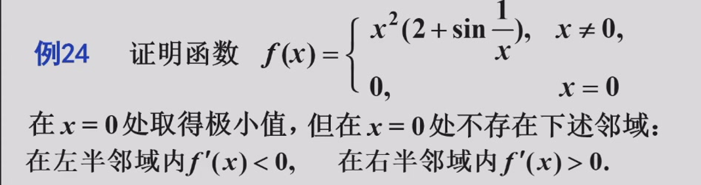

思想：证明不是……：举反例
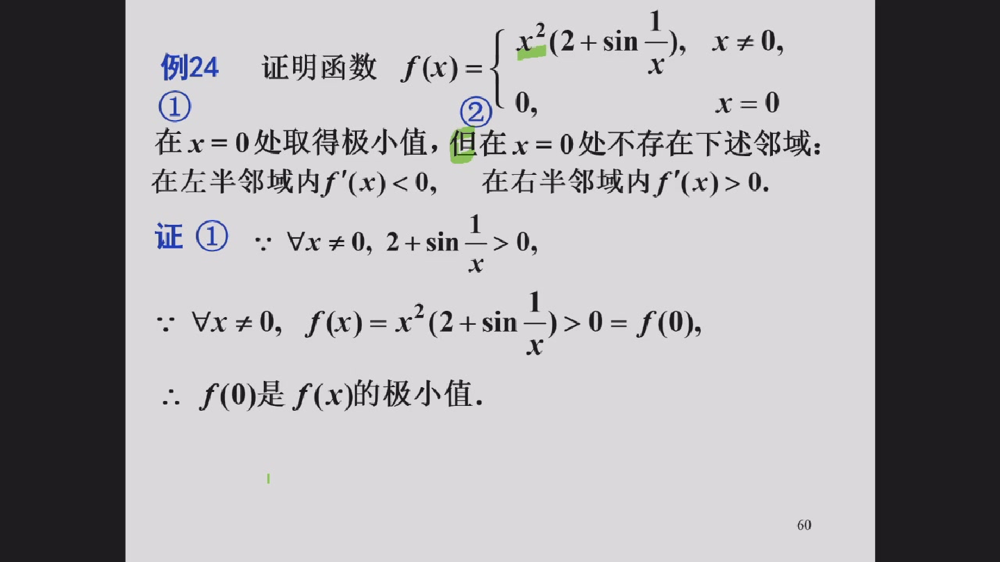
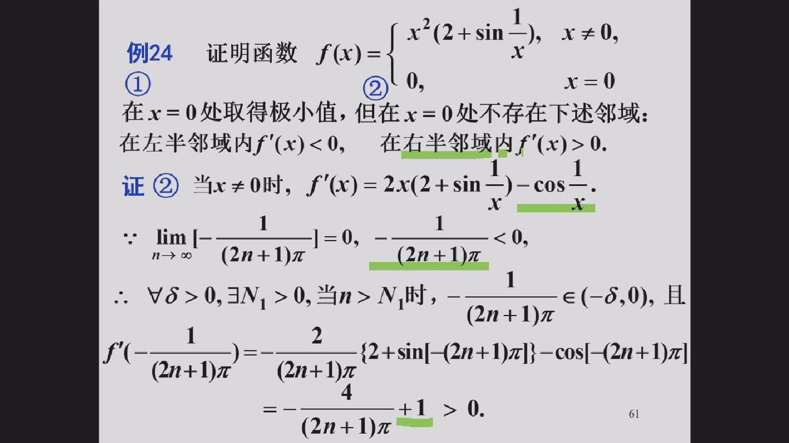
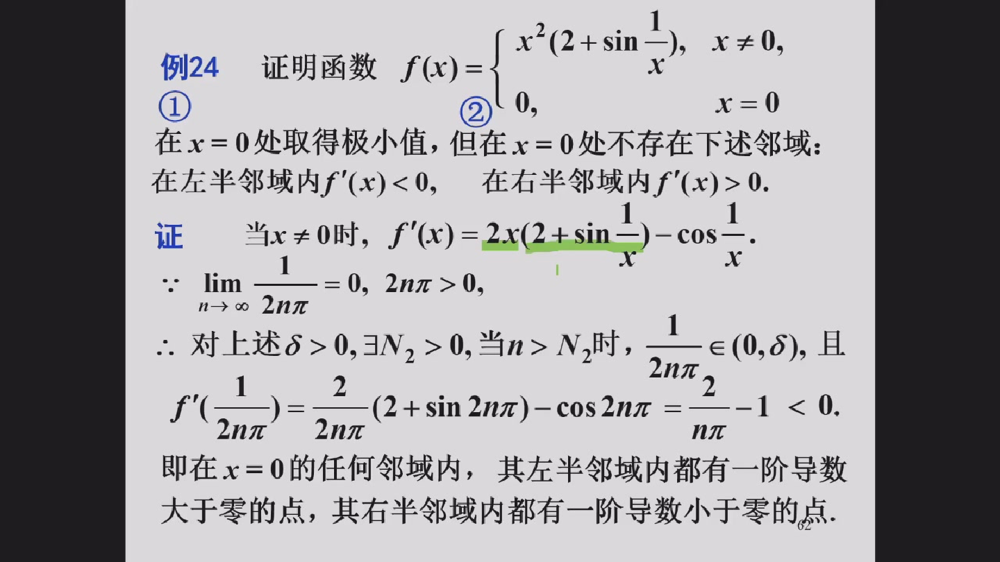

###### 隐函数

**方法**

- 统一用：第二充分条件

	原因：因为$y'$是$x和y$的函数，你不知道$x$属于$x_0$左右范围时$y'$正负

**步骤**

- 求一阶导 —— 令$y'=0$，得$x和y$等式 —— 将其带入$y$（原函数），得到驻点的横纵坐标

!!! info

	隐函数极值只用考虑驻点处，不可导点超纲

- 求二阶导 —— 带入$y',x,y$，得到$y''$，第二充分条件，看正负判断极大or极小

#### 罗尔定理
##### 理解

等高段函数中间必有水平切线

##### 题型一：一阶常微分方程解的存在性

**识别**

- 求证：一阶常微分方程等式，自变量是 $\in$ 题目中那个区间的 $ξ$

- 条件：
	
	闭区间连续

	开区间可导
	
	再给出2个函数值$f(x_0) = k$ ，这是用来推原函数的$f(x_1) = f(x_2)$

**方法**

1. 求证的式子变形 ——> RHS = 0 & LHS是某抽象函数的导数（\==高中导函数原型构造）

2. 构造辅助函数（1. 中结果积分找原函数…）

3. 对辅助函数用罗尔

**例题**

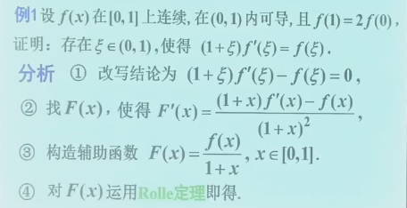

##### 题型二：方程根的个数
**类型一**：证明至多有多少个实根

**方法**

- 反证法：假设$n+1$个，每两个之间用罗尔，得到导数有$n-1$个根，再每两个之间用罗尔，得到二阶导有$n-1$个，依此类推，连续使用，直到矛盾

	

#### 拉格朗日中值定理
一、理解
	存在切线斜率 = 割线斜率
二、应用
	题型一：不等式证明问题
		识别：
			类型一：函数值相减，变量值相减
			类型二：没有相减：函数值相加
				做法：减0 or 加a减a
			给出几个特殊点处函数值 eg : $f(0) = 0$
		方法：
			选定区间
			构造形式
			从区间内找点，将其分为两个子区间，分别用拉格朗日
			从结论出发，联系定理，逆推目标
		例题：
		![[Pasted image 20241105085005.png]]
		遗失部分：$f''(x) > 0, f(0) = 0$ 
		![[Pasted image 20241105092644.png]]
		遗失部分：$[a,b)连续$
		![[Pasted image 20241105093345.png]]
		遗失部分：$f(a) = f(b)$ ,存在$\xi$ 
		方法：区间内找点，将其分为两个子区间，分别用拉格朗日
		![[Pasted image 20241105095636.png]]
		遗失部分：$[0,+\infty)二阶可导$， $(0,a)$取得最大值，$f'(a)$
#### 柯西中值定理
一、理解
	讨论函数比和导数比

二、应用
	识别
		有差，但没有$x_1$ - $x_2$，有俩函数值的差
	例题
	![[IMG_20241029_104215.jpg]]

## 泰勒定理
### 公式
1. 泰勒公式
- 带拉格朗日型余项
$$
f(x) = P_n(x) + R_n(x) = \sum_{k=0}^{n} \frac{f^{(k)}(x_0)}{k!}(x-x_0)^k + \frac{f^{(n + 1)}(ξ)}{(n + 1)!}(x-x_0)^{n + 1}
$$
其中，$ξ$属于$(x_0, x)$ or $ξ = x_0 + θ(x - x_0)$，$P_n(x)$称为泰勒多项式，$R_n(x)$称为拉格朗日型余项

- 带皮亚诺型余项
$$
f(x) = \sum_{k=0}^{n} \frac{f^{(k)}(x_0)}{k!}(x-x_0)^k + o((x - x_0)^n)
$$
其中$o((x - x_0)^n)$为高阶无穷小

2. 麦克劳林
- 带拉格朗日型余项

一般形式：
$$
f(x) = \sum_{k=0}^{n} \frac{f^{(k)}(0)}{k!}x^k + \frac{f^{(n + 1)}(ξ)}{(n + 1)!}x^{n + 1} = \sum_{k=0}^{n} \frac{f^{(k)}(0)}{k!}x^k + \frac{f^{(n + 1)}(θx)}{(n + 1)!}x^{n + 1}
$$	

常用公式

$$
e^x = \sum_{n=0}^{\infty} \frac{x^n}{n!} = 1 + x + \frac{x^2}{2!} + \frac{x^3}{3!} + \cdots
$$

$$
\sin(x) = \sum_{n=0}^{\infty} \frac{(-1)^n x^{2n+1}}{(2n+1)!} = x - \frac{x^3}{3!} + \frac{x^5}{5!} - \cdots
$$

$$
\cos(x) = \sum_{n=0}^{\infty} \frac{(-1)^n x^{2n}}{(2n)!} = 1 - \frac{x^2}{2!} + \frac{x^4}{4!} - \cdots
$$

$$
\ln(1+x) = \sum_{n=1}^{\infty} \frac{(-1)^{n+1} x^n}{n} = x - \frac{x^2}{2} + \frac{x^3}{3} - \cdots
$$

$$
\frac{1}{1-x} = \sum_{n=0}^{\infty} x^n = 1 + x + x^2 + x^3 + \cdots \quad \text{for} \quad |x| < 1
$$

$$
(1+x)^a = \sum_{n=0}^{\infty} \binom{a}{n} x^n = 1 + ax + \frac{a(a-1)}{2!}x^2 + \frac{a(a-1)(a-2)}{3!}x^3 + \cdots
$$

皮亚诺

$$x —>0$$ 

$$
e^x = 1 + x + \frac{x^2}{2!} + \frac{x^3}{3!} + \cdots + \frac{x^n}{n!} + o(x^n)= \sum_{n=0}^{\infty} \frac{x^n}{n!} + o(x^n)
$$

$$
\sin(x) = x - \frac{x^3}{3!} + \frac{x^5}{5!} - \cdots +\frac{(-1)^n x^{2n+1}}{(2n+1)!} + o(x^{2n+1})= \sum_{n=0}^{\infty} \frac{(-1)^n x^{2n+1}}{(2n+1)!} + o(x^{2n+1})
$$

$$
\cos(x) = 1 - \frac{x^2}{2!} + \frac{x^4}{4!} - \cdots + \frac{(-1)^n x^{2n}}{(2n)!}+ o(x^{2n})= \sum_{n=0}^{\infty} \frac{(-1)^n x^{2n}}{(2n)!} + o(x^{2n})
$$

$$
\ln(1+x) = x - \frac{x^2}{2} + \frac{x^3}{3} - \cdots + \frac{(-1)^{n+1} x^n}{n}+ o(x^n)= \sum_{n=1}^{\infty} \frac{(-1)^{n+1} x^n}{n} + o(x^n)
$$

$$
\frac{1}{1-x} = 1 + x + x^2 + x^3 + \cdots + x^n+ o(x^n)= \sum_{n=0}^{\infty} x^n + o(x^n) \quad \text{for} \quad |x| < 1
$$

$$
(1+x)^a = 1 + ax + \frac{a(a-1)}{2!}x^2 + \frac{a(a-1)(a-2)}{3!}x^3 + \cdots + \frac{a(a-1)(a-2)\cdots(a-n+1)}{n!}x^n + o(x^n)= \sum_{n=0}^{\infty} \binom{a}{n} x^n + o(x^n)
$$

### 题型一、求极限

**公式**

*用皮亚诺型余项的泰勒公式*

**方法**

步骤：

- 展几项？
	- 一部分（分子or分母）只有单项式：
		另一部分出现该单项式的系数次幂为止；

		若为乘积AB：A首项 * B末项 = 该单项式系数次幂 && B首项 * A末项 = 该单项式系数次幂，决定了末项到哪
	- 均为复杂式子
		- 本质：求出等价无穷小
		- 所以：分子分母分别展到首项出现为止：和or差式的左右两端对照着展，到那一项消不了，成为首项为止
		该方法也适用于上面的情况，反正就是出首项
		- 例题：
		求$lim_{x \to 0} \frac{x^2e^{2x} + ln(1 - x^2)}{xcosx - sinx}$  
		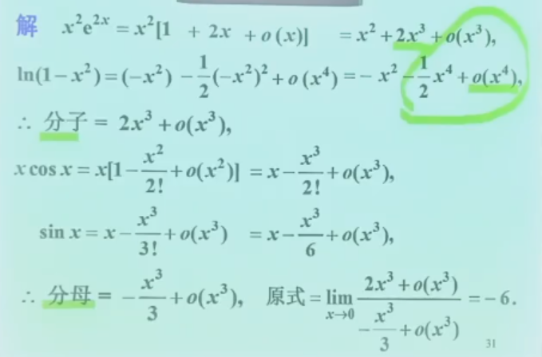
		
注意事项：

- 最后一项的后面写上$o(x^k)$
	- 不写就是错的
	- 最后一项$x$是几，$k$就写几

### 题型二、近似计算

**公式**

*带拉格朗日型余项的麦克劳林公式*

**方法**

步骤：

- 公式里的$x$替换为要求的自变量值
- $误差<最后一项|_{θ = 1}$

原理：

<figure markdown="span">

  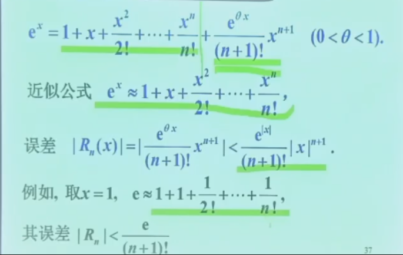

  <figcaption>泰勒定理近似计算原理</figcaption>

</figure>

### 题型三、证明题 / 难题

**最关键的问题为什么想到用泰勒？**

!!! warning

	平时是因为你在做泰勒的作业前面全是泰勒考试需要自己想！

	这个问题一定要想清楚，每个方法想想什么时候用，为什么用，什么条件触发我用他。

- 涉及*〇 & 一 & 二阶导数*的不等式证明题

- 

**特点**

不是直接运用，不能直接看出来要用泰勒

**公式**

*带拉格朗日型余项的泰勒公式*

- 其中$x, x_0$代哪个值？

	见下《怎样选点》
	
- 展到第几项？

	题目中涉及到的最高阶导数对应的项

**方法**

特殊点处的函数值在特殊点处展开成泰勒公式

特殊点：
- 各阶导数已知的点
- 区间端点
- 区间中点
- 题目涉及的点

怎样选点？

- 某阶导已知 —— 在该点处展开，即作为"$x_0$"，式中出现"$f^{(k)}x_0$"，

!!! info 

	那么接下来想办法求该点处别的阶的导数（如果需要且可以的话）

	且还需注意由于使用拉格朗日型余项，最高阶的导数的自变量是ξ，不再是x_0，且一定要搞清楚这个ξ的范围，在so-called x 和 x_0 区间之间。

- 从求证的式子出发寻找被展开的点，即作为"$x$"

	- 式子左边是某点*函数值*（注意是函数值，n阶导数不算），大概率展开那个点

- 一些原则
	- 观察式子结构：二阶导、一阶导都是作为“在该处展开”；原函数值作为被展开的值
	
	- 实在想不到就试试端点、中点、某阶导已知点、跟着感觉走~

	- "$ξ$"，即“证明：$\exists$…$\in ( )$ ”中的"…"，永远不可能作为“在该处展开”，不管是用什么字母表示的。
	
	- 这个"$ξ$" 他是与拉格朗日型余项$R_n(x)$中的 $ξ$ 有关的（经过了放缩 or 取值 等操作）
	
	- 端点和中点的类型：

		- 操作：展两次，两式加加减减消一些你感觉需要消去的东西（主要是不知道的量什么的），端点在中点处展开 & 中点在端点处展开都试试都有可能
		- 识别：$\frac{(a+b)}2$ or $\frac{(a-b)}2$ 及其倒数、平方等出现时候

	- $x$也有可能作为被展开的那个点！这时千万不要混了$x 和 x_0$啊~

	- 涉及到端点的一般都要展两次，加加减减

**注意事项**

- 分清 $x 和 x_0$，展开某处 & 在某处展开

例题：
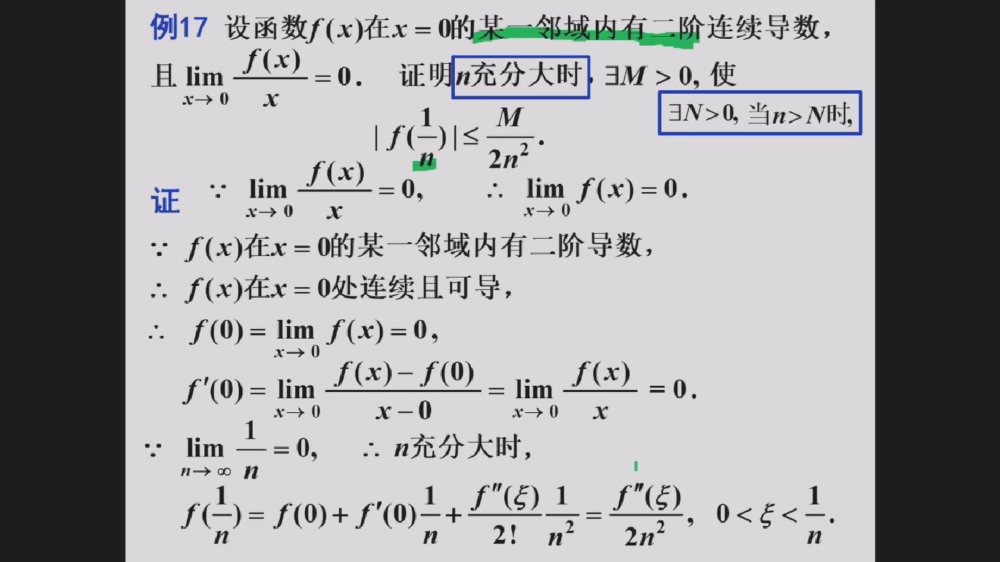

<figure markdown="span">

  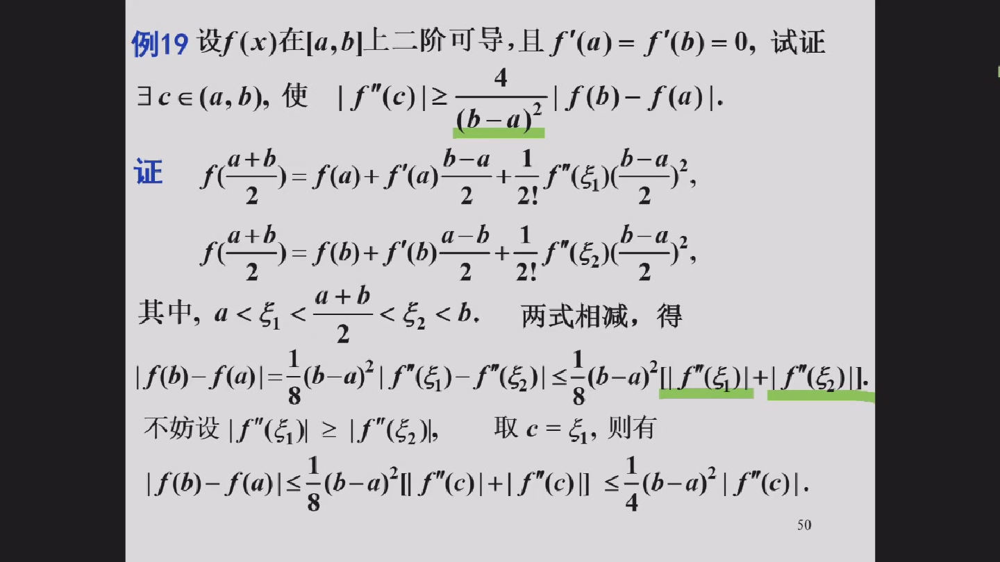

  <figcaption>tips：闭区间上连续函数有界</figcaption>

</figure>

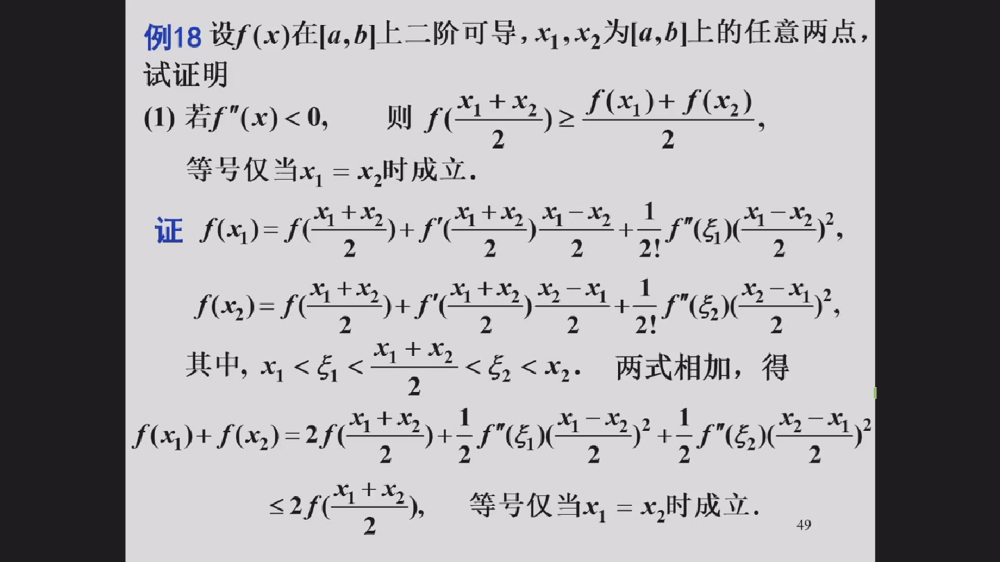

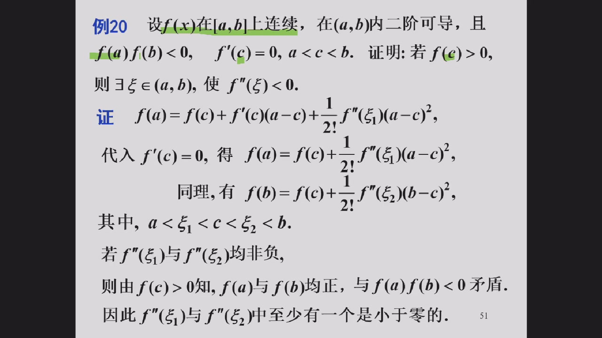

用〇阶、二阶讨论一阶，当然泰勒；问x，则x为特殊点，在这展开；展什么？端点；俩，消元

<!-- [公式](https://r-z-zhang-ai.github.io/KNOWLEDGE/Note/Calculus/Knowledge%20Frame%20of%20Calculus/#_53) -->

### 间接法求泰勒公式

**识别**

求$x = x_0$非0处泰勒展开

通过换元，变成：

1. 新元在0处的泰勒
2. 符合几个常见的背过的结构

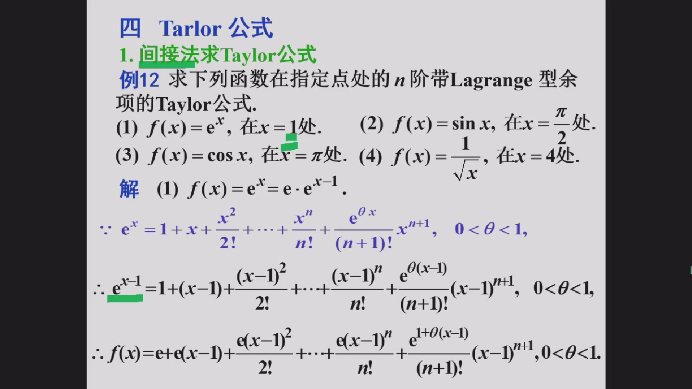
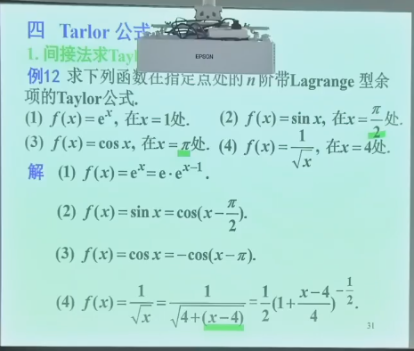

### 求高阶导数
#### 法一、泰勒公式法
**原理**

**方法**

1. 将函数用泰勒展开化为多项式函数
	- 注意：四则运算的函数可以分开化啊
2. 用上述原理($a_k = \frac{f^{(n)}(x_0)}{k!}$)找到对应项即得。

例题：

错误原因：分子分母同除了x，将所得式子展开：
- 一、不知道可以分开展。
- 二、看 x or x 的函数趋于多少：出现$\frac1x$, 他是$+\infty$啊怎么能。
#### 法二、常微分方程法
方法：

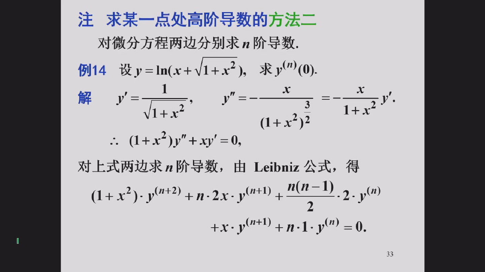
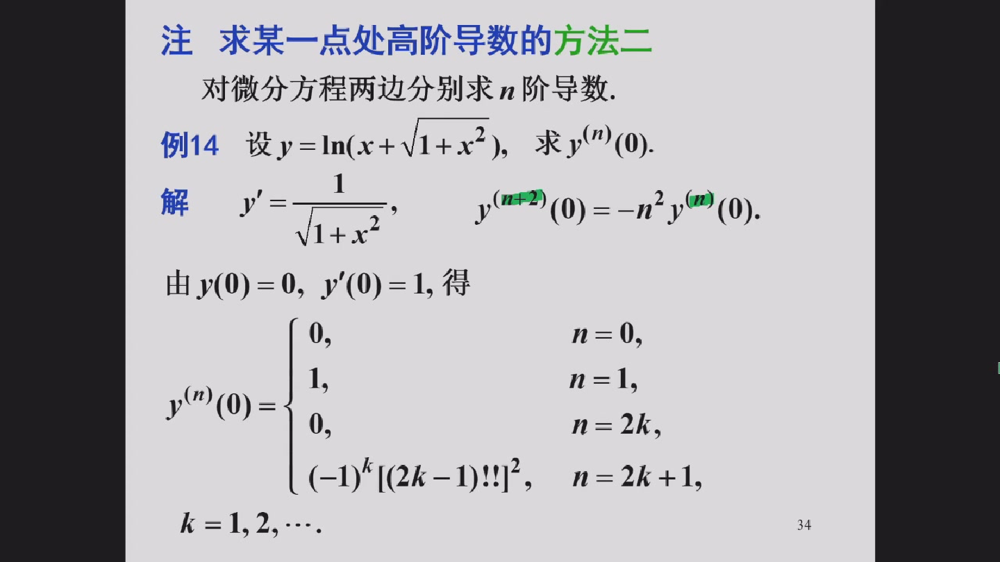

## 不定积分

+ C

### 基本积分表

1. 常数函数积分  
$$
\int c \, dx = c x + C
$$

2. 幂函数积分  
$$
\int x^n \, dx = \frac{x^{n+1}}{n+1} + C \quad (n \neq -1)
$$

3. 指数函数积分  
$$
\int e^x \, dx = e^x + C
$$
$$
\int a^x \, dx = \frac{a^x}{\ln a} + C \quad (a > 0, a \neq 1)
$$

4. 对数函数积分  
$$
\int \ln x \, dx = x \ln x - x + C
$$

5. 三角函数积分  
$$
\int \sin x \, dx = -\cos x + C
$$
$$
\int \cos x \, dx = \sin x + C
$$
$$
\int \tan x \, dx = -\ln |\cos x| + C \quad (\cos x \neq 0)
$$
$$
\int \cot x \, dx = \ln |\sin x| + C \quad (\sin x \neq 0)
$$
$$
\int \sec x \, dx = \ln |\sec x + \tan x| + C \quad (\cos x \neq 0)
$$
$$
\int \csc x \, dx = -\ln |\csc x + \cot x| + C \quad (\sin x \neq 0)
$$
$$
\int \sec^2 x \, dx = \tan x + C
$$
$$
\int \csc^2 x \, dx = -\cot x + C
$$
$$
\int \sec x \tan x \, dx = \sec x + C
$$
$$
\int \csc x \cot x \, dx = -\csc x + C
$$
$$
\int \sinh x \, dx = \cosh x + C
$$
$$
\int \cosh x \, dx = \sinh x + C
$$

6. 反三角函数积分  
$$
\int \frac{1}{\sqrt{1-x^2}} \, dx = \arcsin x + C     = -\arccos x + C \quad (|x| \leq 1)
$$
$$
\int \frac{1}{1+x^2} \, dx = \arctan x + C= -arccot x + C
$$
$$
\int \frac{1}{x\sqrt{x^2-1}} \, dx = \text{arcsec } x + C \quad (|x| \geq 1)
$$

7. 常考
$$
\int \frac{1}{a^2+x^2} \, dx = \frac1a \arctan \frac xa + C
$$

**用处：** 分母是二次多项式，配方，凑该形式

### 易错

- 开根号带绝对值，其实不定积分默认正，定积分必须加，并需要按照角度象限判断正负。

- $\frac1x$ 积分得 $\ln |x|$ 积成 $\ln$ 的一定要带 ***绝对值***

- $\int f(x)dx - \int f(x)dx = C$

### 方法总结

#### 零碎方法

- 分子 " $+啥-啥$ " 凑出分母（的因式），约分化简

	使用情形：当分子与分母的一部分重合即可。

<!-- - 根据需要将 $df(x)$ & $f'(x)dx$ 灵活转换，其实是相对固定的。 -->

#### 三角函数积分

- 三角偶数次：用倍角公式降次

#### 两种不同类型函数乘积

**备注：** 多个函数 *乘除* 均算在内

**步骤**

1. 观察 $f(x)$ 和 $g(x)$ 有无 *求导层面的* 内在关联，若有：走“2. ”；若无：走“3. ”；看不出来：先走“2. ”，再看有没有关联；也可寻找该函数的其他特征用对应方法，走“4. ”

2. 凑微分法：“求导层面的关联”（详见下）

3. 分部积分法

4. 观察其他特征

#### 多项式类函数

- $纯二次幂 * 二次多项式的函数$ ：取一个一次出来凑微分，再用分部积分法
	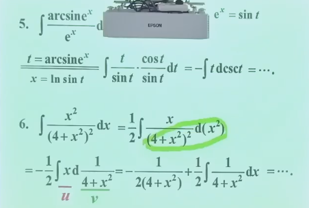

##### 高次广义幂函数

**方法：**

1. 凑微分法 —— 操作幂

	形如 $\int 某结构^{高次} \&某结构^{低次} \, {\rm d}x$

1. 换元法 —— 交换次数法：

	形如 $\int {复杂多项式}^{复杂次数} {简单多项式}^{简单次数}$ ：令 $t = 复杂多项式$

**例题**

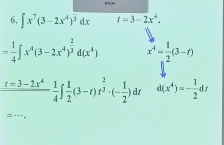

##### 多项式函数

**类型与方法：**

**例题：**

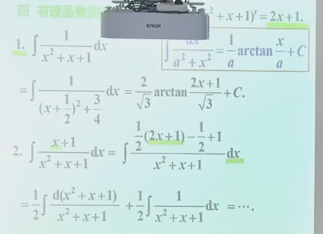

- 假分式（分子次数大于等于分母）：一定一定分离出来多项式，剩下真分式

##### 无理函数

**类型一**

- 被积函数中含有二次根号二次根号内是一次多项式： 令 $t = \sqrt\ $

	>其实根号并不讨厌，讨厌的是根号与其他常数相加减，故若没有相加减，另根号内部分 = t 亦可

- 被积函数中含有二次根号二次根号内是二次多项式： 配方—— 三角换元

	- $\sqrt {a^2 + x^2}$ ： 令 $x = a\tan t$
	- $\sqrt {x^2 - a^2}$ ： 令 $x = a\sec t$
	- $\sqrt {a^2 - x^2}$ ： 令 $x = a\sin t$ or $x = a\cos t$

**类型二**

分母 $x^n \sqrt{x的多项式}$  ： 倒变换令 $t = \frac1x$ —— 观察式子结构选用其他方法例如凑微分/三角换元

!!! info "倒变换的原理"

	精髓在分母根号外面的 $x^n$，与 $\frac1{t^2}$ 抵消

**类型三**

凑微分法：分母有根号，且其中 $x$ 的表达式和 $d$ 里面的相近or次数相同可以讲该根号凑微分

**例题：**

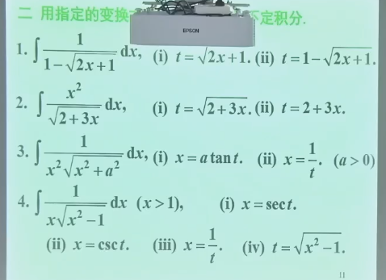

### 凑微分法（第一类换元法）

***方法***

**核心方法：**

1. 掌握老师讲的基础题目的固定操作方法
2. 其他全靠感觉 & 目测法

**零碎方法**

1. 形如 $\int f(x)g(x) \, dx$ : 

	把 $f(x)$ 和 $g(x)$ 分别求导，看跟另一部分有没有关联，好的话就是另一部分。
	
	若前一步无求得关联或者 $f(x)$ or $g(x)$ 较复杂，将 $f(x)$ or $g(x)$ 的**一部分**拿出来求导，看跟另一部分有没有关联。

	这里的“一部分”：跟着感觉走 & 不要那个使得导数复杂的运算符，例如 $\sqrt\ $ 。

	例题1：$\int \frac{sinx cosx}{\sqrt{b^2\cos^2x + a^2\sin^2x}}\, dx$  

	例题2：$\int \frac1{1 - x^2} ln\frac{1 + x}{1 - x} \, dx$   答案：$\frac14 ln^2 \frac{1 + x}{1 - x} + C$

2. （实际为1的应用）

	一次多项式和二次多项式函数的乘积，例如 $\int (x + 1) \sqrt{x^2 + 2x} \, dx$ ，$\int \frac{x}{\sqrt{1 - x^2}} \, dx$将一次与 $dx$ 凑微分

	这里其实“一次多项式”是个奇数次就行，原理就是分出来一个一次可以凑微分成二次，-1次也行, $\frac1{x(x^2 + 1)}$

3. $\int 某结构^{高次} \&某结构^{低次} \, {\rm d}x$

	将高次中拿出一部分凑微分

**例题**

$\int \tan x \, dx$

$\int \frac {\, dx}{a^2 - x^2}$

- 因式分解平方差降次

求 $\int \csc x$ 的5种方法

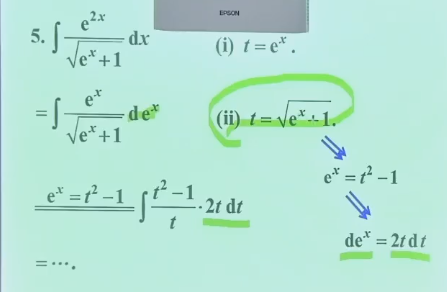

### 换元法（第二类换元法）

#### 方法

**核心方法**

谁讨厌就另谁 = $t$

这里一般（一定）要将 $df(x)$ （变量代换后得到） 换成 $f'(x)dx$，再用其他方法操作；不要将这个与凑微分法中凑 $df(x)$ 混了。

### 分部积分法

表格积分法，[对应的知乎文](https://zhuanlan.zhihu.com/p/237626870)，以及[对应的论文](http://ramanujan.math.trinity.edu/rdaileda/teach/s18/m3357/parts.pdf)，个人感觉论文比知乎文更好。

**核心公式：**

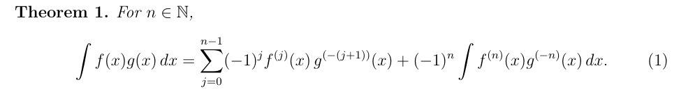
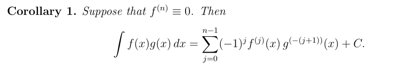

!!! info "箴言"

	整个高数，微积分很简单的，线代有点难

	整个微积分我觉得就三部爱情故事，极限分部积分、微分方程

!!! success "口诀"

	“反对幂三指”

	男上女下

	上导下积

	正负交错

	斜线乘积

	剧情完了

	竖线积分

备注：

1. “反对幂三指”：反三角函数、对数、幂函数、三角函数、指数函数

1. 男上女下实际上是“反对幂三指”前上后下

1. 斜线乘积：乘积连带正负号写入结果

2. 竖线积分：最后一列的上下乘积式的积分

3. 上导下积何时结束？

	竖线积分好积时：例如到0，再如“竖线积分”回到之前，再如俩乘积变得特别好积。

示例：

（之后补一下）

$$ \int u \, dv = uv - \int v \, du $$

-

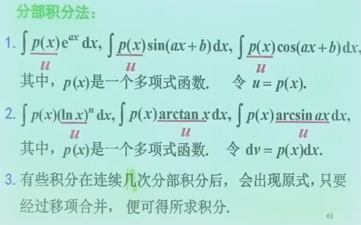

**场景：** 被积函数为两种不同类型函数乘积

**步骤：** 

1. 先找 u ，余下 dv，凑微分凑 v
	
	- 原则性方法：
		- 求导不变的函数不能做 $u$ ，例如三角函数、指数函数

		- 求导改变的，做 $u$ 很好，例如对数函数、反三角函数

			原理：RHS要 $du = u'dx$，这里涉及 $u'$，变成幂很好

		- 不好凑微分的做 $u$ 

		- 单一函数积分可以看作 $1 * 它$，则 x 是 v 
	- 零碎方法
		- 有 $\arcsin$ 一定要用分步；单一 $\arcsin$ 则用上面一个：$1 * \arcsin$
2. 用公式
3. 使用一次之后，含积分的部分不好求：考虑使用几次分部积分并 ***凑出原式***

	此种方法还适用于涉及 n 的

	关键是怎样通过代数变换凑出来！

**例题：**

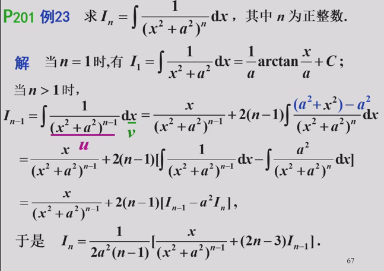
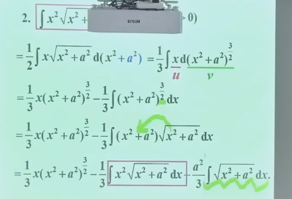

$\int \sec^1 x \, dx$ 公式

$\int \sec^2 x \, dx$ 公式

$\int \sec^3 x \, dx$ 分步

$\int \sec^4 x \, dx$ ${(1 + \tan^2)}^2$

$\int \sec^5 x \, dx$

<!-- 我 -500 + 400 + 500
马 -400
校 -500
商 +500

马 -500
马 +500
校 -500
商 +500 
生财之道（sczd） 传说中的（cszd）中间商就是这样-->

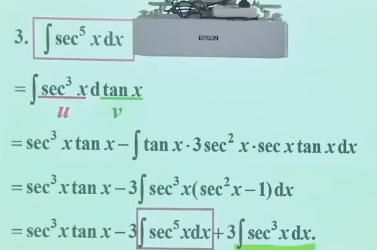

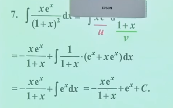
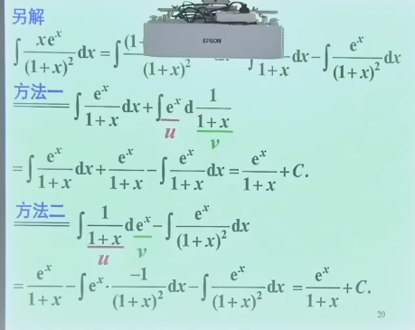
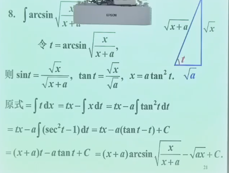
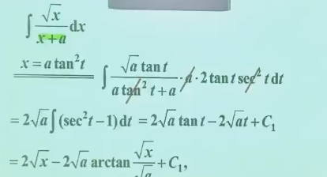

### 特殊类型函数的积分

#### 有理函数

假分式 =  真分式 + 幂函数

真分式的因式分解：代数学基本定理
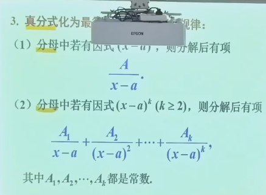
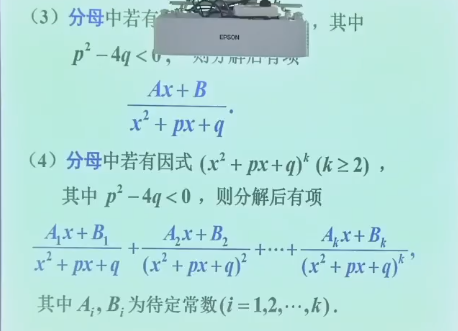

任意一个次数 >= 3 的多项式均可因式分解；检查是否分解到不能分解

- 配方等方法因式分解

	例：$x^4 - 1$

分解方法：

- 观察法（首选）

- 待定系数法：对应项系数相等

- 赋值法（对每个x都成立所以可）：通分，看分子

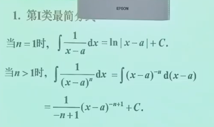
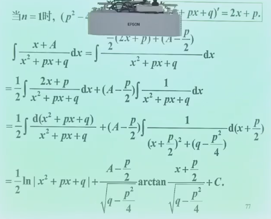
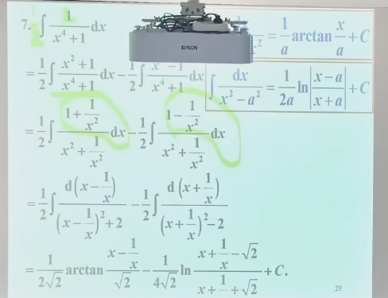

$\int \frac1{1 + x^4}\, dx$

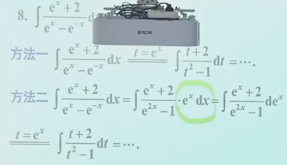

$e^x$ 的有理函数：上下同乘 $e^x$ ，上面的 $e^x$ 和 $dx$ 凑微分，再换元

2次 —— 配方

有 $ \int e^{kx}$ 换元

$\int \frac {x^2 + x - 3}{{(x - 1)}^{10}} \, dx$

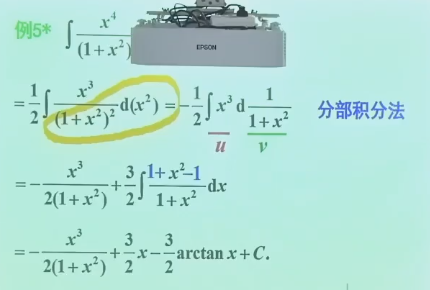
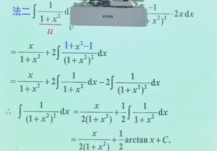

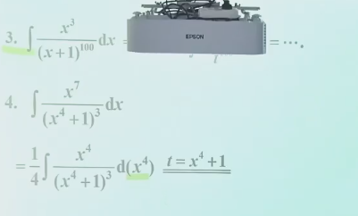

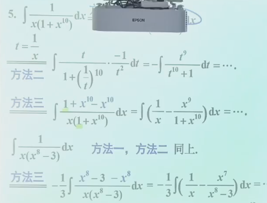

方法1是上下同*x^9

#### 三角函数积分

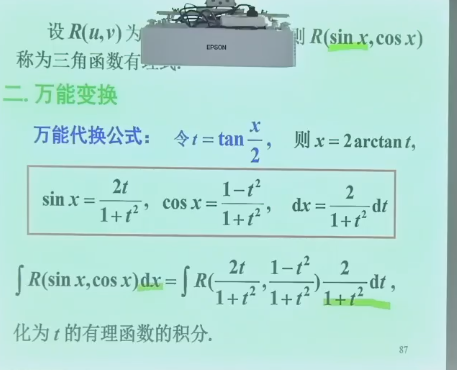
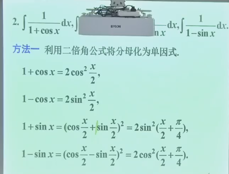
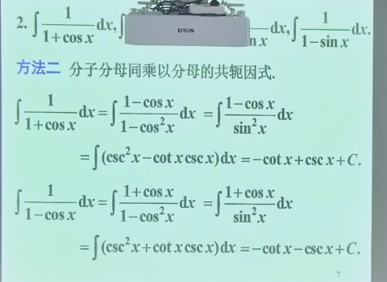
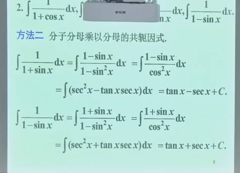
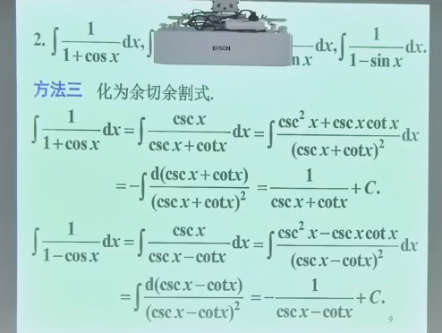
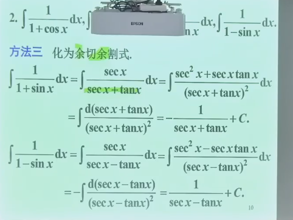

$\int \tan^2 x \, dx$ 换 tan = sec^2 - 1

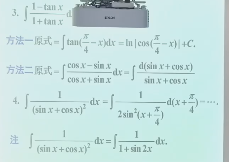

化为单因式！

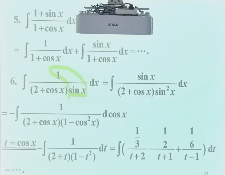
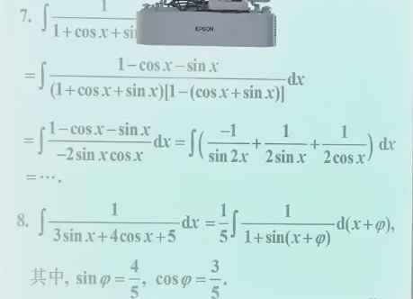
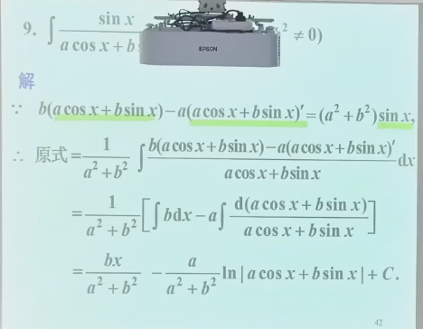
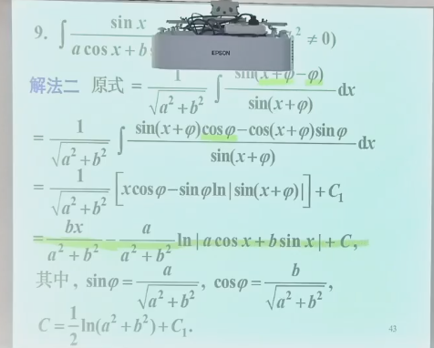

法三：t = tanx

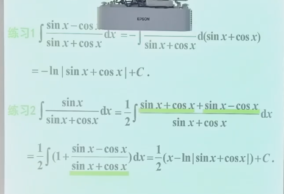

利用：导数

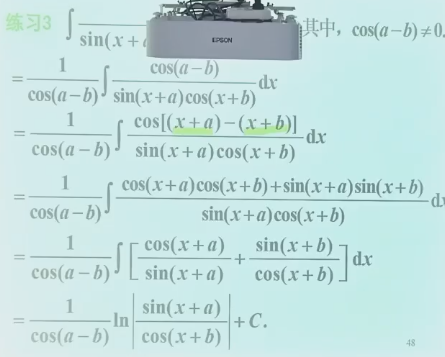

特殊类型的三角函数积分

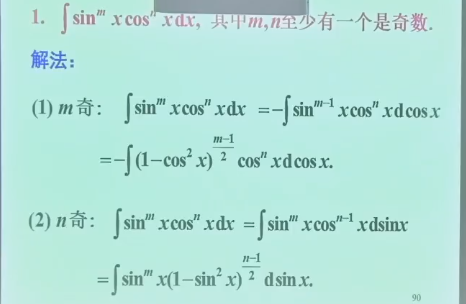
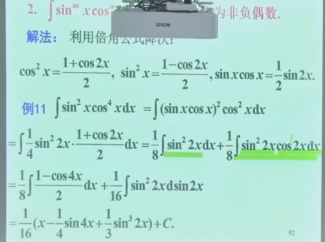
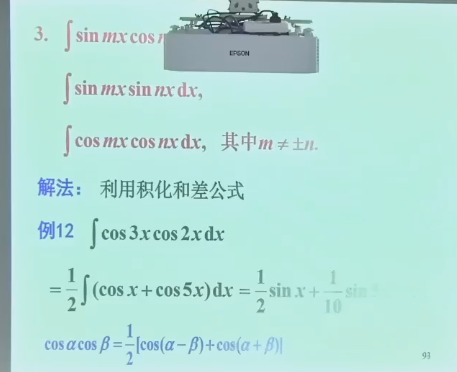

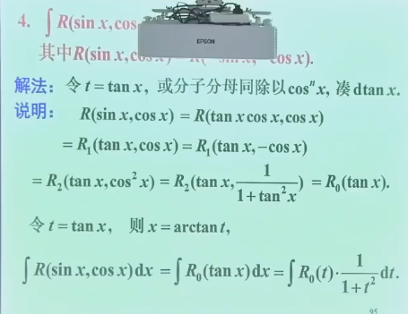
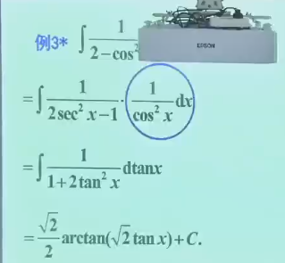

#### 某些无理函数

被积函数含有n次根号，根号内是两个1次多项式的商；内部是1词多项式的乘积：提出来，化商
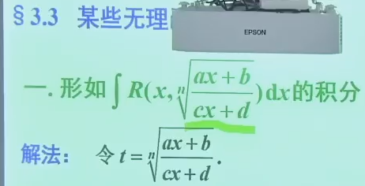

有些初等函数的原函数不一定是初等函数
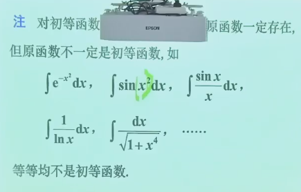

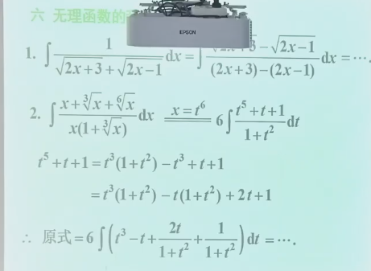
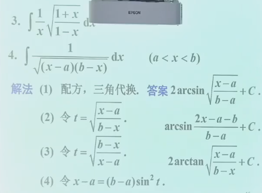

#### 分段函数积分

- 分区间求，每个区间上的C均不一样，$C_1, C_2, C_3$
- 分界点：可导必连续，左右极限存在且相等，用1个C表示其他的

#### 抽象函数积分

带着抽象函数符号 $f$ 用分部积分法。千万不能想着用特别基础的知识直接求出来结果。

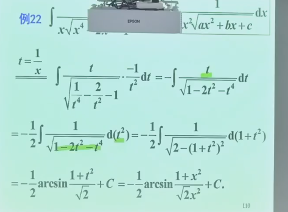
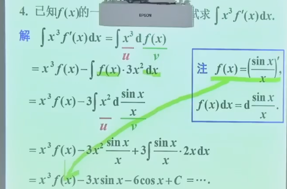

应该按照函数类型

不能求不定积分的函数：$\frac{\sin x}x$，$e^{x^2}$

不能积的函数：对它求导：可以通过分部积分法达到该目的。

## 定积分

### 方法

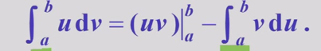

**零碎方法**

- 不会积分：先求导；在题目中创造导数

- 有些函数的原函数不可求，则一定可以和别的部分抵消，代数变换、换元……

	- $\frac{\sin x}{x}$

	- $e^{- x^2}$

**简化计算的方法**

- 先看积分区间关于原点对称，再看被积函数是否具有奇偶性，看被积函数的一部分有没有奇偶性

	公式：$\int_{-a}^{a} f(x) \,{\rm d}x = \int_{0}^{a}[f(x) + f(-x)] \,{\rm d}x$ 

	偶函数：区间减半，值*2；奇函数：0

	证明：用换元法统一积分区间 $t = -x$

- ？40min……

	- 从区间中点将积分区间分段
	- 换元法统一积分区间，换元法看题目，原则是换完之后用起来已知条件

		- 周期函数：平移
		- 奇偶函数：对称

	- 利用线性性质，消为0

### 常见函数/结构

- $\frac1{1 + e^{-x}}$：$g(x) + g(-x) = g(x)g(-x) = 1$

	

- 三角函数

	- 统一三角函数名：$\cos^2 x = 1 - \sin^2 x$ 
	- 重要公式：
$$
\int_0^{\fracπ2}\sin^{n}x\, {\rm d}x = \int_0^{\fracπ2}\cos^{n}x\, {\rm d}x = 
\left\{
\begin{aligned}
&\frac{n - 1}{n} \frac{n - 3}{n - 2} \cdots \frac23 1 ，n为奇数\\
&\frac{n - 1}{n} \frac{n - 3}{n - 2} \cdots \frac12 \fracπ2 ，n为偶数\\
\end{aligned}
\right.
$$
$$\int_0^{2π} = 2\int_0^{π} = 4\int_0^{\fracπ2}$$

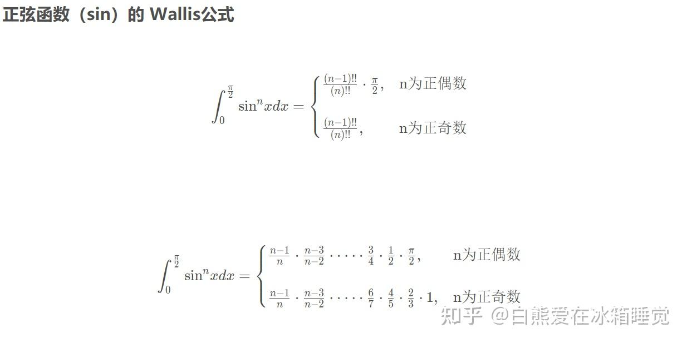

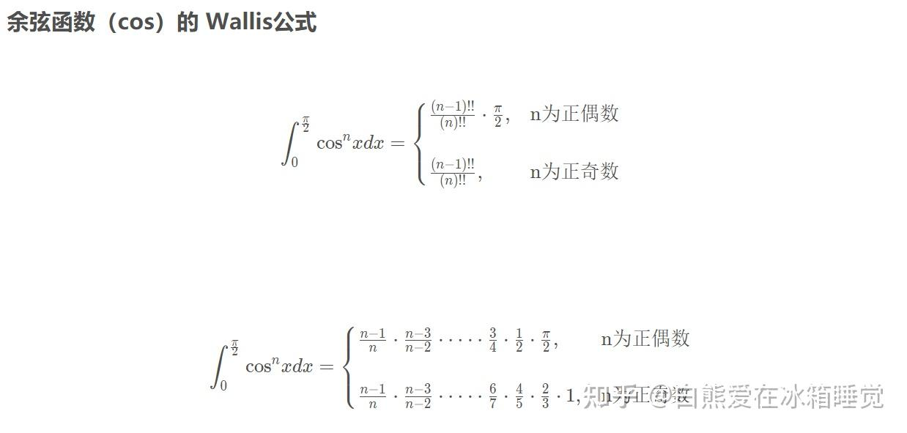

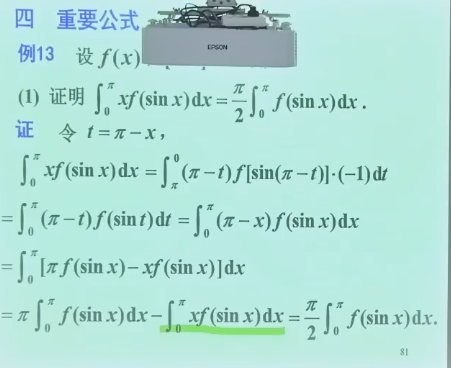

**方法：** 换元法 $t = π - x$

**辨识：** 积分区间 $(0, π)$ ，被积函数是 $x 和 \sin x$ 的乘积。如果不满足：分部积分

- 一奇一偶函数之和，积分区间关于原点对称

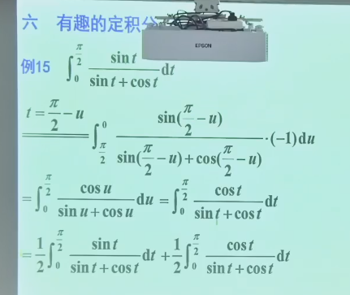

- $\   \to 三角换元$

	- 挑角度：象限：一  一四  一二  一二三四

	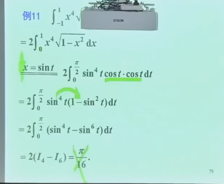

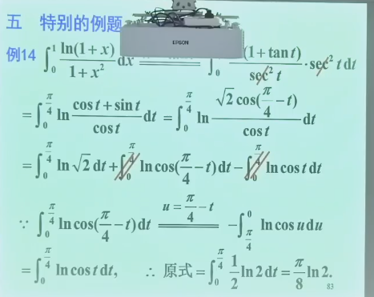

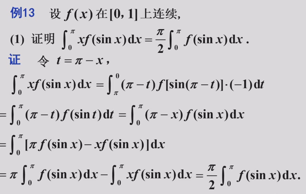

两种不同类型函数，且必须得是sin的函数，cos不行

变上/下限积分

微积分基本定理

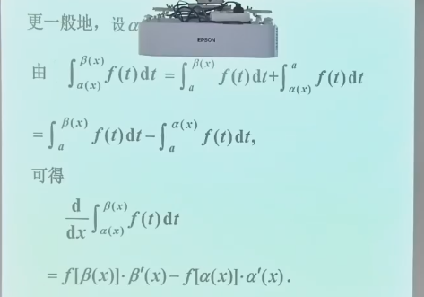

的极限：洛必达

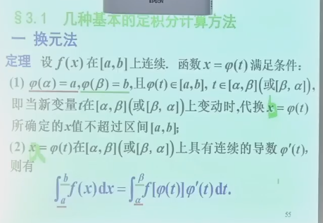

注意条件！：在那个上下中

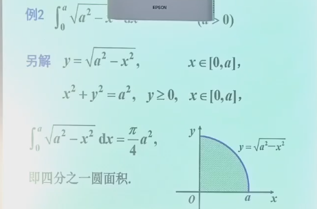

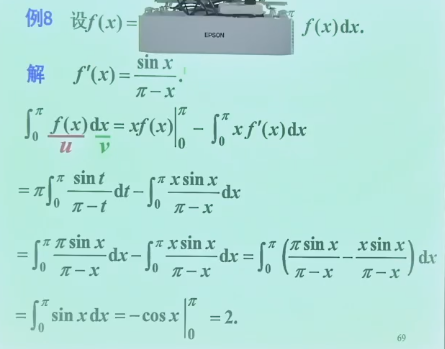

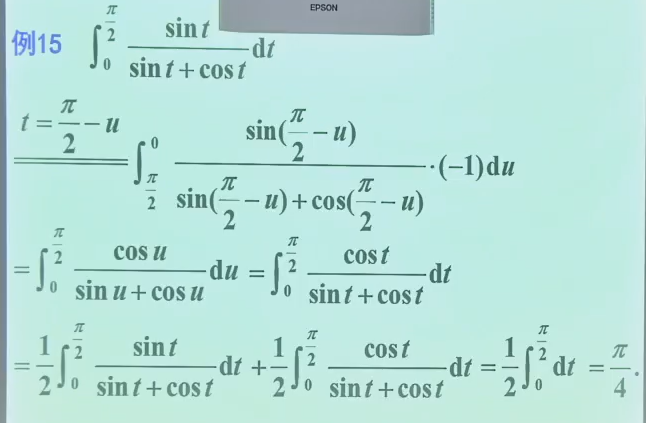

应用

微元法

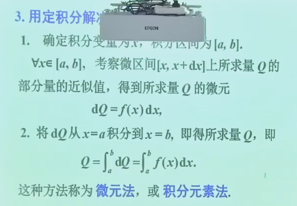

