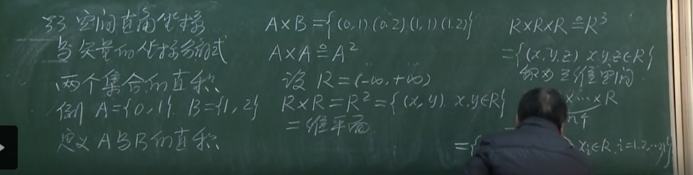
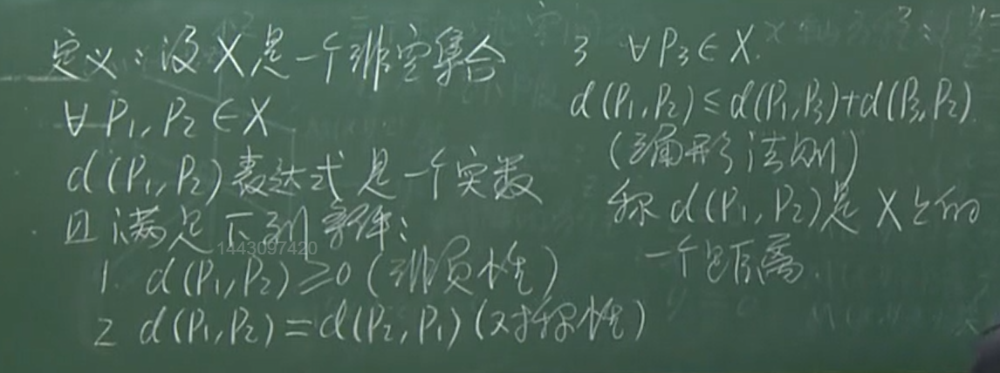
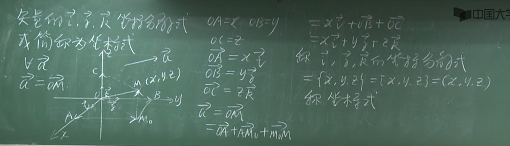
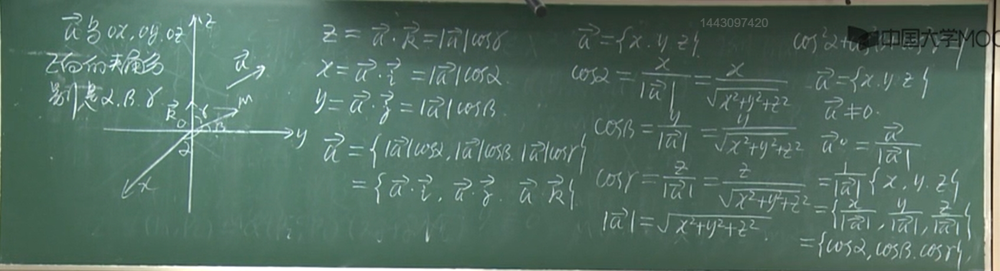
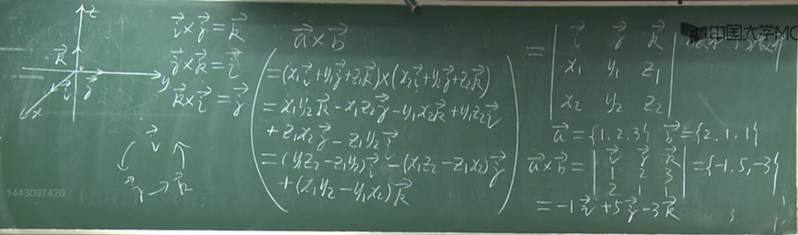
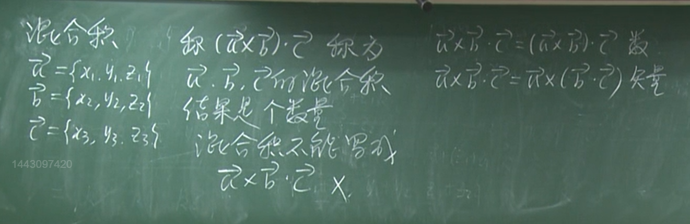

{ width="300" }
/// caption
Harvard University
///

03-11 3-5节1：28 —— 03-13 1-2节36：00

## 矢量的概念和运算

## 矢量的叉乘

### 叉乘的性质

**$a × b = - b × a$**

**$a × (b + c) = a × b + a × c$**

**$(a · b)^2 + |a × b|^2 = |a|^2|b|^2$**

## 空间直角坐标系与矢量的坐标分解

/// caption
两个集合的直积和平面的定义
///

不同顺序的混合积的正负号关系用三阶行列式性质来记

要先算叉乘

叉乘的几何意义：平行四边形面积

混合积几何意义：平行六面体体积

四面体体积：$\frac 16$ 混合积

## 空间曲面 / 曲线方程

## 平面与直线方程

### 直线方程

向量两点之差表示

### 平面方程

**点法式**

!!! success "求法矢量的方法"

    