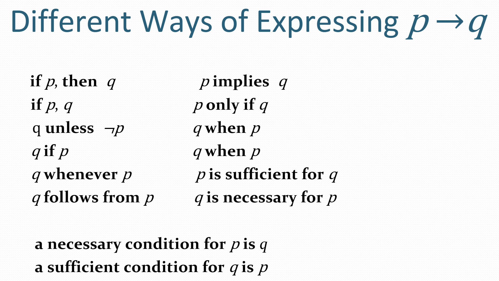
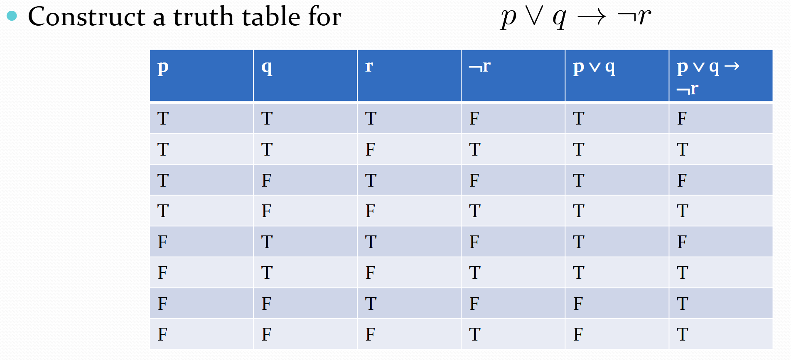
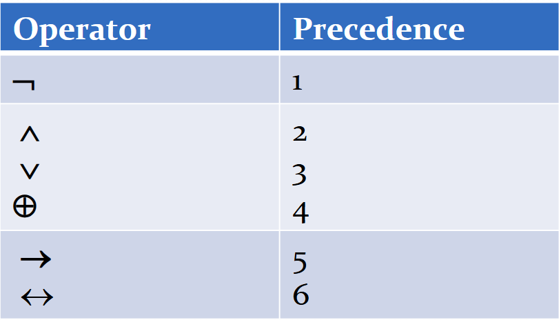

## 命题proposition

定义: 可判断真假的陈述句(declarative sentence)

分类

- atomic: 不可分解, 最小
- compound: 复合命题,  有连接词

!!! warning

    - not p 是复合命题但是是简单句
    - 复合命题两个没关系也可放一起

连接词

- $\neg$ : negation否定
- $\wedge$ : conjunction = and 合取，且, 
    - 类似集合交集, 同时成立
    - 同时真才真
- $\vee$ : disjunction析取，或, 
    - 类似集合并集
    - 同时假才假

- 异或
    - 两者不同才为真, 或者说 仅有一个真才真

!!! info 

    英文or有两种含义, 包含或(inclusive or) & 排斥或(exclusive or, 又称异或), 

    - 我今天晚上看电影或者写作业 理解:只有一个真才真
    - student who take the cs202 or math120 and take this class

- $\rightarrow$	implication充分条件, "p implies q"
    - 只有条件真结果假命题才假

    

    - "p蕴含q""p仅当q""q每当p" ......

!!! info "记忆"

    p: 上课不睡觉 q: 期末过, "满意/没有异议" 为真

    条件假不对结果产生影响 , "无罪推理"

converse 否 条件结论都否

inverse 逆 条件结论反

contrapositive 逆否 逆再否

- $\leftrightarrow$	双条件命题, 充要条件 "if and only if"
    - p q 真值相等为真, 与异或恰好相反

truth table 真值表

equivalent prop等价命题

在两个复合命题下, 其中原子命题所有可能的赋值(真值)情况下真值都相同,则俩复合命题等价

$$ f(p_1, p_2, \dots, p_r) = g(p_1, p_2, \dots, p_r)$$ 

> f和g两个复合命题, 对于其中原子命题的所有真值情况组合 $p_i$ 其值都相同

with n propositional variables, we can construct 22n     distinct (i.e., not equivalent) propositions. 

连接词优先级（Precedence of Logical Operators）
