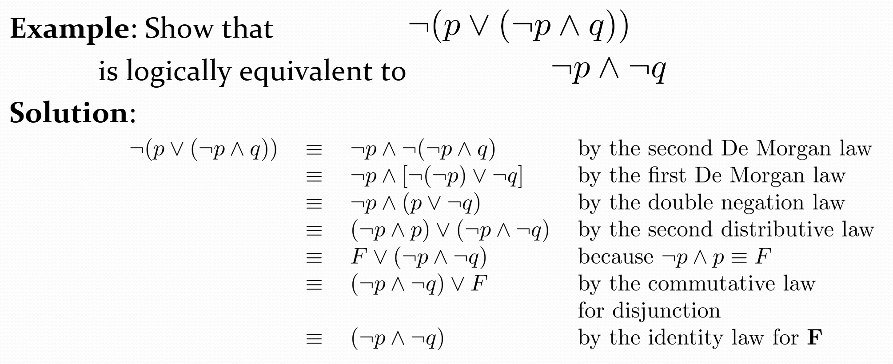

## 命题proposition

定义: 可判断真假的陈述句(declarative sentence)

分类

- atomic: 不可分解, 最小
- compound: 复合命题,  有连接词

!!! warning

    - not p 是复合命题但是是简单句
    - 复合命题两个没关系也可放一起

连接词

- $\neg$ : negation否定
- $\wedge$ : conjunction = and 合取，且, 
    - 类似集合交集, 同时成立
    - 同时真才真
- $\vee$ : disjunction析取，或, 
    - 类似集合并集
    - 同时假才假

- 异或
    - 两者不同才为真, 或者说 仅有一个真才真

!!! info 

    英文or有两种含义, 包含或(inclusive or) & 排斥或(exclusive or, 又称异或), 

    - 我今天晚上看电影或者写作业 理解:只有一个真才真
    - student who take the cs202 or math120 and take this class

- $\rightarrow$	implication充分条件, "p implies q"
    - 只有条件真结果假命题才假

    

    易错: only if: 逻辑直接顺着译, only if 和 if 的逻辑相反

    - "p蕴含q""p仅当q""q每当p" ......

!!! info "记忆"

    p: 上课不睡觉 q: 期末过, "满意/没有异议" 为真

    条件假不对结果产生影响 , "无罪推理"

converse 否 条件结论都否

inverse 逆 条件结论反

contrapositive 逆否 逆再否

- $\leftrightarrow$	双条件命题, 充要条件 "if and only if"
    - p q 真值相等为真, 与异或恰好相反

truth table 真值表

equivalent prop等价命题

在两个复合命题下, 其中原子命题所有可能的赋值(真值)情况下真值都相同,则俩复合命题等价

$$ f(p_1, p_2, \dots, p_r) = g(p_1, p_2, \dots, p_r)$$ 

> f和g两个复合命题, 对于其中原子命题的所有真值情况组合 $p_i$ 其值都相同

with $n$ propositional variables, we can construct $2^{2^n}$ distinct (i.e., not equivalent) ropositions. 
( $n$ 个变元, $2^n$ 行, $2^{2^n}$ 个不等价的命题)

连接词优先级（Precedence of Logical Operators）

### 应用

1. 翻译自然语言为逻辑表达式: 

    - 分解成简单句 -> 原子命题
    - 连接词 -> 逻辑连接词

2. 用逻辑语言描述软件/硬件/产品开发逻辑

3. consistent system specification

    在**变量赋值(变量即原子命题, 赋值即对其真值进行赋值)** 相同时, 对几个逻辑表达式的真值判断, 如果恒同真, 则真确; 若不同真, 则自相矛盾, 无法设计该系统

4. logic puzzle

    

    p和q两个需要判断的命题, 后面那个命题时A说的话, 其真值要与A的身份匹配

## 命题等价

> Tautologies(恒真命题), 

> Contradictions(恒假命题), 

> Contingencies(真值依赖于命题变元的取值).

定义: $p \leftrightarrow q $ is a tautologies, 记作 $p⇔q$   or as $p≡q$

例如, 如下命题等价

用真值表可以验证de-morgen律

常用逻辑等价: 前两张图用Venn图想想就行, 后面一个可以实际意义上理解

利用前面的逻辑等价定律构造新的命题等价(不用真值表因为随着n增大真值表太长)

思想: 引入中间表达式, 逐步等价到目标, 每一个等价表达式只用一个or少数个前面的等价定律

例题: 

## dual(对偶式)

定义: 讲命题中 or 与 and 互变, T 与 F 互变, not 不变! 命题 $S$ 的dual记作 $S^*$

性质: 两个命题等价, 当且仅当他俩的对偶式等价

## Functionally complete operators(全功能连接词)

最简的一组连接词, 仅用他们可表示所有命题

$|$ 与非, $\downarrow$ 或非 

## Propositional Satisfiability(命题的可满足性)

对变量进行赋值, 可以使得该命题为真, 则其可满足; 否则该命题恒假

!!! question

    命题可满足与命题为假互反 ?

## 命题公式的范式

目的: 

DNF：析取范式：主要连接词是or

CNF：合取范式：主要连接词是and，连接合取项，项内什么均可

二者不是相互排斥

复杂式子的判断方法：

- 消除其他连接词
- not 直接作用于变元（一个原子命题的literal即p or not p）
- 化标

### full conjunctive normal form

从真值表获取公式，首先定义minterm

## 常用推理规则

