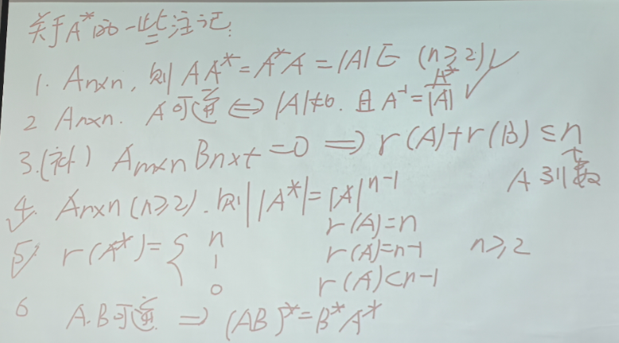
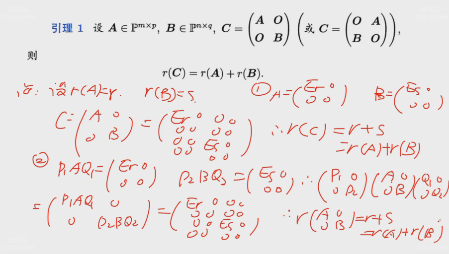
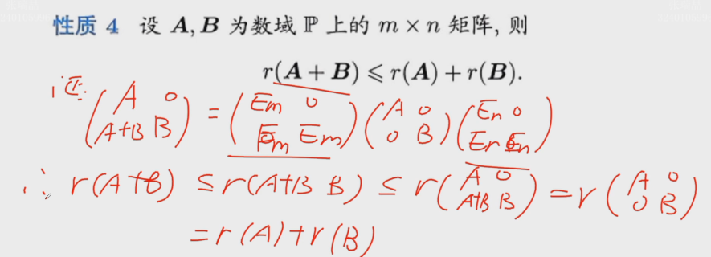
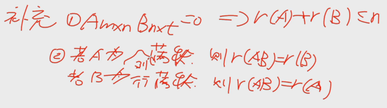

## 矩阵的运算

### 加减、数乘、乘法、转置
#### 加减
- 方法：对应位置直接相加
- 运算律：交换律、结合律

#### 数乘
- 方法：乘所有
- 运算律：结合律、分配率、变行列式则n次方
- 区别：行列式数乘：乘一列 or 一行

#### 乘法
- 要求：前列 = 后行
- 结果：（m * n） * (n * s) == (m * s)
- 方法：(i, j) 位置：前第 i 行与后第 j 列对应相乘相加
- 运算律：
	结合律、分配率
	Attention ！  没有交换律！分左乘和右乘！
- 乘方：
	0次幂 = E
- 重要等式：A、B均为方阵，有| AB | == | A | * | B |
	意义：将矩阵的乘法与行列式（数字）的乘法关联

#### 转置
- 运算律：
1. 转置
2. 加减：分配率
3. 乘法 ：交换分配率 $(AB)^T = B^T A^T$ 
4. 数乘：分配率
5. 行列式相等 $|A| = |A^T|$
6. 秩相等

- 几种特殊对角矩阵
	一般形式：
		乘法：前行后列（对角矩阵与矩阵A相乘，对角矩阵在前（后），则结果为A第 i 行（列）乘对角矩阵第 i 行（列）的那个元素；即每一行（列）前面的系数相等）
	数量矩阵：
		乘法：相当于数乘
	单位矩阵：主对角线全是1
### 求逆

仅对方阵

- 定义：乘积 == E
- 等价：可逆 <=> 非零 <=> 满秩
- 运算：行列式分之一乘伴随阵 Attention 别忘行列式分之一！！别忘行列式分之一！！

$A A^* = |A|E$

$A^{-1} = \frac{A^*}{|A|}$

	伴随阵注意：
		1. 代数余子式（-1的 n 次幂，n为子式的行标 + 列标）
		2. Aij 的排布：行列反着
- 线性方程的矩阵表示：cramer法则证明；求逆证明唯一

**运算律**

- 求逆 $(A^{-1})^{-1} = A$
- 乘法：交换分配率 ${(AB)}^{-1} = B^{-1} A^{-1}$
- 数乘：分配率 $ {(cA)}^{-1} = \frac{A^{-1}}c$
- 转置：可换顺序 ${(A^{-1})}^{T} = {(A^{T})}^{-1}$
- 行列式：可换顺序 $|A^{-1}| = |A|^{-1}$
 

### 分块

#### 可分块的条件
#### 运算
直接将每个小矩阵看成元素算
- 和差
- 数乘
- 乘法
- 转置：注意 整体转置 + 每个转置
- 求逆：可现推，设$X_{ij}$，乘法等于E

注：A可逆且 AX = O => X = O ；没有可逆条件则不行

#### 准对角矩阵
每块都是方阵，
与对角矩阵的性质完全一样
- 加减：对应
- 乘：对应
- 行列式：连乘
- 求逆：分别变逆

### 初等变换&乘法的关系

- 乘初等变换对应的初等矩阵 <=> 初等变换：“—> 变 =”
	行变换<=>对应初等阵左乘原矩阵；
	列变换<=>对应初等阵右乘原矩阵；
- 初等变换和其逆向变换互为逆
	换种说法：初等阵的逆矩阵为同种类型的初等阵
	第一类：st-st ; 第二类：c-1/c ; 第三类： c- -c
- 可逆的充要条件们
	

- 求逆矩阵：
	A|E ——> E|A^-1

### 秩与运算

**1. 左/右乘可逆矩阵（方阵）不改变秩**

P、Q均为可逆方阵，

$$r(PA) = r(A)$$

$$r(AQ) = r(A)$$

$$r(PAQ) = r(A)$$

原理：乘可逆矩阵 == 行/列变换

**2. 乘积的秩小于等于秩较小的那个的秩**

$$r(AB) \le min\{r(A), r(B)\}$$

**3. 二阶非标准准对角阵的秩等于对角元素的秩之和**

- 备注：“非标准准对角阵”指分块后形式与准对角阵相似，但其中的元素不一定是方阵

$$C = \begin{pmatrix} A&O\\O&B \end{pmatrix} or \begin{pmatrix} O&A\\B&O \end{pmatrix},则r(C) = r(A) + r(B)$$

	
证明：

**4. 和的秩小于等于秩的和**

$$r(A + B) \le r(A) + r(B)$$
	
证明：
	
<!--构造，增加行or列：秩增加or不变，乘可逆 == 初等变换：秩不变-->

**5. 两方阵积的秩大于等于秩的和减阶数**

$$A、B为方阵，r(AB) \ge r(A) + r(B) - n $$

**6. 三方阵积的秩大于等于前两个积的秩加后两个积的秩减中间的秩**

$$A、B、C为方阵，r(ABC) \ge r(AB) + r(BC) - r(B)$$

**7. 补充**

## 线性空间

### 定义&基本性质

“数域P上的一个线性空间”

先定义 “加法” “数乘” 两个运算，再满足8条

1. 加法交换
2. 加法结合
3. 存在 $\theta$
4. 存在负元素
5. 数乘1不变
6. 数乘结合
7. 数乘分配1
8. 数乘分配2

??? info "详细版"

	1. **闭性条件**  
	对于集合 $V$ 中任意的 $u, v \in V$，有：  
	$$
	u + v \in V
	$$
	即向量加法封闭。

	2. **数乘封闭性**  
	对于集合 $V$ 中任意的 $u \in V$ 和标量 $c \in \mathbb{R}$（或 $\mathbb{C}$），有：  
	$$
	c \cdot u \in V
	$$

	3. **加法交换律**  
	对于集合 $V$ 中任意的 $u, v \in V$，有：  
	$$
	u + v = v + u
	$$

	4. **加法结合律**  
	对于集合 $V$ 中任意的 $u, v, w \in V$，有：  
	$$
	(u + v) + w = u + (v + w)
	$$

	5. **加法的零元**  
	存在一个零向量 $0 \in V$，使得对于任意的 $u \in V$，有：  
	$$
	u + 0 = u
	$$

	6. **加法的逆元**  
	对于集合 $V$ 中任意的 $u \in V$，存在一个向量 $-u \in V$，使得：  
	$$
	u + (-u) = 0
	$$

	7. **数乘分配律（标量加法）**  
	对于集合 $V$ 中任意的 $u \in V$ 和标量 $a, b \in \mathbb{R}$（或 $\mathbb{C}$），有：  
	$$
	(a + b) \cdot u = a \cdot u + b \cdot u
	$$

	8. **数乘分配律（向量加法）**  
	对于集合 $V$ 中任意的 $u, v \in V$ 和标量 $a \in \mathbb{R}$（或 $\mathbb{C}$），有：  
	$$
	a \cdot (u + v) = a \cdot u + a \cdot v
	$$

	9. **数乘结合律**  
	对于集合 $V$ 中任意的 $u \in V$ 和标量 $a, b \in \mathbb{R}$（或 $\mathbb{C}$），有：  
	$$
	a \cdot (b \cdot u) = (a \cdot b) \cdot u
	$$

	10. **单位标量作用**  
		对于集合 $V$ 中任意的 $u \in V$，有：  
		$$
		1 \cdot u = u
		$$

!!! warning "理解"

	1. 这俩运算不是普通的加法 & 乘法，要顺着题目定义走
	
	2. 定义两个运算的目的是为下面8条打基础，若无运算何来8条？

数域中的元素叫做向量，所以，线性空间 也称作 向量空间

#### 性质

- θ唯一
- -α唯一
- 0α = cθ = θ
- -α = (-1)α
- cα = 0 $=>$ c = 0 or a = θ

定义了减法运算

### 转化关系

任意空间的向量组 ——(常用)基——> $P^n$ 空间的列向量组(矩阵) 

推广：任意空间的向量组 ——任意无关组——> $P^n$ 空间的列向量组(矩阵) 

则：任意空间的性质 / 概念 / 方法 ————>$P^n$空间的性质 / 概念 / 方法

### 线性表示&线性相关

#### 二者关系

**基本等价**

一群线性相关 $<=>$ 其中一个可以被剩下的线性表示

一群线性无关 $<=>$ 任意一个都不可以被剩下的线性表示

#### 线性表示

**定义**：一个能被一群线性地表示

!!! info "$P^n$空间与线性方程组"

	线性表示 = 非齐次线性方程组 = 相应矩阵 ：

	一群 = 系数矩阵；一群加一个 = 增广矩阵

	表示系数 = 方程组的解

	有解 = 可表示；无解 = 不可表示

	系数矩阵的秩 & 增广矩阵秩 & 列向量个数 三者关系  ~ 方程组解的情况 ~ 是否可表示

#### 线性相关

**定义**：线性和 = θ 不仅有唯一0解

!!! info "$P^n$空间与线性方程组"

	线性相关 = 齐次线性方程组 ：

	基本同上：解的情况 ~ 相关性（可否表示） ~ 矩阵的秩 ~ 行列式的值 ~ 是否可逆
**性质**：

1. $ θ <=> 相关 $ 

2. 部分相关，整体相关
	
	2.5 整体无关，部分无关 

3. 包含$θ$的相关

4. 原组无关，接长组无关

	4.5 原组相关，截短组相关

5. 原组无关，补一个向量则相关，那么补上的那个可以被原来的那些唯一表示

6. $P^n$空间的含 $n + 1$ 个向量的向量组相关

### 向量组的线性表示&等价

**定义**：

表示：$(\alpha_1\ \alpha_2\ \alpha_3\ \dots\alpha_s\ ) = (\beta_1\ \beta_2\ \beta_3\ \dots\beta_s\ ) M$

以上为合成形式写法，实际上是 $\alpha$ 中每个列向量都用 $\beta$ 向量组乘列向量表示

可表示：看秩：$r(原) = r(原 补)$

等价：*互相*表示

**性质**

- 多用少表示则多相关
- 无关组可以被表示则其向量个数少
- 等价两无关组向量个数相同

<!-- 

*线性表示核心逻辑：*

	![[Pasted image 20241104150848.png]]![[Pasted image 20241104152107.png]]
	Interpret
		向量空间
			一个列向量用一群列向量线性表示（乘系数），
			形式上，
			等价于非齐次线性方程组：
			系数：方程组解；列向量：方程组系数
			所以，
				可表示：有解
					唯一表示：唯一解；
					无数表示：无数解；
				不可表示：无解
			那么，
			可以关联矩阵的秩：
			初等行变换后，
				$r(A) = r(\overline{A})$ : 有解
					  $r(A) = r(\overline{A}) = 行数n$ : 唯一解；
					  $r(A) = r(\overline{A}) ≤ 行数n$ : 无数解；
				$r(A) != r(\overline{A})$ or $r(A) < r(\overline{A})$ or $r(A) + 1 = r(\overline{A})$ : 无解
			因而，
			上下两部分可以一一对应关联：
				唯一表示：$r(A) = r(\overline{A}) = 行数n$
				无数表示：$r(A) = r(\overline{A}) ≤ 行数n$
				不可表示：$r(A) != r(\overline{A})$ or $r(A) < r(\overline{A})$ or $r(A) + 1 = r(\overline{A})$
			做题，
			列向量合并写成线性方程组对应的矩阵，用秩看是否可表示
			至此，
			线性方程组，矩阵的秩，向量空间的线性表示 达到统一
		过渡
			如果不把LHS和RHS中的每一个元素（$\alpha$）理解成列向量，就一个单独的独特的元素，就是到了线性空间

*线性相关/无关核心逻辑：*
	![[Pasted image 20241104152648.png]]
	![[Pasted image 20241104152553.png]]
	Interpret
		向量空间
			在研究$\theta$的线性表示
			线性相关：一群矩阵的存在非全零系数的线性表示等于$\theta$ (0)；线性无关：只有全零系数的一种表示得$\theta$
			同上展开，
			等价于，齐次线性方程组
			所以：
			线性相关：无数解；
			线性无关：唯一0解
			那么，
			关联矩阵的秩：
			左P后：
			首先，由于齐次线性方程组，$r(A) = r(\overline{A})$
			$r(A) < 行数n$ : 无数解；
			$r(A) = 行数n$ : 唯一0解；
			因而，
			上下两部分一一对应关联：
				线性相关：$r(A) < 行数n$
				线性无关：$r(A) = 行数n$ 
		过渡
			如果不把LHS和RHS中的每一个元素（$\alpha$）理解成列向量，就一个单独的独特的元素，就是到了线性空间

**向量空间：本质上都是线性方程组解的问题 ——>柯西消元法 + 用矩阵的秩秩理解线性方程组的解**

线性相关性质
	![[Pasted image 20241104174405.png]]![[Pasted image 20241104174923.png]]![[Pasted image 20241104175117.png]]
	因为：原线性方程组的几个方程遗传到接长向量组中，原来的解出来0，则后来的方程组也得是0
	逆否：原无关，截短无关

 -->

### 极大线性无关组 & 秩

**方法**

化阶梯，选阶梯头所在列

**性质**

数量相同

向量组的极大无关组等价于该组

一个无关组一定可以*扩充*为一个极大无关组

!!! info "方法"

	右补单位阵，化阶梯，按阶梯头选出极大无关组

无关的一组向量，秩为数量，自己就是极大无关组

秩：矩阵三秩相等

### 基 维数 坐标 过渡矩阵

维数 == 秩

基 == 极大无关组的一种有序排列

坐标 == 在基下的表示向量

过渡矩阵：

$(\beta_1\ \beta_2\ \beta_3\ \dots\beta_s\  ) = (\alpha_1\ \alpha_2\ \alpha_3\ \dots\alpha_s\ ) M$

$基\alpha 对应的坐标是 x$， $ \beta 对应 y$，则

$x = My$

*用常用基将其他空间转化为向量空间！*，常见空间的常用基：

- $P^n$ 空间：n个列向量，每个位置分别是1

- $P^{m * n}$ 矩阵：每个位置分别1，共 $m * n $个

- 多项式空间：$(1, x, x^2, x^3, \cdots x^{n - 1})$

### 子空间

**判断**

非空子集（关键是证明存在一个属于他） + 加法乘法封闭

$P^n$ 空间中一些向量线性组合成扩张子空间即$span(向量组)$，他是包含这些向量的最小的子空间

### 方程组解的结构

#### 齐次

基础解系 = 解空间的基 

自由未知量数 = 基数，即 $dimW_0 = n - r $

**基础解系的证明**

- 是方程组解
- 无关
- 数量 = 维数 / 秩

**表示**

$\sum$ 自由未知量的值为系数 $*$ 列向量 

#### 非齐次

特解 + 导出组的基础解系的线性组合

