!!! info "跟着感觉走"

    对矩阵分块方法的感觉，对矩阵的秩的理解领悟，决定了线性代数的高度

## 矩阵行列式

### 行列式的求解方法

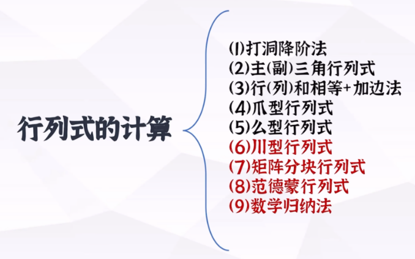

#### 1. 定义

core：消出0！！！

提示：
- 行标/列标正序，另一个的逆序数：行列等价
- 注意-1的逆序数次方
- 三阶：捺-撇

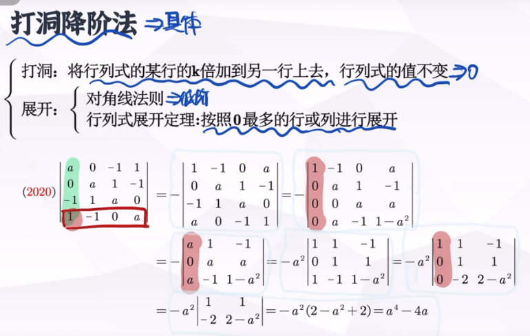
##### 1.1化为上三角
	右上or左下：主对乘积
	右下or左上：

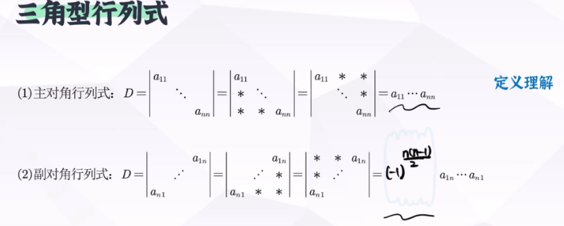
——>简化消0过程，找平衡

#### 2. Laplace 定理
 用处：
    0成片出现 or 0很多
核心方法：
    以0多的列（行）为基准，先把它划上，再选合适数量个行（列），形成子式and余子式
易错点：
    有且仅有余子式需要* pow（-1，划去的所有行标和+所有列标和）：变代数余子式
    子式不要，余子式别忘

#### 3.  爪形

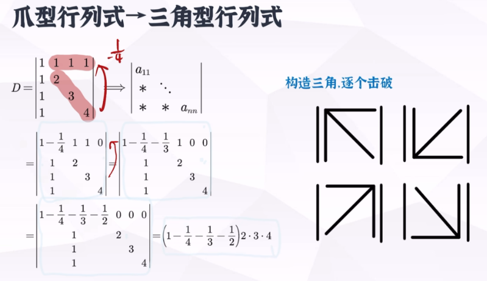

#### 4. 镶边法

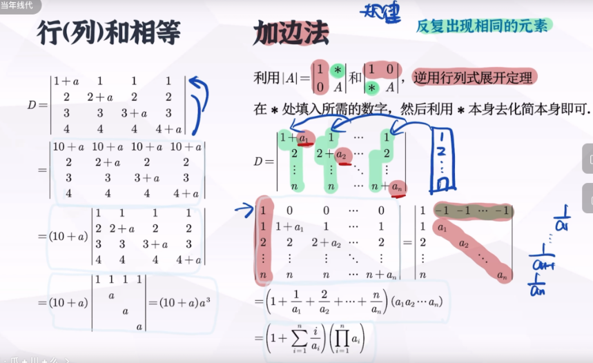

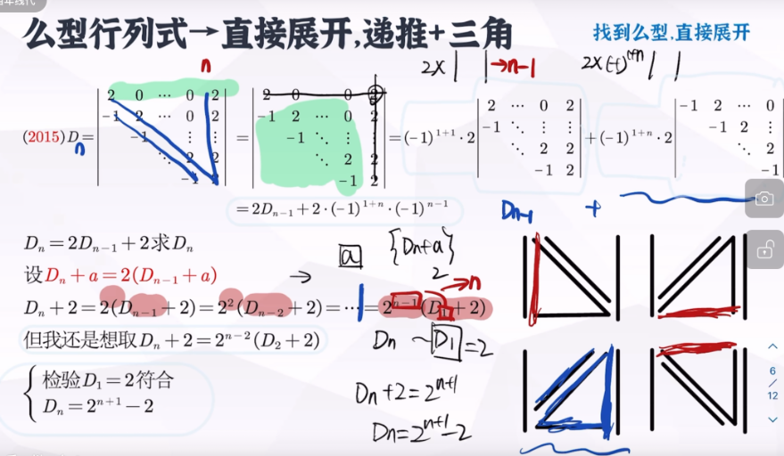

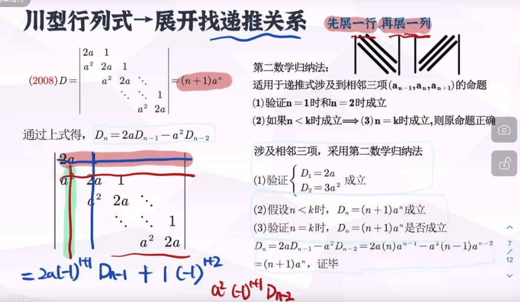

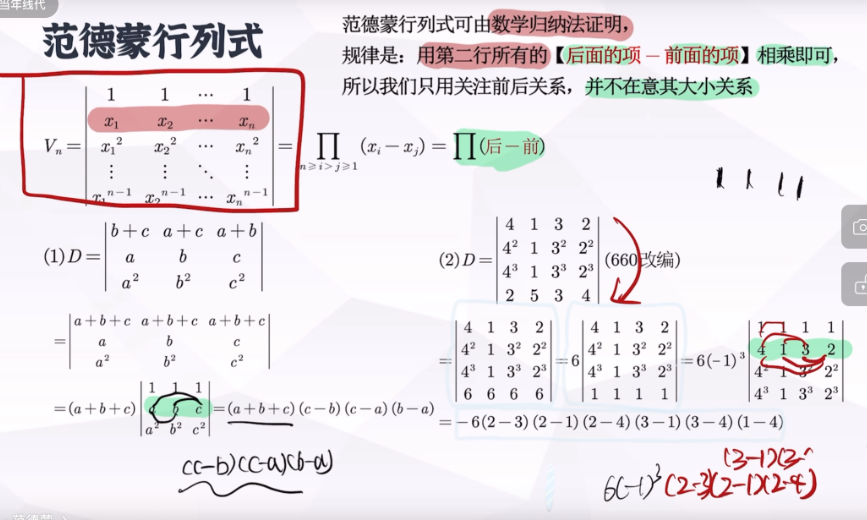

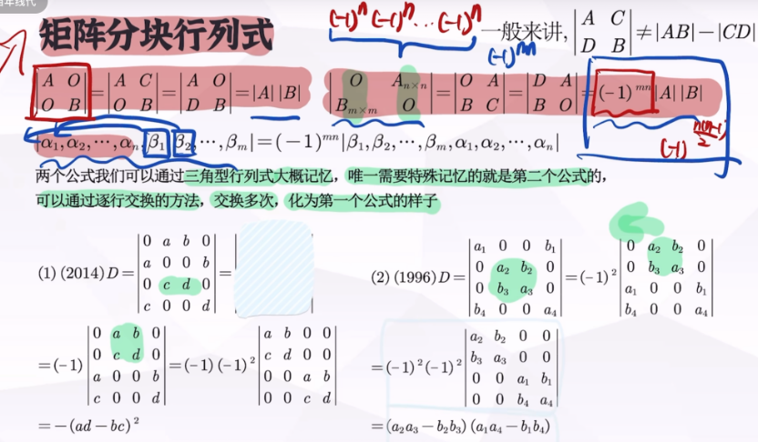

### 矩阵与行列式的关联

矩阵是表，行列式是值
矩阵的初等变换：行变换，列变换，包括互换、倍乘、倍加，秩不变，矩阵不讨论值

行列式的变换：
	1. 转置，值不变
	2. 互换（行or列），值相反
		推论：两行相等or成倍：值为0
	3. 倍乘：c乘某一行or列：值变c倍
	4. 分拆：对某一行进行分拆，值为分拆后的俩的和
		分拆很常用！！！
	5. 倍加：值不变

### 矩阵的运算
#### 计算
**核心思想：**

通过同乘、用逆（**必须可逆矩阵**）等手段，凑公式，靠到已知量上去（将所求表示成只含已知量和E的式子）
**有n：**
    
找规律，数学归纳

注意多找几个别就一个
    

**给A\***

- 必用$|A^*| = |A|^{(n-1)} $，一般用来求$|A|$：接下来
    - 证可逆
    - 运算过程中有$|A|$，要用其值

- 必用$A × A^*=|A| × E$：可以两边同乘创造出来它

#### 矩阵求逆

**证明矩阵可逆：**

思路1：设其逆矩阵，想办法求出来他，在求解过程中一些取逆操作会用到题目条件

例题：

#### 矩阵的分块

**条件：**
	
1. 原来A列数 == B的行数：分块之前可以乘

2. 前面列分块方式和后面行分块方式一样（若抽象阵，乘进去看每块乘积有意义即可）

**方法**

1. 左的列分块方式 == 右的行分块方式 

2. 目标：想办法分出来特殊矩阵：零矩阵、单位阵、数量阵、三角形

**步骤**

1. 前列 + 后行 ——>方法1(原则) + 方法2（开始朝着目标凑）

2. 前行、后列 ——>方法2（接着朝着目标凑）

$AXB = C$ 求$X$
1. $A^{-1}(A$  $C)$  = $(E$  $A^{-1}C)$
2. $\begin{pmatrix} B\\A^{-1}C\\ \end{pmatrix}$ $B^{-1}$ = $\begin{pmatrix} E\\A^{-1}CB^{-1}\\ \end{pmatrix}$

### 矩阵的秩

**与秩or箭头有关的证明题：**

先用等价标准型证明对，再证一般情况（等价标准型的左P右Q）：利用其他矩阵知识（行列初等变换秩不变/乘可逆秩不变，）
	
例题：
	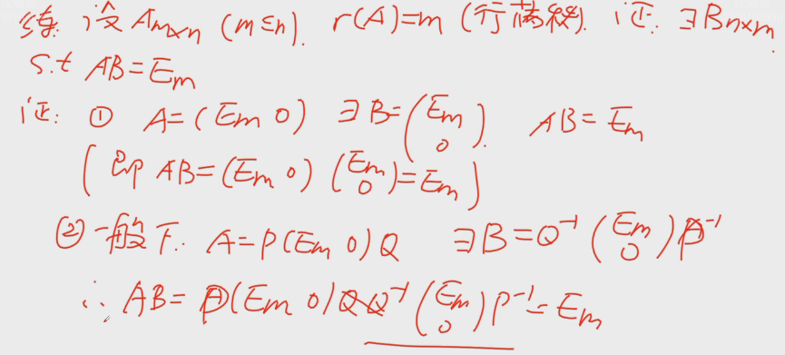

## 线性空间

### 定义

**证明是线性空间 / 判断是否是线性空间**：加法数乘封闭 + [8条]()

（补一下）

### 相关&无关&表示

#### 具体向量组

$P^n$ 空间：矩阵，化阶梯看秩 $\Leftrightarrow$ 行列式 $\ne 0$ $\Leftrightarrow$ 可逆

- 这里：别忘了矩阵秩的三个等价表示（见上）
- 三阶矩阵（较小）一般算行列式比较简单）

其他空间：常用基转化为向量组，矩阵，同上

两个向量组（例如向量组的相互表示）：俩合并在一起成一个大矩阵，前面一半化 $E$ ，后面即为所求，不要分开多个写

[去看看公式](https://r-z-zhang-ai.github.io/KNOWLEDGE/Note/Linear%20Algebra/Knowledge%20Frame%20of%20LA/#_24)，尤其是过渡矩阵谁在前：这个可以通过矩阵乘法的条件判断（记住 $M$ 是方阵）

#### 抽象向量组

**常用方法**

1. 抽象内容具体化：将其用未知数设出来

2. *列基本定义公式*

**零碎知识**

- 多个向量组无关：任意一个不能用其他表示 $\rightarrow$ 先取一个有相关条件的该向量前面的系数 $ = 0$

**类型一：$n$ 个有某种递推关联的向量组**

方法：形成递推，逐项求得，依此类推

目标 / 入手点：*两个向量*的式子 / 线性关系（因为俩向量相关无关表示可对系数分类讨论，两类即可）

例题：P121-13 P205-8

**与秩相关**

看看矩阵的秩的公式！（哪天附上链接）

<!-- 

    减肥啊！别吃零食！

 -->

线性相关与线性表示的相互转化，多用于双向量 $\alpha 和 \beta 的情况$ 

### 秩&极大无关组&基&维数&坐标

**坐标相同问题**

具体化坐标，$X = MY = MX \Rightarrow (M - E)X = O$ ，利用向量非零条件解该齐次方程（若满秩则零向量故不满秩）。

#### 判断问题

**判断是基**

1. 属于空间

2. 线性无关：等于0，解系数

3. 可表所有：设任意，解方程

#### 子空间

**判断是子空间**：**2条**

1. 非零子集：在里面找出一个 / 一群 & 包含于大的

2. 加乘封闭：验证即可

判断是

## 欧式空间

**证明是欧式空间**：[4条]()

- $(\alpha, \alpha) > 0 ，\alpha = \theta \Leftrightarrow (\alpha, \alpha) = 0$

- $(\alpha, \beta) = (\beta, \alpha)$

- $(c\alpha, \beta) = c(\alpha, \beta)$

- $(\alpha + \beta, γ) = (\alpha, γ) + (\beta, γ)$ 

Schmidt（施密特）正交化

$\alpha_1, \alpha_2, \cdots, \alpha_s 线性无关$

$$
\beta_1 = \alpha_1
$$
$$
\beta_2 = \alpha_2 - \frac{(\alpha_2, \beta_1)}{(\beta_1, \beta_1)}\beta_1
$$
$$
\beta_3 = \alpha_3 - \frac{(\alpha_3, \beta_1)}{(\beta_1, \beta_1)}\beta_1 - \frac{(\alpha_3, \beta_2)}{(\beta_2, \beta_2)}\beta_2
$$
$$
\cdots\ \cdots
$$
$$
\beta_k = \alpha_k - \frac{(\alpha_k, \beta_1)}{(\beta_1, \beta_1)}\beta_1 - \frac{(\alpha_k, \beta_2)}{(\beta_2, \beta_2)}\beta_2 - \cdots - \frac{(\alpha_k, \beta_{k - 1})}{(\beta_{k - 1}, \beta_{k - 1})}\beta_{k - 1} \quad, 2 \le k \le s 
$$

何时能相似对角化以及 $P$ 的样子
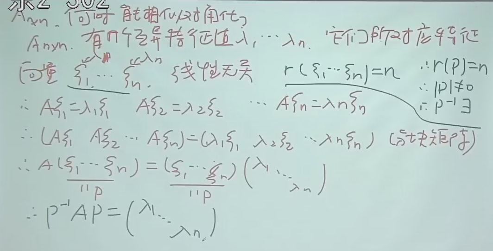

例题：

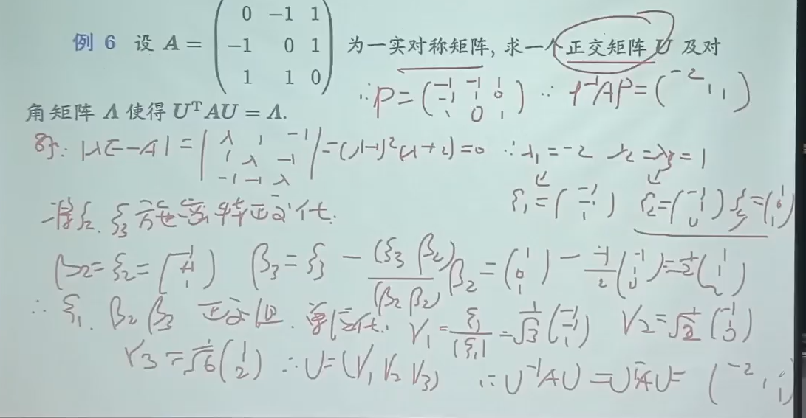
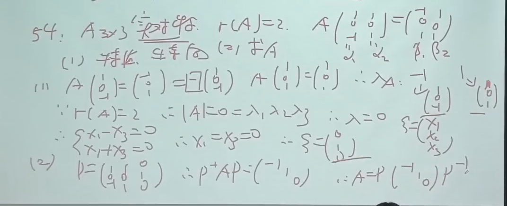
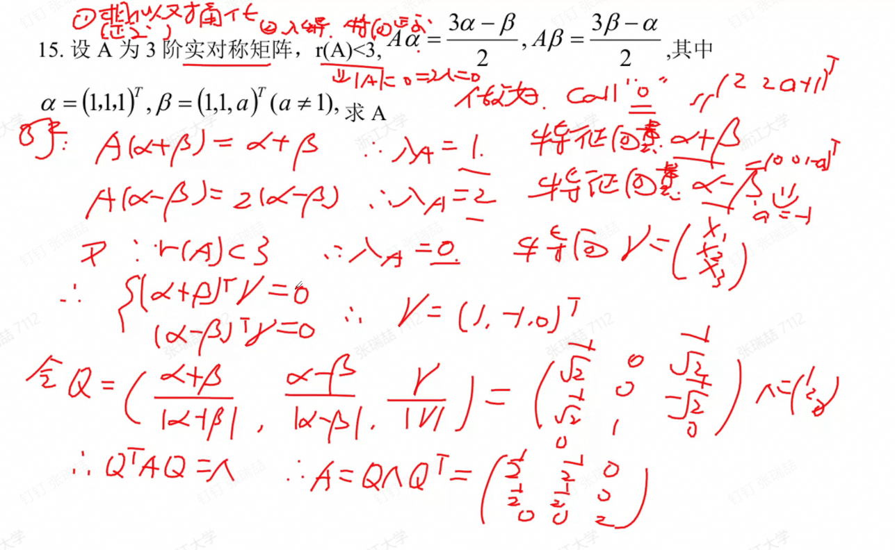

正定

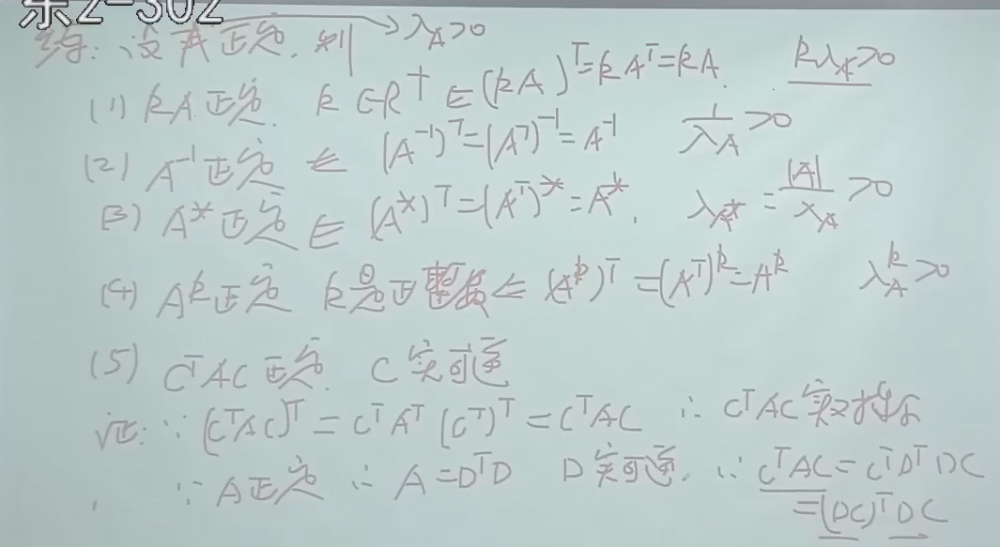
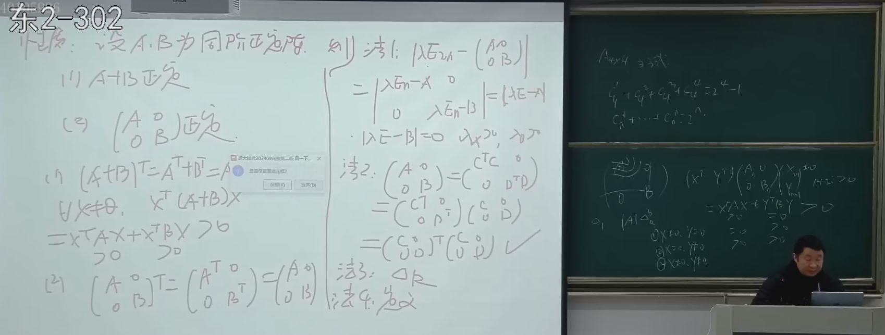

证明正定：
1. 实对称：人为取出转置，证明它等于自己
2. 用等价条件

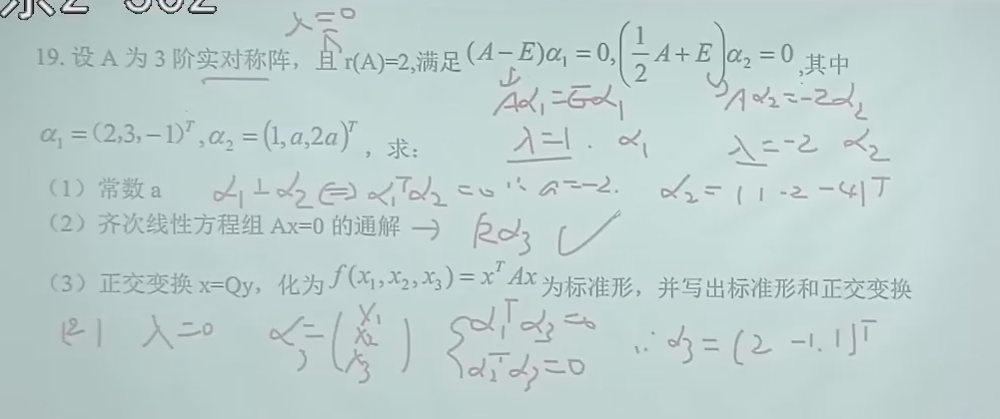

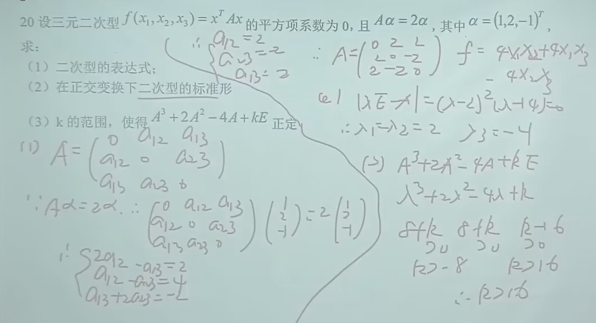
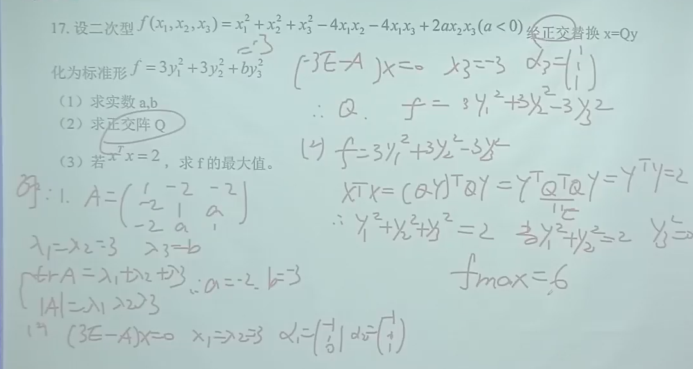
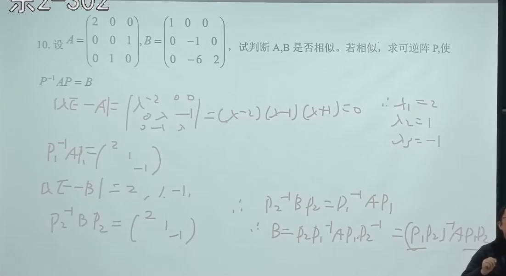
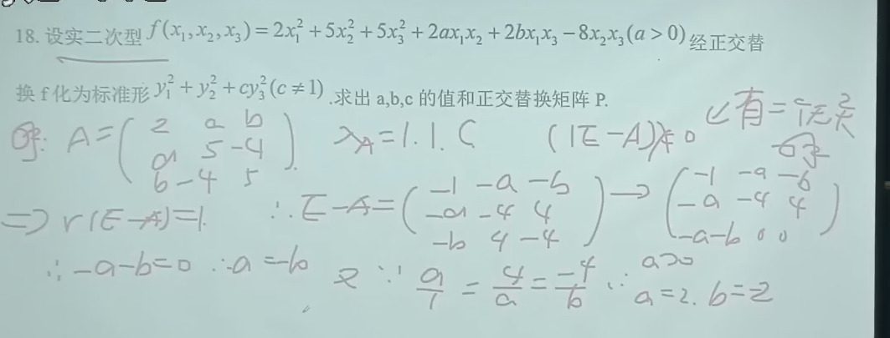

